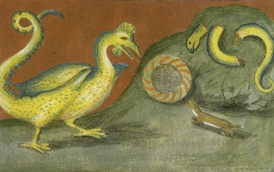

  
[Intangible Textual Heritage](../../index)  [Esoteric](../index.md) 

------------------------------------------------------------------------

[Buy this Book at
Amazon.com](https://www.amazon.com/exec/obidos/ASIN/B002A9JP00/internetsacredte.md)

------------------------------------------------------------------------

<table width="75%">
<colgroup>
<col style="width: 50%" />
<col style="width: 50%" />
</colgroup>
<tbody>
<tr class="odd">
<td width="50%" data-valign="TOP"> 
Basilisk: Aurora Consurgens [early 16th c.] (Public Domain Image)</td>
<td width="50%" data-valign="CENTER"><h1 id="the-philosophy-of-natural-magic" data-align="CENTER">The Philosophy of Natural Magic</h1>
<h2 id="by-henry-cornelius-agrippa" data-align="CENTER">by Henry Cornelius Agrippa</h2>
<h3 id="ed.-l.-w.-de-laurence" data-align="CENTER">ed. L. W. de Laurence</h3>
<h4 id="section" data-align="CENTER">[1913]</h4></td>
</tr>
</tbody>
</table>

------------------------------------------------------------------------

[Contents](#contents)    [Start Reading](pnm00.md)    [Page
Index](pageidx)    [Text \[Zipped\]](pnm.txt.gz.md)

------------------------------------------------------------------------

|                                                                                                                           |
|---------------------------------------------------------------------------------------------------------------------------|
|  |

They say, also, that the blood of a basilisk, which
they call the blood of Saturn, hath such great force in sorcery that it
procures for him that carries it about him good success of his petitions
from great men in power, and of his prayers from God, and also remedies
of diseases, and grant of any privilege.

This is an early 20th century edition of Agrippa's Philosophy of Natural
Magic, along with a wealth of background material. Originally published
in 1531-3, De occulta philosophia libri tres, (Three books of Occult
Philosophy) proposed that magic existed, and it could be studied and
used by devout Christians, as it was derived from God, not the Devil.
Agrippa had a huge influence on Renaissance esoteric philosophers,
particularly Giordano Bruno.

While this is not a specialist edition, it will suffice for the casual
reader who doesn't want to wade through Elizabethan typography and
spelling, just enough of which is preserved here for flavor. A more
comprehensive transcription is located
[here](https://www.esotericarchives.com/agrippa/.md). This edition is a
pastiche of a portion of a translation of Agrippas' libri tres by an
unidentified translator, excerpts from a book on Agrippa by Henry Morley
with extensive background, and some self-promotional material by the
publisher, de Lawrence, who was a notorious pirate publisher. This end
material is of interest because it is a good example of early 20th
century American occult publishing.

------------------------------------------------------------------------

[Title Page](pnm00.md)

[Dedication](pnm01.md)

[Agrippa](pnm02.md)

[Table of Contents](pnm03.md)

[Sublime Occult Philosophy](pnm04.md)

[Preface](pnm05.md)

[Early Life of Cornelius Agrippa](pnm06.md)

[Cornelius Agrippa to the Reader](pnm07.md)

[Agrippa to Trithemius](pnm08.md)

[Trithemius to Agrippa](pnm09.md)

### Agrippa

[Chapter I. How Magicians Collect Virtues from the Three-Fold World is
Declared in these Three Books](pnm10.md)

[Chapter II. What Magic Is, What Are the Parts Thereof, and How the
Professors Thereof Must Be Qualified](pnm11.md)

[Chapter III. Of the Four Elements, Their Qualities, and Mutual
Mixtions](pnm12.md)

[Chapter IV. Of a Three-Fold Consideration of the Elements](pnm13.md)

[Chapter V. Of the Wonderful Natures of Fire and Earth](pnm14.md)

[Chapter VI. Of the Wonderful Natures of Water, Air and Winds](pnm15.md)

[Chapter VII. Of the Kinds of Compounds, what Relation They Stand in to
the Elements, and What Relation There Is Betwixt the Elements Themselves
and the Soul, Senses and Dispositions of Men](pnm16.md)

[Chapter VIII. How the Elements Are in the Heavens, in Stars, in Devils,
in Angels, and lastly in God Himself](pnm17.md)

[Chapter IX. Of the Virtues of Things Natural, Depending Immediately
upon Elements](pnm18.md)

[Chapter X. Of the Occult Virtues of Things](pnm19.md)

[Chapter XI. How Occult Virtues are Infused into the Several Kinds of
Things by Ideas Through the Help of the Soul of the World, And Rays of
the Stars; and what Things Abound Most with this Virtue](pnm20.md)

[Chapter XII. How It Is That Particular Virtues Are Infused into
Particular Individuals, even of the Same Species](pnm21.md)

[Chapter XIII. Whence the Occult Virtues of Things Proceed](pnm22.md)

[Chapter XIV. Of the Spirit of the World, What It Is, and How by Way of
Medium It Unites Occult Virtues to Their Subjects](pnm23.md)

[Chapter XV. How We Must Find Out and Examine the Virtues of Things by
Way of Similitude](pnm24.md)

[Chapter XVI. How the Operations of Several Virtues Pass from One Thing
Into Another, and Are Communicated One to the Other](pnm25.md)

[Chapter XVII. How by Enmity and Friendship the Virtues of Things Are to
be Tried and Found Out](pnm26.md)

[Chapter XVIII. Of the Inclinations of Enmities](pnm27.md)

[Chapter XIX. How the Virtues of Things Are to Be Tried and Found Out,
Which Are in Them Specially, or in Any One Individual by Way of Special
Gift](pnm28.md)

[Chapter XX. The Natural Virtues Are in Some Things Throughout Their
Whole Substance, and in Other Things in Certain Parts and
Members](pnm29.md)

[Chapter XXI. Of the Virtues of Things Which Are in Them Only in Their
Life Time, and Such as Remain in Them Even After Their Death](pnm30.md)

[Chapter XXII. How Inferior Things Are Subjected to Superior Bodies, and
How the Bodies, the Actions, and Dispositions of Men Are Ascribed to
Stars and Signs](pnm31.md)

[Chapter XXIII. How We Shall Know What Stars Natural Things Are Under,
and What Things Are Under the Sun, Which Are Called Solary](pnm32.md)

[What Things Are Lunary, or Under the Power of the Moon](pnm33.md)

[Chapter XXV. What Things Are Saturnine, or Under the Power of
Saturn](pnm34.md)

[Chapter XXVI. What Things Are Under the Power of Jupiter, and Are
Called Jovial](pnm35.md)

[Chapter XXVII. What Things Are Under the Power of Mars, and Are Called
Martial](pnm36.md)

[Chapter XXVIII. What Things Are Under the Power of Venus, and Are
Called Venereal](pnm37.md)

[Chapter XXIX. What Things Are Under the Power of Mercury, and Are
Called Mercurial](pnm38.md)

[Chapter XXX. That the Whole Sublunary World, and Those Things Which Are
in It, Are Distributed to Planets](pnm39.md)

[Chapter XXXI. How Provinces and Kingdoms Are Distributed to
Planets](pnm40.md)

[Chapter XXXII. What Things Are Under the Signs, the Fixed Stars, and
Their Images](pnm41.md)

[Chapter XXXIII. Of the Seals and Characters of Natural Things](pnm42.md)

[Chapter XXXIX. How, by Natural Things and Their Virtues, We May Draw
Forth and Attract the Influences and Virtues of Celestial Bodies](pnm43.md)

[Chapter XXXV. Of the Mixtions of Natural Things, One With Another, and
Their Benefit](pnm44.md)

[Chapter XXXVI. Of the Union of Mixed Things, and the Introduction of a
More Noble Form and the Senses of Life](pnm45.md)

[Chapter XXXVII. How, By Some Certain Natural and Artificial
Preparations, We May Attract Certain Celestial and Vital Gifts](pnm46.md)

[Chapter XXXVIII. How We May Draw Not Only Celestial and Vital, but Also
Certain Intellectual and Divine Gifts From Above](pnm47.md)

[Chapter XXXIX. That We May, By Some Certain Matters of the World, Stir
Up the Gods of the World and Their Ministering Spirits](pnm48.md)

[Chapter XL. Of Bindings; What Sort They Are Of, and in What Ways They
Are Wont to Be Done](pnm49.md)

[XLI. Of Sorceries, and Their Power](pnm50.md)

[Chapter XLII. Of the Wonderful Virtues of Some Kinds of
Sorceries](pnm51.md)

[Chapter XLIII. Of Perfumes or Suffumigations; Their Manner and
Power](pnm52.md)

[Chapter XLIV. The Composition of Some Fumes Appropriated to the
Planets](pnm53.md)

[Chapter XLV. Of Collyries, Unctions, Love-Medicines, and Their
Virtues](pnm54.md)

[Chapter XLVI. Of Natural Alligations and Suspensions](pnm55.md)

[Chapter XLVII. Of Magical Rings and Their Compositions](pnm56.md)

[Chapter XLVIII. Of the Virtue of Places, and What Places Are Suitable
to Every Star](pnm57.md)

[Chapter XLIX. Of Light, Colors, Candles and Lamps, and to What Stars,
Houses and Elements Several Colors Are Ascribed](pnm58.md)

[Chapter L. Of Fascination, and the Art Thereof](pnm59.md)

[Chapter LI. Of Certain Observations, Producing Wonderful
Virtues](pnm60.md)

[Chapter LII. Of the Countenance and Gesture, the Habit and the Figure
Of The Body, and to What Stars Any of These Do Answer—Whence
Physiognomy, and Metoposcopy, and Chiromancy, Arts of Divination, Have
Their Grounds](pnm61.md)

[Chapter LIII. Of Divinations, and the Kinds Thereof](pnm62.md)

[Chapter LIV. Of Divers Certain Animals, and Other Things, Which Have a
Signification in Auguries](pnm63.md)

[Chapter LV. How Auspicias Are Verified by the Light of Natural
Instinct, and of Some Rules of Finding It Out](pnm64.md)

[Chapter LVI. Of the Soothsayings of Flashes and Lightnings, and how
Monstrous and Prodigious Things are to be Interpreted](pnm65.md)

[Chapter LVII. Of Geomancy, Hydromancy, Aeromancy, and Pyromancy, Four
Divinations of Elements](pnm66.md)

[Chapter LVIII. Of the Reviving of the Dead, and of Sleeping or
Hibernating (Wanting Victuals) Many Years Together](pnm67.md)

[Chapter LIX. Of Divination by Dreams](pnm68.md)

[Chapter LX. Of Madness, and Divinations which are made when men are
awake, and of the Power of a Melancholy Humor, by which Spirits are
sometimes induced into Men's Bodies](pnm69.md)

[Chapter LXI. Of the Forming of Man, of the External Senses, also those
Inward, and the Mind; and of the Three-Fold Appetite of the Soul, and
Passions of the Will](pnm70.md)

[Chapter LXII. Of the Passions of the Mind, their Original Source,
Differences, and Kinds](pnm71.md)

[Chapter LXIII. How the Passions of the Mind Change the Proper Body by
Changing Its Accidents and Moving the Spirit](pnm72.md)

[Chapter LXIV. How the Passions of the Mind Change the Body by Way of
Imitation From Some Resemblance; of the Transforming and Translating of
Men, and What Force the Imaginative Power Hath, Not Only Over the Body
But the Soul](pnm73.md)

[Chapter LXV. How the Passions of the Mind can Work of Themselves Upon
Another's Body](pnm74.md)

[Chapter LXVI. That The Passions Of The Mind Are Helped By A Celestial
Season, And How Necessary The Constancy Of The Mind Is In Every
Work](pnm75.md)

[Chapter LXVII. How the Mind of Man May Be Joined With the Mind of the
Stars, and Intelligences of the Celestials, and, Together With Them,
Impress Certain Wonderful Virtues Upon Inferior Things](pnm76.md)

[Chapter LXVIII. How Our Mind Can Change and Bind Inferior Things to the
Ends Which We Desire](pnm77.md)

[Chapter LXIX. Of Speech, and the Occult Virtue of Words](pnm78.md)

[Chapter LXX. Of the Virtue of Proper Names](pnm79.md)

[Chapter LXXI. Of Many Words Joined Together, as in Sentences and
Verses; and of the Virtues and Astrictions of Charms](pnm80.md)

[Chapter LXXII. Of the Wonderful Power of Enchantments](pnm81.md)

[Chapter LXXIII. Of the Virtue of Writing, and of Making Imprecations,
and Inscriptions](pnm82.md)

[Chapter LXXIV. Of the Proportion, Correspondency, and Reduction of
Letters to the Celestial Signs and Planets, According to Various
Tongues, and a Table Thereof](pnm83.md)

### End Matter by Morley

[Henry Morley's Criticism](pnm84.md)

[Agrippa and the Rosicrucians](pnm85.md)

[Exposition of the Cabala](pnm86.md)

[The Mirific Word](pnm87.md)

[Reuchlin The Mystic](pnm88.md)

[Agrippa Expounds Reuchlin](pnm89.md)

[The Nobility of Woman](pnm90.md)

[Order of the Empyrean Heaven](pnm91.md)

[Symbols of the Alchemists](pnm92.md)

### End Matter by Lawrence

[A Message From the Stars](pnm93.md)

[The Eternal Principle](pnm94.md)

[A Message to All Mystics](pnm95.md)

[The Hindu Magic Mirror](pnm96.md)

