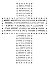

  
[Intangible Textual Heritage](../../index)  [Esoteric](../index) 
[Index](index)  [Previous](pnm00)  [Next](pnm02) 

------------------------------------------------------------------------

[Buy this Book at
Amazon.com](https://www.amazon.com/exec/obidos/ASIN/B002A9JP00/internetsacredte)

------------------------------------------------------------------------

  
*The Philosophy of Natural Magic*, by Henry Cornelius Agrippa, L. W. de
Laurence ed. \[1913\], at Intangible Textual Heritage

------------------------------------------------------------------------

 
[  
Click to enlarge](img/00500.jpg)  
Dedication  

THIS WORK  
OF OCCULT  
PHILOSOPHY,  
OR NATURAL  
MAGIC, BY  
THAT PURE MYSTIC, THINKER AND TEACHER, SCHOLAR,  
STATESMAN, PHILOSOPHER AND AUTHOR,  
HENRY CORNELIUS AGRIPPA  
WAS BROUGHT FORTH BY HIM THOUGH  
SLANDER, EDICT, AND ENEMIES OPPOSED.  
HE LIVED,  
TOILED AND  
TRIUMPHED IN  
THIS CAUSE.  
TO THOSE  
WHO HAVE  
A LOVE FOR  
TRUTH AND  
MYSTIC ART  
THIS NEW  
EDITION IS  
DEDICATED.

------------------------------------------------------------------------

[Next: Agrippa](pnm02)
