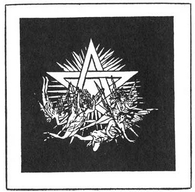

  
[Intangible Textual Heritage](../../index)  [Esoteric](../index) 
[Index](index)  [Previous](pnm01)  [Next](pnm03) 

------------------------------------------------------------------------

[Buy this Book at
Amazon.com](https://www.amazon.com/exec/obidos/ASIN/B002A9JP00/internetsacredte)

------------------------------------------------------------------------

  
*The Philosophy of Natural Magic*, by Henry Cornelius Agrippa, L. W. de
Laurence ed. \[1913\], at Intangible Textual Heritage

------------------------------------------------------------------------

p. 6

### AGRIPPA.

Mr. Henry Morley, an eminent English scholar, in his Life of Cornelius
Agrippa, makes these tributary statements:

He secured the best honors attainable in art and
arms; was acquainted with eight languages, being the master of six. His
natural bent had been from early youth to a consideration of Divine
Mysteries. To learn these and teach them to others had been at all times
his chief ambition. He is distinguished among the learned for his
cultivation of Occult Philosophy, upon which he has written a complete
work.

 

------------------------------------------------------------------------

[Next: Table of Contents](pnm03)
