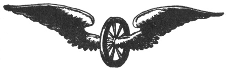

  
[Intangible Textual Heritage](../../index)  [Esoteric](../index) 
[Index](index)  [Previous](pnm09)  [Next](pnm11) 

------------------------------------------------------------------------

[Buy this Book at
Amazon.com](https://www.amazon.com/exec/obidos/ASIN/B002A9JP00/internetsacredte)

------------------------------------------------------------------------

  
*The Philosophy of Natural Magic*, by Henry Cornelius Agrippa, L. W. de
Laurence ed. \[1913\], at Intangible Textual Heritage

------------------------------------------------------------------------

p. 35 p. 36

  [  
Click to enlarge](img/03600.jpg)  
Title Page of 1651  

p. 37

 

# THE PHILOSOPHY OF NATURAL MAGIC

###### BY

#### HENRY CORNELIUS AGRIPPA

##### KNIGHT AND DOCTOR OF BOTH LAWS, COUNSELLOR TO CÆSAR'S SACRED MAJESTY, AND JUDGE OF THE PREROGATIVE COURT.

\_\_\_\_\_\_\_

### CHAPTER I.

#### How Magicians Collect Virtues from the Three-Fold World is Declared in these Three Books.

Seeing there is a Three-fold
World—Elementary, Celestial and Intellectual—and every inferior is
governed by its superior, and receiveth the influence of the virtues
thereof, so that the very Original and Chief Worker of all doth by
angels, the heavens, stars, elements, animals, plants, metals and stones
convey from Himself the virtues of His Omnipotency upon us, for whose
service He made and created all these things: Wise men conceive it no
way irrational that it should be possible for us to ascend by the same
degrees through each World, to the same very original World itself, the
Maker of all things and

p. 38

\[paragraph continues\] First cause, from
whence all things are and proceed; and also to enjoy not only these
virtues, which are already in the more excellent kind of things, but
also besides these, to draw new virtues from above. Hence it is that
they seek after the virtues of the Elementary World, through the help of
physic, and natural philosophy in the various mixtions of natural
things; then of the Celestial World in the rays, and influences thereof,
according to the rules of Astrologers, and the doctrines of
mathematicians, joining the Celestial virtues to the former. Moreover,
they ratify and confirm all these with the powers of divers
Intelligence, through the sacred ceremonies of religions. The order and
process of all these I shall endeavor to deliver in these three books:
Whereof the first contains Natural Magic, the second Celestial, and the
third Ceremonial. But I know not whether it be an unpardonable
presumption in me, that I, a man of so little judgment and learning,
should in my very youth- so confidently set upon a business so
difficult, so hard and intricate as this is. Wherefore, whatsoever
things have here already, and shall afterward be said by me, I would not
have anyone assent to them, nor shall I myself, any further than they
shall be approved of by the universal church and the congregation of the
faithful.

------------------------------------------------------------------------

[Next: Chapter II. What Magic Is, What Are the Parts Thereof, and How
the Professors Thereof Must Be Qualified](pnm11)
