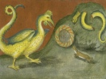

  
[Intangible Textual Heritage](../../index)  [Esoteric](../index) 
[Index](index)  [Previous](pnm18)  [Next](pnm20) 

------------------------------------------------------------------------

[Buy this Book at
Amazon.com](https://www.amazon.com/exec/obidos/ASIN/B002A9JP00/internetsacredte)

------------------------------------------------------------------------

  
*The Philosophy of Natural Magic*, by Henry Cornelius Agrippa, L. W. de
Laurence ed. \[1913\], at Intangible Textual Heritage

------------------------------------------------------------------------

### CHAPTER X.

#### Of the Occult Virtues of Things.

There are also other virtues in things,
which are not from any Element, as to expel poison, to drive away the
noxious vapors of minerals, to attract iron

p. 63

or anything else; and these virtues are a sequel of the species and form
of this or that thing; whence also they being a little in quantity, are
of great efficacy; which is not granted to any Elementary quality. For
these virtues, having much form and little matter, can do very much; but
an Elementary virtue, because it hath more materiality, requires much
matter for its acting. And they are called *Occult Qualities*, because
their causes lie hid, and man's intellect cannot in any way reach and
find them out. Wherefore philosophers have attained to the greatest part
of them by long experience, rather than by the search of reason: for as
in the stomach the meat is digested by heat, which we know, so it is
changed by a certain hidden virtue which we know not: for truly it is
not changed by heat, because then it should rather be changed by the
fire-side than in the stomach. So there are in things, besides the
Elementary qualities which we know, other certain imbred virtues created
by Nature, which we admire and are amazed at, being such as we know not,
and indeed seldom or never have seen. As we read in Ovid of the Phœnix,
one only bird, which renews herself:

All Birds from others do derive their birth,  
But yet one Fowle there is in all the Earth,  
Call’d by th’ Assyrians Phœnix, who the wain  
Of age repairs, and sows her self again.

And in another place—

Ægyptus came to see this wondrous sight;  
And this rare Bird is welcom’d with delight.

Long since Matreas brought a very great wonderment upon the Greeks and
Romans concerning himself. He said that he nourished and bred a beast
that did devour itself. Hence many to this day are solicitous what this
beast of Matreas should be. Who would not wonder that fishes should be
digged out of the Earth, of which Aristotle, Theophrastus, and

p. 64

\[paragraph continues\] Polybius the
historian, makes mention? And those things which Pausanius wrote
concerning the Singing Stones? All these are effects of Occult Virtues.
So the ostrich concocts cold and most hard iron, and digests it into
nourishment for his body; whose stomach, they also report, cannot be
hurt with red-hot iron. So that little fish, call echeneis, doth so curb
the violence of the winds, and appease the rage of the sea, that, let
the tempests be never so imperious and raging, the sails also bearing a
full gale, it doth notwithstanding by its mere touch stay the ships and
makes them stand still, that by no means they can be moved. So
salamanders and crickets live in the fire; although they seem sometimes
to burn, yet they are not hurt. The like is said of a kind of bitumen,
with which the weapons of the Amazons were said to be smeared over, by
which means they could be spoiled neither with sword nor fire; with
which also the gates of Caspia, made of brass, are reported to be
smeared over by Alexander the Great. We read also that Noah's Ark -vas
joined together with this bitumen, and that it endured some thousands of
years upon the Mountains of Armenia. There are many such kind of
wonderful things, scarce credible, which notwithstanding are known by
experience. Amongst which Antiquity makes mention of Satyrs, which were
animals, in shape half men and half brutes, yet capable of speech and
reason; one whereof St. Hierome reporteth, spake once unto holy Antonius
the Hermit, and condemned the error of the Gentiles in worshiping such
poor creatures as they were, and desired him that he would pray unto the
true God for him; also he affirms that there was one of these Satyrs
shewed openly alive, and afterwards sent to Constantine the Emperor.

------------------------------------------------------------------------

[Next: Chapter XI. How Occult Virtues are Infused into the Several Kinds
of Things by Ideas Through the Help of the Soul of the World, And Rays
of the Stars; and what Things Abound Most with this Virtue](pnm20)
