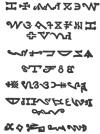

  
[Intangible Textual Heritage](../../index)  [Esoteric](../index.md) 
[Index](index)  [Previous](pnm41)  [Next](pnm43.md) 

------------------------------------------------------------------------

[Buy this Book at
Amazon.com](https://www.amazon.com/exec/obidos/ASIN/B002A9JP00/internetsacredte.md)

------------------------------------------------------------------------

  
*The Philosophy of Natural Magic*, by Henry Cornelius Agrippa, L. W. de
Laurence ed. \[1913\], at Intangible Textual Heritage

------------------------------------------------------------------------

### CHAPTER XXXIII.

#### Of the Seals and Characters of Natural Things.

All Stars have their peculiar natures,
properties, and conditions, the Seals and Characters whereof they
produce, through their rays, even in these inferior things, viz., in
elements, in stones, in plants, in animals, and their members; whence
every natural thing receives, from a harmonious disposition and from its
star shining upon it, some particular Seal, or character, stamped upon
it; which Seal of character is the significator of that star, or
harmonious disposition, containing in it a peculiar Virtue, differing
from other virtues of the same matter, both generically, specifically,
and numerically. Every thing, therefore, hath its character pressed upon
it by its star for some particular effect, especially by that star which
doth principally govern it. And these Characters contain and retain in
them the peculiar Natures, Virtues, and Roots of their Stars, and
produce the like operations upon *other* things, on which they are
reflected, and stir up and help the influences of *their* Stars, whether
they be Planets, or fixed Stars, or Figures, or celestial Signs, [†](#fn_26.md) viz.,

p. 115

as oft as they shall be made in a *fit* matter, and in their *due* and
accustomed times. Which ancient Wise Men considering—such as *labored
much* in the finding out of the occult properties of things—did set down
in writing the Images of the Stars, their Figures, Seals, Marks,
Characters, such as Nature herself did describe, by the rays of the
Stars, in these inferior bodies—some in stones, some in plants, and
joints and knots of boughs, and some in divers members of animals. For
the bay-tree, the lote-tree, and the marigold are Solary Plants, and in
their roots and knots, being cut off, shew the Characters of the Sun. So
also in the bones and shoulder-blades in animals; whence there arose a
spatulary kind of divining (*i. e.*) by the shoulder-blades; and in the
stones and stony things the Characters and Images of celestial things
are often found. But seeing that in so great a diversity of things there
is not a traditional knowledge, only in a few things, which human
understanding is able to reach: Therefore, leaving those things which
are to be found out in plants and stones, and other things, as also in
the members of divers animals, we shall limit ourselves to man's nature
only, which, seeing *it is the most complete Image of the whole
Universe*, containing in itself the whole heavenly harmony, will,
without all doubt, abundantly afford us the Seals and Characters of all
the Stars and Celestial Influences, and those, as the more efficacious,
which are less differing from the celestial nature. But as the number.
of the Stars is known to God alone, so also their effects and Seals upon
these inferior things, wherefore no human intellect is able to attain to
the knowledge of them. Whence

p. 116

very few of those things became known to us which the ancient
philosophers and chiromancers attained to, partly by reason and partly
by experience; and there be many things yet lying hid in the treasury of
Nature. We shall here, in this place, note some few Seals and Characters
of the Planets, such as the ancient chiromancers knew of, in the hands
of men. These doth Julian call Sacred and Divine Letters, seeing that by
them, according to the holy Scripture, is the life of men writ in their
hands. And there are in all nations of all languages always the same and
like to them, and permanent; to which were added and found out
afterwards many more; as by the ancient, so by latter chiromancers. And
they that would know them must have recourse to their volumes. It is
sufficient here to shew from

p. 117

HERE FOLLOW THE FIGURES OF DIVINE LETTERS:

The Letters or Characters of Saturn.

 

The Letters or Characters of Jupiter.

 

The Letters or Characters of Mars.

 

The Letters or Characters of the Sun.

 

The Letters or Characters of Venus.

 

The Letters or Characters of Mercury.

 

The Letters or Characters of the Moon.

 

p. 118

whence the Characters of Nature have their original source, and in what
things they are to be enquired after. [\*](#fn_27.md)

------------------------------------------------------------------------

### Footnotes

[114:†](pnm42.htm#fr_26.md) The Heavens in general
are mapped out into clusters and combinations of stars, known as
"constellations," and to each constellation the ancients gave a certain
"figure," the name of which also named the constellation, p. 115 as Capricornus (from "caper," goat, and
"cornu," horn) is given the figure of a goat (one horn starry); and this
constellation, by being one of the twelve constellations of the Zodiac,
is further known as one of the twelve
"Signs."

[118:\*](pnm42.htm#fr_27.md) "Mr. Morley, on page
138 of his work, gives "successively, line under line, the divine
letters of Saturn, Jupiter, Mars, Venus, Mercury, the Sun, and the
Moon," which may be compared with the figures made from the 1651
edition:

  [  
Click to enlarge](img/11600.jpg.md)

------------------------------------------------------------------------

[Next: Chapter XXXIX. How, by Natural Things and Their Virtues, We May
Draw Forth and Attract the Influences and Virtues of Celestial
Bodies](pnm43.md)
