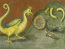

  
[Intangible Textual Heritage](../../index)  [Esoteric](../index) 
[Index](index)  [Previous](pnm67)  [Next](pnm69) 

------------------------------------------------------------------------

[Buy this Book at
Amazon.com](https://www.amazon.com/exec/obidos/ASIN/B002A9JP00/internetsacredte)

------------------------------------------------------------------------

  
*The Philosophy of Natural Magic*, by Henry Cornelius Agrippa, L. W. de
Laurence ed. \[1913\], at Intangible Textual Heritage

------------------------------------------------------------------------

p. 188

### CHAPTER LIX.

#### Of Divination by Dreams.

There is also a certain kind of
divination by dreams which is confirmed by the traditions of
philosophers, the authorities of divines, the examples of histories and
by daily experience. By dreams I do not mean vain and idle imaginations,
for they are useless and have no divination in them, but arise from the
remains of watchings, and disturbance of the body. For, as the mind is
taken up about and wearied with cares, it suggests itself to him that is
asleep. I call that a true dream which is caused by the celestial
influences in the phantastic spirit, mind or body, being all well
disposed. The rule of interpreting these is found amongst astrologers,
in that part which is wrote concerning questions: but yet that is not
sufficient, because these kinds of dreams come by use to divers men
after divers manners, and according to the divers qualities and
dispositions of the phantastic spirit. Wherefore, there cannot be given
one common rule to all for the interpretation of dreams. But, according
to the doctrine of Synesius, seeing there are the same accidents to
things, and like befalls like, so he which hath often fallen upon the
same visible thing, hath assigned to himself the same opinion, passion,
fortune, action, and event. As Aristotle saith, the memory is confirmed
by sense, and by keeping in memory the same thing, knowledge is
obtained; as also, by the knowledge of many experiences, by little and
little, arts and sciences are thus obtained. After the same account you
must conceive of dreams. Whence Synesius commands that every one should
observe his dreams and their events, and such like rules, viz., to
commit to memory all things that are seen, and accidents that befall, as
well in sleep as in watching, and with a diligent observation

p. 189

consider with himself the rules by which these are to be examined; for
by this means shall a diviner be able, by little and little, to
interpret his dreams, if so be nothing slip out of his memory. Now,
dreams are more efficacious when the Moon overruns that Sign which was
in the ninth number [\*](#fn_31) of the
nativity, or revolution of that year, [†](#fn_32) or in the ninth Sign from the Sign of
Perfection. [‡](#fn_33) For it is a most true
and certain divination, neither doth it proceed from nature or human
arts, but from purified minds, by divine inspiration. We shall now
discuss and examine Prophesying and Oracles.

------------------------------------------------------------------------

### Footnotes

[189:\*](pnm68.htm#fr_31) "Ninth Number."—The
Ninth House of the Horoscope, known as the House of Science and
Religion.

[189:†](pnm68.htm#fr_32) "Revolution."—When the
Sun has attained, as to the Earth, its original position, or the place
it occupied at the moment of birth.

[189:‡](pnm68.htm#fr_33) "Sign of
Perfection."—This is the First House of the Horoscope: that House of the
"Heaven," or Zodiac, "rising" at birth; the eastern horizon.

------------------------------------------------------------------------

[Next: Chapter LX. Of Madness, and Divinations which are made when men
are awake, and of the Power of a Melancholy Humor, by which Spirits are
sometimes induced into Men's Bodies](pnm69)
