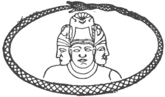
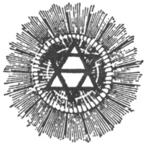

  
[Intangible Textual Heritage](../../index)  [Esoteric](../index.md) 
[Index](index)  [Previous](pnm93)  [Next](pnm95.md) 

------------------------------------------------------------------------

[Buy this Book at
Amazon.com](https://www.amazon.com/exec/obidos/ASIN/B002A9JP00/internetsacredte.md)

------------------------------------------------------------------------

  
*The Philosophy of Natural Magic*, by Henry Cornelius Agrippa, L. W. de
Laurence ed. \[1913\], at Intangible Textual Heritage

------------------------------------------------------------------------

p. 286

 

### THE ETERNAL PRINCIPLE.

#### By Dr. L. W. de Laurence.

The struggle between light and darkness, between good and evil, is as
old as the world, and yet there is no principle of evil; 

|                    |
|--------------------|
|  |

whatever degrades is evil, whatever elevates is good.

Evil or so-called sin is simply undeveloped good. Good and evil are the
light and shadow of the one eternal principle of life, and each is
necessary for the existence of the other.

The struggle between light and shadow is life, and there can be no life
without a struggle.

Matter transmits force, but does not originate force. It is for a time
the receptacle of power, but not the power. All essence of power belongs
to Spirit. All pure force is invisible.

Matter and Spirit may be one to the Absolute and Infinite Being, but
that one is Spirit. In human speech, matter is only the name of an
effect whose cause is wrapped in mystery.

It remains for the human to penetrate the veil and solve the mystery.
And the solution of this problem of mind and matter discovers man unto
himself,

p. 287

and binds him in loving union forever with the Infinite "I am," the
Spirit of all.

Absence of feeling and of suffering only shows that the process of death
has begun, or that the animal has taken full possession. Pain is not an
element to be most dreaded; for, as gold is refined by fire, the Soul is
refined by pain, and only through the death of suffering does the human
Soul rise into eternal life.

If selfishness and the animal instinct have full sway, the Soul shrivels
toward decay, while all its noble powers are congealed, its
sensibilities benumbed, its vision blinded, its intellect dimmed, and
from the once clear mirror the reflection of a noble Soul shines no more
where the innermost temple might have been radiant with truth and
virtue.

DEATH—Is death more to be feared because it is an enigma the mysteries
of which western dull minds, because obscured by theology, cannot
fathom, or their weak fancy cannot comprehend?

The human Soul is the anchorage or place of ideas. The Astral body or
star magno is the mirror that reflects and records them, human thoughts
being simply the clothing of these ideas. The spirit is the self-acting
energy that produces the Idea.

------------------------------------------------------------------------

[Next: A Message to All Mystics](pnm95.md)
