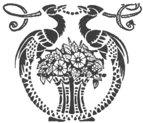

  
[Intangible Textual Heritage](../../index)  [Esoteric](../index) 
[Index](index)  [Previous](pnm95) 

------------------------------------------------------------------------

[Buy this Book at
Amazon.com](https://www.amazon.com/exec/obidos/ASIN/B002A9JP00/internetsacredte)

------------------------------------------------------------------------

  
*The Philosophy of Natural Magic*, by Henry Cornelius Agrippa, L. W. de
Laurence ed. \[1913\], at Intangible Textual Heritage

------------------------------------------------------------------------

p. 306

This advertisement appeared at the end of the original 1913 edition of
this book. It is included for completeness.—JBH.

### THE HINDU MAGIC MIRROR.

##### ORDER NO. 135. CATALOGUE PAGE NO. 140.

For many ages people have sought some medium, instrument, or means by
which they might penetrate through, or lift the veil which hangs between
the world we inhabit and that vast spiritual realm where causes reside
and principles exist. To that end, recourse has been had to various
so-called marvelous methods; 

|                    |
|--------------------|
|  |

taught by fake spiritualists, would-be mediums, and silk hat professors,
all of which in the end have proved unsatisfactory. No person can reach
the interior sight, develop or read in the Astral Light by such methods.

To all who have failed so far there is a surer, better and safer way,
and that is self-development, by means entirely within the reach of
every one, and which are within their will and control; and which
require but the elements of Time, Patience and constant practice to
ensure very good results; if not complete success in soul-sight.

The best way is for the student to use some form of the spirit-glass or
Magic Mirror.

Full particulars regarding the construction, magnetizing and use of the
Magic Mirror is contained in **"A Message to All Mystics,"** also read
article concerning **Soul Sight and Magic Mirrors**, which will be found
in our Great **Catalogue**. All those desiring special instructions on
various points regarding the making, use and care of the Magic Mirror
should read the above articles by Dr. de Laurence very closely, then
there will be no need for further inquiry.

#### HOW TO OBTAIN THE MATERIAL FOR MAKING A MAGIC MIRROR.

If you wish to own a real, genuine Opaque Magic Mirror and be able to
make it exactly as it was made by famous ancient

\`307

\[paragraph continues\] Mystics so that it
will possess Occult Virtue and become infused with Astral Auras, then
proceed as hereinafter instructed.

Foremost, procure unto thyself the following materials from de Laurence,
Scott & Co., with which to make your own Opaque Magic Mirror:

One Convexo-Concave superior transparent glass which has a perfect and
complete sphericity of form on the properly indicated side; manufactured
by a certain secret process and formed by infusing silicious matter with
fixed alkalies; but so constructed that it possesses none of the
qualities of the lens, so that rays of Astral Light passing through it
are not made to change their direction or to magnify or diminish objects
at a certain distance, as does the crystalline humour of the human eye.

In other words, this exclusive **Convexo-Concave** superior transparent
glass must be made by a special process that it has no mitigating,
assuasive or lenitive qualities whatsoever.

Its exact size must be 5 12-16 × 7 12-16 inches.

Next obtain a sufficient amount of a secret **bituminiferous substance**
like that used by the ancient mystics and old philosophers for this very
purpose.

Also one small brush; very fine.

**Messrs. de Laurence, Scott & Co. will, upon order, supply the
materials hereinbefore mentioned, consisting of one specially made
Convexo-Concave superior transparent glass, 5 12-16x7 12-16 inches, a
sufficient amount of a secret bituminiferous substance to give the glass
three coats and make it Opaque; also a brush to apply the substance on
the glass.**

**Order No. 135—The above materials will be sent in a mailing case,
securely packed, together with "THE FAMOUS MESSAGES TO ALL MYSTICS,"
which gives full directions for making a Magic Mirror. Price, $2.50.
Foreign, 12s, 10d.**

#### "MAGIC MIRROR," SPECIAL HEAVY XX.

#### ORDER NO. 136. CATALOGUE PAGE 140.

Same material as described above, except that the superior transparent
glass is XX heavy, and the more desirable, especially for professional
business.

**Order No. 136—Price with one fine Sable Brush and a sufficient amount
of bituminiferous substance to make same perfectly opaque, $3.50,
prepaid. Foreign, 16s 5d.**

 

 

 
