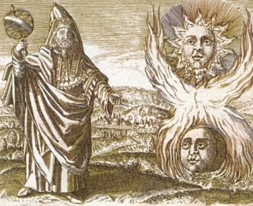

  
[Intangible Textual Heritage](../../index)  [Esoteric](../index) 

------------------------------------------------------------------------

[Buy this Book at
Amazon.com](https://www.amazon.com/exec/obidos/ASIN/B002ECE6GQ/internetsacredte)

------------------------------------------------------------------------

<table width="75%">
<colgroup>
<col style="width: 50%" />
<col style="width: 50%" />
</colgroup>
<tbody>
<tr class="odd">
<td width="50%" data-valign="TOP"> 
Hermes Trismegistus (Public Domain Image)</td>
<td width="50%" data-valign="CENTER"><h1 id="the-divine-pymander" data-align="CENTER">The Divine Pymander</h1>
<h3 id="of-hermes-mercurius-trismegistus" data-align="CENTER">of Hermes Mercurius Trismegistus</h3>
<h4 id="translation-by-john-everard" data-align="CENTER">Translation by John Everard</h4>
<h4 id="section" data-align="CENTER">[1650]</h4></td>
</tr>
</tbody>
</table>

------------------------------------------------------------------------

[Contents](#contents)    [Start Reading](pym00)    [Text
\[Zipped\]](pym.txt.gz)

------------------------------------------------------------------------

|                                                                                                                           |
|---------------------------------------------------------------------------------------------------------------------------|
|  |

This is an early modern translation of a central text of the Hermetic
canon, the Divine Pymander.

------------------------------------------------------------------------

 [Title Page](pym00)  
[Preface](pym01)  
[Hermes Trismegistus, His First Book](pym02)  
[The Second Book, Called, Poemander](pym03)  
[The Third Book, the Holy Sermon](pym04)  
[The Fourth Book, Called the Key](pym05)  
[The Fifth Book, That God is not Manifest, and Yet Most
Manifest](pym06)  
[The Sixth Book, That in God Alone is Good](pym07)  
[The Seventh Book, His Secret Sermon in the Mount of Regeneration,
Profession of Silence](pym08)  
[The Eighth Book, the Greatest Evil in Man is the not Knowing
God](pym09)  
[The Ninth Book, a Universal Sermon to Asclepius](pym10)  
[The Tenth Book, the Mind to Hermes](pym11)  
[The Eleventh Book of the Common Mind, to Tat](pym12)  
[The Twelfth Book, His Crater or Monas](pym13)  
[The Thirteenth Book, of Sense and Understanding](pym14)  
[The Fourteenth Book, of Operation and Sense](pym15)  
[The Fifteenth Book, of Truth to His Son Tat](pym16)  
[The Sixteenth Book, that None of the Things that Are Can
Perish](pym17)  
[The Seventeenth Book, to Asclepius, to be Truly Wise](pym18)  
