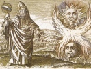

  
[Intangible Textual Heritage](../../index)  [Esoteric](../index.md) 
[Index](index)  [Previous](pym16)  [Next](pym18.md) 

------------------------------------------------------------------------

[Buy this Book at
Amazon.com](https://www.amazon.com/exec/obidos/ASIN/B002ECE6GQ/internetsacredte.md)

------------------------------------------------------------------------

  
*The Divine Pymander*, by Hermes Mercurius Trismegistus, tr. by John
Everard, \[1650\], at Intangible Textual Heritage

------------------------------------------------------------------------

**THE SIXTEENTH BOOK,** **THAT NONE OF THE THINGS THAT ARE CAN PERISH**

*Herm.*

WE must now speak of the Soul and body, O Son, after what manner the
soul is Immortal, and what operation that is, which constitutes the
Body, and dissolves it.

2\. But in none of these is Death, for it is a conception of a name,
which is either an empty word, or else it is wrongly called Death …, by
taking away the first letter, instead of Immortal ….

3\. For Death is destruction, but there is nothing in the whole World
that is destroyed.

4\. For if the World be a second God, and an Immortal living Wight, it
is impossible that any part of an Immortal living Wight should die.

5\. But all things that are in the World, are members of the World,
especially man, the reasonable living Wight.

6\. For the first of all is God, the Eternal, the Unmade, and the
Workman of all things.

7\. The second is the World, made by him, after his own Image, and by
him holden together, and nourished, and immortalized, and as from its
own Father, ever living.

8\. So that as Immortal, it is ever living, and ever immortal.

9\. For that which is ever living, differs from that which is eternal.

10\. For the Eternal was not begotten, or made by another, and if it
were begotten or made, yet it was made by itself, not by any other, but
it is always made.

11\. For the Eternal, as it is Eternal, is the Universe.

12\. For the Father himself, is Eternal of himself, but the World was
made by the Father, ever living, and immortal.

13\. And as much Matter as there was laid up by him, the Father made it
all into a Body, and swelling it, made it round like a Sphere, endued it
with Quality, being itself immortal, and having Eternal Materiality.

14\. The Father being full of *Ideas,* sowed qualities in the Spheres,
and shut them up as in a Circle, deliberating to beautify with every
Quality, that which afterwards should be made.

15\. Then clothing the Universal Body with Immortality, lest the Matter,
if it would depart from this Composition, should be dissolved into its
own disorder.

16\. For when the Matter was Incorporated, O Son, it was disordered, and
it hath here the same confusion daily revolved about other little
things, endued with Qualities, in point of Augmentation, and Diminution,
which men call Death, being indeed a disorder happening about earthly
living Wights.

17\. For the Bodies of Heavenly things, have one order, which they have
received from the Father at the beginning, and is by the instauration of
each of them, kept indissolveable.

18\. But the instauration of earthly Bodies is their consistence, and
their dissolution restores them into indissolveable, that is, Immortal.

19\. And so there is made a privation of Sense, but not a destruction of
Bodies.

20\. Now the third living Wight is Man, made after the Image of the
World, and having by the will of the Father, an mind above other earthly
Wights.

21\. And he hath not only a sympathy with the second God, but also an
understanding of the first.

22\. For the Second God, he apprehends as a Body, but the first, he
understands as Incorporeal, and the Mind of the Good.

23\. *Tat.* And doth not this living Wight perish?

24\. *Herm.* Speak advisedly, O Son, and learn what God is, what the
World, what an Immortal Wight, and what a dissolveable one is.

25\. And understand that the World is of God, and in God, but Man of the
World, and in the World.

26\. The Beginning, and End, and Consistence of all, is God.

The End of the Sixteenth Book,  
THAT NONE OF THE THINGS THAT ARE CAN PERISH.

------------------------------------------------------------------------

[Next: The Seventeenth Book, to Asclepius, to be Truly Wise](pym18.md)
