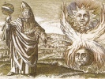

  
[Intangible Textual Heritage](../../index)  [Esoteric](../index.md) 
[Index](index)  [Previous](pym17.md) 

------------------------------------------------------------------------

[Buy this Book at
Amazon.com](https://www.amazon.com/exec/obidos/ASIN/B002ECE6GQ/internetsacredte.md)

------------------------------------------------------------------------

  
*The Divine Pymander*, by Hermes Mercurius Trismegistus, tr. by John
Everard, \[1650\], at Intangible Textual Heritage

------------------------------------------------------------------------

**THE SEVENTEENTH BOOK, TO ASCLEPIUS, TO BE TRULY WISE**

BECAUSE, my Son, *Tat*, in thy absence, would needs learn the Nature of
the things that are, he would not suffer me to give over (as coming very
young to the knowledge of every individual), till I was forced to
discourse to him many things at large, that his contemplation might,
from point to point, be more easy and successful.

2\. But to thee, I have thought good to write in few words, choosing out
the principal heads of the things then spoken, and to interpret them
more mystically, because thou hast both more years, and more knowledge
of Nature.

3\. All things that appear, were made, and are made.

4\. Those things that are made, are not made by themselves, but by
another.

5\. And there are many things made, but especially all things that
appear, and which are different, and not like.

6\. If the things that be made and done, be made and done by another,
there must be one that must make, and do them, and he, unmade, and more
ancient than the things that are made.

7\. For I affirm the things that are made, to be made by another, and it
is impossible, that of the things that are made, any should be more
ancient than all, but only that which is not made.

8\. He is stronger, and one, and only knowing all things indeed, as not
having anything more ancient than himself.

9\. For he bears rule, both over multitude and greatness, and the
diversity of the things that are made, and the continuity of the
Facture, and of the Operation.

10\. Moreover, the things that are made, are visible, but he is
invisible, and for this cause, he maketh them, that he may be visible,
and therefore he makes them always.

11\. Thus, it is fit to understand, and understanding to admire, and
admiring to think thyself happy, that knowest thy natural Father.

12\. For what is sweeter than a natural Father?

13\. Who, therefore, is this, or how shall we know him?

14\. Or is it just to ascribe unto him alone, the Title and Appellation
of God, or of the Maker or of the Father, or all Three? That of God
because of his Power; the Maker, because of his Working and Operation;
and the Father because of his Goodness.

15\. For Power is different from the things that are made, but Act or
Operation in that all things are made.

16\. Wherefore, letting go all much and vain talking, we must understand
these two things: *That which is made*, and *him which is the Maker*;
for there is nothing in the Middle, between these Two, nor is there any
third.

17\. Therefore, understanding All things, remember these Two; and think
that these are All things, putting nothing into doubt; neither of the
things above, nor of the things below; neither of things changeable, nor
things that are in darkness or secret.

18\. For All things, are but Two things, *That which maketh*, and *that
which is made*; and the One of them cannot depart, or be divided from
the other.

19\. For neither is it possible that the Maker should be without the
thing made, for either of them is the self-same thing; therefore cannot
the one of them be separated from the other, no more than a thing can be
separated from itself.

20\. For if he that makes be nothing else but that which makes alone,
*simple*, *uncompounded*, it is of necessity, that he makes the same
thing to himself, to whom it is the Generation of him that maketh to be
also All that is made.

21\. For that which is Generated or made, must necessarily be generated
or made by another, but without the maker, that which is made, neither
is made, nor is; for the one of them without the other, has lost his
proper Nature by the privation of the other.

22\. So if these Two be confessed, That which maketh, and that which is
made, then they are One in Union, this going before, and that following.

23\. And that which goeth before, is, God the Maker; and that which
follows, is, that which is made, be it what it will.

24\. And let no man be afraid because of the variety of things that are
made or done, lest he should case an aspersion of baseness, or infamy
upon God; for it is the only Glory of him to do, or make all things.

25\. And this making, or Facture, is as it were the Body of God; and to
him that maketh, or doth, there is nothing evil or filthy to be imputed,
or *there is nothing thought evil, or filthy*.

26\. For these are Passions that follow Generation, as Rust doth Copper,
or as Excrements do the Body.

27\. But neither did the Coppersmith make the Rust, nor the Maker of the
Filth, nor God the Evilness.

28\. But the vicissitude of Generation doth make them, as it were, to
blossom out; and for this cause did make change to be, as one should
say, The Purgation of Generation.

29\. Moreover, is it lawful for the same Painter to make both Heaven,
and the Gods, and the Earth, and the Sea, and Men, and brute Beasts, and
inanimate things, and Trees; and is it impossible for God to make these
things? O the great madness, and ignorance of men in things that concern
God!

30\. For men that think so, suffer that which is most ridiculous of all;
for professing to bless, and praise God, yet in not ascribing to him the
making or doing of All things, they know him now.

31\. And besides their not knowing him, they are extremely impious
against him, attributing unto him Passions, as *Pride*, or *Oversight*,
or Weakness, or Ignorance, or Envy.

32\. For if he do not make, or do all things, he is either proud, or not
able, or ignorant, or envious, which is impious to affirm.

33\. For god hath only one Passion, namely, Good; and he that is good,
is neither proud, nor impotent, nor the rest, but God is Good itself.

34\. For *Good* is all *Power*, to do or make all things, and everything
that is made, is made by God, that is, by the Good, and that can make or
do all things.

35\. See, then, how he maketh all things, and how the things are done,
that are done, and if thou wilt learn, thou mayest see an Image thereof,
very beautiful and like.

36\. Look upon the Husbandman, how he casteth seeds into the Earth, here
wheat, there barley, and elsewhere some other seeds.

37\. Look upon the same Man, planting a vine, or an apple tree, or a fig
tree, or some other tree.

38\. So doth God in Heaven sow Immortality in the Earth, Change in the
whole Life and Motion.

39\. And these things are not many, but few, and easily numbered; for
they are all but four, God and Generation, in which are all things.

The End of the Seventeenth Book,  
TO ASCLEPIUS, TO BE TRULY WISE.  
(End of the Divine Pymander--1650)

 
