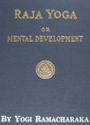

  
[Intangible Textual Heritage](../../index)  [Esoteric](../index.md) 
[Yoga](../../hin/yoga/index)  [Index](index)  [Next](ryo01.md) 

------------------------------------------------------------------------

[Buy this Book at
Amazon.com](https://www.amazon.com/exec/obidos/ASIN/B000FCG7RS/internetsacredte.md)

------------------------------------------------------------------------

  
*Raja Yoga*, by Yogi Ramacharaka (William Walker Atkinson), \[1906\], at
Intangible Textual Heritage

------------------------------------------------------------------------

## A SERIES OF LESSONS

###### IN

# RAJA YOGA

##### By

### YOGI RAMACHARAKA

Author of "Fourteen Lessons in Yogi Philosophy and
Oriental Occultism,"  
"Advanced Course it Yogi Philosophy, etc."; "Hatha Yoga",  
Psychic Healing", "Science of Breath." etc.

|                                                                                                                                                                                                             |
|-------------------------------------------------------------------------------------------------------------------------------------------------------------------------------------------------------------|
| *"When the soul sees itself as a center surrounded by its circumference—when the Sun knows that it is a Sun, surrounded by its whirling planets—then is it ready for the Wisdom and Power of the Masters."* |

#### THE YOGI PUBLICATION SOCIETY

#### CHICAGO, ILLINOIS

#### \[1906\]

 
[  
Click to enlarge](img/cover.jpg.md)  
Cover  

  [  
Click to enlarge](img/title.jpg.md)  
Title Page  

(*Note different title on cover and title page—JBH*.)

------------------------------------------------------------------------

[Next: Publishers' Notice](ryo01.md)
