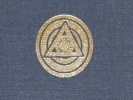

  
[Intangible Textual Heritage](../../index)  [Esoteric](../index.md) 
[Yoga](../../hin/yoga/index)  [Index](index)  [Previous](ryo04.md) 
[Next](ryo06.md) 

------------------------------------------------------------------------

[Buy this Book at
Amazon.com](https://www.amazon.com/exec/obidos/ASIN/B000FCG7RS/internetsacredte.md)

------------------------------------------------------------------------

  
*Raja Yoga*, by Yogi Ramacharaka (William Walker Atkinson), \[1906\], at
Intangible Textual Heritage

------------------------------------------------------------------------

p. 47

### THE THIRD LESSON.

#### THE EXPANSION OF THE SELF.

In the first two lessons of this course we have endeavored to bring to
the candidate a realization in consciousness of the reality of the "I,"
and to enable him to distinguish between the Self and its sheaths,
physical and mental. In the present lesson we will call his attention to
the relationship of the "I" to the Universal "I," and will endeavor to
give him an idea of a greater, grander Self, transcending personality
and the little self that we are so apt to regard as the "I."

The keynote of this lesson will be "The Oneness of All," and all of its
teachings will be directed to awakening a realization in consciousness
of that great truth. But we wish to impress upon the mind of the
Candidate that we are *not* teaching him that he is the Absolute. We are
not teaching the "I Am God" belief, which we consider to be erroneous
and misleading, and a perversion of the original Yogi teachings. This
false teaching has taken possession of many of the Hindu teachers and
people, and with its accompanying teaching of "Maya" or the complete
illusion or non-existence of the Universe, has reduced millions of
people to a passive, negative mental condition which undoubtedly is
retarding their progress. Not only in India is this true, but the same
facts may be observed among the pupils of the Western teachers who have
embraced this negative side of the

p. 48

\[paragraph continues\] Oriental
Philosophy. Such people confound the "Absolute" and "Relative" aspects
of the One, and, being unable to reconcile the facts of Life and the
Universe with their theories of "I Am God," they are driven to the
desperate expedient of boldly denying the Universe, and declaring it to
be all "an illusion" or "Maya."

You will have no trouble in distinguishing the pupils of the teachers
holding this view. They will be found to exhibit the most negative
mental condition—a natural result of absorbing the constant suggestion
of "nothingness"—the gospel of negation. In marked contrast to the
mental condition of the students, however, will be observed the mental
attitude of the teachers, who are almost uniformly examples of vital,
positive, mental force, capable of hurling their teaching into the minds
of the pupils—of driving in their statements by the force of an awakened
Will. The teacher, as a rule, has awakened to a sense of the "I"
consciousness, and really develops the same by his "I Am God" attitude,
because by holding this mental attitude he is enabled to throw off the
influence of the sheaths of the lower mental principles, and the light
of the Self shows forth fiercely and strongly, sometimes to such an
extent that it fairly scorches the mentality of the less advanced pupil.
But, notwithstanding this awakened "I" consciousness, the teacher is
handicapped by his intellectual misconception and befogging metaphysics,
and is unable to impart ttne "I" consciousness to his pupils, and,
instead of raising

p. 49

them up to shine with equal splendor with himself, he really forces them
into a shadow by reason of his teachings.

Our students, of course, will understand that the above is not written
in the spirit of carping criticism or fault-finding. We hold no such
mental attitude, and indeed could not if we remain true to our
conception of Truth. We are mentioning these matters simply that the
student may avoid this "I Am God" pitfall which awaits the Candidate
just as he has well started on the Path. It would not be such a serious
matter if it were merely a question of faulty metaphysics, for that
would straighten itself out in time. But it is far more serious than
this, for the teaching inevitably leads to the accompanying teaching
that all is Illusion or *Maya*, and that Life is but a dream—a false
thing—a lie—a nightmare; that the journey along the Path is but an
illusion; that everything is "nothing"; that there is no soul; that You
are God in disguise, and that He is fooling Himself in making believe
that He is You; that Life is but a Divine masquerade or sleight-of-hand
performance; that You are God, but that You (God) are fooling Yourself
(God) in order to amuse Yourself (God). Is not this horrible? And yet it
shows to what lengths the human mind will go before it will part with
some pet theory of metaphysics with which it has been hypnotized. Do you
think that we have overdrawn the picture? Then read some of the
teachings of these schools of the Oriental Philosophy, or listen to some
of the mort

p. 50

radical of the Western teachers preaching this philosophy. The majority
of the latter lack the courage of the Hindu teachers in carrying their
theories to a logical conclusion, and, consequently they veil their
teachings with metaphysical subtlety. But a few of there are more
courageous, and come out into the open and preach their doctrine in
full.

Some of the modern Western teachers of this philosophy explain matters
by saying that "God is masquerading as different forms of life,
including Man, in order that he may gain the experience resulting
therefrom, for although He has Infinite and Absolute Wisdom and
Knowledge, he lacks the experience that comes only from actually living
the life of the lowly forms, and therefore He descends thus in order to
gain the needed experience." Can you imagine the Absolute, possessed of
all possible Knowledge and Wisdom, feeling the need of such petty
"experience," and living the life of the lowly forms (including Man) in
order "to gain experience?" To what depths do these vain theories of Man
drive us? Another leading Western teacher, who has absorbed the teaching
of certain branches of the Oriental Philosophy, and who possesses the
courage of his convictions, boldly announces that "You, yourself, are
the *totality* of being, and with your mind alone create, preserve and
destroy the universe, which is your owl, mental product." And again the
last mentioned teacher states: "the entire universe is a bagatelle
illustration of your own creative power, which you are now exhibiting
for

p. 51

your own inspection." "By their fruits shall you know them," is a safe
rule to apply to all teachings. The philosophy that teaches that the
Universe is an illusion perpetrated by you (God) to amuse, entertain or
fool yourself (God), can have but one result, and that is the conclusion
that "everything is nothing," and all that is necessary to do is to sit
down, fold your hands and enjoy the Divine exhibition of legerdemain
that you are performing for your own entertainment, and then, when the
show is over, return to your state of conscious Godhood and recall with
smiles the pleasant memories of the "conjure show" that you created to
fool yourself with during several billions of ages. That is what it
amounts to, and the result is that those accepting this philosophy
thrust upon them by forceful teachers, and knowing in their hearts that
they are *not* God, but absorbing the suggestions of "nothingness," are
driven into a state of mental apathy and negativeness, the soul sinking
into a stupor from which it may not be roused for a long period of time.

We wish you to avoid confounding our teaching with this just mentioned.
We wish to teach you that You are a real Being—*not* God Himself, but a
manifestation of Him who is the Absolute. You are a Child of the
Absolute, if you prefer the term, possessed of the Divine Heritage, and
whose mission it is to unfold qualities which are your inheritances from
your Parent. Do not make the great mistake of confounding the Relative
with the Absolute. Avoid this pitfall into which so many have fallen. Do
not allow yourself

p. 52

to fall into the "Slough of Despond," and wallow in the mud of
"nothingness," and to see no reality except in the person of some
forceful teacher who takes the place of the Absolute in your mind. But
raise your head and assert your Divine Parentage, and your Heritage from
the Absolute, and step out boldly on the Path, asserting the "I."

(We must refer the Candidate back to our "Advanced Course," for our
teachings regarding the Absolute and the Relative. The last three
lessons of that course will throw light upon what we have just said. To
repeat the teaching at this point would be to use space which is needed
for the lesson before us.)

And yet, while the "I" is *not* God, the Absolute, it is infinitely
greater than we have imagined it to be before the light dawned upon us.
It extends itself far beyond what we had conceived to be its limits. It
touches the Universe at all its points, and is in the closest union with
all of Life. It is in the closest touch with all that has emanated from
the Absolute—all the world of Relativity. And while it faces the
Relative Universe, it has its roots in the Absolute, and draws
nourishment therefrom, just as does the babe in the womb obtain
nourishment from the mother. It is verily a manifestation of God, and
God's very essence is in it. Surely this is almost as "high" a statement
as the "I Am God" of the teachers just mentioned,—and yet how different.
Let us consider the teaching in detail in this lesson, and in portions
of others to follow.

p. 53

Let us begin with a consideration of the instruments of the Ego, and the
material with which and through which the Ego works. Let us realize that
the physical body of man is identical in substance with all other forms
of matter, and that its atoms are continually changing and being
replaced, the material being drawn from the great storehouse of matter,
and that there is a Oneness of matter underlying all apparent
differences of form and substance. And then let us realize that the
vital energy or *Prana* that man uses in his life work is but a portion
of that great universal energy which permeates everything and
everywhere, the portion being used by us at any particular moment being
drawn from the universal supply, and again passing out from us into the
great ocean of force or energy. And then let us realize that even the
mind, which is so close to the real Self that it is often mistaken for
it.—even that wonderful thing Thought—is but a portion of the Universal
Mind, the highest emanation of the Absolute beneath the plane of Spirit,
and that the Mind—substance or *Chitta* that we are using this moment,
is not ours separately and distinctly, but is simply a portion from the
great universal supply, which is constant and unchangeable. Let us then
realize that even this thing that we feel pulsing within us—that which
is so closely bound up with the Spirit as to be almost inseparable from
it—that which we call Life—is but a bit of that Great Life Principle
that [pervades](errata.htm#1.md) the Universe, and which cannot be added
to, nor subtracted from. When we have realized these

p. 54

things, and have begun to feel our relation (in these particulars) to
the One Great Emanation of the Absolute, then we may begin to grasp the
idea of the Oneness of Spirit, and the relation of the "I" to every
other "I," and the merging of the Self into the one great Self, which is
not the extinction of Individuality, as some have supposed, but the
enlargement and extension of the individual Consciousness until it takes
in the Whole

In Lessons X and XI, of the "Advanced Course" we called your attention
to the Yogi teachings concerning *Akasa* or Matter, and showed you that
all forms of what we know as Matter are but different forms of
manifestation of the principle called *Akasa*, or as the Western
scientists call it, "Ether." This Ether or *Akasa* is the finest,
thinnest and most tenuous form of Matter, in fact it is Matter in its
ultimate or fundamental form, the different forms of what we call Matter
being but manifestations of this *Akasa* or Ether, the apparent
difference resulting from different rates of vibration, etc. We mention
this fact here merely to bring clearly before your mind the fact of the
Universality of Matter, to the end that you may realize that each and
every particle of your physical body is but a portion of this great
principle of the Universe, fresh from the great store-house, and just
about returning to it again, for the atoms of the body are constantly
changing. That which appears as your flesh to-day, may have been part of
a plant a few days before, and may be part of some other living thing a

p. 55

few days hence. Constant change is going on, and what is yours to-day
was someone's else yesterday, and still another's to-morrow. You do not
own one atom of matter *personally*, it is all a part of the common
supply, the stream flowing through you and through all Life, on and on
forever.

And so it is with the Vital Energy that you are using every moment of
your life. You are constantly drawing upon the great Universal supply of
*Prana*, then using what is given you, allowing the force to pass on to
assume some other form. It is the property of all, and all you can do is
to use what you need, and allow it to pass on. There is but one Force or
Energy, and that is to be found everywhere at all times.

And even the great principle, Mind-substance, is under the same law. It
is hard for us to realize this. We are so apt to think of our mental
operations as distinctively our own—something that belongs to us
personally—that it is difficult for us to realize that Mind-substance is
a Universal principle just as Matter or Energy, and that we are but
drawing upon the Universal supply in our mental operations. And more
than this, the particular portion of Mind-substance that we are using,
although separated from the Mind-substance used by other individuals by
a thin wall of the very finest kind of Matter, is really in touch with
the other apparently separated minds, and with the Universal Mind of
which it forms a part. Just as is the Matter of which our physical
bodies are composed really in touch with all Matter; and just as is

p. 56

the Vital Force used by us really in touch with all Energy; so is our
Mind-substance really in touch with all Mind-substance. It is as if the
Ego in its progress were moving through great oceans of Matter, Energy,
or Mind-substance, making use of that of each which it needed and which
immediately surrounded it, and leaving each behind as it moved on
through the great volume of the ocean. This illustration is clumsy, but
it may bring to your consciousness a realization that the Ego is the
only thing that is really *Yours*, unchangeable and unaltered, and that
all the rest is merely that portion of the Universal supply that you
draw to yourself for the wants of the moment. It may also bring more
clearly before your mind the great Unity of things—may enable you to see
things as a Whole, rather than as separated parts. Remember, *You*—the
"I"—are the only Real thing about and around you—all that has
permanence—and Matter, Force and even Mind-substance, are but your
instruments for use and expression. There are great oceans of each
surrounding the "I" as it moves along.

It is well for you also to bear in mind the Universality of Life. All of
the Universe is alive, vibrating and pulsating with life and energy and
motion. There is nothing dead in the Universe. Life is everywhere. and
always accompanied by intelligence. There is no such thing as a dead,
unintelligent Universe. *Instead of being atoms of Life floating in a
sea of death, we are atoms of Life surrounded by an ocean of Life,
pulsating, moving, thinking, living*. Every atom of

p. 57

what we call Matter is alive. It has energy or force with it, and is
always accompanied by intelligence and life, Look around us as we
will—at the animal world—at the plant world—yes, even at the world of
minerals, and we see life, life, life—all alive and having intelligence.
When we are able to bring this conception into the realm of actual
consciousness—when we are able not only to intellectually accept this
fact, but to even go still further and *feel* and be conscious of this
Universal Life on all sides, then are we well on the road to attaining
the Cosmic Consciousness.

But all these things are but steps leading up to the realization of the
Oneness in Spirit, on the part of the Individual. Gradually there dawns
upon him the realization that there is a Unity in the manifestation of
Spirit from the Absolute—a unity with itself, and a Union with the
Absolute. All this manifestation of Spirit on the part of the
Absolute—all this begetting of Divine Children—was in the nature of a
single act rather than as a series of acts, if we may be permitted to
speak of the manifestation as an *act*. Each Ego is a Centre of
Consciousness in this great ocean of Spirit—each is a Real Self,
apparently separate from the others and from its source, but the
separation is only apparent in both cases, for there is the closest bond
of union between the Egos of the Universe of Universes—each is knit to
the other in the closest bond of union, and each is still attached to
the Absolute by spiritual filaments, if we may use the term. In time we
shall grow more conscious of this mutual relationship,

p. 58

as the sheaths are outgrown and cast aside, and in the end we will be
withdrawn into the Absolute—shall return to the Mansion of the Father.

It is of the highest importance to the developing soul to unfold into a
realization of this relationship and unity, *for when this conception is
once fully established the soul is enabled to rise above certain of the
lower planes, and is free from the operation of certain laws that bind
the undeveloped soul*. Therefore the Yogi teachers are constantly
leading the Candidates toward this goal. First by this path, and then by
that one, giving them different glimpses of the desired point, until
finally the student finds a path best fitted for his feet, and he moves
along straight to the mark, and throwing aside the confining bonds that
have proved so irksome, he cries aloud for joy at his new found Freedom.

The following exercises and Mental Drills are intended to aid the
Candidate in his work of growing into a realization of his relationship
with the Whole of Life and Being.

#### MENTAL DRILL.

\(1\) Read over what we have said in the "Advanced Course" regarding the
principle known as Matter. Realize that all Matter is One at the
last—that the real underlying substance of Matter is *Akasa* or Ether,
and that all the varying forms evident to our senses are but
modifications and grosser forms of that underlying principle. Realize
that by known chemical processes all forms of Matter known to us, or

p. 59

rather all combinations resulting in "forms," may be resolved into their
original elements, and that these elements are merely *Akasa* in
different states of vibration. Let the idea of the Oneness of the
visible Universe sink deeply into your mind, until it becomes fixed
there. The erroneous conception of diversity in the material world must
be replaced by the consciousness of Unity—Oneness, at the last, in spite
of the appearance of variety and manifold forms. You must grow to see
behind the world of forms of Matter, and see the great principle of
Matter (*Akasa* or Ether) back of, within, and under it all. You must
grow to *feel* this, as well as to intellectually see it.

\(2\) Meditate over the last mentioned truths, and then follow the
matter still further. Read what we have said in the "Advanced Course"
(Lesson XI) about the last analysis of Matter showing it fading away
into Force or Energy until the dividing line is lost, and Matter merges
into Energy or Force, showing them both to be but the same thing, Matter
being a grosser form of Energy or Force. This idea should be impressed
upon the understanding, in order that the complete edifice of the
Knowing of the Oneness may be complete in all of its parts.

\(3\) Then read in the "Advanced Lessons" about Energy or Force, in the
oneness underlying its various manifestations. Consider how one form of
Energy may be transformed into another, and so on around the circle, the
one principle producing the entire chain of appearances. Realize that
the energy within

p. 60

you by which you move and act, is but one of the forms of this great
Principle of Energy with which the Universe is filled, and that you may
draw to you the required Energy from the great Universal supply. But
above all endeavor to grasp the idea of the Oneness pervading the world
of Energy or Force, or Motion. See it in its entirety, rather than in
its apparent separateness. These steps may appear somewhat tedious and
useless, but take our word for it, they are all helps in fitting the
mind to grasp the idea of the Oneness of All. Each step is important,
and renders the next higher one more easily attained. In this mental
drill, it will be well to mentally picture the Universe in perpetual
motion—everything is in motion—all matter is moving and changing its
forms, and manifesting the Energy within it. Suns and worlds rush
through space, their particles constantly changing and moving. Chemical
composition and decomposition is constant and unceasing, everywhere the
work of building up and breaking down is going on. New combinations of
atoms and worlds are constantly being formed and dissolved. And after
considering this Oneness of the principle of Energy, reflect that
through all these changes of form the Ego—the Real Self—YOU—stand
unchanged and unharmed—Eternal, Invincible, Indestructible,
Invulnerable, *Real* and Constant among this changing world of forms and
force. You are above it all, and it revolves around and about
you—Spirit.

4\) Read what we have said in the 'Advanced

p. 61

\[paragraph continues\] Course" about
Force or Energy, shading into Mind-substance which is its parent.
Realize that Mind is back of all this great exhibition of Energy and
Force that you have been considering. Then will you be ready to consider
the Oneness of Mind.

\(5\) Read what we have said in the "Advanced Lessons" about
Mind-substance. Realize that there is a great world of Mind-substance,
or an Universal Mind, which is at the disposal of the Ego. All Thought
is the product of the Ego's use of this Mind-substance, its tool and
instrument. Realize that this Ocean of Mind is entire and Whole, and
that the Ego may draw freely from it. Realize that *You* have this great
ocean of Mind at your command, when you unfold sufficiently to use it.
Realize that Mind is back of and underneath all of the world of form and
names and action, and that in that sense: "All is Mind," although still
higher in the scale than even Mind are *You*, the Real Self, the Ego,
the Manifestation of the Absolute.

\(6\) Realize your identity with and relationship to All of Life. Look
around you at Life in all its forms, from the lowest to the highest, all
being exhibitions of the great principle of Life in operation along
different stages of The Path. Scorn not the humblest forms, but look
behind the form and see the reality—Life. Feel yourself a part of the
great Universal Life. Let your thought sink to the depths of the ocean,
and realize your kinship with the Life back of the forms dwelling there.
Do not confound the forms

p. 62

\[paragraph continues\] (often hideous
from your personal point of view) with the principle behind them. Look
at the plant-life, and the animal life, and seek to see behind the veil
of form into the real Life behind and underneath the form. Learn to feel
your Life throbbing and thrilling with the Life Principle in these other
forms, and in the forms of those of your own race. Gaze into the starry
skies and see there the numerous suns and worlds, all peopled with life
in some of its myriad forms, and feel your kinship to it. If you can
grasp this thought and consciousness, you will find yourself at-one-ment
with those whirling worlds, and, instead of feeling small and
insignificant by comparison, you will be conscious of an expansion of
Self, until you feel that in those circling worlds is a part of
yourself—that You are there also, while standing upon the Earth—that you
are akin to all parts of the Universe—nay, more, that they are as much
your home as is the spot upon which you are standing. You will find
sweeping upon you a sense of consciousness that the Universe is your
home—not merely a part of it, as you had previously thought. You will
experience a sense of greatness, and broadness and grandness such as you
have never dreamed of. You will begin to realize at least a part of your
Divine inheritance, and to know indeed that you are a Child of the
Infinite, the very essence of your Divine Parent being in the fibres of
your being. At such times of realization one becomes conscious of what
lies before the soul in its upward path, and how small the greatest
prizes that

p. 63

\[paragraph continues\] Earth has to offer
are when compared to some of these things before the soul, as seen by
the eyes of the Spiritual Mind in moments of clear vision.

You must not dispute with these visions of the greatness of the soul,
but must treat them hospitably, for they are your very own, coming to
you from the regions of your Spiritual Mind which are unfolding into
consciousness.

\(7\) The highest step in this dawning consciousness of the Oneness of
All, is the one in which is realized that there is but One Reality, and
at the same time the sense of consciousness that the "I" is in that
Reality. It is most difficult to express this thought in words for it is
something that must be felt, rather than seen by the Intellect. When the
Soul realizes that the Spirit within it is, at the last, the only *real*
part of it, and that the Absolute and its manifestation as Spirit is the
only *real* thing in the Universe, a great step has been taken. But
there is still one higher step to be taken before the full sense of the
Oneness and Reality comes to us. That step is the one in which we
realize the Identity of the "I" with the great "I" of the Universe. The
mystery of the manifestation of the Absolute in the form of the Spirit,
is veiled from us—the mind confesses its inability to penetrate behind
the veil shielding the Absolute from view, although it will give us a
report of its being conscious of the presence of the Absolute just at
the edge of the boundary line. But the highest region of the Spiritual
Mind, when explored by the advanced souls who

p. 64

are well along the Path, reports that it sees beyond the apparent
separation of Spirit from Spirit, and realizes that there is but one
Reality of Spirit, and that all the "I" 's are really but different
views of that One—Centres of Consciousness upon the surface of the One
Great "I," the Centre of which is the Absolute Itself. This certainly
penetrates the whole region of the Spiritual Mind, and gives us all the
message of Oneness of the Spirit, just as the Intellect satisfies us
with its message of the Oneness of Matter, Energy, and Mind. The idea of
Oneness permeates all planes of Life.

The sense of Reality of the "I" that is apparent to You in the moments
of your clearest mental vision, is really the reflection of the sense of
Reality underlying the Whole—it is the consciousness of the Whole,
manifesting through your point or Centre of Consciousness. The advanced
student or Initiate finds his consciousness gradually enlarging until it
realizes its identity with the Whole. He realizes that under all the
forms and names of the visible world, there is to be found One Life—One
Force—One Substance—One Existence—One Reality—ONE. And, instead of his
experiencing any sense of the loss of identity or individuality, he
becomes conscious of an enlargement of an expansion of individuality or
identity—instead of feeling himself absorbed in the Whole, he feels that
he is spreading out and embracing the Whole. This is most hard to
express in words, for there are no words to fit the conception, and all
that

p. 65

we can hope to do is to start into motion, by means of our words, the
vibrations that will find a response in the minds of those who read the
words, to the end that they will experience the consciousness which will
bring its own understanding. This consciousness cannot be transmitted by
words proceeding from the Intellect, but vibrations may be set up that
will prepare the mind to receive the message from its own higher planes.

Even in the early stages of this dawning consciousness, one is enabled
to identify the *real* part of himself with the *real* part of all the
other forms of life that pass before his notice. In every other man—in
every animal—in every plant—in every mineral—he sees behind the sheath
and form of appearance, an evidence of the presence of the Spirit which
is akin to his own Spirit—yea, more than akin, for the two are One. He
sees Himself in all forms of life, in all time in all places. He
realizes that the Real Self is everywhere present and everlasting, and
that the Life within himself is also within all the Universe—in
everything, for there is nothing dead in the Universe, and all Life, in
all of its varying phases, is simply the One Life, held, used and
enjoyed in common by all. Each Ego is a Centre of Consciousness in this
great ocean of Life, and while apparently separate and distinct, is yet
really in touch with the Whole, and with every apparent part.

It is not our intention, in this lesson, to go into the details of this
great mystery of Life, or to recite the

p. 66

comparatively little of the Truth that the most advanced teachers and
Masters have handed down. This is not the place for it—it belongs to the
subject of Gnani Yoga rather than to Raja Yoga—and we touch upon it
here, not for the purpose of trying to explain the scientific side of it
to you, but merely in order that your minds may be led to take up the
idea and gradually manifest it in conscious realization. There is quite
a difference between the scientific, intellectual teaching of Gnani
Yoga, whereby the metaphysical and scientific sides of the Yogi
teachings are presented to the minds of the students, in a logical,
scientific manner, and the methods of *Raja* Yoga, in which the
Candidate is led by degrees to a *consciousness* (outside of mere
intellectual belief) of his real nature and powers. We are following the
latter plan, for this course is a Course in Raja Yoga. We are aiming to
present the matter to the mind in such a manner that it may prepare the
way for the dawning consciousness, by brushing away the preconceived
notions and prejudices, and allowing a clean entrance for the new
conception. Much that we have said in this lesson may appear, on the one
hand, like useless repetition, and, on the other hand, like an
incomplete presentation of the scientific side of the Yogi teachings.
But it will be found, in time, that the effect has been that the mind of
the student has undergone a change from the absorbing of the idea of the
Oneness of Life, and the Expansion of the Self. The Candidate is urged
not to be in too much of a hurry. Development

p. 67

must not be forced. Read what we have written, and practice the Mental
Drills we have given, even if they may appear trifling and childish to
some of you—we know what they will do for you, and you will agree with
us in time. Make haste slowly. You will find that the mind will work out
the matter, even though you be engaged in your ordinary work, and have
forgotten the subject for the time. The greater portion of mental work
is done in this way, while you are busy with something else, or even
asleep, for the sub-conscious portion of the mind works along the lines
pointed out for it, and performs its task.

As we have said, the purpose of this lesson is to bring you in the way
of the unfoldment of consciousness, rather than to teach you the details
of the scientific side of the Yogi teachings. Development is the keynote
of Raja Yoga. And the reason that we wish to develop this sense of the
Reality of the "I," and the Expansion of the Self, at this place is that
thereby you may assert your Mastery over Matter, Energy and Mind. Before
you may mount your throne as King, you must fully realize in
consciousness that you *are* the *Reality* in this world of appearances.
You must realize that you—the *real* You—are not only existent, and
real, but that you are in touch with all else that is real, and that the
roots of your being are grounded in the Absolute itself. You must
realize that instead of being a separate atom of Reality, isolated and
fixed in a narrow space, you are a Centre of Consciousness in the Whole
of Reality, and that the

p. 68

\[paragraph continues\] Universe of
Universes is your home—that your Centre of Consciousness might be moved
on to a point trillions of miles from the Earth (which distance would be
as nothing in Space) and still you—the awakened soul—would be just as
much at home there as here—that even while you are here, your influence
extends far out into space. Your real state, which. will be revealed to
you, gradually, throughout the ages, is so great and grand, that your
mind in its present state of development cannot grasp even the faint
reflection of that glory.

We wish you to try to form at least a faint idea of your Real State of
Being, in order that you may control the lower principles by the force
of your awakened Will, which Will depends upon your degree of
consciousness of the Real Self.

As man grows in understanding and consciousness of the Real Self, so
does his ability to use his Will grow. Will is the attribute of the Real
Self. It is well that this great realization of the Real Self brings
with it Love for all of Life, and Kindness, for, were it not so, the
Will that comes to him who grows into a realization of his real being
could be used to the great hurt of those of the race who had not
progressed so far (their *relative* hurt, we mean, for in the end, and
at the last, no soul is ever really *hurt*). But the dawning power
brings with it greater Love and Kindness, and the higher the soul mounts
the more is it filled with the higher ideals and the more does it throw
from it the lower animal attributes. It is true that

p. 69

some souls growing into a consciousness of their real nature, without an
understanding of what it all means, may commit the error of using the
awakened Will for selfish ends, as may be seen in the cases of the Black
Magicians spoken of in the occult writings, and also in the cases of
well known characters in history and in modern life, who manifest an
enormous Will which they misuse. All of this class of people of great
Will have stumbled or grown blindly into a consciousness (or partial
consciousness) of the real nature, but lack the restraining influence of
the higher teachings. But such misuse of the Will brings pain and unrest
to the user, and he is eventually driven into the right road.

We do not expect our students to grasp fully this idea of the Expansion
of Self. Even the highest grasp it only partially. But until you get a
glimmering of the consciousness you will not be able to progress far on
the path of Raja Yoga. You must understand *what you are*, before you
are able to use the power that lies dormant within you. You must realize
that you are the Master, before you can claim the powers of the Master,
and expect to have your commands obeyed. So bear patiently with us, your
Teachers, while we set before you the lessons to be learned—the tasks to
be performed. The road is long, and is rough in places—the feet may
become tired and bruised, but the reward is great, and there are resting
places along the path. Be not discouraged if your progress seem slow,
for the soul must unfold naturally as does the flower, without haste,
without force.

p. 70

And be not dismayed nor affrighted if you occasionally catch a glimpse
of your higher self. As "M. C." says, in her notes on "Light on the
Path" (see "Advanced Course," page 95): "To have seen thy soul in its
bloom, is to have obtained a momentary glimpse in thyself of the
transfiguration which shall eventually make thee more than man; to
recognize, is to achieve the great task of gazing upon the blazing light
without dropping the eyes, and not falling back in terror as though
before some ghastly phantom. This happens to some, and so, when the
victory is all but won, it is lost."

Peace be with thee.

p. 71

# MANTRAM (AFFIRMATION).

#### FOR THE THIRD LESSON.

There is but one ultimate form of Matter; one ultimate form of Energy;
one ultimate form of Mind. Matter proceeds from Energy, and Energy from
Mind, and all are an emanation of the Absolute, threefold in appearance
but One in substance. There is but One Life, and that permeates the
Universe, manifesting in various forms, but being, at the last, but One.
My body is one with Universal Matter; My energy and vital force is one
with the Universal Energy; My Mind is one with the Universal Mind; My
Life is one with the Universal Life. The Absolute has expressed and
manifested itself in Spirit, which is the real "I" overshadowing and
embracing all the apparently separate "I"s. "I" feel my identity with
Spirit and realize the Oneness of All Reality. I feel my unity with all
Spirit, and my Union (through Spirit) with the Absolute. I realize that
"I" am an Expression and Manifestation of the Absolute, and that its
very essence is within me. I am filled with Divine Love. I am filled
with Divine Power. I am filled with Divine Wisdom. I am conscious of
identity in spirit, in substance; and in nature; with the One Reality.

------------------------------------------------------------------------

[Next: Lesson IV. Mental Control](ryo06.md)
