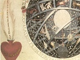

  
[Intangible Textual Heritage](../../index)  [Esoteric](../index.md) 
[Index](index)  [Previous](sat05)  [Next](sat07.md) 

------------------------------------------------------------------------

[Buy Kindle Download of this
Book](https://www.amazon.com/exec/obidos/ASIN/B001BDI55M/internetsacredte.md)

------------------------------------------------------------------------

[Buy Printed Copy of this Book at
lulu.com](https://www.lulu.com/content/2742583.md)

------------------------------------------------------------------------

  
*The Signature of All Things*, by Jacob Boehem, \[1912\], at Intangible
Textual Heritage

------------------------------------------------------------------------

p. 13

### CHAPTER II

OF THE OPPOSITION AND COMBAT IN THE ESSENCE OF ALL
ESSENCES, WHEREBY THE GROUND OF THE ANTIPATHY AND SYMPATHY IN NATURE MAY
BE SEEN, AND ALSO THE CORRUPTION AND CURE OF EACH THING

1\. Seeing then there are so many and
divers forms, that the one always produces and affords out of its
property a will different in one from another, we herein understand the
contrariety and combat in the Being of all beings, how that one does
oppose, poison, and kill another, that is, overcome its essence, and the
spirit of the essence, and introduces it into another form, whence
sickness and pains arise, when one essence destroys another.

2\. And then we understand herein the cure, how the one heals another,
and brings it to health; and if this were not, there were no nature, but
an eternal stillness, and no will; for the contrary will makes the
motion, and the original of the seeking, that the opposite sound seeks
the rest, and yet in the seeking it only elevates and more enkindles
itself.

3\. And we are to understand how the cure of each thing consists in the
assimulate; for in the assimulate arises the satisfaction of the will,
viz. its highest joy; for each thing desires a will of its likeness, and
by the contrary will it is discomfited; [1](#fn_11.md) but if it obtains a will of its likeness,
it rejoices in the assimulate, and therein falls into rest, and the
enmity is turned into joy.

4\. For the eternal nature has produced nothing in its desire, except a
likeness out of itself; and if there were not an everlasting mixing,
there would be an eternal peace in nature, but so nature would not be
revealed and made manifest, in the combat it becomes manifest; so that
each thing elevates itself, and would get out of the combat into the
still rest, and so it runs to and fro, and thereby only awakens and
stirs up the combat.

5\. And we find clearly in the light of nature, that there is no better
help and remedy for this opposition, and that it has no,

p. 14

higher cure than the liberty, that is, the light of nature, which is the
desire of the spirit.

6\. And then we find, that the essence cannot be better remedied than
with the assimulate; for the essence is a being, and its desire is after
being: Now every taste desires only its like, and if it obtains it, then
its hunger is satisfied, appeased and eased, and it ceases to hunger,
and rejoices in itself, whereby the sickness falls into a rest in
itself; for the hunger of the contrariety ceases to work.

7\. Seeing now that man's life consists in three principles, viz. in a
threefold essence, and has also a threefold spirit out of the property
of each essence, viz. first, according to the eternal nature, according
to the fire's property; and secondly, according to the property of the
eternal light and divine essentiality; and thirdly, according to the
property of the outward world: Thereupon we are to consider the property
of this threefold spirit, and also of this threefold essence and will;
how each spirit with its essence introduces itself into strife and
sickness, and what its cure and remedy is.

8\. We understand that without nature there is an eternal stillness and
rest, viz. the Nothing; and then we understand that an eternal will
arises in the nothing, to introduce the nothing into something, that the
will might find, feel, and behold itself.

9\. For in the nothing the will would not be manifest to itself,
wherefore we know that the will seeks itself, and finds itself in
itself, and its seeking is a desire, and its finding is the essence of
the desire, wherein the will finds itself.

10\. It finds nothing except only the property of the hunger, which is
itself, which it draws into itself, that is, draws itself into itself,
and finds itself in itself; and its attraction into itself makes an
overshadowing or darkness in it, which is not in the liberty, viz. in
the nothing; for the will of the liberty overshadows itself with the
essence of the desire, for the desire makes essence and not the will.

11\. Now that the will must be in darkness is its contrariety, and it
conceives in itself another will to go out from the darkness again into
the liberty, viz. into the nothing, and yet it cannot reach the liberty
from without itself, for the desire goes outwards, and causes source and
darkness; therefore the will (understand the reconceived will) must
enter inwards, and yet there is no separation.

12\. For in itself before the desire is the liberty, viz. the

p. 15

nothing, and the will may not be a nothing, for it desires to manifest
in the nothing; and yet no manifestation can be effected, except only
through the essence of the desire; and the more the reconceived will
desires manifestation, the more strongly and eagerly the desire draws
into itself, and makes in itself three forms, viz. the desire, which is
astringent, and makes hardness, for it is an enclosing, when coldness
arises, and the attraction causes compunction, [1](#fn_12.md) and stirring in the hardness, an enmity
against the attracted hardness; the attraction is the second form, and a
cause of motion and life, and stirs itself in the astringency and
hardness, which the hardness, viz. the enclosing, [2](#fn_13.md) cannot endure, and therefore it attracts
more eagerly to hold the compunction, and yet the compunction is thereby
only the stronger.

13\. Thus the compunction willeth upwards, and whirls crossways, and yet
cannot effect it, for the hardness, viz. the desire stays and detains
it, and therefore it stands like a triangle, and transverted orb, which
(seeing it cannot remove from the place) becomes wheeling, whence arises
the mixture in the desire, viz. the essence, or multiplicity of the
desire; for the turning makes a continual confusion and contrition,
whence the anguish, viz. the pain, the third form (or sting of sense)
arises.

14\. But seeing the desire, viz. the astringency becomes only the more
strong thereby (for from the stirring arises the wrath and nature, viz.
the motion), the first will to the desire is made wholly austere and a
hunger, for it is in a hard compunctive dry essence, and also cannot get
rid and quit of it, for itself makes the essence, and likewise possesses
it, for thus it finds itself now out of nothing in the something, [3](#fn_14.md) and the something is yet its contrary
will, for it is an unquietness, and the free-will is a stillness.

15\. This is now the original of enmity, that nature opposes the
free-will, and a thing is at enmity in itself; and here we understand
the centre of nature with three forms, in the original, viz. in the
first principle, it is Spirit; in the second it is Love, and in the
third principle Essence; and these three forms are called in the third
principle Sulphur, Mercury, and Sal.

16\. Understand it thus: Sul is in the first principle the freewill, or
the lubet in the nothing to something, it is in the liberty without
nature; Phur is the desire of the free lubet, and makes in itself, in
the Phur, viz. in the desire, an essence, and this

p. 16

essence is austere by reason of the attraction, and introduces itself
into three forms (as is above mentioned) and so forward into the fourth
form, viz. into the fire; in the Phur the original of the eternal and
also external nature is understood, for the hardness is a mother of the
sharpness of all essences, and a preserver of all essences; out of the
Sul, viz. out of the lubet of the liberty, the dark anguish becomes a
shining light; and in the third principle, viz. in the outward kingdom,
Sul is the oil of nature, wherein the life burns, and everything grows.

17\. But now the Phur, viz. the desire, is not divided from Sul; it is
one word, one original also, and one essence, but it severs itself into
two properties, viz. into joy and sorrow, light and darkness; for it
makes two worlds, viz. a dark fire-world in the austereness, and a light
fire-world in the lubet of the liberty; for the lubet of the liberty is
the only cause that the fire shines, for the original fire is dark and
black, for in the shining of the fire in the original the Deity is
understood, and in the dark fire, viz. in the anguish-source, the
original of nature is understood, and herein we do further understand
the cure.

18\. The source is the cure of the free lubet, viz. of the still
eternity; for the stillness finds itself alive therein, it brings itself
through the anguish-source into life, viz. into the kingdom of joy,
namely that the nothing is become an eternal life, and has found itself,
which cannot be in the stillness.

19\. Secondly, we find that the Sul, viz. the lubet of the liberty, is
the curer of the desire, viz. of the anxious nature: for the lustre of
the liberty does again (from the enkindled fire out of nature) shine in
the dark anguish, and fills or satiates the anguish with the liberty,
whereby the wrath extinguishes, and the turning orb stands still, and
instead of the turning a sound is caused in the essence.

20\. This is now the form of the spiritual life, and of the essential
life; Sul is the original of the joyful life, and Phur is the original
of the essential life; the lubet is before and without nature, which is
the true Sul; and the spirit is made manifest in nature, viz. through
the source, and that in a twofold form, viz. according to the lubet of
the liberty in a source of joy, and according to the anxious desire's
lubet; according to the astringency, compunctive, bitter, and envious
from the compunction, and according to the anguish of the wheel wholly
murderous and hateful; and each property dwells in itself, and yet they
are in one another; herein God's love and anger are understood, they
dwell in each other; and the one apprehends

p. 17

not the other, and yet the one is the curer of the other; understand
through imagination, for the eternal is magical.

21\. The second form in nature, in eternity is the Orb with the
compunctive bitter essences: for there arises the essence, understand
with the perturbation; for the nothing is still without motion, but the
perturbation makes the nothing active: but in the third principle, viz.
in the dominion in the essence, and source of the outward world, the
form is called Mercury, which is opposite, odious, and poisonful, and
the cause of life and stirring, also the cause of the senses: Where one
glance [1](#fn_15.md) may conceive itself in the
infinity, and then also immerse itself into it, where out of one only
the abyssal, unsearchable, and infinite multiplicity may arise.

22\. This form is the unquietness, and yet the seeker of rest; and with
its seeking it causes unquietness, it makes itself its own enemy; its
cure is twofold, for its desire is also twofold, viz. according to the
lubet of the liberty, according to the stillness and meekness; and then
also in the hunger according to the rising of unquietness, and the
finding of itself; the root desires only joy with the first will, and
yet it cannot obtain it, except through the opposite source, for no joy
can arise in the still nothing; it must arise only through motion and
elevation that the nothing finds itself.

23\. Now that which is found desires to enter again into the will of the
still nothing, that it may have peace and rest therein; and the nothing
is its cure; and the wrath and poison is the remedy of the seeker and
finder, that is their life which they find, an example whereof we have
in the poisonous gall, whence in the life arises joy and sorrow, wherein
we also understand a twofold will, viz. one to the wrathful fire and
anxious painful life to the original of nature, and one to the
light-life, viz. to the joy of nature; this takes its original out of
the eternal nothing.

24\. The first will's cure is the lubet of the liberty, if it obtains
that, then it makes triumphant joy in itself; and the wrath in the
hungry desire is the curer and helper of the other will, viz. the will
of nature; and herein God's love and anger are understood, and also how
evil and good are in the centre of each life, and how no joy could arise
without sorrow, and how one is the curer of the other.

25\. And here we understand the third will (which takes its original out
of both these, viz. out of such an essence, viz. out

p. 18

of the mother), viz. the spirit, which has both these properties in it,
and is a son of the properties and also a lord of the same; for in him
consists the power, he may awaken which he pleases; the properties lie
in the essence, and are as a well-constituted life, or as an instrument
with many strings, [1](#fn_16.md) which stand
still; and the spirit, viz. the egress is the real life, he may play
upon the instrument as he pleases, in evil or good, according to love or
anger; and as he plays, and as the instrument sounds, so is it received
of its contra-tenor, viz. of the assimulate.

26\. If the tune of love be played, viz. the liberty's desire, then is
the sound received of the same liberty and love-lubet; for it is its
pleasing relish, and agreeable to its will's desire; one similar lubet
takes another.

27\. And thus likewise is it to be understood of the enmity and contrary
will; if the instrument be struck according to the desire to nature,
viz. in the wrath, anger, and bitter falsehood, then the same contrary
sound and wrathful desire receives it; for it is of its property, and a
satiating of its hunger, wherein we understand the desire of the light,
and also of the dark world; a twofold source and property.

28\. The desire of the liberty is meek, easy, and pleasant, and it is
called good; [2](#fn_17.md) and the desire to
nature makes itself in itself dark, dry, hungry, and wrathful, which is
called God's anger, and the dark world, viz. the first principle; and
the light world is the second principle.

29\. And we are to understand, that it is no divided essence, but one
holds the other hidden or closed up in it, and the one is the beginning
and cause of the other, also its healing and cure; that which is awaked
and stirred up, that gets dominion, and manifests itself externally with
its character, and makes a form and signature according to its will in
the external after itself. A similitude whereof we see in an enraged man
or beast; though the outward man and beast are not in the inward world,
yet the outward nature has even the same forms; for it [3](#fn_18.md) arises originally from the inward, [4](#fn_19.md) and stands upon the inward root.

30\. The third form is the anxiousness which arises in nature from the
first and second form, and is the upholder or preserver of the first and
second; it is in itself the sharp fiat; and the second form has the
Verbum, viz. the property to the word, and it consists in three
properties, and makes out of herself with the three the fourth, viz. the
fire; in the external birth, viz. in the third principle, it is called
Sal, or salt, according to its matter;

p. 19

but in its spirit it has many forms; for it is the fire-root, the great
anguish, it arises betwixt and out of the astringency and bitterness in
the austere attraction; it is the essentiality of that which is
attracted, viz. the corporality, or comprehensibility; from Sulphur it
is of a brimstone nature, and from Mercury a blaze or flash; it is in
itself painful, viz. a sharpness of dying, and that from the sharp
attraction of the astringency: It has a twofold fire, one cold, another
hot; the cold arises from the astringency, from the sharp attraction,
and is a dark black fire; and the hot arises from the driving forth the
compunction [1](#fn_20.md) in the anguish in the
desire after the liberty, and the liberty is its enkindler, and the
raging compunction is the cold's fire's awakener. [2](#fn_21.md)

31\. These three forms are in one another as one, and yet they are but
one; but they sever themselves through the original into many forms, and
yet they have but one mother, viz. the desiring will to manifestation,
which is called the father of nature, and of the Being of all beings.

32\. Now we are to consider the hunger of the anxiety, or the
salt-spirit, and then also its satiating or fulfilling: The anguish has
in it two wills, from the original of the first will out of the liberty
to the manifestation of itself; viz. the first will is to nature, and
the other reconceived will is the son of the first, which goes out of
the manifestation again into itself into the liberty; for it is become
an eternal life in nature, and yet possesses not nature essentially, but
dwells in itself, and penetrates nature as a transparent shining, and
the first will goes outwards, [3](#fn_22.md) for it
is the desire of manifestation; it seeks itself out of itself, and yet
amasses the desire in itself; it desires to educe the internal out of
itself.

33\. Thus it has two properties; with the seeking in itself it makes the
centre of nature: For it is like a poison, a will of dreadful aspiring,
like a lightning and thunder-clap; for this desire desires only anguish,
and to be horrible, to find itself in itself, out of the nothing in the
something; and the second form proceeds forth as a flagrat, or produces
sound out of itself; for it is not the desire of the first will to
continue in the horrible death, but only thus to educe itself out of the
nothing, and to find itself.

34\. And we understand by the centre in itself, with the aspiring
wrathfulness, with the wrathful will to nature, the

p. 20

dark world, and with the egress out of itself to manifestation, the
outward world; and with the second will out of the first, which enters
again into the liberty, we understand the light world, or the kingdom of
joy, or the true Deity.

35\. The desire of the dark world is after the manifestation, viz. after
the outward world, to attract and draw the same essentiality into it,
and thereby to satisfy its wrathful hunger; and the desire of the
outward world is after the essence or life, which arises from the pain
and anguish.

36\. Its desire in itself is the wonder of eternity, a mystery, or
mirror, or what is comprehended of the first will to nature.

37\. The outward world's desire is Sulphur, Mercury, and Sal; for such
an essence it is in itself, viz. a hunger after itself, and is also its
own satisfying; for Sul desires Phur, and Phur desires Mercury, and both
these desire Sal; for Sal is their son, which they hatch in their
desire, and afterwards becomes their habitation, and also food.

38\. Each desire desires only the essentiality of salt according to its
property; for salt is diverse; one part is sharpness of cold, and one
part sharpness of heat; also one part brimstone; and one part salniter
from Mercury.

39\. These properties are in one another as one, but they sever
themselves, each dwelling in itself; for they are of a different
essence, and when one enters into another, then there is enmity, and a
flagrat. A similitude whereof we may apprehend in thunder and lightning,
which comes to pass when the great Anguish, viz. the mother of all
salts, understand the third form of nature, impresses itself; which
comes to pass from the aspect of the sun, which stirs up the hot fire's
form, so that it is penetrative, as the property of the fire is; and
when it reaches the salniter, then it enkindles itself; and the salniter
is in itself the great flagrat in Mercury, viz. the flash, or
compunction, which enters into the coldness, so also into the cold
sharpness of the salt-spirit; this coldness is exceedingly dismayed at
the flash of the fire, and in a trice wraps or folds up itself in
itself, whence arises the thunder-clap (or the tempestuous flash, which
gives a stroke in the flagrat) and the flagrat goes downwards, for it is
heavy by reason of the coldness, and the sal-nitrous spirit is light by
reason of the fire, which \[spirit\] carries the thunder or sound
sideways, as is to be heard in tempests and thunder; presently thereupon
comes the wind or spirit out of all the four forms one against another,
for they are all four enkindled in the penetrating flagrat; whereupon
follows hail and rain; the

p. 21

hail folds itself together in the coldness, in the property of the cold
salt-spirit; for the wrath attracts to itself, and turns the water to
ice, and the water arises from the meekness, viz. from the desire of the
light, for it is the essentiality of the meekness; this the cold
salt-spirit congeals into drops, and distils it upon the earth, for
before the congelation it is only as a mist, or steam, or as a vapour,
or damp.

40\. Thus we see this ground very exactly and properly in thunder and
lightning; for the flash, or lightning, or ethereal blaze, goes always
before, for it is the enkindled salniter; thereupon follows the stroke
in the flagrat of the coldness; as you see, as soon as the stroke is
given the astringent chamber is opened, and a cool wind follows, and
oftentimes whirling and wheeling; for the forms of nature are awakened,
and are as a turning wheel, and so they carry their spirit the wind.

------------------------------------------------------------------------

### Footnotes

[13:1](sat06.htm#fr_11.md) Made sick.

[15:1](sat06.htm#fr_12.md) Or sting.

[15:2](sat06.htm#fr_13.md) Contraction, or
constringency.

[15:3](sat06.htm#fr_14.md) Love and anger, father
and son.

[17:1](sat06.htm#fr_15.md) Thought or sparkle of
the will.

[18:1](sat06.htm#fr_16.md) Or voices.

[18:2](sat06.htm#fr_17.md) Or God.

[18:3](sat06.htm#fr_18.md) Nature.

[18:4](sat06.htm#fr_19.md) World.

[19:1](sat06.htm#fr_20.md) Or sting of instigation.

[19:2](sat06.htm#fr_21.md) Raiser, enkindler, or
inflamer.

[19:3](sat06.htm#fr_22.md) Or out of itself.

------------------------------------------------------------------------

[Next: Chapter III](sat07.md)
