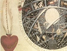
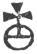
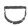
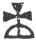

  
[Intangible Textual Heritage](../../index)  [Esoteric](../index.md) 
[Index](index)  [Previous](sat17)  [Next](sat19.md) 

------------------------------------------------------------------------

[Buy Kindle Download of this
Book](https://www.amazon.com/exec/obidos/ASIN/B001BDI55M/internetsacredte.md)

------------------------------------------------------------------------

[Buy Printed Copy of this Book at
lulu.com](https://www.lulu.com/content/2742583.md)

------------------------------------------------------------------------

  
*The Signature of All Things*, by Jacob Boehem, \[1912\], at Intangible
Textual Heritage

------------------------------------------------------------------------

p. 176

### CHAPTER XIV

OF THE WHEEL OF SULPHUR, MERCURY, AND SALT; OF THE
GENERATION OF GOOD AND EVIL; SHEWING HOW THE ONE IS CHANGED INTO THE
OTHER, AND HOW ONE MANIFESTS ITS PROPERTY IN THE OTHER, AND YET BOTH
REMAIN IN THE FIRST CREATION IN THE WONDER OF GOD TO HIS OWN
MANIFESTATION AND GLORY

1\. This is an open gate of the foregoing
the good." Hear and observe well, dear reason; thou must thyself be the
way, the understanding must be born in thee, otherwise I cannot shew it
thee; thou must enter into it, so that the understanding of the work in
its practic art, wherein I deal not, may be opened to thee; I write only
in the spirit of contemplation; how the generation of good and evil is,
and open the fountain: He shall draw the water whom God has appointed
thereunto; I will here only describe the wheel of life as it is [1](#fn_258.md) in itself.

2\. When I speak of Sulphur, Mercury, and Salt, I speak of one only
thing, be it either spiritual or corporeal; all created things are that
one thing, but the properties in the generation of this only thing make
a difference \[or give various gradual distinctions\]; for when I name a
man, or lion, bear, wolf, hare, or any other beast; yea also a root,
herb, tree, or whatever may be named, it is the same only thing.

3\. All whatever is corporeal is the same being; the herbs and trees,
and also the animals, but each thing in its difference of the first
beginning: According as the property in the verbum fiat has imprinted
itself in each thing, so is that kind in its propagation, and all things
stand in the seed and procreation; and there is not anything but has a
fixity in it, be it either hidden or manifest, for all shall stand to
the glory of God.

4\. Whatever is risen from the eternal fixity, as angels and the souls
of men, remains indestructible in its fixt being; but whatever is risen
in the unfixt being, viz. with the motion of time, that does again enter
into the first motion from whence it has taken its original, and is a
map of its form which it had here,

p. 177

like a picture, or as an image in a glass without life; for so it was
from eternity before the times of this world, which the Most High has
introduced into an image, into the comprehensible natural life in time,
to behold the great wonders of his wisdom in a creaturely being, as we
plainly see.

5\. Now we are to consider the only mother, how the same is in her
property, from whence the innumerable multiplicity arises, and has
continually risen; and how she generates life and death, evil and good;
and how all things may be brought into their first \[*ens*\], viz. into
the place where they originally arise, to which the death, or the dying,
is the greatest mystery.

6\. For nothing, which is departed out of its first order, as the mother
brought it forth, can go back again, and enter with its assumed order
into its root, unless it dies again with its assumed order in its
mother; and even then it is again in the end, and in the place whence it
was created, and so it stands again in the verbum fiat, viz. in the
bound of its order in the expressed word, and may enter again into that
which it was in the beginning before it was corporeal; and there it is
good, for it stands again in that from whence it proceeded.

7\. Now therefore we are to consider the beginnings of all things, for
we cannot say that this world was made out of something, it was only and
barely a desire out of the free lubet, that the abyss, viz. the highest
good or being, viz. the eternal will, would behold itself in the lubet
as in a glass; therefore the eternal will has conceived the lubet, and
brought it into a desire, which has impressed itself, and figurised, and
corporised itself both to a body and spirit according to the same
impression's property, according as the impression has introduced itself
into forms, whereby the possibilities \[or powers\] are risen in the
impression as a nature.

8\. This impression is the only mother of the manifestation of the
mystery, and it is called nature and essence, for it manifests what has
been from eternity in the eternal will; yet we are to conceive that
there was in eternity a nature in the eternal will, as an eternal mind
in the will; but it was only a spirit in the will, and the essence of
its ability was not made manifest, but only in the looking-glass [1](#fn_259.md) of the will, which is the eternal
wisdom, wherein all things which are in this world were known in two
centres, viz. according to the fire and light, and then according to the
darkness and essence; all which came with the motion of the eternal will
through the desire in the will into

p. 178

a manifest mystery, and so introduced itself into a manifest
possibility.

9\. This is now the essence expressed or made manifest out of eternity
into a time, and consists in the fore-mentioned forms in Sulphur,
Mercury, and Salt, where the one is not divided or parted asunder from
the other: It is one eternal essence, and shapes [1](#fn_260.md) itself into the properties of the desire
according to the possibility of the manifestation; and we are to
understand that one property is not, nor cannot be without the other;
they are altogether the same only possibility: And now we will speak of
their differences, viz. how this only possibility introduces itself into
good and evil, viz. into still peace and constant unquietness.

10\. We find seven especial properties in nature, whereby this only
mother works all things, which are these, viz. First, the desire, which
is astringent, cold, hard, and dark. Secondly, bitter, which is the
sting of the astringent hard enclosure; [2](#fn_261.md) this is the cause of all motion and
life. Thirdly, the anguish, by reason of the raging in the impression,
where the impressed hardness falls into a tearing anguish and pain by
reason of the sting.

11\. Fourthly, the fire, where the eternal will in this anxious desire
introduces itself into an anxious darting flash \[or twinkling
lightening\], viz. into strength and devouring of the darkness, with
which the hardness is again consumed, and introduced into a corporeal
moving spirit.

12\. Fifthly, the egress [3](#fn_262.md) of the
free will out of the darkness and out of the fire, and dwelling in
itself, where the free will has received the lustre, so that it
enlightens and shines as a light out of the fire, and the potent desire
of the free will, which it has sharpened in the fire (in that it is dead
in the fire to the essence of the darkness of the first form, and
consumed) does now in the light's desire draw into itself the essence
from the dying of the fire, according to its hunger, which is now water;
and in the lustre it is a tincture from the fire and light, viz. a
love-desire, or a beauty of colours; [4](#fn_263.md) and here all colours arise; as we have
fully set it down in our other books, but especially in the *Threefold
Life of Man*.

13\. Sixthly, the voice or sound, which in the first form is only a
noise from the hardness, and is dead or mortified as to that
\[hardness\] in the fire, and yet in the fifth form, in the love-desire,
viz. in the pleasant property, it is again received as a clear

p. 179

sound out of the dying of the fire in the lustre of the light in the
tincture, wherein all the five senses, viz. Hearing, Seeing, Feeling,
Smelling, and Tasting, arise in the tincture of the light from the fire.

14\. Seventhly, the menstruum, or the seed of all these forms which the
desire impresses into a comprehensive body or essence wherein all lies;
whatever the six forms are spiritually, that the seventh is essentially.

15\. Thus these are the seven forms of the mother of all beings, from
whence all whatever is in this world is generated; and moreover the Most
High has, according to this mother,. introduced and created such
properties as this mother is in her wrestling forms (understand, as she
brings herself with the wrestling into properties) into a wheel, [1](#fn_264.md) which is as a mind of the mother, from
whence she continually creates and works; and these are the stars with
the planetary orb according to the platform of the eternal astrum, which
is only a spirit, and the eternal mind in the wisdom of God, viz. the
eternal nature, from whence the eternal spirits are proceeded and
entered into a creaturely being.

16\. And moreover the Most High has introduced the property of this
wheel in the motion, as a life into the four officers, which manage the
dominion in the pregnant mother; and these are the four elements to
which the wheel of the mind, viz. the astrum affords will and desire; so
that this whole being is but one only thing, and yet is so proportioned
\[or composed\] as a mind of a man: Even as he is in soul and body, so
also is this only essence; for it [2](#fn_265.md)
was created out of this whole essence into an image according to
eternity and time; out of eternity according to the soul, and out of
time according to the outward essence, as a similitude and image of
eternity and time, both according to the eternal will and mind and its
essence, and also according to the mind of time and its essence: And
therefore now we are rightly to consider of the sulphurean wheel of all
essences, how the properties introduce themselves into good and evil,
and again bring themselves out of good and evil.

17\. The impression or desire, viz. the first form to nature, which is
called, and is also the fiat, receives the desire's property according
to the property of all the seven forms into itself, and impresses them,
so that out of the nothing proceeds forth an essence according to the
properties of the will: Now its own property, seeing it is only a
desire, and impresses itself, is dark,

p. 180

and causes hardness, viz. a strong pulsation, [1](#fn_266.md) which is a cause of the tone or sound,
which becomes yet more hard in the fire, viz. in the fourth form, where
then the grossness dies away, and it is received again in the fifth
form, viz. in the love-desire; and again it proceeds forth in its own
property in the love-desire, and makes the sixth form, viz. the sound,
voice, or tone out of the fire and water.

18\. Now this tone or sound, which is called Mercury, arises in the
first form, viz. in the impression, by reason of the will and attractive
desire; for the attraction makes the motions and the compunction in the
hardness, which we distinguish, and call the second form, but it is a
son of the first, and in the first.

19\. This second form or property is the raging, stinging, and bitter
pain; for the first is astringent, and the second is drawing, viz. the
desire into an essence; this same essence is the property of the
first, [2](#fn_267.md) and the attraction makes
therein the second property, viz. a bitter stinging which the hardness
cannot endure; for it would be still, and thereupon it does more
vehemently impress itself to withhold the sting, and yet the sting does
thereby only grow the greater: Now the hardness, viz. the astringency
draws inwards, and the sting from the hardness [3](#fn_268.md) upwards: Hence arises the first enmity
and opposition; for the two forms, which yet are but one, make
themselves their own enemies; and yet if this were not, there would not
be any essence, neither body nor spirit, also no manifestation of the
eternity of the abyss.

20\. But now seeing the bitter sting cannot ascend, and the hardness
also cannot hold or enclose it, they fall into a turning or breaking
through like a wheel, which runs into itself as an horrible essence,
where both properties are known only as one, and yet each remains in
itself unaltered, and produce the third property between both, viz. the
great anguish; out of which the will, understand the fixt will to
nature, desires to go forth again into the liberty, viz. into the
nothing, into the eternal rest; for here it has thus found itself, and
manifested itself, and yet there is no separating or departing: and this
anxious form is the mother of Sulphur, for the sting makes it [4](#fn_269.md) painful, and the hardness impresses it,
that it is as a dying source, and yet it is the true original to life.

21\. It has two properties in itself, viz. according to the

p. 181

impression or desire it is dark and hard; and according to the desire of
the will, which wills to be free from the anguish, and enters again into
the liberty, it is spiritual and light; and the sting breaks in pieces
its conceived essence which the astringent desire conceives in itself,
so that its essence is hard and spalt, and wholly darting as a flash of
lightning from the darkness, and from the desire of the light,
understand to the liberty.

22\. Now these three forms are in one essence as a raging spirit; and
the desire impresses these properties, so that an essence is made
according to their property, viz. according to the astringent dark
desire, viz. according to the first original: There is an earthly
essence, out of which in the beginning of the great motion the earth was
made, and according to the bitter raging spirit there is the instigation
in the essence, viz. a poison, and it also imprints \[or impresses\]
itself in the essence, from whence the earthliness is so wholly
loathsome and bitter; and the third form, viz. the anguish gives a fiery
property thereinto; and yet here there cannot be as yet any essence, but
it is only a spiritual essence, and the mother to the essence. [1](#fn_270.md)

23\. The fourth form in this essence is the fire, which as to one part
takes its original out of the dark hard impression, viz. from the
hardness, and from the raging sting in the anguish, which is the cold
black fire, and the pain of the great anguish; and as to the other part
it takes its original in the will's spirit to nature, which goes again
out of this hard dark coldness into itself, viz. into the liberty
without the nature of the austere motion, and enkindles the liberty,
viz. the eternal lubet to the desire of nature, with its sharpness,
which it has conceived in the impression, whereby it is a moving and
stirring lustre: For the liberty is neither dark nor light; but by
reason of the motion it is light, for its lubet brings itself into the
desire to light, that it may be manifest in the light and lustre; and
yet it cannot be otherwise brought to pass but through darkness, so that
the light might be made known and manifest, and the eternal mind might
find and manifest itself; for a will is only one thing and essence, but
through the multiplicity its form is made manifest, that it is infinite,
and a mere wonder, of which we speak with a babe's tongue, being only as
a little spark out of these great infinite wonders.

24\. Now understand us thus; the liberty is, and stands in the darkness
(and inclining to the dark desire after the desire

p. 182

of the light [1](#fn_271).md), it attains with the
eternal will the darkness; and the darkness reaches after the light of
the liberty, and cannot attain it; for it encloses itself with the
desire in itself, and makes itself darkness in itself; and out of both
these, viz. out of the dark impression, and out of the desire of the
light or liberty towards the impression, there is a twinkling \[or
darting\] flash in the impression, viz. the original of the fire; for
the liberty shines in the impression, but the impression in the anguish
comprehends it into itself, and so it is now as a flash: But seeing the
liberty is incomprehensible, and as a nothing, and moreover without and
before the impression, and abyssal, [2](#fn_272.md) therefore the impression cannot conceive
or hold it; but it gives itself into the liberty, and the liberty
devours its dark property and essence, and rules with the assumed
mobility in the darkness, unapprehensible to the darkness.

25\. Thus understand us right: There is in the fire a devouring; the
sharpness of the fire is from the austere impression of the coldness and
bitterness, from the anguish; and the devouring is from the liberty,
which makes out of the something again a nothing according to its
property.

26\. And understand us very exactly and well: The liberty will not be a
nothing, for therefore the lubet of the liberty introduces itself into
nature and essence, that it might be manifest in power, wonder, and
being; it likewise assumes to itself through the sharpness in the cold
and dark impression the properties, that it might manifest the power of
the liberty: For it consumes the dark essence in the fire, and proceeds
forth out of the fire, out of the anguish of the impression, with the
spiritual properties in the light; as you see, that the outward light so
shines forth out of the fire, and has not the source and pain of the
fire in it, but only the property; the light manifests the properties of
the darkness, and that only in itself; the darkness remains in itself
dark, and the light continues in itself light.

27\. The liberty (which is called God) is the cause of the light; and
the impression of the desire is the cause of the darkness and painful
source: Now herein understand two eternal beginnings, viz. two
principles, one in the liberty in the light, the other in the impression
in the pain and source of the darkness, each dwelling in itself.

p. 183

28\. And understand us farther concerning their opening essence and
will, how nature is introduced into seven properties; for we speak not
of a beginning, for there is none in eternity; but thus the eternal
generation is from eternity to eternity in itself; and this same eternal
generation has according to the property of eternity through its own
desire and motion introduced itself with this visible world (as with a
likeness of the eternal spirit into such a creaturely being which is a
type or platform of the eternal being) into a time, of which we will
speak afterwards, and shew what the creature is, namely a similitude of
the operation of eternity, and how it has also this same working
temporally in itself.

29\. Now concerning the fire understand us thus: The fire is the
principle of every life; to the darkness it gives essence and source,
else there would be no sensibility in the darkness, also no spirit, but
mere hardness, a hard, sharp, bitter, galling sting, as it is really so
in the eternal darkness; but so far as the hot fire may be
obtained, [1](#fn_273.md) the dark compunctive
property stands in the aspiring covetous greediness like to a horrible
madness, that it may be known what wisdom and folly is.

30\. Now the fire gives also desire, source, and properties to the
light, viz. to the liberty; yet know this, the liberty, viz. the
nothing, has no essence in itself, but the impression of the austere
desire makes the first essence, which the will-spirit of the liberty
(which has manifested itself through the nature of the desire) receives
into itself, and brings it forth through the fire, where the grossness,
viz. the rawness, does then die in the fire.

31\. Understand it thus: When the flash of fire reaches the dark
essentiality, then it becomes a great flagrat, where the cold fire is
dismayed, and does as it were die, falls into a swoon, [2](#fn_274.md) and sinks down: And this flagrat is
effected in the enkindling of the fire in the essence of the anguish,
which has two properties in it; viz. the one goes downwards into the
death's property, being a mortification of the cold fire, from whence
the water arises, and according to the grossness [3](#fn_275.md) the earth is risen; and the other part
ascends in the will of the liberty, in the lubet, as a flagrat of
joyfulness; and this same essence is also mortified in the flagrat in
the fire, understand the cold fire's property, and gives also a
water-source, understand such a property.

32\. Now the flash, when it is enkindled by the liberty, and by the cold
fire, makes in its rising a cross with the comprehension

p. 184

of all properties; for here arises the spirit in the essence, and it
stands thus:  

If thou hast here re understanding, thou needest ask no more; it is
eternity and time, God in love and anger, moreover heaven and hell.

33\. The lower part, which is thus marked 
, is the first principle, and is the eternal nature in
the anger, viz. the kingdom of darkness dwelling in itself; and the
upper part, with this figure 
 is the salniter: The upper cross above the circle is
the kingdom of glory, which proceeds forth in the flagrat of joy, in the
will of the free lubet in itself out of the fire in the lustre of the
light into the power of the liberty; and this spiritual water, which
also arises in the flagrat of joy, is the corporality, or essentiality,
in which the lustre from the fire and light makes a tincture, viz. a
budding and growing, and a manifestation of colours from the fire and
light.

34\. And this form of separation between the living and the dead
essentiality is the fifth form, and is called the love-desire; its
original is from the liberty, which in the fire has introduced itself
into a desire, viz. out of the lubet of the liberty into the fair and
fiery elevation of joy, being a flame of love, which also imprints in
its love-desire the property of that which it has conceived in the will
of the eternal mind, which brings itself through the fire's sharpness
again into itself, viz. into the first properties, which arise in the
first impression, viz. from the motion and stirring; and the joyfulness
arises out of the anguish: For this is joy, that the will to nature is
delivered and freed from the dark anguish, for else there would be no
knowledge of what joy was, if there was not a painful source; and in its
love-desire it conceives the first properties in the first impression,
which divide themselves in this desire into five forms; viz. from the
fire-flash into seeing, for the water of love reaches the lustre of the
tincture,wherein the sight consists; and from the hardness, viz. from
the penetration of the sting in the hardness, into hearing, so that in
this same nothing, viz. in the liberty, there is a sound, which the
tincture catches, and brings it forth in the water of the desire: and
from the raging sting into feeling, so that one property feels another;
for if all properties were only one, there would be no seeing, hearing,
or feeling, also no understanding: And from the assimulation, that one
property arises in the other, but with another property, comes the
taste; and

p. 185

from the egressive spirit of the properties (in that the egress of each
property enters into the other) arises the smell.

35\. Now these five forms do all of them together make in the
love-desire, viz. in the fifth form, the sixth, that is, the sound or
voice, as a manifestation of all the forms in the spirit's property,
which the fiery light's desire encloses with the spiritual water as one
only essence, which is now the fiery will's own essence, which has
brought itself forth in the light, wherein it works and makes the
seventh form, as an habitation of the sixth, from whence the essence and
dominion of this world were generated, and introduced into a form
according to the right [1](#fn_276.md) of the
eternal birth.

36\. Now understand us right; we do not hereby understand a beginning of
the Deity, but the manifestation of the Deity: The Deity is herein known
and manifested in Trinity; the Deity is the eternal liberty without all
nature, viz. the eternal abyss; but thus it brings itself into byss for
its own manifestation, eternal wisdom, and deeds of wonder.

37\. The Eternal Father is manifested in the fire, and the Son in the
light of the fire, and the Holy Spirit in the power of the life and
motion proceeding from the fire in the light of the kingdom of joy,
being the egressive power in the love-flame; we speak only by parts of
the universal as a creature. [2](#fn_277.md)

38\. The Deity is wholly everywhere all in all; but he is only called
God according to the light of love, and according to the proceeding
spirit of joy; but according to the dark impression he is called God's
anger and the dark world; and according to the eternal fire-spirit he is
called a consuming fire.

39\. We give you only to understand the Being of all beings, whose
original in itself is only one eternal essence; but with its own
manifestation it comes into many beings, to its own honour and glory;
and now we will shew you what the creature's life and dominion is in
this all-essential Being.

40\. Now therefore understand us right what we mean by these three
words, Sulphur, Mercury, and Sal: In the eternity all is spirit; but
when God moved himself with the eternal nature, wherein his own
manifestation consists, he produced out of the spiritual essence a
palpable and manifest essence, and introduced it into a creaturely being
according to the eternal properties, which also consists of spirit and
essence, according to the right [3](#fn_278.md)
\[or law\] of eternity.

p. 186

41\. And now I will speak of the outward kingdom, viz. of the third
principle or beginning; for in this world there is also light and
darkness in each other as in the eternity: God has given this world a
sun, as a nature-god of the outward powers, but he rules therein as
Lord; the outward \[kingdom\] is only his prepared work, which he rules
and makes with the assimulate, as a master makes his work with an
instrument.

42\. Sulphur is in the outward world, viz. in the mystery of the great
God's manifestation, the first mother of the creatures; for it arises
out of darkness, fire, and light; it is on one part, according to the
dark impression, astringent, bitter, and anxious; and on the other part,
towards the Deity, as a similitude of the Deity, it is fire, light, and
water, which in the fire separates itself into two forms, viz. according
to the mortification into water, and according to the life into oil, in
which the true life of all the creatures of the outward world consists.

43\. Mercury is the wheel of motion in the Sulphur; he is on one part
according to the dark impression the stinging rager, and the great
unquietness, and separates itself also in the fire in its mother, viz.
in the Sulphur, into two properties, viz. into a twofold water; for in
the mortification of the fire all is turned to water, understand into a
living pleasant water according to the light, which produces silver in
the brimstone, viz. in the seventh property of nature, which is the
powerful body, and in the fire its water is quicksilver, and in the
astringency, viz. in the anguish of the darkness, it is a rust or smoke;
therefore if its outward water-body be cast into the fire, understand
\[that body\] which it receives in Sulphur from the watery property,
then it does evaporate, [1](#fn_279.md) for in the
fire every property separates itself again into the first essence, from
whence it came originally, where all things were only a spirit.

44\. And then secondly it separates itself according to the water of the
dark impression into a poison-source, which yet cannot be understood to
be a water, but only a corporeal essence of the spirit; for as the
spirit's property is, so is also its water; and even so it is in the
fire-flagrat.

45\. Further understand us in the fiery flagrat concerning the salniter,
from whence the manifold salts and powers arise; for all the properties
of the spirit are become corporeal in the great motion of the essence of
all essences, and entered into a visible and comprehensible being: This
flagrat is effected in the enkindling of the fire; and in the
mortification of the fire it

p. 187

impresses into itself from the water's original a water, according to
the property of the flagrat, which yet is rather fire than water, but
its mortal essence is water according to the property of the flagrat; it
is the comprisal of all properties, it brings forth in its
comprehension, viz. in the fiery flagrat all properties in itself, and
apprehends the property of the light in its powers, and also the
property of the dark impression in its powers, and makes all fiery; one
part according to the coldness, and one part according to the heat; but
the most part according to the endless Mercury, which is the life of all
essences in evil and good, in light and darkness.

46\. This salniter is the mother of all salts in vegetables and animals,
viz. in herbs and trees and everything; he is in all things, which give
a taste and smell, the first root according to each thing's property; in
the good (which grow in the love-desire in the oil of brimstone) he is
good, powerful, and pleasant; and in the evil he is evil in the anguish
of brimstone; and in the darkness he is the eternal horror and despair,
continually desiring in the flagrat to aspire above the gates in the
fire, from whence arises the will of all devils, and of all pride, to
ascend above the humility of the love-desire; and in the fire is the
trial of his essence, as we see how he clashes and consumes himself in
the flash as a sudden thought.

47\. For its essence arises not in the essence of eternity, also it
cannot inherit it, but in the enkindling of the temporal fire, yet it is
perceived in the eternal spirit by reason of the elevation of the joy;
but according to the essence of mortification, viz. according to the
salt of the fire it subsists in the fire: For this property arises out
of the first desire, viz. in the essence of the first impression, which
property the philosophers call Saturn, therefore the salt is manifold:
All sharpness in the taste is salt, the good taste arises out of the
oleous salt, and so also the smell, which is the egressive spirit in
which the tincture appears as a lustre \[or fair complexion\] of
colours.

48\. Thus understand us right; the salniter in the fire-flagrat is the
separation of the properties, where death and life separate themselves,
viz. the life which enters with the love-desire into an essence and
dominion; and then the life which in the flagrat of death, according to
the property of the cold, sinks down in the mortification of the flagrat
as an impotency, and gives weight; and according to the subtility it
gives water, and according to the grossness of the austereness earth;
and according to Sulphur and Mercury, sand and stones; and according to

p. 188

the subtility in Sulphur and Mercury, understand according to the water
of the same, it makes flesh, and according to the anxious darkness a
smoke or rust; but according to the oleous property, viz. according to
the love-desire, a sweet spiritual essence; and according to the spirit
a pleasant smell; and according to the moving of the fire and light the
\[one\] element; and from the lustre in the fire-flagrat with aspect of
the light the precious tincture, which tinctures all oily salts, from
whence the pleasant taste and smell arise.

49\. The salnitral flagrat is the sude [1](#fn_280.md) in the essence, from whence the growth
and pullulation arise, that there is a growing in the impression of the
essence; the salt is the preservation, or upholding of the essence, so
that a thing subsists in a body or comprehension; it holds the Sulphur
and Mercury, else they would part from each other in the fire-flagrat.

50\. All things consist of Sulphur, Mercury, and Salt: In the salnitral
flagrat the element separates itself into four properties, viz. into
Fire, Air, Water, and Earth, which in itself is none of these, but only
a moving and gentle walming, [1](#fn_280.md) not
as the air, but as a moving of the will in the body, a cause of life in
the essence; for as the eternal Spirit of God proceeds from the Father,
who is a spirit from the fire and light, and is the motion and life of
the eternity; so likewise the air proceeds forth continually out of all
the properties in the salnitral flagrat in the fire, from the anguish in
Sulphur in the forcing mercurial wheel, as an impetuous aspiring motion;
it is a son of all the properties, and also the life of the same; the
fire of all the forms affords it, and also receives it again for its
life; the water is its body, wherein it makes the seething in the
salniter, and the earth is its power, wherein it enkindles its strength
and fire-soul.

51\. There is but one only element, and that unfolds itself in the
salnitral flagrat into four parts, viz. with the enkindling it gives a
consuming fire of the darkness, and its essence; and in the flagrat of
the dying of the cold and the darkness it parts itself into essences,
viz. according to the subtility into water, and according to the
grossness into earth; and then according to the motion in the flagrat's
walming into air, which does most resemble the element, but not wholly
essentially; for the \[one\] element is neither hot nor cold, also not
forcing or compulsive, but gently moving.

p. 189

#### Of the Desire of the Properties

52\. Every property keeps its own desire; for a property is nothing else
but an hunger, and the hunger forms itself into such an essence as
itself is, and in the salnitral sude it gives such a spirit into the
four elements; for the original of the sude is in the element, from
whence four elements proceed in this flagrat.

53\. Each body stands in the inward motion [1](#fn_281.md) in the element, and in the growth and
life in the four elements; but every creature has not the true life of
the element, but only the high spirits, as angels and souls of men,
which stand in the first principle; in them the element is incitable: In
the life of the third principle it stands still, and is as a hand of
God, where he holds and governs the four elements as an exit, or
instrument with which he works and builds.

54\. Now every property of nature does in its hunger take its food out
of the four elements; as the hunger is, so it takes a property out of
the elements; for the four elements are the body of the properties, and
each spirit eats of its own body.

55\. First, there are the sulphurean properties according to the first
and second impression, viz. according to the dark, astringent, and
anxious impression; and then according to the love-impression in the
light, viz. according to evil and good.

56\. The dark hunger desires essence according to its property, viz.
earthly things, all whatever resembles the earth; and the bitter hunger
desires bitter raging, stinging, and pain; it receives into itself such
an essence (as the poison-source) out of the elements: And the hunger of
anguish desires anxious hunger, viz. the anguish in the brimstone; also
the melancholy \[takes\] the desire to die, and continual sadness; and
the fire-flash receives into it anger, aspiring, ambition, pride, a
desiring to destroy all, and make it subject to it, a desire to domineer
in and above all, to consume all, and to be peculiar; and it takes the
bitterness from whence the flash arises to envy and hatred, and the
astringency to covetousness, and the fire to anger and indignation.

57\. Here is the true desire of God's anger and all devils, and of all
whatever is against God and love; and this hunger draws such an essence
into self; as it is to be known and searched out in the creatures, and
also in the herbs.

58\. Now the fire-flash is the end of the first desire, viz. of the

p. 190

dark nature, and in the fire the dying of the first hunger and will
begins; for the fire consumes all grossness of the first forms, and
casts them into death; and here is the separation of both wills, viz.
the one which enters back again into the property of death, and is a
will in the life of the dark desire; as the devils have done, who would
domineer in the fire-flash in the salnitral sude over time and eternity;
but they were driven back by the Spirit of God, and spewed forth out of
the love-desire as an abomination: And thus also it happens here to the
wicked soul of man, upon which the election follows. Here is the \[aim\]
or scope of the election of grace, of which the Scripture speaks, that
God knows his; and here the eternal lubet of God's liberty apprehends
the will-spirit, which is arisen in the dark centre, and brings it
through the dying in the fire into the element.

59\. In the salnitral flagrat lies the possibility backwards and
forwards; if the will of the desire goes back, then it is as to the
kingdom of this world \[earthly\], and as to the kingdom of the eternal
world it is in God's anger, and cannot see God unless it be converted,
and enters into the dying in the fire, and wholly dies to its selfness,
and enters into the resignation of the eternal will in the salnitral
flagrat into the element, viz. into the heavenly essentiality and
corporality, so that the hunger may eat of the pure element; and then it
has further no other desire; for it is in the fire dead to the austere
dark hunger, which is evil; thus from the dying in the fire arises the
light, for here the liberty is enkindled, that it becomes also an
hunger, and a desire; this is now a love-desire, a love-hunger.

60\. In the outward world it is the light of the sun in the four
elements; and it is the bestial love-desire, viz. after the sulphurean
body and essence, from whence the copulation and multiplication arise,
viz. the vegetative life; and from the Mercury in the salniter (in which
the sensible life is) therein the astrum gives the reason in the animals
from the properties of the salniter.

61\. For the whole astrum is nothing else but a salniter in the verbum
fiat in the motion of the Being of all beings in the fiery flagrat,
comprehended in the properties of the salts, wherein all the powers of
the element stand as an external birth, which continually boil [1](#fn_282.md) in the four elements as a salnitral
salt, and introduce their property in their desire in the four elements
into the essence of bodies, as is to be seen in trees, herbs, grass, and
all growing things.

p. 191

62\. Thus understand us farther concerning the second centre, which is
manifest in the dying of the fire in the light, whereby the abyss of
God's liberty introduces itself into the byss of nature, both with the
inward world in the kingdom of heaven in the eternity; and then also
with the outward kingdom in the time.

63\. Now all this has also the properties of the desire, and takes its
original from the first principle, viz. from the first centre, and there
is yet no right dying in the fire; the dark essence only dies, and the
will-spirit goes forth with the eternal will to nature again out of the
fiery death in the light; it is only a transmutation of the spirit, so
that an hunger arises out of the liberty, and this hunger is a
love-desire; as to the soul of man it draws essence from the element of
God, viz. in the divine salniter it \[takes\] the divine salts or powers
into itself; and as to the outward world's desire it draws the oil out
of the Sulphur into itself, in which \[oil\] the outward life burns; and
so it is likewise in the vegetables and metals, and other things.

64\. The sun makes the outward transmutation, and the divine light in
the soul's property makes the inward; according as each thing stands in
its degree, so does its hunger reach a property: those which are in the
time \[receive a property\] from the time, and those in eternity
likewise out of eternity: The hunger which proceeds from eternity eats
of the eternity, and that which is of the time eats of the time. The
true life of all creatures eats of the spiritual Mercury, viz. of the
sixth form, where all salts are essentially; the spirit cats of the five
senses, for they are the spirit's corporality; and the body, viz. the
vegetable life, eats of the essence of the Sulphur and Salt; for Christ
says in like manner, "Man liveth not by bread only, but by every word
which proceedeth out of the mouth of God."

65\. Now the sixth form of nature is the expressed spiritual word; and
the speaking word therein is the eternal word: In the first impression
in the darkness it is the word of God's anger; and in the outward world
it is the poisonful Mercury, viz. a cause of all life and stirring, of
all tones and sounds; now every property eats of its likeness in its
degree; the hunger of time \[eats\] of time, and the hunger of eternity
\[eats\] of eternity, both the spirit of Mercury and the spirit of
Sulphur; whereas yet there are not two \[spirits\] but only two
properties; all whatever does only take its original in one principle,
as the creatures of the outward world, they have only one region, but a
twofold inclination from the good and evil; but whatever takes its

p. 192

original out of two principles, as man, he has also a twofold food and
dominion, viz. from the dark centre, and from the outward centre; but if
he dies to his self-hood, and brings his hunger into God's kingdom, then
he may eat of the divine Mercury, viz. of the five divine senses with
the soul, and of the element in the divine essence; and yet the outward
man apprehends not in this life-time the divine essence corporeally, but
only through the imagination, where the inward body penetrates the
outward; as the sun shines through the water, and yet the water
continues still water, for here lies our fall in Adam.

66\. The element did wholly penetrate the four elements, and it was
wholly one in man, but in the curse the element separated from the soul,
so that the poor soul now lives only in the vessel of the four elements,
unless it again enters in the death of its earthly will into the divine
desire, and springs forth in the element.

67\. Thus also the outward body is in the curse, and eats of the cursed
earth's property, viz. only of the earthly salniter, where one hunger of
the earthly properties continually opposes another; for the curse is a
loathsome abominate in all salts, and from thence it comes that a
constant contrariety arises in the outward body; for one hunger of the
properties receives \[or catches\] from the other the abominate: [1](#fn_283.md) Now to help the body that it may be
freed from the abominate, it must take the assimulate of the lothing
abominate, which is risen in the body as a sude or seething, and
introduce it into the dying of the fire, and bring it out in the
love-desire from the curse of the vanity; now this is no otherwise
effected, but as the true life dies to the dark vanity.

68\. The abominate of the outward life arises from a property of the
salt which is contrary to the oil of the life: Thus the abominate does
forthwith enkindle itself in the four elements, and begins to seethe in
the salniter as a strange life: This strange life does at last darken
and destroy the first true life, if it be not resisted; and it can have
no better help than with the assimulate of the introduced abominate,
which the life has taken into itself; *therefore that must be done to
the cure*, which is to be done to the life, that it might be freed from
the abominate.

69\. The cure must be freed from the same abominate, which it has
received in the four elements from the like false insinuation
\[influence, or impression\], it must be brought into the death of the
four elements, and its spirit must also be tinctured in the fifth form
with the Venus desire, viz. with a pleasant essence,

p. 193

that the spiritual Mercury may arise in Jupiter's property; understand,
the cure must first die to its sickness in all the four elements; it
must be introduced into the putrefaction of all the four elements; in
the fire it dies to its earthliness, and in the putrefaction to the
water's earthliness, and in the air's putrefaction to the abominate and
earthliness of the air; and then it must be brought into Venus, and from
Venus into Jupiter, and then the sun will arise in the love-desire, and
with this the abominate in the body may be resisted.

70\. All other cures, which are administered raw and undigested [1](#fn_284.md) (as when one takes cold, and will resist
heat, and so likewise heat to resist cold), are only an opposite fiery
flagrat, whereby indeed the enkindled fire ceases from its powerful
working, but the flagrat enters into death's anguish, and the root of
the abominate becomes a poisonful Mercury unless the heat and cold are
before tempered with Venus and Jupiter, and then indeed it is an
appeasing of the abominate in the salnitral sude; but the root of the
abominate remains still, unless the life be strong, and mightily brings
forth its desire out of the abominate. This the physicians must well
observe, that the raw herbs do not reach the root, where the abominate
is arisen in the centre in the property of the life's form; they reach
only the four elements, and give some easement, but the abominate
remains still in the root as an hidden sickness.

71\. The like is also to be understood concerning the astrum, which has
its sude in the outward body as a peculiar body in the four elements; if
the cure may be freed from the abominate of the four elements, then the
astrum falls also into the good part, and introduces its desire
thereinto, and so the body is also freed from the abominate of the
astrum; for the Scripture says, that " the whole creature [2](#fn_285.md) longeth together with us to be freed
from the vanity: "Now the curse of the earth, wherein the astrum injects
its desire, is the vanity; and if it tastes a pure life in itself, then
it also rejoices therein, and casts forth the abominate.

72\. Every abominate [3](#fn_286.md) of the oily
life arises from the inward Mercury in the inward Sulphur; for sin also
does hence take its original, that the poisonful Mercury (which is a
cause of the life) does in the fire-flash in the original of the
salniter, in retiring backwards, introduce itself again into self-hood,
for even there is the original of the poison-life.

p. 194

73\. Every life which will be without spot, [1](#fn_287.md) must die in the will-spirit to nature in
the fire of the abominate to the first impression of the wrath, and must
give itself forth, in the will-spirit to nature, as a resigned will
through the mortification in the light of love: Let it be either
heavenly or earthly it must hold that process, or else it comes not to
the highest perfection in its degree; for man could not be helped unless
the love-centre of the love-desire did enter again into the humanity,
and bring forth the own life, viz. the human self, through the
mortification into itself: This is an exact type or resemblance, that
whatsoever will be freed from the abominate, viz. from the curse, the
same must die to the four elements in the abominate, and bring forth its
degree through the mortification of the fire in the light.

74\. Thus likewise is the salnitral sude in the earth, from whence
metals, good herbs and trees grow; each property is desirous of the
assimulate; and if it can reach the assimulate in Sulphur, and Mercury
in the love, then it brings forth itself higher than it is in its
degree; as the eternal liberty with its lubet introduces the eternal
nature through the mortification into desire, and thereby brings itself
forth higher, viz. in power and majesty; the like is to be considered in
all things; for all things arise out of one only being; the same is a
mystery of all beings, and a manifestation of the abyss in byss.

75\. All things are generated out of the grand mystery, and proceed out
of one degree into another: Now whatever goes forwards in its degree,
the same receives no abominate, let it be either in vegetables or
animals; but whatever enters in itself into its self-hood, viz. into its
own lubet, the same receives, in passing through the degrees, the
abominate; for each form of nature out of [2](#fn_288.md) the mystery receives of its property in
its hunger, and therein it is not annoyed or molested, for it is of
their property.

76\. But if the will enters back again into the birth of the other
properties, then it receives the lust, and the lust makes an hunger, and
the hunger receives strange essence into itself: Here now is the
abominate and turba born; for this will is entered contrary to the
course of nature into a strange essence, which is not of its property;
this strange essence domineers now in the strange will, and overcomes
the will; now the will must either cast it out, [3](#fn_289.md) or else it will itself be cast out by
the strange essence; and seeing this also cannot be, thereupon arises
anger and enmity.

p. 195

77\. For the properties run to their centre of the first impression, and
seek the strength and might of the fire, from whence arises the heat and
cold in the body, and they are in one another as enemies, whereby the
first mother is stirred up in her most wrathful malice and malignity
according to the austere impression, and then begins the contest for the
conquest, and that property which maintains and keeps its power and
prevalence, casts the other into death's property, viz. into the
devoration, into the house of misery.

------------------------------------------------------------------------

### Footnotes

[176:1](sat18.htm#fr_258.md) Or what it is.

[177:1](sat18.htm#fr_259.md) Mirror.

[178:1](sat18.htm#fr_260.md) Or figures.

[178:2](sat18.htm#fr_261.md) Or attraction.

[178:3](sat18.htm#fr_262.md) The flowing, or
proceeding forth.

[178:4](sat18.htm#fr_263.md) Or fair complexion.

[179:1](sat18.htm#fr_264.md) Orb, or rotation.

[179:2](sat18.htm#fr_265.md) Or he.

[180:1](sat18.htm#fr_266.md) Or noise.

[180:2](sat18.htm#fr_267.md) Or the first
property.

[180:3](sat18.htm#fr_268.md) Or the sting in the
hardness, viz. the hardness itself.

[180:4](sat18.htm#fr_269.md) Understand the mother
of Sulphur.

[181:1](sat18.htm#fr_270.md) Prima materia.

[182:1](sat18.htm#fr_271.md) Or opposite to the
dark desire, or dark impression, which is after the light's desire.

[182:2](sat18.htm#fr_272.md) Or without any
ground.

[183:1](sat18.htm#fr_273.md) Or reached.

[183:2](sat18.htm#fr_274.md) Becomes impotent.

[183:3](sat18.htm#fr_275.md) The *caput mortuum*.

[185:1](sat18.htm#fr_276.md) Law, or appointment.

[185:2](sat18.htm#fr_277.md) Or in a creaturely
manner.

[185:3](sat18.htm#fr_278.md) Or genuine property.

[186:1](sat18.htm#fr_279.md) Or fly from thence as
a smoke.

[188:1](sat18.htm#fr_281.md) Seething.

[189:1](sat18.htm#fr_282.md) Or as to its inward
motion.

[190:1](sat18.htm#fr_283.md) Or seethe.

[192:1](sat18.htm#fr_284.md) Nauseate,
abomination.

[193:1](sat18.htm#fr_285.md) Unregenerated.

[193:2](sat18.htm#fr_286.md) Or all creatures.

[193:3](sat18.htm#fr_287.md) Nauseate, or
loathsomeness.

[194:1](sat18.htm#fr_288.md) Entire.

[194:2](sat18.htm#fr_289.md) Or proceeding from.

[194:3](sat18.htm#fr_290.md) Text, spew out.

------------------------------------------------------------------------

[Next: Chapter XV](sat19.md)
