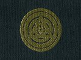

  
[Intangible Textual Heritage](../../index)  [Esoteric](../index) 
[Yoga](../../hin/yoga/index)  [Index](index)  [Previous](sob02) 
[Next](sob04) 

------------------------------------------------------------------------

[Buy this Book at
Amazon.com](https://www.amazon.com/exec/obidos/ASIN/0911662006/internetsacredte)

------------------------------------------------------------------------

  
*Science of Breath*, by Yogi Ramacharaka, pseud. William Atkinson,
\[1904\], at Intangible Textual Heritage

------------------------------------------------------------------------

p. 8

### Chapter II

### "BREATH IS LIFE"

Life is absolutely dependent upon the act of breathing. "Breath is
Life."

Differ as they may upon details of theory and terminology, the
[Oriental](errata.htm#0) and the Occidental agree upon these fundamental
principles.

To breathe is to live, and without breath there is no life. Not only are
the higher animals dependent upon breath for life and health, but even
the lower forms of animal life must breathe to live, and plant life is
likewise dependent upon the air for continued existence. The infant
draws in a long, deep breath, retains it for a moment to extract from it
its life-giving properties, and then exhales it in a long wail, and lo!
its life upon earth has begun. The old man gives a faint gasp, ceases to
breathe, and life is over. From the first faint breath of the infant to
the last gasp of the dying man, it is one long story of continued
breathing. Life is but a series of breaths.

Breathing may be considered the most important of all of the functions
of the body, for, indeed, all the other functions depend upon it. Man
may exist some time without eating; a shorter time without drinking; but
without breathing his existence may be measured by a few minutes.

And not only is Man dependent upon Breath for life, but he is largely
dependent upon correct habits of breathing for continued vitality and
freedom from disease. An intelligent control of our breathing power will
lengthen our days upon earth by giving us increased vitality and powers
of resistance, and, on the

p. 9

other hand, unintelligent and careless breathing will tend to shorten
our days, by decreasing our vitality and laying us open to disease.

Man in his normal state had no need of instruction in breathing. Like
the lower animal and the child, he breathed naturally and properly, as
nature intended him to do, but civilization has changed him in this and
other respects. He has contracted improper methods and attitudes of
walking, standing and sitting, which have robbed him of his birthright
of natural and correct breathing. He has paid a high price for
civilization. The savage, to-day, breathes naturally, unless he has been
contaminated by the habits of civilized man.

The percentage of civilized men who breathe correctly is quite small,
and the result is shown in contracted chests and stooping shoulders, and
the terrible increase in diseases of the respiratory organs, including
that dread monster, Consumption, "the white scourge." Eminent
authorities have stated that one generation of correct breathers would
regenerate the race, and disease would be so rare as to be looked upon
as a curiosity. Whether looked at from the standpoint of the Oriental or
Occidental, the connection between correct breathing and health is
readily seen and explained.

The Occidental teachings show that the physical health depends very
materially upon correct breathing. The Oriental teachers not only admit
that their Occidental brothers are right, but say that in addition to
the physical benefit derived from correct habits of breathing, Man's
mental power, happiness, self-control, clear-sightedness, morals, and
even his spiritual growth may be increased by an understanding of the

p. 10

"Science of Breath." Whole schools of Oriental Philosophy have been
founded upon this science, and this knowledge when grasped by the
Western races, and by them put to the practical use which is their
strong point, will work wonders among them. The theory of the East,
wedded to the practice of the West, will produce worthy offspring.

This work will take up the Yogi "Science of Breath," which includes not
only all that is known to the Western physiologist and hygienist, but
the occult side of the subject as well. It not only points out the way
to physical health along the lines of what Western scientists have
termed "deep breathing," etc., but also goes into the less known phases
of the subject, and shows how the Hindu Yogi controls his body,
increasing his mental capacity, and develops the spiritual side of his
nature by the "Science of Breath."

The Yogi practices exercises by which he attains control of his body,
and is enabled to send to any organ or part an increased flow of vital
force or "prana," thereby strengthening and invigorating the part or
organ. He knows all that his Western scientific brother knows about the
physiological effect of correct breathing, but he also knows that the
air contains more than oxygen and hydrogen and nitrogen, and that
[something](errata.htm#1) more is accomplished than the mere oxygenating
of the blood. He knows something about "prana," of which his Western
brother is ignorant, and he is fully aware of the nature and manner of
handling that great principle of energy, and is fully informed as to its
effect upon the human body and mind. He knows that by rhythmical
breathing one may bring himself into harmonious vibration with

p. 11

nature, and aid in the unfoldment of his latent powers. He knows that by
controlled breathing he may not only cure disease in himself and others,
but also practically do away with fear and worry and the baser emotions.

To teach these things is the object of this work. We will give in a few
chapters concise explanation and instructions, which might be extended
into volumes. We hope to awaken the minds of the Western world to the
value of the Yogi "Science of Breath."

------------------------------------------------------------------------

[Next: Chapter III. The Exoteric Theory of Breath](sob04)
