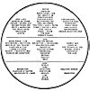

  
[Intangible Textual Heritage](../../index)  [Esoteric](../index)  [New
Thought](../../nth/index)  [Index](index)  [Previous](som06) 
[Next](som08) 

------------------------------------------------------------------------

[Buy this Book at
Amazon.com](https://www.amazon.com/exec/obidos/ASIN/0874779219/internetsacredte)

------------------------------------------------------------------------

The Science of Mind, by Ernest Shurtleff Holmes \[1926\], at Intangible
Textual Heritage

------------------------------------------------------------------------

p. 54

### Lesson One: Metaphysical Meaning of Words Used in Universal Chart

**UPPER SECTION**

SPIRIT.--The Intelligent Power back of and through everything; the First
Person of The Trinity.

Absolute.--The Unconditioned, that which nothing can limit.

FIRST CAUSE.--That from Which everything comes. The Cause of all that is
made manifest on any plane. That Which comes first. The first in any
creative series. The Life back of Things.

GOD.--The same as Spirit. The Self-Knowing Mind back of everything. The
Heavenly Father and the Eternal Mother of all. The Being Whom we worship
and adore. The One and Only Conscious Mind in the Universe, personal to
all who believe in Him. It is impossible to conceive of such a vast idea
as God, and the only way that we can conceive of the Divine Being is
through our own nature, for His Spirit is Our Spirit.

THE GREAT "I AM."--Revealed to Moses as the One and Only Real Mind or
Power in the Universe. That beside Which there is no other. I Am is
another way of saying God. The "I AM" in man is the Life of man; without
this "I AM," man could not be.

CONSCIOUS MIND.--That Power of Consciousness which knows Itself. That
which is conscious of Its Own Being. "The Spirit is the power Which
knows Itself." The Self-Knowing God. The Intelligence in the Universe
which reveals Itself in all of Its Creation. If God were not
Self-Conscious, then man could not be self-conscious. It is impossible
for us to conceive of such a Universal Consciousness. We touch It only
in spots, but the evidence of this Conscious Mind is strewn throughout
all time and space; and the eternal activity

p. 55

[  
Click to enlarge](img/chart01.jpg)  
Lesson One: Metaphysical Chart No. I.  

This chart, which is called the Universal Chart, shows the Universe as a
Trinity of Being. The upper section designates those attributes of
Spirit which are Self-Conscious. The middle section shows the
subconscious aspect of Law; and the lowest section shows the effect of
Spirit working through the medium of Universal Mind. Read and carefully
study the full explanation and meaning of the words used in this chart.

p. 56

of the Cosmos is proof enough that such a Conscious Mind really exists.

PURPOSEFULNESS.--When we speak of the purposefulness of Spirit we mean
that Conscious Mind has the ability to know what It wishes to express
and the power to express it. Dean Inge says that there can be no such
thing as an infinite purpose because this would be a contradiction of
the meaning of Infinite. This is probably true; but it does not follow
that there could be no such thing as an element of purposefulness
running through the Eternal Mind. Indeed, the evidence of this quality
of being is so complete in the Universe that we cannot deny it. The
evolution of creation on this planet alone would presuppose some kind of
a purposefulness.

SELF-PROPELLING.--The Spirit must be Its own propelling power, Its own
motive power. To suppose that Spirit had to go somewhere to get energy
with which to energize Itself would be to suppose Spirit is not First
Cause. Whatever the nature of that which comes first is, It must have
within Itself all that It needs with which to express Itself. We must
realize that, in dealing with Causation, we are dealing with That which
is the First of everything and is absolutely Unconditioned. It does not
need to be energized, but is the energy back of all form and all
manifestation of Life.

SELF-EXISTENT.--It is difficult to grasp the idea of self-existence; but
we can do so to a degree at least. For instance, we might ask the
question, "Why is water wet?" There is no reason why; it is wet simply
because it is its nature to be wet. If we were to ask the question, "Who
made Life?", it could not be answered; because if we were to assume that
some power made Life we would not be supposing that Life is First Cause.
We must grasp the fact that, in dealing with Real Being, we are dealing
with that which was never created. When did two times two begin to make
four? Never, of course. It is a self-existent truth. God did not make
God; God is. This is the meaning of the saying, "I

p. 57

\[paragraph continues\] AM THAT I AM." All
inquiry into Truth must begin with the self-evident fact that Life Is.
The Truth is that which Is and so is Self-Existent.

"Never The Spirit was born;  
  The Spirit shall cease to be never;  
Never was time It was not;  
  End and beginning are dreams."

VOLITION.--Volition means the power of conscious choice.

CHOICE.--Choice means the ability to choose consciously.

WILL.--Will means decision coming into execution.

Volition, choice and will must be attributes of Spirit. They mean
practically the same thing. We must be careful, however, not to think of
these qualities of Spirit in terms of human or limited thought. When we
choose, we choose between different things; but when Spirit chooses, It
simply announces that It is a certain thing. The Spirit does not have to
will to make things happen; things happen because it is the will of
Spirit that they should be. This will, then, is simply the execution of
a purpose; and since Spirit is Absolute, there can be nothing to deny
Its Will. Choice, volition and will are necessary and real attributes of
Self-Existent Power; for without them there would be no channel through
which the Ideas of God could be expressed. In man these qualities of
mentality are limited but in God they are limitless.

POWER.--The energy by which everything lives.

LIFE.--Life means that Inner Something that makes everything live. Life
and Power are necessary attributes of a Limitless Being, and go hand in
hand to complete a Perfect Being. Life is That Which Lives, and Power is
the Energy with which It operates. Considering Life and Power as a
combined quality of Causation, we see that they combine to make the
underlying basis of all manifestation visible and invisible. In the
objective world, Life is the Power that binds everything together; It is
the Intelligent Basis of all that exists.

p. 58

\[paragraph continues\] For instance, in
the material world, It is the Power that holds the atoms together that
they may produce form. In the mental world, It is the Power that enables
us to think; and in the Spiritual World, It is the Power that enables us
to live at all.

It appears that Life manifests on different levels. In the mineral
world, and in the world of all material form, It seems to be
unconscious; that is, It is not manifesting in a self-conscious state.
We know, however, that a certain degree of intelligence runs through all
Creation. Chemical Affinity is a manifestation of Life as the attraction
of Itself to Itself. In plant life It seems to have a more developed
degree of consciousness. That is, It manifests in the vegetable world as
a power to express in one spot, but without volition to move about.
This, however, does not limit The Spirit but is simply one of the ways
that It works. In the animal world, we see different degrees of Life's
manifestation, from the first cell life up to Man. For instance, a dog
is more intelligent than a fish, yet each has the power to move about.
The fish seems to move by instinct alone; the dog appears to have some
degree of conscious being, although there is a difference of opinion on
this score. At least, in most animal life, we find the ability to move
about and, either from instinct or self-choice, the ability to express a
certain degree of freedom. In man, Life expresses in terms of Volition
and Self-Will; It is manifesting at the level of Self-Consciousness.
While The Spirit, of Itself, must always know Itself, yet we are
perfectly justified in saying that It manifests on different levels.
This does not limit The Spirit, but on the other hand proves that It is
really Limitless. For if It had to manifest on one level only, It would
then be limited, but because It can manifest on as many levels as It
wishes It is Limitless.

When Spirit manifests in the purely mechanical and material world we say
that It is Unconscious Life; when It manifests in the animal world we
say that It is manifesting in a state of simple consciousness; and when

p. 59

\[paragraph continues\] It manifests in
and through man we say that It is in a Self-Conscious State. As this
Self-Conscious state of man's mentality reaches a larger world of
realization and comprehends something of Its Unity with the Whole, we
say that It is in a Cosmic State. We now know of four different levels
upon which Spirit manifests:--Unconscious State, Simple-Consciousness,
Self-Consciousness and Cosmic-Consciousness. All of these are but
different ways through which the One Power operates. Life, then, is that
quality of Being, running through all, which enables anything to be what
It is.

TRUTH.--The Truth is That which Is. It is the Reason, Cause and Power in
and through everything. It is Birthless, Deathless, Changeless,
Complete, Perfect, Whole, Self-Existent, Causeless, Almighty, God,
Spirit, Law, Mind, Intelligence, and anything and everything that
implies Reality.

FREE SPIRIT.--Means that which cannot be bound; It is free to do as It
chooses, but cannot, of course, do anything that denies Its own Nature.

PEACE.--An inner calm so complete that nothing can disturb it. The Peace
which comes only from the knowledge that It is All. Fathomless Peace is
meant by the Peace of the Spirit. This is the peace to which Jesus
referred when He said, "Peace I leave with you, My peace I give unto
you." [8](#fn_7) The Infinite is always at peace
because there is nothing to disturb It.

POISE.--That perfect balance which maintains everything in its proper
place without effort. It is the law of equilibrium without which nothing
could be maintained. It is the law of balance that must exist in the
Infinite Mind, since there is nothing to disturb It. Poise or balance is
the law back of what we call "the Law of Compensation." It is Life
perfectly balancing Itself. Self-Existent Life alone could produce
complete poise. We cannot fathom the full meaning of poise as it exists
in Spirit; but we can understand that it means an Eternal

p. 60

\[paragraph continues\] Power, unruffled
by conflicting emotions, always sure of Itself, unhurried and certain.

THE WORD.--The Word means, of course, the ability of Spirit to declare
Itself into manifestation, into form. The Word of God means the
Self-Contemplation of Spirit. The Manifest Universe, as we see It, as
well as the Invisible Universe that must also exist, is the result of
the Self-Contemplation of the Lord. "He spake and it was done." "The
Word was with God and the Word was God. All things were made by Him and
without Him was not anything made that was made." [9](#fn_8) The starting point of all Creation is in the
Word of Spirit. The Word is the Concept, Idea, Image or Thought of God.
It is the Self-Knowing Mind Speaking Itself into manifestation.
Everything has a Word back of it as its Initial Cause.

THE PERFECT LOGOS.--"The Divine Creative Word." The Perfect Word of God.

ONLY--ALL.--Beside Which there is none other. That Which has within
Itself all that really is. The Life of everything and the Love through
everything. The One Presence and the One Infinite Person Whom we call
God or Spirit. Within This One all Live.

KNOWING NO OTHER.--The Spirit could know nothing outside Itself. It is
The Center and Circumference of everything that exists. It has no
enemies, no differences, no otherness, no apartness, no separation from
Itself; is Undivided. Complete and Perfect within Itself. It has no
opposites and no oppositions. It knows only of Its own ability to do;
and, since It is All, It cannot be hindered in any way, shape or manner.
It is not possible to conceive of such a complete Life and Power; but we
do catch glimpses in moments of real inspiration when we realize, to a
degree, at least, that God is All.

FATHER-MOTHER GOD.--The Spirit contains within Itself the Life Principle
of both the masculine and feminine. It is both combined in One.

p. 61

UNITY.--The Axioms of Reason declare that that Which is Infinite cannot
be divided against Itself. The Infinite is, therefore, Indivisible and
consequently a Perfect Unit. "Hear, O Israel, the Lord our God is One
Lord." [10](#fn_9) It is also, "That Whose Center
is everywhere and Whose Circumference is nowhere." All of It is present
at any and every point within It. It is not approaching a point nor
receding from it, but is always at it. The Whole of God is present at
any and every point within God. It was to this Indwelling Spirit that
Jesus prayed; for God is within man as well as throughout all Creation.
It is, "That thread of the All-Sustaining Beauty Which runs through all
and doth all unite." "His lines have gone out into all places." [11](#fn_10) "There is no place where God is not."
This concept enabled Job to say, "In my flesh shall I see God." [12](#fn_11) All Life is bound together by One common
law of Love, and Love is the Self-Givingness of Spirit, manifested in
and through all that is visible and invisible. It was the realization of
this One Presence that illumined the saints and sages of the past. "I
and the Father are One." [13](#fn_12) "The
Father dwelleth in Me, He doeth the works." [14](#fn_13) We must come to sense this Marvelous
Presence; for It is the secret of metaphysical work; God in all and
through all.

MACROCOSM.--Means the Universal World. It is another word for the Whole.

THE GREAT HOUSE.--Another way of saying The Universal.

MASCULINE.--The Assertive Principle of Being. The Self-Conscious,
Self-Propelling Power of Spirit. The Projective Principle of Life,
impregnating the Universal Soul with its ideas and concepts.

ACTIVE.--The Self-Realizations of Spirit constitute Its Active Being. It
acts upon Itself. Since we could not conceive of an unconscious
consciousness, we could not imagine an inactive consciousness. The
Spirit, by reason

p. 62

of Its Infinite Capacity to know Itself, must always be acting upon
Itself. This action is what we call Creation. Creation is eternally
going on. It may stop in one place and begin in another, but It is
always going on; and, as we know that God will always be God, we know
that Creation will never cease. This is the meaning of those mystical
words, "World without end." This point must not be overlooked, for there
are people who believe that some day Creation will cease. No more
unphilosophical position could be taken than to suppose that the
activity of Spirit would ever cease. There is another philosophical
delusion that many believe in, namely, that there are periods when
Spirit does not create. This is impossible, since we cannot conceive of
a time when Spirit will cease to be conscious of Itself. IT'S
SELF-CONSCIOUSNESS IS ITS ACTION. We might imagine that It would not
create more worlds like the one in which we live; but to suppose that It
could stop creating would be to suppose that It could stop Being.

PERSONALNESS.--We do not think of God as a tremendous Person, but we do
think of the Spirit as the Infinite Personalness in and through all
Life. We must remember that Infinite as Spirit is, It is still
Self-Conscious; and Infinite Self-Knowingness is the Infinite Essence of
Personalness, or the Abstract Essence of all personality. To think of
God simply as an Infinite Principle would be to resolve the Divine Being
into an Infinite It, a cold Impersonal Law containing no warmth or
color, and certainly no responsiveness. Such a concept of God would rob
man of his Divine Birthright and throw him, empty-handed, into an abyss
of Law and Action without motive or direction. No worse state of
mentality could be imagined than one in which man thought of God simply
as a Principle. The very fact that man comes from the Universe in a
self-conscious state proves that behind all manifestation there is a
Power that knows Itself; and a Power that knows Itself must be Personal.
It is not, of course, limited but must be

p. 63

\[paragraph continues\] Infinite. As
wonderful as the concept may be, God is Personal to all who believe in
Him. God is responsive to all who approach Him, and God is the Element
of Personalness back of all personality.

CONSCIOUS IDEA.--No two ideas are alike. The Creative Mind of the
Universe, being Infinite, thinks of a limitless number of things, and
each thing is, therefore, separate and distinct in the great Whole. Just
as the atoms of science are cemented together by the ether, so each idea
of Divine Mind is united in One Spirit. No two things are alike; no two
roses are alike; no two people are alike. All come from One Life; all
are in One Life and all live by It; but each forever maintains its
identity in the Perfect Whole.

CHANGELESS.--The One cannot change by reason of the fact that, being
All, there is nothing for It to change into but Itself. It, therefore,
remains Changeless. The One Cause back of all never changes, but It does
constantly remain active; and so we perceive a changing form within that
which is Changeless. Nothing changes, however, but the form. We know
that matter and energy are indestructible and eternal, but we also know
that within them a change is forever taking place. If we realize that
nothing changes but form we will not become confused over the idea of
the Changeless. Water may turn into ice and ice may be melted and again
become water. Where was the water when it was ice? Where was the ice
when it was water? Nothing really happened, except that a form took
shape and again became formless. The Principle back of it did not
change.

OMNISCIENCE.--The All-Knowing, All-Perceiving Mind of God.

OMNIPOTENCE.--The All-Powerful One.

OMNIPRESENCE.--The Constant Presence of the Undivided Whole. Read again
the explanation of Unity.

REASON DEDUCTIVE ONLY.--The Spirit does not reason as man reasons; that
is, It makes no inquiry into Truth, but Itself is the Truth. It knows
intuitively; therefore, It simply announces Itself to be That which It
is. If

p. 64

we were to ascribe to It any reasoning power, we should be compelled to
say that It reasons deductively only, or from the Whole to a part.

**MIDDLE SECTION**

SOUL.--Used in the sense of the World-Soul, or Medium through which
Spirit operates. It is the Holy Ghost or Third Person of the Trinity.

CREATIVE MEDIUM.--Like the creative soil in which seeds are planted and
from which plant life grows, the Soul of the Universe is the Creative
Medium into which the Word of Spirit falls and from which Creation
arises. We must be careful not to think of Soul and Spirit as separate;
for they are really two parts, or aspects of the same thing, each being
Self-Existent and Coeternal with the other. The simplest way to think of
the World-Soul is to think of It as we would the soil in which we plant
seeds.

SUBJECTIVE.--The dictionary defines subjective as "the impression which
an object makes on the mind." The external object is a percept while the
impression is a concept. The concept, or idea, would be subjective; for
it would be the impression which the mind receives.

In the above chart we are interpreting the word subjective as meaning
the receptacle of the thought forms of Spirit. The Soul is Subjective to
the Spirit; that is, It receives impressions from It. Subjective always
means something that receives.

SUBCONSCIOUS MIND.--The same as Subjective. The Spirit is Conscious
Mind; the Soul is Subconscious Mind; It is like the soil or ground; It
receives and acts. It is not a Knower as Spirit is, but is a Doer, or
Executor, of the Will of the Spirit.

UNCHOOSING.--Unlike Spirit, the Soul has no choice of Its own. Being
subjective, It is bound to receive but cannot choose. We must always
bear in mind that Soul simply reflects the images that the Spirit casts
into It.

IMMATERIAL.--The Soul is immaterial, as we think of matter;

p. 65

but It is the substance of Spirit and might be considered to be the
Matter of Spirit. As all matter in the physical world is supposed to
finally resolve into the ether from which it came, so we may think of
the Substance of Soul as we think about the ether and realize that
everything in form finally becomes Soul-Stuff again. Perhaps the
simplest way to think of It, however, would be to think of It as the
last and final analysis of matter. We know that matter comes from
somewhere, and the teaching is that Soul-Stuff is the thing from which
it comes. We must, however, distinguish Soul-Stuff from Soul. Soul is
Subjective Intelligence; for, while It may not have the ability to
choose, It certainly has the ability to intelligently work out the
commands of Spirit. We must never think of the subconscious as though it
were unconscious. The Soul of the Universe is next in Principle to
Spirit and but little lower than Spirit. Subconscious means subjective
consciousness but not unconsciousness. While the Soul may not choose,
having no self-knowing consciousness of Its own, yet It has an
intelligence of Its own, which is Infinite compared to the power of
intelligence which we exhibit. For instance, the whole intelligence of
the race could not create a buttercup or a pansy; yet the Intelligence
in the creative soil in the earth will produce as many for us as we ask
it to; that is, of course, if we plant the seeds. This same idea holds
good in that greater Creative Medium of the Spirit which we call the
Soul of the Universe. It has the intelligence and the power to produce
things but no choice as to what It is to produce.

Soul and Soul-Stuff are two different things; but they belong together
and must be placed in the category of the Creative Medium. Soul is
Subconscious Mind working on Immaterial Stuff and creating from It the
many forms which we see. Think of It as a seed working in the soil and
the soil working on the seed.

ILLUSION OF MIND.--This does not mean that Subjective Mind is an
illusion, but it does mean that forms could be projected into It which
were not really true. For a more

p. 66

complete explanation of this, see chart in the lesson on Psychic
Phenomena.

IMPERSONAL.--The Creative Medium is Impersonal, having no personality of
Its own as the Spirit has. It neither knows nor cares who uses It, but
is always ready to work for any or all alike. Remember this.

FEMININE.--The Universal Medium or Soul has been called the "Womb of
Nature" and "The Holy Mother," because It is receptive to the Spirit and
is impregnated with the Divine Ideas. It gives birth to the Ideas of the
Spirit and is, therefore, the Feminine Principle of Nature.

NEUTRAL.--Soul is neutral. Like the soil it will produce any or all
kinds of plants. Having no conscious mind of Its own, It receives all
ideas and works them out into form. We must always remember that the
Creative Medium is neutral. If It could choose, It could reject, and
this is just what It cannot do. It is bound to accept and act, just as
the soil does when we plant cabbages in the ground. It does not argue,
but at once goes to work to produce cabbages. When we plant potatoes it
does the same thing. We may plant cabbages and potatoes with roses and
pansies; and we shall receive all four plants from the one neutral
creative medium which knows neither good nor bad, but is conscious only
of its ability to do.

PLASTIC.--This refers to Soul-Stuff, either formed or unformed. It is
entirely an indeterminate stuff; that is, it has no mind of its own.
Matter has no intelligence at all, but is the material which is formed
by the power of the Word.

MAYA.--Refers to the illusion of mind.

BLIND FORCE.--Some of the early philosophers referred to the Soul or
Creative Medium as a "Blind force not knowing, only doing." This we know
to be true of all law. Law knows only to do but has no conscious
volition of its own.

LAW.--It will be apparent by now that the Creative Medium of Spirit is
the great Mental Law of the Universe. It

p. 67

is the Law obeying the Will of the Spirit. It is the Universal Law of
Mind. All law is Mind in action.

MEDIUM OF ALL THOUGHT, POWER AND ACTION.--It is the one Medium through
which all Law and all Power operate. It is the One Law within which all
the lesser laws work.

CINEMA PICTURES.--Means that It is the Medium of all thought forms. See
explanation of chart covering the lesson on Psychic Phenomena.

PASSIVE AND RECEPTIVE.--Means neutral and feminine.

REASON DEDUCTIVE ONLY.--Being subjective, the Creative Medium cannot
analyze, dissect nor deny. Because of Its nature, It must always accept.
Consequently, It is always deductive in Its reasoning powers.

KARMIC LAW.--Karmic Law means the law of cause and effect. The Karmic
Law works through the Medium of the World-Soul.

THE SERVANT OF THE SPIRIT THROUGHOUT THE AGES.--The Universal Soul,
being the Creative Principle of Nature and the Law of Spirit, has been
called "The Holy Ghost or The Servant of the Eternal Spirit throughout
the Ages."

Let us realize that neither the Soul of the Universe nor the Spirit were
ever created. Each is Eternal.

**LOWEST SECTION**

BODY.--The entire manifestation of Spirit, both visible and invisible,
is the Body of God. Within this One Body of God is included all lesser
bodies. This One Body, coupled with the Intelligence running through it,
is called the Son, or the Second Person of the Trinity. This, of course,
includes man, both visible and invisible. It also includes every
gradation of consciousness from the simple to the complex, from a cell
to an archangel.

"All are but parts of One stupendous Whole,  
Whose body Nature is, and God the Soul."

\[paragraph continues\] n short, it is the
entire manifestation of Spirit on any and all planes. "In my Father's
House are many

p. 68

\[paragraph continues\] Mansions." [15](#fn_14) We do not, of course, see all these
mansions, but science has revealed to us that many exist which we do not
see, and revelation has shown that the Universe is Infinite. "For we
know in part." [16](#fn_15)

EFFECT.--That which follows cause. Effect is that which did not make
itself, but which must have a power back of it causing it to be. All
manifestation is effect and all effect is subject to its cause. The
Creator is greater than His Creation. Everything that we see, touch,
taste, feel, hear or sense with the physical senses is an effect.
"Things which are seen are not made of things which do appear." [17](#fn_16) This means that what we see comes from
what we do not see.

FORM.--Form is definite, the result of a definite idea. Form is real as
form, but is not self-conscious; it is subjective to the power that
created it. Forms come and go, but the power back of them remains
forever and is changeless. Form is temporary, but Mind is Eternal. It is
necessary that Spirit should manifest in SOME KIND OF FORM in order that
It may come into Self-Expression through Self-Realization. This is the
meaning of that Creation which is eternally going on.

OBJECTIVE.--Means the object, the external, the effect.

CONDITIONS.--The result of causes, another word for effect.

RESULTS.--What happens as a necessary result of the law of cause and
effect. Results follow causes mathematically.

TIME.--Dean Inge says that "Time is a sequence of events in a Unitary
Whole." This is an excellent definition; for, of course, time is not a
thing of itself; it is simply a measure of experience in eternity. Time
does not contradict Eternity, but allows It to become expressed in terms
of definite experience. Time is necessary since it allows experience to
take place within the One, but time is never a thing of itself. It is
really impossible to measure time; for yesterday is gone and to-morrow
has not come, and to-day is rapidly slipping into the past. If we were
to attempt to put a finger on any period of time

p. 69

it would be gone before we could point to it. But, illusive as time is,
it is still necessary to experience.

SPACE.--Space, like time, is not a thing of itself, but is only the
outline of form. It is a relative distance within the Absolute. Space,
also, is necessary to the expression of Spirit; for without it no
definite form could be produced. We must not be confused over the ideas
of time and space, as they are not things of themselves. They are
entirely relative, but none the less necessary.

THINGS.--Mean forms in time and space. Things are always results and
never make themselves; they are the objectifications of Spirit. Things
are necessary to the manifestation of Spirit. They are the result of the
Self-Knowingness of the Word of God. Things vary in size and shape, in
time and duration, from the planet to the peanut, from a moment to an
eternity.

REFLECTION.--The world of matter reflects the Thoughts of God.

ILLUSION OF MATTER.--Refers to false forms.

MULTIPLICITY, MANY.--From One come many. From Unity comes multiplicity,
but multiplicity does not contradict Unity. It is like the soil from
which come many plants. We grow many plants from one soil, but the Unity
of the soil is never disturbed in the least. So the One Mind, working
through the Creative Medium of the Universe, produces many things.

RELATIVE MIRROR.--Both the Absolute and the relative are reflected in
the mirror of matter.

EMANATION.--Projection of Spirit into form.

------------------------------------------------------------------------

### Footnotes

[59:8](som07.htm#fr_7) John 14:27.

[60:9](som07.htm#fr_8) John 1:1, 3.

[61:10](som07.htm#fr_9) Deut 6:4.

[61:11](som07.htm#fr_10) Ps. 19:4.

[61:12](som07.htm#fr_11) Job 19:26.

[61:13](som07.htm#fr_12) John 10:30.

[61:14](som07.htm#fr_13) John 14:10.

[68:15](som07.htm#fr_14) John 14:2.

[68:16](som07.htm#fr_15) 1 Cor. 13:9.

[68:17](som07.htm#fr_16) Heb. 11:3.

------------------------------------------------------------------------

[Next: Lesson One: The Nature of Being](som08)
