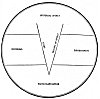
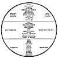

  
[Intangible Textual Heritage](../../index)  [Esoteric](../index)  [New
Thought](../../nth/index)  [Index](index)  [Previous](som10) 
[Next](som12) 

------------------------------------------------------------------------

[Buy this Book at
Amazon.com](https://www.amazon.com/exec/obidos/ASIN/0874779219/internetsacredte)

------------------------------------------------------------------------

The Science of Mind, by Ernest Shurtleff Holmes \[1926\], at Intangible
Textual Heritage

------------------------------------------------------------------------

p. 97

**Lesson Two: Metaphysical Meaning of Words Used in Individual Chart No.
II-B**

**UPPER SECTION**

SPIRIT.--That part of man which enables him to be self-conscious. That
which he really is. We do not see the spirit of man any more than we see
the Spirit of God. We see what man does; but we do not see the doer.

CHRIST, LOGOS.--The Word of God manifest in and through man. In a
liberal sense the Christ means the Entire Manifestation of God and is,
therefore, the Second Person of the Trinity. Christ is a Universal Idea,
and each one "Puts on The Christ" [34](#fn_33)
to the degree that he surrenders a limited sense of Life to the Divine
Realization.

SONSHIP.--We are all Sons of God and all partake of the Divine Nature.

MICROCOSM.--The individual world as distinguished from the Universal.

EMMANUEL.-GOD-WITH-US.--Means that Christ is in every one.

PERSONALITY.--The external evidence of individualized being.

INDIVIDUALITY.--Each one is a separate identity in Mind and no two are
alike. Each is an Individualized Center of God-Consciousness. Our
personality is the use that we make of our Divine Individuality.

CONSCIOUS-STATE.--The conscious-state is the self-knowing mind of man.
It is the only thing that distinguishes him from brute creation. Without
a conscious-state of mind man would not be at all; or, at least, he
would not know that he is. The conscious mind should be carefully
guarded, as it is the real man.

MENTAL.--Means that man is mentally conscious.

SPIRITUAL.--Means that man is a Spiritual Being.

p. 98

REASON: INDUCTIVE AND DEDUCTIVE.--The conscious mind of man can reason
both inductively and deductively. It can reason from the Whole to a part
or from a part to the Whole.

WILL.--Means conscious ability to determine.

CHOICE.--Ability to differentiate and choose.

VOLITION.--Power to act independently.

INTELLECT.--Mental quality of analysis.

PURPOSE.--Determination with incentive.

DECISION.--Ability to choose.

**MIDDLE SECTION**

SOUL.--*The Subjective Side of Life.* Man's place in the One Subjective
Mind of the Universe; his identity in Mind. Man's soul life reënacts the
Soul Life of the Universe with which it is at One.

SUBJECTIVE.--The Soul is subjective. Read again the meaning of
subjectivity as given in the Universal Chart.

SUBCONSCIOUS.--The Soul is subjective to the conscious thought.

UNCONSCIOUS.--Word used in Psycho-analysis to denote soul. It is a poor
way of expressing soul-life, for it really is not unconscious. It is
subconscious but certainly not unconscious.

CONSCIOUSNESS.--Another way of saying soul. The Bible says, soul; the
psycho-analyst says, unconscious; the psychologist says, subjective or
subconscious; and the metaphysician says, consciousness. All have the
same meaning.

KARMA.--The subjective law of tendency set in motion by the individual.
The mental law acting through him. Karmic Law means the use that man
makes of his mentality. Karma is not Kismet; for Kismet means "fate,"
and Karma simply means "the mental tendency." Karma is both individual
and Universal.

AURA.--Mental atmosphere or vibration. It extends from a few inches to a
few feet around the individual and can be seen by many people.

p. 99

[  
Click to enlarge](img/chart02a.jpg)  
Lesson Two: Metaphysical Chart No. II-A.  

This chart shows, first, the Universal Spirit; then the Universal Soul
or Subjectivity, which is the medium of all thought, power and action;
then particularization or manifestation of Spirit.

The point drawn down through the center symbolizes the descent of Spirit
into matter, or form. It is necessary that Spirit be manifested in order
to express Itself. The word Unity on the descending line shows that all
come from the One. Man reënacts the whole Universal Life, and his nature
is identical with Spirit. What is true of the Whole is true of any one
of Its undivided parts. Man comes to a point of individualization in the
Whole and is subject to the Law of the Whole.

p. 100

MEMORY.--The soul, or subjective mind, is the seat of memory, and
retains within itself everything that the individual has ever said,
thought, seen, heard, felt, read or been told; and, indeed, everything
that has ever happened to him. It also contains race memory, and may, or
may not, contain much of what we call Cosmic Purposes. Cosmic Purposes
mean the Ideas of God. The soul of man, being in constant contact with
the Soul of the Universe, might contact tremendous powers if it would
turn to the One.

CONFLICT.--In the study of Psycho-analysis, which means the analysis of
the soul, we learn that the subjective side of thought, being the seat
of memory, often retains thoughts and suppressed emotions which more or
less tear or bind. This is what is meant by inner conflict.

PSYCHE.--Means soul.

INHERITED TENDENCIES.--The subjective, being the seat of memory,
contains the race characteristics and tendencies. We do not inherit
diseases, but we do inherit tendencies. This is the way that family and
race traits are handed down.

RACE-SUGGESTION.--The tendency to reproduce what the race has thought
and experienced.

PRENATAL CONDITIONS.--The tendency to inherit family traits.

IMAGES OF THOUGHT.--The soul, or subjective mind, contains all of our
thoughts as mental images or pictures.

AUTO-SUGGESTION.--The soul receives the suggestions of the individual.

REASON DEDUCTIVE ONLY.--That which is subjective can reason deductively
only.

**LOWEST SECTION**

BODY.--The definite outline of flesh, containing all of the ideas which
go to make the complete physical instrument.

EFFECT.--That which follows cause. The body is always an effect.

AFFAIRS.--That which happens to the external man.

CONDITIONS.--External things, the result of thought.

p. 101

[  
Click to enlarge](img/chart02b.jpg)  
Lesson Two: Metaphysical Chart No. II-B.  

This chart shows how man reënacts the Whole and is subject to the law of
his own being. If the meaning of this chart is carefully studied it will
be made plain that man thinks consciously and that his conscious thought
becomes the law of his life. The upper section stands for the
Self-Conscious man; the middle section stands for the subconscious man;
and the lowest section stands for the man as he appears in the flesh and
in the conditions of his life.

p. 102

RESULTS.--Conditions.

HEALTH.--Result of correct thinking.

DISEASE.--Result of wrong thinking.

DESTINY.--Result of what man thinks.

RICHES.--Result of a consciousness of supply.

POVERTY.--Result of limited thought.

BUSINESS.--Also result of thought.

VOCATION.--The thing that our thought causes us to do.

PROFESSION.--Same as vocation.

OCCUPATION.--Same as vocation.

REASON, NONE.--Everything in the body of man, as well as in his affairs,
is the result of what he thinks. Nothing in the external is a cause, and
nothing that happens causes itself to happen. Things have no power to
reason, but are always the result of some inner cause.

------------------------------------------------------------------------

### Footnotes

[97:34](som11.htm#fr_33) Gal. 3:27.

------------------------------------------------------------------------

[Next: Lesson Two: The Nature of Man](som12)
