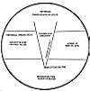

  
[Intangible Textual Heritage](../../index)  [Esoteric](../index)  [New
Thought](../../nth/index)  [Index](index)  [Previous](som14) 
[Next](som16) 

------------------------------------------------------------------------

[Buy this Book at
Amazon.com](https://www.amazon.com/exec/obidos/ASIN/0874779219/internetsacredte)

------------------------------------------------------------------------

The Science of Mind, by Ernest Shurtleff Holmes \[1926\], at Intangible
Textual Heritage

------------------------------------------------------------------------

p. 134

### Lesson Three: Metaphysical Meaning of Words Used in Chart No. III

UNIVERSAL SPIRIT.--Means the universe of conscious mind and
self-determination. The Universal Subjectivity means the Creative Medium
of the Spirit, or the Subjective law of the Universe. Particularization
means the world of matter and forms. Read again the explanation to Chart
Number One. The descent of Spirit means the passing of Spirit into
form;--the particularization of Spirit into many things. The point,
drawn from the top of the chart to the bottom section, symbolizes the
Unity of all Life. Spirit passes through Law into Form. Multiplicity
comes from Unity, but never contradicts Oneness. The many are within the
One.

Man's life partakes of the Divine Nature, and this chart may be used in
the Individual or the Universal sense. Our conscious mind is some part
of the One Conscious Mind of the Whole. The Complete Nature of God is
reflected in man, and he uses the same law that God uses; for there is
but One Law, as there is but One Spirit. Both God and man use the same
Creative Medium or the Universal Subjectivity. It is the law of all
thought and all action. Things come from One Source through One Common
Law and One Common Creative Medium. We think of our lives as One with
the Whole on all three planes of expression. We are one with the
Conscious Mind, one with the Creative Law, and in our bodies we are one
with all matter.

No matter what we are treating or for what purpose, the Medium of all
thought is the Universal Law. It particularizes Itself through the power
of the word that is spoken into It. The word alone is conscious. The Law
is Automatic and the form is without self-determination.

p. 135

[  
Click to enlarge](img/chart03.jpg)  
Lesson Three: Metaphysical Chart No. III.  

The upper section of this chart shows how the conscious mind, or spirit
of man, reflects or contemplates itself, through the medium of soul or
subjectivity, into form or matter. The middle section represents the
World-Soul or Subjectivity; the Mirror of Mind and unformed matter; the
Servant of the Spirit; the lowest section shows the result of
self-contemplation as it takes form in the world of matter. Read and
carefully study the metaphysical meanings of the words used in the
Individual Chart.

p. 136

CONSCIOUS MIND OR SPIRIT.--Means the Self-Knowing Mind of the Universe.
Contemplator, or Reflector, means the conscious thought of the Conscious
Mind.

SUBJECTIVE MIND AND UNFORMED MATTER.--MEAN THE SUBSTANCE AND THE SOUL OF
THE UNIVERSE.

MIRROR OF MIND, OR SOUL.--Means that the Subjective side of life acts
like a mirror; that is, It reflects the forms of thought that are given
It.

UNCONSCIOUS FORM OR MIRROR OF MATTER.--Means that the material world
reflects the forms of thought which the Soul holds before it.

This depicts the Creative process and sequence:--first in the chain of
Causation is the Word, and this Word is conscious of Itself; next comes
the action of Law, reflecting the Word. (This Law is subjective and
obeys the Word, reflecting It into form or matter; matter, being at
first unformed, or a Universal unformed stuff.) It then takes form,
through the power of the word acting upon It, on the subjective side of
life.

Soul and Substance are both subjective to the Spirit; and form, or
matter in form, has no volition.

In the Trinity of Unity, one attribute alone is really self-conscious,
namely, the Spirit, or the Word.

This chart may be used in either the individual or the universal sense,
for the individual reënacts the Universal on all three planes.

The manifest Universe is the result of the self-contemplation of Spirit
or God. This self-contemplation, through law, reflects its images into
the world of form or manifestation.

Man's world of affairs and his body are the result of his inner
self-knowingness. He is the result of his self-contemplation.

------------------------------------------------------------------------

[Next: Lesson Three: Mental Healing](som16)
