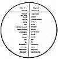

  
[Intangible Textual Heritage](../../index)  [Esoteric](../index.md)  [New
Thought](../../nth/index)  [Index](index)  [Previous](som18.md) 
[Next](som20.md) 

------------------------------------------------------------------------

[Buy this Book at
Amazon.com](https://www.amazon.com/exec/obidos/ASIN/0874779219/internetsacredte.md)

------------------------------------------------------------------------

The Science of Mind, by Ernest Shurtleff Holmes \[1926\], at Intangible
Textual Heritage

------------------------------------------------------------------------

p. 180

### Lesson Four: The Control of Conditions

In taking up this subject, let us very clearly understand that we do not
differentiate between Conscious Mind and Spirit; there is no difference,
for they are One.

The Spirit of Intelligence, which is God, in order to do something for
us must do that thing through us, and what It is to do must first become
a part of our mentality before it can become an individual experience.
OUR MENTALITIES ARE BUT THE SPIRIT WORKING THROUGH US AS INDIVIDUALS.

In the new schools of thought there are those who claim to demonstrate
only by the Spirit; also those who claim to demonstrate only by the
Mind. This is a distinction which is suppositional rather than real and
is impossible, because, if there were two powers, we would at once have
duality and our philosophy of Unity would be contradicted. There is but
One Active Intelligence, whether it be the Universal Intelligence or
Universal Spirit individualized in us.

We do, however, distinguish between the phase of mind which we call
conscious and the phase which we call unconscious or subjective, as has
already been explained.

In demonstrating conditions, the only inquiries we need to make are: do
the things that we want lend themselves to a constructive program? Do
they express a more abundant life, rob none, create no delusion, but
instead, do they express a greater degree of livingness? If they do,
then all the power in the universe must be behind them. If it is money,
automobiles, houses, lands, stocks, bonds, dresses, shirts or
shoestrings, cabbages or kings,--all of which come from the same
source,--there can be nothing, either in the Law or in the Spirit back
of the Law, to deny us the right to the greatest possible expression of
life.

So we need not hesitate to use the Law for personal motives, for we have
a perfect right to do so. It is good for every

p. 181

[  
Click to enlarge](img/chart04.jpg.md)  
Lesson Four: Metaphysical Chart No. IV.  

HOW IDEAS MANIFEST AS THINGS.

This chart is divided into two sides, representing the world of thought
and the world of reflections. It represents the law of cause and effect.
The world of thought is the world of ideas, while the world of
reflections means the results of thought. The world of reflections is
entirely a world of effects and is, of itself, unconscious and
unknowing. Consider everything on the left side of this chart to be
thoughts or ideas; and consider everything on the right side to be the
automatic results of the law as it works out into effects. By using this
chart in conjunction with the explanations already given, it will be
plain just how the law of cause and effect works from the idea to the
thing.

p. 182

one to express himself, provided that in so doing, he does not destroy
the independence of others.

**LAW OF REFLECTION**

In turning to the Law, then, realize that It is a Law of reflection.
"Life is the mirror of king and slave." Chart No. IV is divided into two
parts with a suppositional line in the center; on one side is depicted
the world of thought and on the other, the world of the reflections of
thought. The world of thought is the world of our individuality; it is
the part of us that knows. The other is the world of soul or receptivity
and of reflections. In the thought is the cause that reflects the
effect; the belief that reflects the correspondence. Here is the image;
and here is a form. Here is the limited thought, the result of which
reflects poverty. Here is the freed thought, the result of which
reflects wealth. Here is a thought of peace which reflects peace. Here
is a prayer and here is its answer; the answer to prayer is in the
prayer when it is prayed, and the answer is identical with the prayer.
Here is Yes and here is Yes; and here is No and here is No. Why is this?
Because the Law takes us at our own valuation; if we say "Yes," It says
"Yes"; and if we say "No," It says "No"; for It can only reflect; It
cannot initiate anything. So here is friendship and over here is
friendship. Emerson said: "If you want a friend, be a friend"; and so,
as the idea of friendship dawns upon the consciousness, the law of
attraction produces friends; for one is the picture and the other is the
thing. This is the great teaching of Involution and Evolution, the
thought involved and the result evolved; one is the treatment and the
other is the demonstration.

We mean by demonstration, bringing into our experience something which
we had not experienced before; bringing it in as the result of conscious
thought; and unless it is possible to do this the whole science is a
mistake and a delusion.

Unless there is a Divine Principle, Universal Soul or Subjectivity, or
Medium, which, of Itself, without any help or assistance, can produce
things, and will, then there is nothing in this teaching. But there is
Divine Principle; and what It

p. 183

does for us, It must do through us. Our part in the demonstration is to
set the word in motion, thus compelling, through the law of
subjectivity, the result or manifestation.

**ATTRACTING FRIENDS**

When we are dealing with Causation, we are dealing with that which has
involved within Itself all effect, as it unfolds. We may leave it to the
Law to compel right action. With this in mind, let us go on to
treatment.

Suppose we wish to attract friends. We must begin to image ideal
relationships, be they social or otherwise; to sense and feel the
presence of friends; to enjoy them in our own mentalities, not as an
illusion, but as a reality; not as a dream, but as an experience; to
declare that their presence is now here; that they know it and that we
know it. But we must never look to see if they are here, because this
would imply doubt and would neutralize our word. We can attract the kind
of friends we wish if we specifically designate the kind; but we must
never think of certain people, or that a particular individual must be
one of them, for this would be hypnotic; just thinking the idea will
bring the right kind of friends.

In order to have this friendship enduring, true, really worth while and
a thing of beauty, we should cultivate an attitude of friendship toward
everybody and everything.

**THE PRINCIPLE OF PROSPERITY**

We are surrounded by a Universal Subjectivity, a Subjective, Creative
Consciousness, which is receptive, neutral, impersonal, always receiving
the impress of our thought, and which has no alternative other than to
operate directly upon it, thus creating the things which we think.

Each one should realize that there is nothing in him that denies that
which he desires. Our unity with our good is not established while there
is anything in us that denies it.

People often say: "How shall I know when I know?" If you knew you would
not ask this question; the very fact that

p. 184

you can ask it proves you do not know; for when you know that you know
you can prove it by doing.

Thought sets definite force in motion in Mind, relative to the
individual who thinks. For instance, I am known in Consciousness as
Ernest Holmes, for that is my name; and every claim made for me, which I
accept, operates through avenues of mind-activity and returns to me as
some condition.

In practice, always forget the limitations of individuality. Each
treatment should embody a recognition of the Whole, because It is
Omnipresent.

**WE DEAL WITH ABSOLUTENESS**

We deal with Absoluteness; this is the attitude that we should have.
What we need is to know the Truth. This does not mean that we need not
be active; of course we shall be active; but we need not compel things
to happen. A good demonstration is made when the Truth, gathering Its
own power, lifts one out of his environment; and until that time comes
he should stay where he is, in order that he may know when he has made a
demonstration.

It is not a good demonstration if, when we give our treatments, we have
to struggle just as before. Principle is Absolute, and in so far as any
individual can actually induce, within consciousness, upon Principle, a
definite, concrete acceptance of his desire, it will manifest, even if
every thought on earth had to change to compel it. If it were a bit of
information that only one person on earth knew, and he was in the center
of Africa, it would be produced.

**PRAYER IS ITS OWN ANSWER**

Cause and effect are but two sides of thought; and Spirit is both Cause
and Effect. Prayer is its own answer. Now, if the one who prays only
partly believes, then there is a tendency to set an idea in motion; if
the next day he wholly doubts, this idea must be wiped out. In dealing
with Mind, we are dealing with a Force which we cannot fool. We can fool
ourselves; we can fool others; but we cannot cheat Principle

p. 185

out of the slightest shadow of our most subtle concept; for this is
impossible. The hand writes and passes on, but the writing is left
there, nevertheless; and the only thing that can erase it is a writing
of a different character. We must either transcend all that has gone
before, by walking above it, neutralize it by an opposite state of
consciousness, or endure it.

Get a sense of self-mastery, of being equal to every occasion. There is
nothing too great; there is no obstacle that you cannot surmount; no
obstruction that you cannot dissipate by the power of Truth, if your
concept of Truth is dynamic enough and clear enough, and if the
embodiment is complete.

**IF YOU KNOW**

If you know that the Power with which you are dealing is Principle and
not personality; if you know and believe that Mind is the only Actor,
Cause, Effect, Substance, Intelligence, Truth and Power that there is;
and if you have a real embodiment of your desires, then you can
demonstrate.

If you lack, if you are poor, if you are without friends, if you are
without opportunity, don't fight anything; but be sure to erase from
your consciousness any sense of that lack.

You erase thought from consciousness by pouring in an opposite thought;
this opposite thought meets the other and neutralizes it; that is, it
rubs it out, just as we rub a chalk mark off a board. Take a consistent,
positive, aggressive mental attitude in the Truth.

We walk by falling forward; water falls by its own weight; the planets
are eternally falling through space; for everything sustains itself in
nature. The only reason that man is limited is that he has not allowed
the Instinctive Life to come out through him, and the reason why this is
possible, is that his own Divine Individuality, as soon as it was
evolved, compelled Infinity to appear in his experience as duality,
because he believed in duality.

Take no personal responsibility for making anything happen. Throw your
word into Mind, and know that Mind receives it; Mind believes it; Mind
accepts it; Mind acts upon it; and Mind produces it.

p. 186

**NO PERSONAL RESPONSIBILITY**

No matter how great a responsibility may rest in that which must be
done, never let one minute's responsibility rest in your own thought
about it, because that to which the mind gives birth is, and EVERY IDEA
IS BOUND TO PRODUCE AN EFFECT EXACTLY LIKE ITS CAUSE.

When we make a demonstration we must take what goes with it. Therefore,
all demonstrations should be made in peace, confidence and joy and in
the realization of Divine Love and Perfection as permeating everything.
The reason for this is evident, for we are dealing with the law of cause
and effect. We are not depending upon chance, but upon Law.

We must know that we are dealing with the substance from which all
things are made--people, brains, monkeys--everything that is. Nothing
moves but Mind, and we are dealing with the Mind that is the Mover, the
Creator, the Cause of all that is or is to be.

**HELPING AN INVENTOR**

Suppose an inventor came to you and said: "I am trying to perfect a
piece of machinery and have not been able to work out the right plan."
You sit with him for treatment; that is, you concentrate in Mind, in
order to produce the desired idea through him. You know that all ideas
come from Mind and that Mind is always unfolding Its Ideas through man.
You say: "John Smith is an inventor; a certain idea is trying to operate
through him and there is nothing in him that can obstruct this idea."
Then state that this idea is known in Mind, and is now flowing through
him. If you do this, thinking clearly, new ideas will begin to operate
through him and he will discover the thing he needs.

**LOOK ONLY AT WHAT YOU WANT**

Never look at that which you do not wish to experience. No matter what
the false condition may be, it must be refuted.

p. 187

\[paragraph continues\] The proper kind of
a denial is based upon the recognition that, in reality, there is no
limitation; for mind can as easily make a planet as anything else. The
Infinite knows no difference between a million dollars and a penny. It
only knows that IT IS. It would be just as easy to demonstrate a million
dollars as it would be to demonstrate ten cents, if the mental concept
embodied the idea of a million dollars.

It is the consciousness back of the word that forms the word.
Consciousness means the inner embodiment of an idea through the
recognition of Truth and a direct relationship to the Divine. The
greatest Teacher Who ever lived was the most spiritual man; for the more
universal and comprehensive the thought, the more Godlike it must
become.

A good treatment is always filled with the recognition of the Presence
of God or Good. Even in Spiritual Things we are still dealing with the
law of cause and effect, for God is Law. The more exalted the thought,
the more heavenly, the more boundless, the more Godlike or Christlike
the thought, the more power it will have. This is why the greatest
Teacher should become the Saviour; He couldn't help it. A great teacher
would have to be a Saviour.

**DEFINITE PLAN**

We will say that there are four men, "A," "B," "C," and "D." "A"
receives 15 a week, "B" receives 50, "C," 75, and "D," 100. Now these
four are all without positions and they come to a practitioner for
mental treatment. The practitioner takes the thought that there is
nothing but activity; he neutralizes, in his own thought, any belief in
inactivity and declares that each of these four men is divinely active
and occupied. Without question he has set in motion a law which will
respond and will reproduce something for each of these four. We will
suppose that his treatment is a good and an effective one; they receive
it, and consequently each one of them receives a position. You will find
that each does not receive the same compensation, for in all probability
"A" will receive 15 per week; "B," 50; "C," 75, and "D," 100. "But," one
might say, "he spoke the same word for each; why did they not all
receive 100 per week?" Because, while his word was used for

p. 188

each in a like manner, each could receive only his fill, his mental
capacity to comprehend. Each was full, and no doubt running over; but
the molds which their perceptions of life provided were limited to the
subjective remembrance already set in motion by themselves. Each
attracted to himself, out of the Universal Good, that which he could
comprehend. It is the old statement that water will reach its own level
by its own weight, and without effort. So a treatment will only level
itself in the objective world at the level of the subjective thought and
realization.

This does not mean that each of the above-stated men will always have to
receive the same compensation; for with an enlarged consciousness he
would receive more.

**ATTRACTION**

Every one automatically attracts to himself just what he is, and you may
set it down that wherever you are, however intolerable the situation may
be, it is just where you belong. There is no power in the Universe but
yourself that can get you out of it. Some one may help you on the road
to realization, but substantiality and permanence can come only through
the consciousness of your own life and thought. Man must bring himself
to a point where there is no misfortune, no calamity, no accident, no
trouble, no confusion; where there is nothing but plenty, peace, power,
Life and Truth. He should definitely, daily, using his own name, declare
the Truth about himself, realizing that he is reflecting his statements
into Consciousness, and that they will be operated upon by It.

This is called, in mysticism, High Invocation; invoking the Divine Mind;
implanting within It seeds of thought relative to one's self. And this
is why some of the teachers of older times used to teach their pupils to
cross their hands over their chests and say: "Wonderful, wonderful,
wonderful me!" definitely teaching them that, as they held themselves,
so they would be held. "Act as though I Am and I will Be."

One of the ancient sayings is that, "To the man who can perfectly
practice inaction, all things are possible." This

p. 189

sounds like a contradiction until one gets down to the inner teachings;
for it is only when one completely practices inaction that he arrives at
the point of the true actor. For he then realizes that the act and the
actor are one and the same, that cause and effect are the same; which is
simply a different way of saying: "Know the Truth and the Truth shall
make you free." To reduce the whole thing to its simplest form, whatever
one reflects into Mind will be done.

**HOW TO DEMONSTRATE A HOME**

Suppose you wish to demonstrate a home; daily, looking into Mind,
visualize it just as you wish it to be, making the picture as clear as
possible; for it is a lack of clearness of thought that hinders
demonstration. Then sit there about ten minutes, saying, "It is, it is,
it is." Perhaps thoughts will come in which say "that it is not." Pay no
attention to such thoughts but return to your meditation, and seeing the
picture anew, say again, "It is, it is, it is." Use no effort, but
simply see the picture very clearly and declare for its presence.

Never look for results from treatment; for if you do you will not find
them. This is in accordance with law, for what you look for you know
that you do not have and are only trying to fool yourself into thinking
that you do have. Treatment is not a process of hypnotism; it is a
process of self-knowing; and if you really know you will be sure to
demonstrate.

Treatment is the art, the science and process of systematically inducing
within consciousness concepts of definite desires as already
accomplished facts and experiences in life.

**RESIST NOT**

When Jesus said "Resist not evil," [60](#fn_59.md)
He meant that non-recognition of evil is the only way to avoid it. This
is true according to the law of cause and effect; for what we persist in
recognizing, we persist in holding in place. That which we
non-recognize, we neutralize, and it is no longer there, so far

p. 190

as we are concerned. In making a demonstration, don't try to
demonstrate; for demonstrations are not made through effort, because
this would contradict one of the fundamental principles of the universe,
which is the Self-Existence of Causation. In other words, nothing can
come before that which is, consequently everything must come out of that
which is; and within that which is, is the inherent possibility of that
which is to be. All things exist as a potentiality, as a possibility,
now. "I Am Alpha and Omega." [61](#fn_60.md) Try to
get a recognition of your desire and pass the whole thing over to Mind,
and let It operate. Just know that the desire is already a fact, and
quietly say to yourself, as often as the thought comes into mind: "It is
done." The lighter the thought is, the less care or worry over it, the
better. The best work is done when the element of struggle is entirely
left out.

**HEALING A MISUNDERSTANDING**

Suppose one says: "I have had a terrible misunderstanding with a friend
of mine and it has come to a point where we do not even speak to each
other." What is the fundamental error which has brought about this
condition? A lack of the realization of the Unity of all life, a belief
in duality. Destroy this belief in duality; recognize that there is but
One Mind; see God in each, and the trouble will be healed. We all live
in the One Mind of God.

**FATE**

If one believes in fate he must be healed of this thought, for there is
no such thing as fate. If one believes that planetary forces have
anything to do with life he must be healed of this thought. Break down
everything except the recognition of the One Perfect Power, which is not
contingent upon any place, person, condition, time of year, or anything
but Itself. A demonstration is made when it comes through straight from
the Truth.

The one who wishes to make a demonstration must first

p. 191

clear up his own subjective atmosphere; the reason being that he may be
objectively making statements which his subjective thought may be
denying. In this way we often neutralize our word as fast as it is
spoken.

A treatment is scientific in that it is the act of inducing into
Subjectivity ideas which neutralize false images of thought and which
let the Truth come through into expression. The reason that we need such
a science is that we do not have a perfect faith; for if we had a
perfect faith we would have washed clean the subjective thought and no
doubts would be there. Until the time comes when one can say to the
sick, "Get up and walk," and have them do so; or say, "There is money,"
and have it appear, he must take the process of inducing thought for the
purpose of accumulating a subjective belief in the things which he
desires; this belief, as soon as it is complete, IS THE DEMONSTRATION.
The demonstration takes place within and not without.

**ATTRACTION OF PERSONALITY**

One might say, "I have no personality with which to attract people."
There is but One Person; this Person is manifested through every living
soul. It is radiant, vibrant, dynamic; It is *The* Personality; It is
Complete; It is, It is.

The ones to whom we are the most strongly attracted are not necessarily
the ones who are the most beautiful physically; but are the ones from
which we receive that subtle emanation, "that something." What is "that
something"? It is not that which shows, but that which floats through
from within. It is the inner recognition of Reality.

**SEE LIFE EXPRESSED**

One should analyze himself, saying, "Do I look at myself from a
standpoint of restriction? Do I see life as limited to the eternal round
of getting up in the morning, eating, going to work, coming home, going
to bed, sleeping, getting up again?" and so on. Break the bonds of
necessity and see life as one continuous expression of the Infinite
Self; and as this

p. 192

conception gradually dawns upon the inner thought, something will happen
in the outer conditions to let up on the greater demands of the law of
necessity. If one were doing the work he should be doing, he would never
become tired, because the energy which holds the universe in place is
tireless. The reason why we become tired is that we have cross currents
of thought over our work. This arises from a belief in duality.

A treatment is the scientific act of inducing concepts in Mind, which
operates upon them and manifests them in external affairs, just as the
picture is held subjectively. During the process we meet, contact,
neutralize and erase any and all opposing mental forces or conditions
which deny our greater good.

Never limit your view of life by what you or any one else has ever
accomplished. The possibility of life is inherent within the capacity to
imagine what life is, backed by the power to produce this imagery or
Divine Imagination. It is not a question of failing or of succeeding; it
is simply a question of sticking to an idea until it becomes a tangible
reality.

The illusion is in the way that we look at things. We have looked at
some things and they have looked evil to us; we must look at them until
they look good. We have looked at some one and he has looked sick to us;
we must look at him until he looks well. We have seen discord; we must
see harmony.

Look [at](errata.htm#0.md) harmony and people will become harmonious. We
have looked at poverty, degradation and misery until they have assumed a
gigantic form. Now we must look at harmony, happiness, plenty,
prosperity, peace and right action until it appears.

**LOOK TO THE ULTIMATE**

In treating, we conceive of the ultimate of the idea, but never of the
process. Never treat a process; never look for one. We plant a seed, and
there is in that seed, operating through the creative soil, everything
that is going to happen until it comes up, unfolds, and produces a
plant. The ultimate

p. 193

of effect is already potential in cause. This is the mystical meaning of
those words, "I am Alpha and Omega." [62](#fn_61.md) Our word should be the alpha and the
omega, the beginning and the end of the thing thought of. All cause and
effect are in Spirit. Cause and effect are bound together into one
complete whole. One is the inside and the other is the outside of the
same thing.

Once you have driven the peg into the ground, stick to it. Never let
anything cause you to doubt your ability to demonstrate the Truth.
Conceive of your word as being the thing. See the desire as an already
accomplished fact and rest in perfect confidence, peace and certainty,
never looking for results, never wondering, never becoming anxious,
never being hurried nor worried. Those who do not understand this
attitude will think that you are inactive, but remember, "To him who can
perfectly practice inaction, all things are possible."

**NO MISTAKES**

In mental work, we must realize that there is One Infinite Mind, which
is consciously directing our destiny. Declare every day that "no
mistakes have been made, none are being made, and none can be made";
declare, "There is One Supreme Intelligence which governs, guides and
guards, tells me what to do, when to act, and how to act"; then act with
perfect assurance. Declare, "everything necessary to the full and
complete expression of the most boundless experience, joy and life,
everything is now"; know this, see it, feel it and be it. Do this every
day for a few minutes; we should all do this until the time comes when
it will no longer be necessary. When that time comes, we will know it,
because our demonstrations will have been made.

Suppose one says: "I have made a lot of mistakes in my life. I had
opportunities which I did not grasp." This is a direct belief that there
is but one opportunity which comes to man, and if he does not take it he
will have no more. This is a belief in limited opportunities, and it
must be denied completely

p. 194

and specifically. We exist in Limitless Opportunities, which are forever
seeking expression through us, and are expressed in and through us.

Know that there is no condemnation; for nothing can condemn unless we
believe in condemnation. Destroy the thought that would lay limitation
or bondage upon any situation or condition. "Loose him, and let him
go." [63](#fn_62.md)

Talk to yourself, not to the world. There is no one to talk to but
yourself, for all experiences take place within. Conditions are the
reflections of our own meditations, and nothing else. There is but One
Mind to think, but one thing that It can think; that Mind is our Mind
now. It never thinks confusion; It knows what it wishes, and how to
accomplish what it desires. It is what It desires.

**CAUSES AND CONDITIONS**

Pay no attention to what happens in the objective world when you are
making a demonstration. We interpret causes by conditions only as we
realize that a condition must partake of the nature of its cause. If
there appears to be confusion in the condition, then there must have
been confusion in the thought back of it. Pay no attention to the
objective expression so long as you know you are getting the right
subjective recognition. The way to work out a problem scientifically is
to take it up in thought daily and conceive of it as already being an
accomplished fact in experience. Get the idea of the desire as already
embodied in the Absolute. Unless one believes that there is an Absolute,
how can he do this? We must believe that we are dealing with Reality and
with nothing less than the Absolute.

If we are radiating thought into Divine Mind, what is there that can
hinder It from operating on this thought? Nothing, for It knows no
hindrances. Be sure that there is nothing destructive in the reaction;
for there must be no element of destructiveness in our work. Daily hold
your desire as an already accomplished fact and go about your business
with joy and gladness, with peace and quiet confidence; the Law

p. 195

is then sure to act. During the process many things may happen that will
appear to be destructive. You may pass through good fortune and bad; but
if you can come to the point where you are not disturbed by what happens
on the outside, you have found the secret. If, as Jesus said, we "Judge
not according to the appearance, but judge righteous judgment," [64](#fn_63.md) remembering that "things which are seen
were not made of things which do appear"; [65](#fn_64.md) out of any chaos we can produce harmony,
provided we keep our thought steady. The answer to prayer is already in
the prayer when it is prayed.

**PERFECT ACTION**

Assume a case of treatment for prosperity. Suppose one comes to you and
says: "Business is bad; there is no activity." How are you going to
treat him? Are you going to treat activity or business, customers,
conditions or what? There is but one thing to treat, as far as the
practitioner is concerned, and that is HIMSELF. The practitioner treats
himself, the reason being that his patient's and his own mind are in the
One Mind.

There is but one activity, which is perfect. Nothing has happened to it;
nothing can cut it off; it is always operating. There is no belief in
inactivity. What is this statement for? To neutralize the belief in
inactivity. A word spoken in Mind will reach its own level, in the
objective world, by its own weight; just as in physical science we know
that water reaches its own level by its own weight. You must destroy the
thoughts of inactivity. Man cannot become either discouraged or afraid
if he realizes that there is but One Mind which he may consciously use.
The real man knows no discouragement, cannot be afraid and has no
unbelief.

"Who plants a seed beneath the sod  
And waits to see it turn away the clod,  
Has faith in God."

p. 196

And he who knows of the power with which he is dealing, and who plants a
seed of thought in Subjectivity, knows that it will come up and bear
fruit.

Bring out the idea of Substance. Make consciousness perceive that
Substance is Spirit, Spirit is God, and God is all that there is. Once
you acquaint the consciousness with this idea, it is implanted in the
Creative Power which is externalizing in your life.

**MENTAL EQUIVALENTS**

The Law is Infinite and Perfect; but in order to make a demonstration we
must first have a mental equivalent of the thing we DESIRE.
Consequently, the range of our possibilities at the present time does
not extend far beyond the range of our present concepts. As we bring
ourselves to a greater vision, we can then induce a still greater
concept and thereby demonstrate more in our experience. In this way
there is a continuous growth and unfoldment taking place. We do not
expect to give a treatment to-day and have a million dollars to-morrow.
But, little by little, we can unfold our consciousness through the
acquisition of greater and still greater mental equivalents, until at
last we shall be made free. The way to proceed is to begin right where
we are. It is not scientific to attempt to begin somewhere else. This
would be chaotic. One who understands the systematic use of the Law will
realize that he is where he is because of what he is; but he will not
say, "I must be where I am because of what I am." Instead, he will begin
to disclaim what he appears to be. As his statements loosen wrong
subjective tendencies and false mentality, providing in their place a
correct concept of life and Reality, he will automatically be lifted out
of his conditions; and impelling forces, which will sweep everything
before them, will set him free, if he trusts in Spirit and in nothing
else.

Stay with the One and never deviate from It; never leave It for a
moment. Nothing else can equal this attitude. To desert the Truth in the
hour of need is to prove that we do not know the Truth. When things look
the worst is the supreme moment to demonstrate to yourself that there
are no

p. 197

obstructions. When things look worst is the best time to work, the most
satisfying time. The person who can throw himself, with a complete
abandon, into that Limitless Sea of Receptivity, having cut loose from
all apparent moorings, is the one who will always receive the greatest
reward.

**TREATING FOR ACTIVITY**

Suppose you have a store and wish to attract customers, which means
activity in this kind of business. Every day see the place filled with
people. Make a mental picture of this. You are dealing with
Intelligence, so work intelligently. Ask for what you wish and take it.
If you were treating for activity in a store in Boston you would not be
treating some one in Kalamazoo for the mumps. Remember that you are
dealing with Intelligence; IT IS GOING TO EVOLVE YOUR CONCEPT EXACTLY AS
YOU INVOLVE IT. If one could take a picture of his objective
circumstances and his subjective mentality, he would find that they
would be identical; for one is the cause of the other; one is the image
and the other is the reflection of that image.

**RECEIVING INFORMATION**

Suppose that we wish a special piece of information; we should say, "I
wish to know this thing and I do know it. Whatever instrument is
necessary to present it to me is now in full operation." This is a
direct declaration that we have the desired knowledge, that that which
we wish to know we do know. Say, "The Spirit of Intelligence within me
tells me what I should know," or, "Everything that I should know I do
know." It does not matter how we get this knowledge; we would not care
if we read it on a sign, or in the dictionary, or if it were told us, or
if it were sent to us; but we should consider the demonstration complete
provided we received it. Say, "Everything necessary for the complete
fulfillment of this idea is now in full operation, and I accept it."

p. 198

**NO FAILURES**

If one appears to have failed he should realize that there are no
failures in the universe. We should completely erase the idea of failure
by stating that there are no failures. If one believes that he failed
last year he will be likely to fail again this year, unless the false
thought should be erased.

Now here is a place where it looks as though one were lying to himself,
but he is not; for he is declaring the truth about the Spirit that
indwells him; this Spirit never fails. Affirm, "This word blots from the
book of my remembrance any sense of lack, limitation, want or fear of
failure. There is no failure, no person to fail; failure is neither
person, place nor thing; it is a false thought and has no truth in it;
it is a belief in lack and there is no lack; it is a belief in a
limitation which does not exist."

Thought is very subtle, and sometimes you may find, when you are making
such a statement, that arguments will rise against it. Stop right here
and meet those arguments; refuse to accept them.

**OPPORTUNITY**

Suppose you are treating your business and something from within says,
"There are too many people in this business"; handle the thought of
competition at once; say, "There is no competition or monopoly." You
must do something to free the endeavor to express itself. Treatment is a
thing of itself; it is an entity of Infinite Intelligence, Life and
Action, and nothing can hinder its operation except unbelief or a lack
of adequate mental equivalents. "They could not enter in because of
unbelief," [66](#fn_65.md) and they "tempted God
and limited the Holy One of Israel." [67](#fn_66.md)

Never depend upon people, or say that things must come from this or that
source. It makes no difference where things come from. Say that they are
and let them come from where they will; and then, if something appears
to happen which points to a place for them to come from, it is correct
to say,

p. 199

"If this is the place, then there is nothing which can hinder." This is
not hypnotic, for you are simply guarding against the possibility of
some false thought coming in and hindering your demonstration.

Nothing moves but Mind. God makes things through the direct act of
becoming the things which He creates. This is what we do, for our
thought becomes the thing thought of. The thought and the thing are one,
in reality. "WHAT A MAN HAS AS WELL AS WHAT HE IS, IS THE RESULT OF THE
SUBJECTIVE STATE OF HIS THOUGHT." Keep on subjectifying thought until
the balance of your consciousness is on the affirmative side, and
nothing can hinder it from demonstrating. This is inevitable, for this
is the way that the Law operates.

**NO MISTAKES**

Regarding mistakes,--declare that there are none, that there never were
and never will be any. Say, "I represent the Truth, the whole Truth and
nothing but the Truth; It is unerring, It never mistakes; there are no
mistakes in the Divine Plan for me; there is no fear; there is no
limitation, poverty, want nor lack; I stand in the midst of eternal
opportunity, which is forever presenting me with the evidence of its
full expression. I am joy, peace and happiness; I am the spirit of joy
within me; I am the spirit of peace within me, of poise and power; I am
the spirit of happiness within me; I radiate life; I am Life. There is
One Life; that Life is my Life now." It is not enough to say, "There is
One Life and that Life is God." We must complete this statement by
saying, "That Life is my Life now," because we must couple this Life
with ours in order to express It. We are not becoming This Life, but are
now, in, and of, This Life. There is no other Life.

God is not becoming; God Is. God is not growing; God is Complete. God is
not trying to find out something; God already knows. Evolution is not
the expression of a becoming God, but is simply one of the ways that a
God Who already Is, expresses Himself; and as such, it is the logical
result of involution and is eternally going on.

p. 200

**DEMONSTRATION BY PROOF**

If one is in a position which is distasteful, subject to circumstances
over which he apparently has no control at the time, how should he act?
He should not leave the place where he is until his thought has drawn
him to a better one. In making a demonstration, we should not shove
anything before us, carry anything with us nor drag anything after us.
We should stay where we are until our word takes us somewhere else; for
this is the only proof that we have demonstrated.

**HANDLING A SCHOOLROOM**

A teacher, in dealing with the thought of pupils, should treat their
thought as a unit. The individuality of the room, of which each pupil is
a part, is a perfect idea. There is One Mind operating in, around and
through all these pupils, controlling them, directing them and inspiring
them; there are peace, calm, satisfaction and enlightenment here.
Realize the Active Presence of the One Mind, working in, around and
through all, and you will find that this will harmonize the most
discordant state, provided the teacher, the one who is thinking, really
knows the Truth.

**THE LAW OF CORRESPONDENCE**

The limit of our ability to demonstrate depends on our ability to
provide a mental equivalent of our desire; for the law of
correspondences works from the belief to the thing. But we can provide a
greater mental equivalent through the unfolding of consciousness; and
this growth from within will finally lead to freedom.

What we demonstrate to-day, to-morrow and the next day is not as
important as THE TENDENCY WHICH OUR THOUGHT IS TAKING. If, every day,
things are a little better, a little happier, a little more harmonious,
a little more health-giving and joyous; if, each day, we are expressing
more life, we are going in the right direction.

p. 201

And so we meditate daily upon the Universe of the All Good, that
Infinite Indwelling Spirit which we call God, the Father, Incarnate in
man; trying to sense and to feel this Indwelling Good as the Active
Principle of our lives. This is what the mystics call "The Man of the
Heart," or "The Angel of God's Presence." This is why they taught that
there are always Two; for there is what we seem to be and what we really
are; and as we contact this Higher Principle of our own lives--Which is
Perfect and Complete, needing nothing, wanting nothing, knowing
everything, being happy and satisfied,--and as we daily meditate upon
this Indwelling God, we shall acquire a greater mental equivalent.

For those who have thought small thoughts all of their lives a very good
practice is to dwell upon the bigness of the universe. Think how many
stars there are; think of how many fish there are in the seas, and how
many grains of sand on the beach. Think of how big the ocean is; of the
immensity of space, the bigness of everything, the grandeur of
everything, Mechanically, if necessary, compel the mentality to cognize
Reality. Compel the consciousness to recognize the Truth through pure
reason, if no other conviction comes.

Think, see and feel activity. Radiate Life. Feel that there is that
within which is the center and circumference of the universe. The
universe is the result of the Self-Contemplation of the Lord. Our lives
are the results of our self-contemplations, and are peopled with the
personifications of our thoughts and ideas. Accept this without
question, for it is true.

Nothing is real to us unless we make it real. Nothing can touch us
unless we let it touch us. Refuse to have the feelings hurt. Refuse to
receive any one's condemnation. In the independence of your own
mentality, believe and feel that you are wonderful. This is not conceit;
it is the truth. What can be more wonderful than the manifestation of
the Infinite Mind?

"Awake thou that sleepest, and arise from the dead, and Christ shall
give thee light." [68](#fn_67.md) "Prove Me, now
herewith, saith

p. 202

the Lord of Hosts, if I will not open you the windows of heaven, and
pour you out a blessing, that there shall not be room enough to receive
it." [69](#fn_68.md) "Be firm and ye shall be made
firm." "Act as though I am and I will be." "Onlook thou the Deity and
the Deity will onlook thee." "As thou hast believed so be it
done." [70](#fn_69.md) "Ask and it shall be given
unto you." [71](#fn_70.md) "So shall my word be
that goeth forth out of my mouth--it shall prosper." [72](#fn_71.md)

 

Note: Read and study "That Something"; "The Edinburgh Lectures," T.
Troward; "The Law and the Word," T. Troward; "Creative Mind and
Success," E. S. Holmes; "How to Visualize," Behrend; "Financial Success
Through Creative Thought," Wattles.

------------------------------------------------------------------------

### Footnotes

[189:60](som19.htm#fr_59.md) Matt. 5:39.

[190:61](som19.htm#fr_60.md) Rev. 1:8.

[193:62](som19.htm#fr_61.md) Rev. 1:8.

[194:63](som19.htm#fr_62.md) John 11:44.

[195:64](som19.htm#fr_63.md) John 7:24.

[195:65](som19.htm#fr_64.md) Heb. 11:3.

[198:66](som19.htm#fr_65.md) Heb. 3:19.

[198:67](som19.htm#fr_66.md) Ps. 78:41.

[201:68](som19.htm#fr_67.md) Eph. 5:14.

[202:69](som19.htm#fr_68.md) Mal. 3:10.

[202:70](som19.htm#fr_69.md) Matt. 8:13.

[202:71](som19.htm#fr_70.md) Matt. 7:7.

[202:72](som19.htm#fr_71.md) Isa. 55:11.

------------------------------------------------------------------------

[Next: Recapitulation](som20.md)
