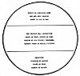

  
[Intangible Textual Heritage](../../index)  [Esoteric](../index)  [New
Thought](../../nth/index)  [Index](index)  [Previous](som23) 
[Next](som25) 

------------------------------------------------------------------------

[Buy this Book at
Amazon.com](https://www.amazon.com/exec/obidos/ASIN/0874779219/internetsacredte)

------------------------------------------------------------------------

The Science of Mind, by Ernest Shurtleff Holmes \[1926\], at Intangible
Textual Heritage

------------------------------------------------------------------------

p. 231

### Lesson Six: Metaphysical Meanings of Words Used in Chart No. VI

The upper section represents the Conscious Mind, the Self-Knowing Mind,
which we call Spirit. The middle section represents the Psychic Sea,
that is, the Subjective World; this is the world of thought forms and
mental pictures. This has been called "The illusion of Mind," because it
contains many pictures, which are pictures only, and have no real form
behind them. As a picture that is hung on the wall is not really a
person--but is simply a picture--so the Psychic Sea may contain pictures
which, while they are real as pictures, are not real from any other
sense. It does not follow that everything in the psychic world is an
illusion, for it contains much that is true. We should be very careful
to distinguish the false from the true.

The lower section of the chart represents the objective world. This
world also reflects many false forms, such as disease and limitation.
They are not things of themselves, but are the results of wrong mental
pictures in the Subjective World.

Neither the psychic pictures nor the world of forms are self-creative;
both are effects.

p. 232

[  
Click to enlarge](img/chart06.jpg)  
Lesson Six: Metaphysical Chart No. VI.  

This is the psychic's chart and should be carefully considered, as it
shows that the Spirit, or Conscious Mind, operates through a mental
field, or law, which is a world of reflections. Thought is first
reflected into Mind and then into matter. Read again the meaning of the
conscious and the subconscious aspects of being. The world of
Subjectivity is the Psychic Sea and the Medium of all subjective action.
From the standpoint of man's thoughts it may be false or true, according
to the way in which he thinks. It is the picture gallery of the soul,
both from the universal and the individual sense. The illusion of matter
means that the false mental pictures will produce a false form in the
world of objectivity. Mind is not an illusion, but might contain false
pictures which would be illusions; matter is not an illusion but may
take on false conditions. We must learn to separate the false from the
true.

------------------------------------------------------------------------

[Next: Psychic Phenomena](som25)
