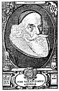
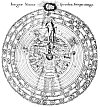
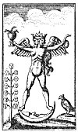
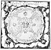

  
[Intangible Textual Heritage](../../index)  [Esoteric](../index.md) 
[Index](index)  [Previous](sta33)  [Next](sta35.md) 

------------------------------------------------------------------------

p. 141

# Rosicrucian Doctrines and Tenets

TRUSTWORTHY information is unavailable concerning the actual
philosophical beliefs, political aspirations, and humanitarian
activities of the Rosicrucian Fraternity. Today, as of old, the
mysteries of the Society are preserved inviolate by virtue of their
essential nature; and attempts to interpret Rosicrucian philosophy are
but speculations, anything to the contrary notwithstanding.

Evidence points to the probable existence of two distinct Rosicrucian
bodies: an inner organization whose members never revealed their
identity or teachings to the world, and an outer body under the
supervision of the inner group. In all probability, the symbolic tomb of
Christian Rosencreutz, Knight of the Golden Stone, was in reality this
outer body, the spirit of which is in a more exalted sphere. For a
period of more than a century subsequent to 1614, the outer body
circulated tracts and manifestoes under either its own name or the names
of various initiated members. The purpose of these writings was
apparently to confuse and mislead investigators, and thus effectively to
conceal the actual designs of the Fraternity.

When Rosicrucianism became the philosophical "fad" of the seventeenth
century, numerous documents on the subject were also circulated for
purely commercial purposes by impostors desirous of capitalizing its
popularity. The cunningly contrived artifices of the Fraternity itself
and the blundering literary impostures of charlatans formed a double
veil behind which the inner organization carried on its activities in a
manner totally dissimilar to its purposes and principles as publicly
disseminated. The Fratres Rosa Crucis naively refer to the
misunderstandings which they have for obvious reasons permitted to exist
concerning themselves as being "clouds" within which they labor and
behind which they are concealed.

An inkling of the substance of Rosicrucianism--its esoteric
doctrines--can be gleaned from an analysis of its shadow--its exoteric
writings. In one of the most important of their "clouds," the *Confessio
Fraternitatis*, the Brethren of the Fraternity of R.C. seek to justify
their existence and explain (?) the purposes and activities of their
Order. In its original form the *Confessio* is divided into fourteen
chapters, which are here epitomized.

### CONFESSIO FRATERNITATIS R. C. AD ERUDITOS EUROPÆ

*Chapter I*. Do not through hasty judgment or prejudice misinterpret the
statements concerning our Fraternity published in our previous
manifesto--the *Fama Fraternitatis*. Jehovah, beholding the decadence of
civilization, seeks to redeem humanity by revealing to the willing and
by thrusting upon the reluctant those secrets which previously He had
reserved for His elect. By this wisdom the godly shall be saved, but the
sorrows of the ungodly shall be multiplied. While the true purpose of
our Order was set forth in the Fama Fraternitatis, misunderstandings
have arisen through which we have been falsely accused of heresy and
treason. In this document we hope so to clarify our position that the
learned of Europe will be moved to join with us in the dissemination of
divine knowledge according to the will of our illustrious founder.

*Chapter II*. While it is alleged by many that the philosophic cide
(*sic*. JBH) of our day is sound, we declare it to be false and soon to
die of its own inherent weakness. just as Nature, however, provides a
remedy for each new disease that manifests itself, so our Fraternity has
provided a remedy for the infirmities of the world's philosophic system.
The secret philosophy of the R.C. is founded upon that knowledge which
is the sum and head of all faculties, sciences, and arts. By our
divinely revealed system--which partakes much of theology and medicine
but little of jurisprudence--we analyze the heavens and the earth; but
mostly we study man himself, within whose nature is concealed the
supreme secret. If the learned of out day will accept our invitation and
join themselves to our Fraternity, we will reveal to them undreamed-of
secrets and wonders concerning the hidden workings of Nature.

*Chapter III*. Do not believe that the secrets discussed in this brief
document are lightly esteemed by us. We cannot describe fully the
marvels of our Fraternity lest the uninformed be overwhelmed by our
astonishing declarations and the vulgar ridicule the mysteries which
they do not comprehend. We also fear that many will be confused by the
unexpected generosity of our proclamation, for not understanding the
wonders of this sixth age they do nor realize the great changes which
are to come. Like blind men living in a world full of light, they
discern only through the sense of feeling. \[By *sight* is implied
spiritual cognition: by *feeling*, the material senses.\]

*Chapter IV*. We firmly believe that through deep meditation on the
inventions of the human mind and the mysteries of life, through the
cooperation of the angels and spirits, and through experience and long
observation, our loving Christian Father C.R.C. was so fully illumined
with God's wisdom that were all the books and writings of the world lost
and the foundations of science overturned, the Fraternity of R.C. could
reestablish the structure of world thought upon the foundation of divine
truth and integrity. Because of the great depth and perfection of our
knowledge, those desiring to understand the mysteries of the Fraternity
of R. C. cannot attain to that wisdom immediately, but must grow in
understanding and knowledge. Therefore, our Fraternity is divided into
grades through which each must ascend step by step to the Great Arcanum.
Now that it has pleased God to lighten unto us His sixth candelabrum, is
it not better to seek truth in this way than to wander through the
labyrinths of worldly ignorance?

Furthermore, those who receive this knowledge shall become masters of
all arts and crafts; no secret shall be hidden from them; and all good
works of the past, present, and future shall be accessible to them. The
whole world shall become as one book and the contradictions of science
and theology shall be reconciled. Rejoice, O humanity! for the time has
come when God has decreed that the number of our Fraternity shall be
increased, a labor that we have joyously undertaken. The doors of wisdom
are now open to the world, but only to those who have earned the
privilege may the Brothers present themselves, for it is forbidden to
reveal our knowledge even to our own children. The right to receive
spiritual truth cannot be inherited: it must be evolved within the soul
of man himself.

*Chapter V*. Though we may be accused of indiscretion in offering our
treasures so freely and promiscuously--without discriminating between
the godly, the wise, the prince, the peasant--we affirm that we have not
betrayed our trust; for although we have published our *Fama* in five
languages, only those understand it who have that right. Our Society is
not to be discovered by curiosity

[  
Click to enlarge](img/14100.jpg.md)  
JOHANN VALENTIN ANDREÆ.  

From a rare print.

In certain esoteric circles there are vague rumors which intimate that
the humble personality of Johann Valentin Andreæ masked an exalted
emissary of the Rose Cross. While there is sufficient evidence at hand
to establish the actual existence of a German theologian by the name of
Andreæ, there are many discrepancies in his biography which have net
been cleared up to the satisfaction of critical investigators. A
comparison of the face shown above with that of Sir Francis Bacon
discloses striking resemblances in spite of the differences due to age.
If Lord Bacon borrowed the name and identity of William Shakspere, he
could also assume, after his mock funeral in England, the personality of
Johann Valentin Andreæ. The crescent below the bust is significant, as
it also appears upon the crest of Lord Bacon; to denote that he was the
second son of Sir Nicholas Bacon. Further, the four letters (O MDC) in
the frame at the lower right corner of the plate, by a very simple
Baconian cipher, can be changed into number whose sum gives 33--the
numerical equivalent of the name Bacon. These several points of
interest, when considered together, go far towards clearing up the
mystery surrounding the authorship of the first Rosicrucian manifestoes.

p. 142

seekers, but only by serious and consecrated thinkers; nevertheless we
have circulated our *Fama* in five mother tongues so that the righteous
of all nations may have an opportunity to know of us, even though they
be not scholars. A thousand times the unworthy may present themselves
and clamor at the gates, but God has forbidden us of the Fraternity of
R.C. to hear their voices, and He has surrounded us with His clouds and
His protection so that no harm may come to us, and God has decreed that
we of the Order of R.C. can no longer be seen by mortal eyes unless they
have received strength borrowed from the eagle. We further affirm that
we shall reform the governments of Europe and pattern them according to
the system applied by the philosophers of Damcar. All men desirous of
securing knowledge shall receive as much as they are capable of
understanding. The rule of false theology shall be overthrown and God
shall make His will known through His chosen philosophers.

*Chapter VII*. Because of the need of brevity, it is enough to say that
our Father C.R.C. was born in the year 1378 and departed at the age of
106, leaving to us the labor of spreading die doctrine of philosophic
religion to the entire world. Our Fraternity is open to all who
sincerely seek for truth; but we publicly warn the false and impious
that they cannot betray or injure us, for God has protected our
Fraternity, and all who seek to do it harm shall have their evil designs
return and destroy them, while the treasures of our Fraternity shall
remain untouched, to be used by the Lion in the establishment of his
kingdom.

*Chapter VII*. We declare that God, before the end of the world, shall
create a great flood of spiritual light to alleviate the sufferings of
humankind. Falsehood and darkness which have crept into the arts,
sciences, religions, and governments of humanity--making it difficult
for even the wise to discover the path of reality--shall be forever
removed and a single standard established, so that all may enjoy the
fruitage of truth. We shall not be recognized as those responsible for
this change, for people shall say that it is the result of the
progressiveness of the age. Great are the reforms about to take place;
but we of the Fraternity of R.C. do not arrogate to ourselves the glory
for this divine reformation, since many there are, not members of our
Fraternity but honest, true and wise men, who by their intelligence and
their writings shall hasten its coming. We testify that sooner the
stones shall rise up and offer their services than that there shall be
any lack of righteous persons to execute the will of God upon earth.

*Chapter VIII*. That no one may doubt, we declare that God has sent
messengers and signs in the heavens, namely, the i new stars in
*Serpentarius* and *Cygnus*, to show that a great Council of the Elect
is to take place. This proves that God reveals in visible nature--for
the discerning few--signs and symbols of all things that are coming to
pass. God has given man two eyes, two nostrils, and two ears, but only
one tongue. Whereas the eyes, the nostrils, and the ears admit the
wisdom of Nature into the mind, the tongue alone may give it forth. In
various ages there have been illumined ones who have seen, smelt,
tasted, or heard the will of God, but it will shortly come to pass that
those who have seen, smelt, tasted, or heard shall speak, and truth
shall be revealed. Before this revelation of righteousness is possible,
however, the world must sleep away the intoxication of her poisoned
chalice (filled with the false life of the theological vine) and,
opening her heart to virtue and understanding, welcome the rising sun of
Truth.

*Chapter IX*. We have a magic writing, copied from that divine alphabet
with which God writes His will upon the face of celestial and
terrestrial Nature. With this new language we read God's will for all
His creatures, and just as astronomers predict eclipses so we
prognosticate the obscurations of the church and how long they shall
last. Our language is like unto that of Adam and Enoch before the Fall,
and though we understand and can explain our mysteries in this our
sacred language, we cannot do so in Latin, a tongue contaminated by the
confusion of Babylon.

*Chapter X*. Although there are still certain powerful persons who
oppose and hinder us--because of which we must remain concealed--we
exhort those who would become of our Fraternity to study unceasingly the
Sacred Scriptures, for such as do this cannot be far from us. We do not
mean that the Bible should be continually in the mouth of man, but that
he should search for its true and eternal meaning, which is seldom
discovered by theologians, scientists, or mathematicians because they
are blinded by the opinions of their sects. We bear witness that never
since the beginning of the world has there been given to man a more
excellent book than the Holy Bible. Blessed is he who possesses it, more
blessed he who reads it, most blessed he who understands it, and most
godlike he who obeys it.

*Chapter XI*. We wish the statements we made in the *Fama Fraternitatis*
concerning the transmutation of metals and the universal medicine to be
lightly understood. While we realize that both these works are
attainable by man, we fear that many really great minds may be led away
from the true quest of knowledge and understanding if they permit
themselves to limit their investigation to the transmutation of metals.
When to a man is given power to heal disease, to overcome poverty, and
to reach a position of worldly dignity, that man is beset by numerous
temptations and unless he possess true knowledge and full understanding
he will become a terrible menace to mankind. The alchemist who attains
to the art of transmuting base metals can do all manner of evil unless
his understanding be as great as his self-created wealth. We therefore
affirm that man must first gain knowledge, virtue, and understanding;
then all other things may be added unto him. We accuse the Christian
Church of the great sin of possessing power and using it unwisely;
therefore we prophesy that it shall fall by the weight of its own
iniquities and its crown shall be brought to naught.

*Chapter XII*. In concluding our *Confessio*, we earnestly admonish you
to cast aside the worthless books of pseudo-alchemists and philosophers
(of whom there are many in our age), who make light of the Holy Trinity
and deceive the credulous with meaningless enigmas. One of the greatest
of these is a stage player, a man with

[  
Click to enlarge](img/14200.jpg.md)  
A SYMBOLIC DIAGRAM OF THE OPERATIONS OF NATURE.  

From *Fludd's Collectio Operum*.

This plate, engraved by de Bry, is the most famous of the diagrams
illustrating the philosophic principles of Robert Fludd (Robertus de
Fluctibus). Three figures are outstanding links between Rosicrucianism
and Freemasonry: Michael Maier, Elias Ashmole, and Robert Fludd. De
Quincey considers Robert Fludd to be the immediate father of
Freemasonry. (See *The Rosicrucians and Freemasons*.) Edward Waite
considers Robert Fludd as second to none of the disciples of Paracelsus,
even going as far as to declare that Fludd far surpassed his master. He
further adds, "The central figure of Rosicrucian literature, towering as
an intellectual giant above the crowd of souffleurs, theosophists, and
charlatanic Professors of the magnum opus, who, directly or otherwise,
were connected with the mysterious Brotherhood, is Robertus de
Fluctibus, the great English mystical philosopher of the seventeenth
century, a man of immense erudition, of exalted mind, and, to judge by
his writings, of extreme personal sanctity. " (See *The Real History of
the Rosicrucians*.) Robert Fludd was born in 1574 and died in 1637.

The de Bry diagram shown above is almost self-explanatory. Outside the
circle of the starry heavens are the three fiery rings of the
empyreum--the triple fire of the Supreme Creator--in which dwell the
celestial creatures. Within he, of the stars are the circles of the
planets and elements. After the element of air comes the circle of the
world (earth). The circle of animals is followed by the circle of
plants, which, in turn is followed by the circle of he minerals. Then
come various industries and in the center is a terrestrial globe with an
ape-man sitting upon it, measuring a sphere with a pair of compasses.
This little figure represents the animal creation. In the outer ring of
fire, above is the sacred name of Jehovah surrounded by clouds. From
these clouds issues a hand holding a chain. Between the divine sphere
and the lower world personified by the ape is the figure of a woman. It
is to be specially noted that the female figure is merely holding the
chain connecting her with the lower world, but the chain connecting her
with the higher world ends in a shackle about her wrist. This female
figure is capable of several interpretations: she may represent humanity
suspended between divinity and the beast; she may represent Nature as
the link between God and the lower world; or she may represent the human
soul--the common denominator between the superior and the inferior.

p. 143

sufficient ingenuity for imposition. Such men are mingled by the Enemy
of human welfare among those who seek to do good, thus making Truth more
difficult of discovery. Believe us, Truth is simple and unconcealed,
while falsehood is complex, deeply hidden, proud, and its fictitious
worldly knowledge, seemingly a glitter with godly luster, is often
mistaken for divine wisdom. You that are wise will turn from these false
teachings and come to us, who seek not your money but freely offer you
our greater treasure. We desire not your goods, but that you should
become partakers of our goods. We do not deride parables, but invite you
to understand all parables and all secrets. We do not ask you to receive
us, but invite you to come unto our kingly houses and palaces, not
because of ourselves but because we are so ordered by the Spirit of God,
the desire of our most excellent Father C.R.C., and the need of the
present moment, which is very great.

*Chapter XIII*. Now that we have made our position clear that we
sincerely confess Christ; disavow the Papacy; devote our lives to true
philosophy and worthy living; and daily invite and admit into our
Fraternity the worthy of all nations, who thereafter share with us the
Light of God: will you not join yourselves with us to the perfection of
yourselves, the development of all the arts, and the service of the
world? If you will take this step, the treasures of every part of the
earth shall be at one time given unto you, and the darkness which
envelopes human knowledge and which results in the vanities of material
arts and sciences shall be forever dispelled.

*Chapter XIV*. Again we warn those who are dazzled by the glitter of
gold or those who, now upright, might be turned by great riches to a
life of idleness and pomp, not to disturb our sacred silence with their
clamorings; for though there be a medicine which will cure all diseases
and give unto all men wisdom, yet it is against the will of God that men
should attain to understanding by any means other than virtue, labor,
and integrity. We are not permitted to manifest ourselves to any man
except it be by the will of God. Those who believe that they can partake
of our spiritual wealth against the will of God or without His sanction
will find that they shall sooner lose their lives in seeking us than
attain happiness by finding us.

FRATERNITAS R.C.

Johann Valentin Andreæ is generally reputed to be the author of the
Confessio. It is a much-mooted question, however, whether Andreæ did not
permit his name to be used as a pseudonym by Sir Francis Bacon. Apropos
of this subject are two extremely significant references occurring in
the introduction to that remarkable potpourri, *The Anatomy of
Melancholy*. This volume first appeared in 1621 from the pen of
Democritus junior, who was afterwards identified as Robert Burton, who,
in turn, was a suspected intimate of Sir Francis Bacon. One reference
archly suggests that at the time of publishing *The Anatomy of
Melancholy* in 1621 the founder of the Fraternity of R.C. was still
alive. This statement--concealed from general recognition by its textual
involvement--has escaped the notice of most students of Rosicrucianism.
In the same work there also appears a short footnote of stupendous
import. It contains merely the words: "Job. Valent. Andreas, Lord
Verulam." This single line definitely relates Johann Valentin Andreæ to
Sir Francis Bacon, who was Lord Verulam, and by its punctuation
intimates that they are one and the same individual.

Prominent among Rosicrucian apologists was John Heydon, who inscribes
himself "A Servant of God, and a Secretary of Nature." In his curious
work, *The Rosie Cross Uncovered*, he gives an enigmatic but valuable
description of the Fraternity of R.C. in the following language:

"Now there are a kind of men, as they themselves report, named *Rosie
Crucians*, a divine fraternity that inhabit the suburbs of heaven, and
these are the officers of the *Generalissimo* of the world, that are as
the eyes and ears of the great King, seeing and hearing all things: they
say these *Rosie Crucians* are seraphically illuminated, as Moses was,
according to this order of the elements, earth refin'd to water, water
to air, air to fire." He further declares that these mysterious Brethren
possessed polymorphous powers, appearing in any desired form at will. In
the preface of the same work, he enumerates the strange powers of the
Rosicrucian adepts:

"I shall here tell you what *Rosie Crucians* are, and that *Moses* was
their Father, and he was Θεοῦ παῖς; some say they were of the order of
Elias, some say the Disciples of Ezekiel; \* \* \* For it should seem
*Rosie Crucians* were not only initiated into the Mosaical Theory, but
have arrived also to the power of working miracles, as *Moses*, *Elias*,
*Ezekiel*, and the succeeding Prophets did, as being transported where
they please, as *Habakkuk* was from *Jewry* to Babylon, or as Philip,
after he had baptized the *Eunuch* to Azorus, and one of these went from
me to a friend of mine in Devonshire, and came and brought me an answer
to London the some day, which is four days journey; they caught me
excellent predictions of Astrology and Earthquakes; they slack the
Plague in Cities; they silence the violent Winds and Tempests; they calm
the rage of the Sea and Rivers; they walk in the Air, they frustrate the
malicious aspects of Witches; they cure all Diseases."

The writings of John Heydon are considered a most important contribution
to Rosicrucian literature. John Heydon was probably related to Sir
Christopher Heydon, "a Seraphically Illuminated *Rosie Crucian*, " whom
the late F. Leigh Gardner, Hon. Secretary Sec. Ros. in Anglia, believes
to have been the source of his Rosicrucian knowledge. In his
*Bibliotheca Rosicrucian*a he makes the following statement concerning
John Heydon: "On the whole, from the internal evidence of his writings,
he appears to have gone through the lower grade of the R. C. Order and
to have given out much of this to the world." John Heydon traveled
extensively, visiting Arabia, Egypt, Persia, and various parts of
Europe, as related in a biographical introduction to his work, *The
Wise-Mans Crown, Set with Angels, Planets, Metals, etc.*, or *The Glory
of the Rosie Cross*--a work declared by him to be a translation into
English of the mysterious book *M* brought from Arabia by Christian
Rosencreutz.

Thomas Vaughan (Eugenius Philalethes), another champion of the Order,
corroborates the statement of John Heydon concerning the ability of the
Rosicrucian initiates to make themselves invisible at will: "The
Fraternity of R.C. can move in this white mist. 'Whosoever would
communicate with us must be able to see in this light, or us he will
never see unless by our own will.'"

The Fraternity of R.C. is an august and sovereign body, arbitrarily
manipulating the symbols of alchemy, Qabbalism, astrology, and magic to
the attainment of its own peculiar purposes, but entirely independent of
the cults whose terminology it employs. The three major objects of the
Fraternity are:

1\. *The abolition of all monarchical forms of government and the
substitution therefor of the rulership of the philosophic elect*. The
present democracies are the direct outgrowth of Rosicrucian efforts to
liberate the maws from the domination of despotism. In the early part of
the eighteenth century the Rosicrucians turned their attention to the
new American Colonies, then forming the nucleus of a great nation in the
New World. The American War of Independence represents their first great
political experiment and resulted in the establishment of a national
government founded upon the fundamental principles of divine and natural
law. As an imperishable reminder of their

[  
Click to enlarge](img/14300.jpg.md)  
THE ALCHEMICAL ANDROGYNE  

From the *Turbæ Philosophorum*.

The Turbæ Philosophorum is one of the earliest known documents on
alchemy in the Latin tongue. Its exact origin is unknown. It is
sometimes referred to as *The Third Pythagorical Synod*. As its name
implies, it is an assembly of the sages and sets forth the alchemical
viewpoints of many of the early Greek philosophers. The symbol
reproduced above is from a rare edition of the *Turbæ Philosophorum*
published in Germany in 1750, and represents by a hermaphroditic figure
the accomplishment of the *magnum opus*. The active and passive
principles of Nature were often depicted by male and female figures, and
when these two principle, were harmoniously conjoined in any one nature
or body it was customary to symbolize this state of perfect equilibrium
by the composite figure above shown.

[  
Click to enlarge](img/14301.jpg.md)  
A ROSICRUCIAN TITLE PAGE.  

From Maier's *Viatorium*.

Count Michael Maier, physician to Rudolph II., was an outstanding figure
in the Rosicrucian controversy. There is little doubt that he was an
initiated member of the Rosicrucian Fraternity, empowered by the Order
to promulgate its secrets among the philosophic elect of Europe. The
above title page shows the seven planets represented by appropriate
figures. Behind the central figure in each case is a smaller emblem,
signifying the zodiacal sign in which the planet is enthroned. In the
arch over the title itself is a portrait of the learned Maier. The
volume of which this is the title page is devoted to an analysis of the
nature and effect of the seven planets, and is couched in alchemical
terminology throughout. Michael Maier concealed his knowledge so
cunningly that it is exceedingly difficult to tract from his writings
the secrets which he possessed. He was profuse in his use of emblems and
the greater part of his philosophical lore is concealed in the
engravings which illustrate his books.

p. 144

*sub rosa* activities, the Rosicrucians left the Great Seal of the
United States. The Rosicrucians were also the instigators of the French
Revolution, but in this instance were not wholly successful, owing to
the fact that the fanaticism of the revolutionists could not be
controlled and the Reign of Terror ensued.

2\. *The reformation of science, philosophy, and ethics*. The
Rosicrucians declared that the material arts and sciences were but
shadows of the divine wisdom, and that only by penetrating the innermost
recesses of Nature could man attain to reality and understanding. Though
calling themselves Christians, the Rosicrucians were evidently
Platonists and also profoundly versed in the deepest mysteries of early
Hebrew and Hindu theology. There is undeniable evidence that the
Rosicrucians desired to reestablish the institutions of the ancient
Mysteries as the foremost method of instructing humanity in the secret
and eternal doctrine. Indeed, being in all probability the perpetuators
of the ancient Mysteries, the Rosicrucians were able to maintain
themselves against the obliterating forces of dogmatic Christianity only
by absolute secrecy and the subtlety of their subterfuges. They so
carefully guarded and preserved the Supreme Mystery--the identity and
interrelationship of the *Three Selves*--that no one to whom they did
not of their own accord reveal themselves has ever secured any
satisfactory information regarding either the existence or the purpose
of the Order. The Fraternity of R.C., through its outer organization, is
gradually creating an environment or body in which the Illustrious
Brother C.R.C. may ultimately incarnate and consummate for humanity the
vast spiritual and material labors of the Fraternity.

3\. *The discovery of the Universal Medicine, or panacea, for all forms
of disease*. There is ample evidence that the Rosicrucians were
successful in their quest for the Elixir of Life. In his *Theatrum
Chemicum Britannicum*, Elias Ashmole states that the Rosicrucians were
not appreciated in England, but were welcomed on the Continent. He also
states that Queen Elizabeth was twice cured of the smallpox by the
Brethren of the Rosy Cross, and that the Earl of Norfolk was healed of
leprosy by a Rosicrucian physician. In the quotations that follow it is
.hinted by John Heydon that the Brothers of the Fraternity possessed the
secret of prolonging human existence indefinitely, but not beyond the
time appointed by the will of God:

"And at last they could restore by the same course every Brother that
died to life again, and so continue many ages; the rules you find in the
fourth book. \* \* \* After this manner began the Fraternity of the
Rosie Cross, first by four persons, who died and rose again until
Christ, and then they came to worship as the Star guided them to
Bethlehem of Judea, where lay our Saviour in his mother's arms; and then
they opened their treasure and presented unto him gifts, gold,
frankincense, and myrrh, and by the commandment of God went home to
their habitation. These four waxing young again successively many
hundreds of years, made a magical language and writing, with a large
dictionary, which we yet daily use to God's praise and glory, and do
find great wisdom therein. \* \* \* Now whilst Brother C.R. was in a
proper womb quickening, they concluded to draw and receive yet others
more into their Fraternity."

The *womb* herein referred to was apparently the glass casket, or
container, in which the Brothers were buried. This was also called the
*philosophical egg*. After a certain period of time the philosopher,
breaking the shell of his egg, came forth and functioned for a
prescribed period, after which he retired again into his shell of glass,
The Rosicrucian medicine for the healing of all human infirmities may be
interpreted either as a chemical substance which produces the physical
effects described or as spiritual understanding--the true healing power
which, whet a man has partaken of it, reveals truth to him. Ignorance is
the worst form of disease, and that: which heals ignorance is therefore
the most potent of all medicines. The perfect Rosicrucian medicine was
for the healing of nations, races, and individuals.

In an early unpublished manuscript, an unknown philosopher declares
alchemy, Qabbalism, astrology, and magic to have been divine sciences
originally, but that through perversion they had become false doctrines,
leading seekers after wisdom ever farther from their goal. The same
author gives a valuable key to esoteric Rosicrucianism by dividing the
path of spiritual attainment into three steps, or schools, which he
calls *mountains*. The first and lowest of these mountains is *Mount*
*Sophia*; the second, *Mount* *Qabbalah*; and the third, *Mount*
*Magia*. These three mountains are sequential stages of spiritual
growth. The unknown author then states:

"By philosophy is to be understood the knowledge of the workings of
Nature, by which knowledge man learns to climb to those higher mountains
above the limitations of sense. By Qabbalism is to be understood the
language of the angelic or celestial beings, and he who masters it is
able to converse with the messengers of God. On the highest of the
mountains is the School of Magia (Divine Magic, which is the language of
God) wherein man is taught the true nature of all things by God
Himself."

There is a growing conviction that if the true nature of Rosicrucianism
were divulged, it would cause consternation, to say the least.
Rosicrucian symbols have many meanings, but the Rosicrucian meaning has
not yet been revealed. The mount upon which stands the House of the Rosy
Cross is still concealed by clouds, in which the Brethren hide both
themselves and their secrets. Michael Maier writes: "What is contained
in the *Fama* and *Confessio* is true. It is a very childish objection
that the brotherhood have promised so much and performed so little. With
them, as elsewhere, many are called but few are chosen. The masters of
the order hold out the rose as the remote prize, but they impose the
cross on those who are entering." (See *Silentium post Clamores*, by
Maier, and *The Rosicrucians and the Freemasons*, by De Quincey.)

The rose and the cross appear upon the stained glass windows of
Lichfield Chapter House, where Walter Conrad Arensberg believes Lord
Bacon and his mother to have been buried. A crucified rose within a
heart is watermarked into the dedication page of the 1628 edition of
Robert Burton's *Anatomy of Melancholy*.

The fundamental symbols of the Rosicrucians were the rose and the cross;
the rose female and the cross male, both universal phallic emblems.
While such learned gentlemen as Thomas Inman, Hargrave Jennings, and
Richard Payne Knight have truly observed that the rose and the cross
typify the generative processes, these scholars seem unable to pierce
the veil of symbolism; they do not realize that the creative mystery in
the material world is merely a shadow of the divine creative mystery in
the spiritual world. Because of the phallic significance of their
symbols, both the Rosicrucians and the Templars have been falsely
accused of practicing obscene rites in their secret ceremonials. While
it is quite true that the alchemical retort symbolizes the womb, it also
has a far more significant meaning concealed under the allegory of the
second birth. As generation is the key to material existence, it is
natural that the Fraternity of R.C. should adopt as its characteristic
symbols those exemplifying the reproductive processes. As regeneration
is the key to spiritual existence, they therefore founded their
symbolism upon the rose and the cross, which typify the redemption of
man through the union of his lower temporal nature with his higher
eternal nature. The rosy cross is also a hieroglyphic figure
representing the formula of the Universal Medicine.

[  
Click to enlarge](img/14400.jpg.md)  
THE ELEMENTARY WORLD.  

From *Musæum Hermeticum Reformatum et Amplificatum*.

The outer circle contains the figures of the Zodiac; the second, their
signs and that part of the human body which they rule; the third, the
months of the year, with brief notes concerning temperaments, etc. The
fourth circle contains the elements accompanied by their appropriate
symbols, and the following seven circles mark the orbits of the planets;
also the planetary angels, the seven major members of the Universal Man,
and the seven metals, each division appearing under its appropriate
element according to the elemental names in the fourth circle. In the
twelfth circle appear the words: "There are Three Principles, Three
Worlds, Three Ages, and Three Kingdoms." In the thirteenth circle appear
the names of the twelve arts and sciences which are considered essential
to spiritual growth. In the fourteenth circle is the word Nature. The
fifteenth circle contains the following words. "It is the great honour
of faithful souls, that from their very birth an angel is appointed to
preserve and keep each of them." (See first English translation, London,
1893.)

------------------------------------------------------------------------

[Next: Fifteen Rosicrucian and Qabbalistic Diagrams](sta35.md)
