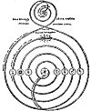
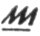
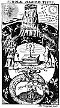

  
[Intangible Textual Heritage](../../index)  [Esoteric](../index.md) 
[Index](index)  [Previous](sta37)  [Next](sta39.md) 

------------------------------------------------------------------------

p. 157

# The Theory and Practice of Alchemy

## Part Two

All true Philosophers of the natural or Hermetic sciences begin their
labors with a prayer to the Supreme Alchemist of the Universe,
beseeching His assistance in the consummation of the Magnum Opus. The
prayer that follows, written in a provincial German centuries ago by an
adept now unknown, is representative: "O holy and hallowed Trinity, Thou
undivided and triple Unity! Cause me to sink into the abyss of Thy
limitless eternal Fire, for only in that Fire can the mortal nature of
man be changed into humble dust, while the new body of the salt union
lies in the light. Oh, melt me and transmute me in this Thy holy Fire,
so that on the day at Thy command the fiery waters of the Holy Spirit
draw me out from the dark dust, giving me new birth and making me alive
with His breath. May I also be exalted through the humble humility of
Thy Son, rising through His assistance out of the dust and ashes and
changing into a pure spiritual body of rainbow colors like unto the
transparent, crystal-like, paradisiacal gold, that my own nature may be
redeemed and purified like the elements before me in these glasses and
bottles. Diffuse me in the waters of life as though I were in the wine
cellar of the eternal Solomon. Here the fire of Thy love will receive
new fuel and will blaze forth so that no streams can extinguish it.
Through the aid of this divine fire, may I in the end be found worthy to
be called into the illumination of the righteous. May I then be sealed
up with the light of the new world that I may also attain unto the
immortality and glory where there shall be no more alternation of light
and darkness. Amen."

### THE ORIGIN OF ALCHEMICAL FORMULÆ

Apparently but few of the mediæval alchemists discovered the Great
Arcanum without aid, some authors declaring that none of them attained
the desired end without the assistance of a Master or Teacher. In every
instance the identity of these Masters has been carefully concealed, and
even during the Middle Ages speculation ran rife concerning them. It was
customary to call such illuminated sages adepts, a title which indicated
that they possessed the true secrets of transmutation and
multiplication. These adepts were polyonymous individuals who
unexpectedly appeared and disappeared again, leaving no trace of their
whereabouts. There are indications that a certain degree of organization
existed among them. The most powerful of the alchemical organizations
were the Rosicrucians, the Illuminati, and certain Arabian and Syrian
sects.

I n the documents which follow, references are made to the "Brethren "or
"Brothers. " These are to signify that those who had actually
accomplished the *Magnum Opus* were banded together and known to each
other by cipher codes and secret signs or symbols. Apparently a number
of these illuminated adepts dwelt in Arabia, for several of the great
European alchemists were initiated in Asia Minor. When a disciple of the
alchemical arts had learned the supreme secret, he guarded it jealously,
revealing to no man his priceless treasure. He was not permitted to
disclose it even to the members of his immediate family.

As the years passed, one who had discovered the secret--or, more
properly, one to whom it had been revealed--sought for some younger man
worthy to be entrusted with the formulæ. To this one, and to this one
only, as a rule, the philosopher was permitted to disclose the arcanum.
The younger man then became the "philosophical son" of the old sage, and
to him the latter bequeathed his secrets. Occasionally, however, an
adept, on finding a sincere and earnest seeker, would instruct him in
the fundamental principles of the art, and if the disciple persisted, he
was quietly initiated into the august fraternity of the Brethren. In
such manner the alchemical processes were preserved, but the number of
those who knew them did not increase rapidly.

During the sixteenth, seventeenth, and eighteenth centuries a
considerable number of alchemical adepts made their way from place to
place throughout Europe, appearing and disappearing apparently at will.
According to popular tradition, these adepts were immortal, and kept
themselves alive by means of the mysterious medicine that was one of the
goals of alchemical aspiration. It is asserted that some lived hundreds
of years, taking no food except this elixir, a few drops of which would
preserve their youth for a long period of time. That such mysterious men
did exist there can be little doubt, as their presence is attested by
scores of reliable witnesses.

It is further asserted that they are still to be found by those who have
qualified themselves to contact them. The philosophers taught that like
attracts like, and that when the disciple has developed a virtue and
integrity acceptable to the adepts they will appear to him and reveal
those parts of the secret processes which cannot be discovered without
such help. "Wisdom is as a flower from which the bee its honey makes and
the spider poison, each according to its own nature." (By an unknown
adept.)

The reader must bear in mind at all times that the formulæ and emblems
of alchemy are to be taken primarily as allegorical symbols; for until
their esoteric significance has been comprehended, their literal
interpretation is valueless. Nearly every alchemical formula has one
element purposely omitted, it being decided by the mediæval philosophers
that those who could not with their own intelligence discover that
missing substance or process were not qualified to be entrusted with
secrets which could give them control over great masses of humanity and
likewise subject to their will the elemental forces of Nature.

### THE EMERALD TABLE OF HERMES

The oldest and most revered of all the alchemical formulæ is the sacred
Emerald Tablet of Hermes. Authorities do not agree as to the genuineness
of this Table, some declaring it to be a post-Christian fraud, but there
is much evidence that, regardless of its author, the Table is of great
antiquity. While the symbol of the Emerald Table is of special Masonic
import--relating as it does to the personality of *CHiram* (Hiram)--it
is first and fundamentally an alchemical formula, relating both to the
alchemy of the base metals and the divine alchemy of human regeneration.

In Dr. Sigismund Bacstrom's collection of alchemical manuscripts is a
section devoted to the translations and interpretations of this
remarkable Tablet, which was known to the ancients as the *Tabula
Smaragdina*. Dr. Bacstrom was initiated into the Brotherhood of the Rose
Cross on the island of Mauritius by one of those unknown adepts who at
that time called himself *Comte de Chazal*. Dr. Bacstrom's translations
and notes on the Emerald Tablet are, in part, as follows, the actual
text being reproduced in capital letters:

"*The Emerald Table, the Most Ancient Monument of the Chaldeans
concerning the Lapis Philosophorum* (the stone of the philosophers).

"The Emerald Table furnishes the origin of the allegorical history of
King *Hiram* (rather *Chiram*). The Chaldeans, Egyptians, and Hebrews in
what concerns *Chiram* have taken their knowledge from one and the same
fountain; *Homerus*, who relates this history in a different manner,
followed that original, and Virgil followed

[  
Click to enlarge](img/15700.jpg.md)  
THE KEY TO ALCHEMY ACCORDING TO THE EGYPTIANS.  

From Kircher's *Œdipus Ægyptiacus*.

The priests of Egypt not only used the scarab as a symbol of
regeneration but also discovered in its habits many analogies to the
secret process whereby base metals could be transmuted into gold. They
saw in the egg of the scarab the seed of the metals, and the above
figure shows the path of this seed through the various planetary bodies
until, finally reaching the center, it is perfected and then returns
again to its source. The words in the mall spiral at the top read: "The
spiral Progress of the mundane spirit." After the scarab has wound its
way around the spiral to the center of the lower part of the figure, it
returns to the upper world along the path bearing the words: "Return of
the spirit to the center of unity."

p. 158

\[paragraph continues\] *Homerus*, as *Hesiodus* took the subject for
his Theogony likewise from thence, which *Ovidius* took afterwards for a
pattern for his Metamorphosis. The knowledge of Nature's secret
operations constitutes the principal sense of all these ancient
writings, but ignorance framed out of it that external or veiled
mythology and the lower class of people turned it into idolatry.

"*The Genuine Translation from the Original Very Ancient Chaldee is as
Follows*:

"THE SECRET WORKS OF *CHIRAM ONE* IN ESSENCE, BUT THREE IN ASPECT.

"(The two first large words mean *the Secret Work*.)

"(The second line in large letters, reads: Chiram Telat Machasot, i.e.
*Chiram the Universal Agent, One in Essence but three in aspect*.)

'IT IS TRUE, NO LIE, CERTAIN, AND TO BE DEPENDED UPON, THE SUPERIOR
AGREES WITH THE INFERIOR, AND THE INFERIOR WITH THE SUPERIOR, TO EFFECT
THAT ONE TRULY WONDERFUL WORK. AS ALL THINGS OWE THEIR EXISTENCE TO THE
WILL OF THE *ONLY ONE*, SO ALL THINGS OWE THEIR ORIGIN TO THE *ONE ONLY
THING*, THE MOST HIDDEN, BY THE ARRANGEMENT OF *THE ONLY GOD*. THE
FATHER OF THAT *ONE ONLY THING* IS *THE SUN*, ITS MOTHER IS *THE MOON*,
THE WIND CARRIES IT IN ITS BELLY; BUT ITS NOURSE IS *A SPIRITUOUS
EARTH*. THAT *ONE ONLY THING* (after God) IS THE FATHER OF ALL THINGS IN
THE UNIVERSE. ITS POWER IS PERFECT, AFTER IT HAS BEEN UNITED TO A
SPIRITUOUS EARTH.

"(Process--First Distillation.) SEPARATE THAT SPIRITUOUS EARTH FROM THE
DENSE OR CRUDE BY MEANS OF A GENTLE HEAT, WITH MUCH ATTENTION.

"(Last Digestion.) IN GREAT MEASURE IT ASCENDS *FROM THE EARTH* UP TO
HEAVEN, AND DESCENDS AGAIN, NEWBORN, ON THE EARTH, AND THE SUPERIOR AND
THE INFERIOR ARE INCREASED IN POWER. The Azoth ascends from the Earth,
from the bottom of the Glass, and redescends in Veins and drops into the
Earth and by this continual circulation the Azoth is more and more
subtilized, *Volatilizes Sol* and carries the volatilized Solar atoms
along with it and thereby becomes a *Solar Azoth*, i.e. *our third, and
genuine Sophic Mercury*, and this circulation of the Solar Azoth must
continue until it ceases of itself, and the Earth has sucked it all in,
when it muse become the black pitchy matter, the *Toad* \[the substances
in the alchemical retort and also the lower elements in the body of
man\], which denotes complete putrefaction or *Death of the Compound*.

"BY THIS THOU WILT PARTAKE OF THE HONOURS OF THE WHOLE WORLD. Without
doubt as the black, pitchy matter will and must of necessity become
*White* and *Red*, and the Red having been carried to perfection,
*medicinally* and for Metals, is then fully capable to preserve *mentem
sanam in corpore sano* until the natural period of Life and promise us
ample means, in infinitum multipliable, to be benevolent and charitable
without any diminution of our inexhaustible resources, therefore well
may it be called *the Glory* \[Honours\] *of the Whole World*, as truly
the study and contemplation of the L. P. \[*Lapis Philosophorum*\],
harmonising with Divine Truths, elevates the mind to God our Creator and
merciful Father, and if He should permit us to possess it practically
must eradicate the very principle of Avarice, Envy, and Evil
Inclinations, and cause our hearts to melt in gratitude toward Him that
has been so kind to us! Therefore the Philosophers say with great Truth,
that the L. P. either finds a good man or makes one.

"AND DARKNESS WILL FLY FROM THEE. By invigorating the Organs the Soul
makes use of for communicating with exterior objects, the Soul must
acquire greater powers not only for conception but also for retention,
and therefore if we wish to obtain still more knowledge, the organs and
secret springs of physical life being wonderfully strengthened and
invigorated, the Soul must acquire new powers for conceiving and
retaining, especially if we pray to God for knowledge, and confirm our
prayers by faith, all Obscurity must vanish of course. That this has not
been the case with all possessors, was their own fault, as they
contented themselves merely with the Transmutation of Metals.

"(Use.) THIS IS THE STRENGTH OF ALL POWERS. This is a very strong
figure, to indicate that the L. P. positively does possess all the
Powers concealed in Nature, not for destruction but for exaltation and
regeneration of matter, in the three Departments of Nature.

"WITH THIS THOU WILT BE ABLE TO OVERCOME ALL THINGS, AND TO TRANSMUTE
ALL *WHAT IS FINE* (☉☽) AND WHAT IS *COARSE* (♃♄ ♀ ♂ ☿  ). It will conquer every subtil
Thing, of course, as it refixes the most subtil Oxygen into its own
*fiery Nature* and that with more power, penetration and virtue, in a
tenfold ratio, at every multiplication, and each time in a much shorter
period, until its power becomes incalculable, which multiplied power
also penetrates \[overcomes\] every *Solid Thing*, such as
*unconquerable Gold and Silver*, the otherwise *unalterable Mercury*,
Crystals and Glass Fluxes, to which it is able to give natural hardness
and fixity, as *Philaletha* does attest, and is proved by an artificial
Diamond, in my father's time, in possession of *Prince Lichtenstein in
Vienna*, valued at Five Hundred Thousand Ducats, fixed by the Lapis
\[Philosopher's Stone\].

"IN THIS MANNER THE WORLD WAS CREATED; THE ARRANGEMENTS TO FOLLOW THIS
ROAD ARE HIDDEN. FOR THIS REASON I AM CALLED *CHIRAM TELAT MECHASOT*,
*ONE IN ESSENCE*, BUT *THREE IN ASPECT*. IN THIS TRINITY IS HIDDEN THE
WISDOM OF THE WHOLE WORLD (i.e., in *Chiram* and *its Use*). It is
thought that *Hermes* was *Moses* or *Zoroaster*, otherwise Hermes
signifies a *Serpent*, and the Serpent used to be *an Emblem of
Knowledge or Wisdom*. The *Serpent* is met with everywhere amongst the
Hieroglyphics of the ancient Egyptians, so is *the Globe with Wings*,
*the Sun* and *Moon*, *Dragons* and *Griffins*, whereby the Egyptians
denoted their sublime knowledge of the Lapis Philosophorum, according to
Suidas, the hints in the Scriptures, and even *De Non* where he speaks
of the sanctuaries of the ancient Egyptian Temples.

"IT IS ENDED NOW, WHAT I HAVE SAID CONCERNING THE EFFECTS OF THE SUN.
FINISH OF THE TABULA SMARAGDINA. What I have said or taught of *the
Solar Work*, is now finished. The *perfect Seed*, fit for
multiplication.

"This I know is acknowledged to be the genuine *Tabula Smaragdina
Hermetis*."

A LETTER FROM THE  
BROTHERS OF R. C. (ROSE CROSS)

Although Eugenius Philalethes disclaimed membership in the Rosicrucian
Fraternity, it is believed that for a number of years he was the head of
that Order. In a little work called *Lumen de Lumine, or A New Magical
Light Discovered and Communicated to the World*, published in London in
1651, Eugenius Philalethes gives a remarkable letter, presumably from
the Rosicrucian Order. Accompanying the letter is an emblematic figure
setting forth in symbolic form the processes and formulæ of the
Philosopher's Stone. This epistle is an excellent example of the
Rosicrucian system of combining abstract theological speculations with
concrete chemical formulæ. With the aid of the material contained in
various parts of this present book the student would do well to set
himself the task of solving the riddle contained in this hieroglyph.

"*A Letter from the Brothers of R. C. Concerning the Invisible, Magical
Mountain, And the Treasure therein Contained*.

"Every man naturally desires a superiority, to have treasures of Gold
and Silver \[intellect and soul\], and to seem great in the eyes of the
world. God indeed created all things for the use of man, that he might
rule over them, and acknowledge therein the singular goodness and
omnipotence of God, give Him thanks for His benefits, honor Him and
praise Him. But there is no man looks after these things, otherwise than
by spending his days idly; they would enjoy them without any previous
labor and danger; neither do they look them out of that place where God
hath treasured them up, Who expects also that man should seek for them
there, and to those that seek will He give them. But there is not any
that labors for a possession in that place, and therefore these riches
are not found: For the way to this place, and the place itself hath been
unknown for a long time, and it is hidden from the greatest part of the
world. But notwithstanding it be difficult and laborious to find Out
this way and place, yet the place should be sought after.

"But it is not the will of God to conceal anything from those that are
His, and therefore in this last age, before the final judgment comes,
all these things shall be manifested to those that are worthy: As He
Himself (though obscurely, lest it should be manifested to, the
unworthy) hath spoken in a certain place: There is nothing covered that
shall not be revealed, and hidden that shall not be known. We therefore
being moved by the Spirit of God, do declare the will of God to the
world, which we have also already performed and published in several
languages. But most men either revile, or contemne that, our Manifesto,
(the *Fama* and *Confessio Fraternitatis*) or else waiving the Spirit of
God, they expect the proposals thereof from us, supposing we will
straightway teach them how to make gold by Art, or furnish them with
ample treasures, whereby they may live pompously in the face of the
world, swagger, and make wars, turn usurers, gluttons, and drunkards,
live unchastely, and defile their whole life With several other sins,
all which things are contrary to the blessed will of God. These men
should have learnt from those Ten Virgins (whereof five that were
foolish demanded oil for their lamps, from those five that were wise)
how that the case is much otherwise.

p. 159

"It is expedient that every man should labor for this treasure by the
assistance of God, and his own particular search and industry. But the
perverse intentions of these fellows we understand out of their own
writings, by the singular grace and revelation of God. We do stop our
ears, and wrap ourselves as it were in clouds, to avoid the bellowings
and howlings of those men, who in vain cry out for gold. And hence
indeed it comes to pass that they brand us with infinite calumnies and
slanders, which notwithstanding we do not resent but God in His good
time will judge them for it. But after that we had well known (though
unknown to you) and perceived also by your writing how diligently you
are to peruse the Holy Scripture, and seek the true knowledge of God: we
have also above many thousands, thought you worthy of some answer, and
we signify this much to you by the will of God and the admonition of the
Holy Ghost.

"There is a mountain situated in the midst of the earth, or center of
the world, which is both small and great. It is soft, also above measure
hard and stony. It is far off, and near at hand, but by the providence
of God, invisible. In it are hidden most ample treasures, which the
world is not able to value. This mountain by envy of the devil, who
always opposeth the glory of God and the happiness of man, is compassed
about with very cruel beasts and other \[sic\] ravenous birds, which
make the way thither both difficult and dangerous; and therefore
hitherto, because the time is not yet come, the way thither could not be
sought after nor found out. But now at last the way is to be found by
those that are worthy, but notwithstanding by every man's self-labor and
endeavors.

"To this mountain you shall go in a certain night (when it: comes) most
long and most dark, and see that you prepare yourselves by prayer.
Insist upon the way that: leads to the mountain, but ask not of any man
where the way lies: only follow your Guide, who will offer himself to
you, and will meet you in the way but you shall not know him. This Guide
will bring you to the mountain at midnight, when all things are silent
and dark. It is necessary that you arm yourselves with a resolute heroic
courage, lest you fear those things that will happen, and so fall back.
You need no sword, nor any other bodily weapons, only call upon God
sincerely and heartily.

"When you have discovered the mountain, the first miracle that will
appear is this. A most vehement and very great wind, that will shake the
mountain and shatter the rocks to pieces. You shall be encountered also
by lions and dragons and other terrible beasts, but fear not any of
these things. Be resolute and rake heed that you return not, for your
Guide who brought you thither will not suffer any evil to befall you. As
for the treasure, it is not yet discovered but it is very near. After
this wind will come an earthquake, that will overthrow those things
which the wind hath left and make all flat. But be sure that you fall
not off.

"The earthquake being past, there shall follow afire, that will consume
the earthly rubbish, and discover the treasure, but as yet you cannot
see it. After all these things and near the daybreak there shall be a
great calm, and you shall see the Day-Star arise and the dawning will
appear, and you shall perceive a great treasure. The chiefest thing in
it, and the most perfect, is a certain exalted tincture, with which the
world (if it served God and were worthy of such gifts) might be tinged
and turned into most pure gold.

"This tincture being used, as your Guide shall reach you, will make you
young when you are old, and you shall perceive no disease in any part of
your bodies. By means of this tincture also you shall find pearls of
that excellency which cannot be imagined. But do not you arrogate
anything to yourselves because of your present power, but be contented
with that which your Guide shall communicate to you. Praise God
perpetually for this His gift, and have a special care that you use it
not for worldly pride, but employ it in such works which are contrary to
the world. Use it rightly and enjoy it so, as if you had it not. Live a
temperate life, and beware of all sin, otherwise your Guide will forsake
you, and you shall be deprived of this happiness. For know this of a
truth, whosoever abuseth this tincture and lives not exemplarly, purely,
and devoutly before men he shall lose this benefit, and scarce any hope
will there be left ever to recover it afterwards."

If, as transcendentalists believe, the initiations into the Fraternity
of the Rose Cross were given in the invisible worlds which surround and
interpenetrate the visible universe, it is not beyond the range of
possibility that this allegory is to be considered in the light of an
initiatory ritual as well as an alchemical formula.

As has been noted, it is difficult to secure a complete formula for any
of the alchemical operations. The one presented here is the most nearly
complete of any available. The collecting of the rays and energies of
the celestial bodies as precipitated in dew is a process which
Paracelsus used with great success. Bear constantly in mind that these
processes are only for those who have been properly instructed in the
secret *art*.

"*A TRUE REVELATION OF THE MANUAL OPERATION FOR THE UNIVERSAL MEDICINE
COMMONLY CALLED 'THE PHILOSOPHER'S STONE.'* By the celebrated
philosopher of Leyden, as attested upon his deathbed with his own Blood,
Anno Domini 1662. To my Loving Cousin and Son, the True Hermetic
Philosopher--

"Dear Loving Cousin and Son:

"Although I had resolved never to give in writing to any person the
secret of the Ancient Sages, yet notwithstanding out of peculiar
affection and love to you, I have taken it upon me, to which the
nearness of our relation obliges me, and especially because this
temporal life is short, and Art is very dark and you may therefore not
attain the wished for end;--but my Son because so precious a jewel
belongs not to swine; and also this so great a gift of God may be
treated carefully and Christianlike, in consideration thereof I do so
largely declare myself to thee.

"I conjure thee with hand and mouth sacredly;

"1st. That most especially thou faithfully keep the same from all
wicked, lustful and criminal persons.

"2dly. That thou exalt not thyself in any way.

"3dly. That thou seek to advance the honor of thy Creator of all things
and the good of thy neighbor, preserve it sacredly that thy Lord may not
have cause to complain of thee at the last day. I have written here in
this treatise such a part of the Kingdom of Heaven, just as I myself
have worked this treasure and finished it with my fingers, therefore I
have subscribed all this work with my blood, lying on my deathbed in
Leyden.

"*THE PROCESS*--In the Name of God, take of the purest and cleanest
salt, sea salt, so as it is made by the sun itself, such as is brought
by shipping from Spain, (I used salt that came from St. Uber) let it be
dried in a warm stove, grind it in a stone mortar, as fine as possible
to a powder that it may be so much the easier dissolve and taken up by
our *Dew-water*, which is thus to be had in the months of May or June:
When the Moon is at the full, observe when the dew falls with an East or
South East wind. Then you must have sticks about one and a half feet
high above the ground when driven in the Earth. Upon two or three such
sticks, lay some four square plates of glass, and as the dew falls it
easily fastens on the glass like a vapour, then have glass Vessels in
readiness, let the dew drain from the sides of the glasses into your
vessels. Do this until you have enough. The full of the Moon is a good
season, afterwards it will be hard."

The solar rays descending from the sun carry with them solar
sulphur--the Divine Fire. These rays are crystallized by contact with

[  
Click to enlarge](img/15900.jpg.md)  
THE INVISIBLE MAGICAL MOUNTAIN.  

From Phililethales' *Lumen de Lumine*.

On Page 24 of *Lumen de Lumine*, Eugenius Philalethes describes the
magical mountain as follows:

"This is that emblematical magical type, which Thalia delivered to me in
the invisible Guiana. The first and superior Part of it represents the
Mountains of the Moon. The philosophers commonly call them the Mountains
of India, on whose tops grows their secret and famous Lunaria. It is an
Herb easy to be found, but \[for the fact\] that men are blind discovers
itself and shines after night like pearl. The earth of these mountains
is very red and soft beyond all expression. It is full of crystalline
rocks, which the philosophers call their glass and their stone: birds
and fish (say they) bring it to them. Of these mountains speaks Hali the
Arabian, a most excellent judicious author: 'Go, my son, to the
Mountains of India, and to their quarries or caverns, and take thence
our precious stones which dissolve or melt in water, when they are
mingled therewith. Much indeed might be spoken of these mountains, if it
were lawful to publish their mysteries, but one thing I shall not
forbear to tell you. They are very dangerous places after night, for
they are haunted with fires and other strange apparitions, (as a I am
told by the Magi) by certain spirits, which dabble lasciviously with the
sperm of the world and imprint their imaginations in, producing many
times fantastic and monstrous generations. The access and pilgrimage to
this place, with the difficulties which attend them, are faithfully and
magisterially described by the Brothers of R.C." (Set accompanying
letter.)

p. 160

the lunar rays. The solar rays are also met by the emanations pouring
upward from the earth's surface and are thus still further crystallized
into a partly tangible substance, which is soluble in pure water. This
substance is the "Magical Mountain of the Moon" referred to in the R. C.
letter. The crystallization of the solar and lunar rays in water (dew)
produces the virgin earth--a pure, invisible substance, uncontaminated
by material matter. When the virgin earth crystals are wet, they appear
green; when dry, white.

Von Welling makes a suggestion for the extraction of the solar life from
stagnant water, but is reticent both as to naming the essence extracted
and also as to the various processes through which it must pass to be
refined and increased in power. His hint, however, is both valuable and
unusual:

"Take sweet clean water and seal it in a large bottle, leaving about
one-fourth empty. Place the bottle in the sun for some weeks until it
rots, showing a precipitation in the bottom. This precipitation, when
properly manipulated by distillation, will produce a clear, fiery,
burning oil, the constituents and use of which are only known to the
wise."

The philosopher of Leyden continues: "Now when you have enough of your
dew close your glasses exactly, and keep it till you use it, that none
of its spirits may evaporate, which may easily happen. Set it therefore
in a cool place, that no warmth may come to it, or else the subtle
spirit will rise and be gone; which will not so happen if after you have
filled your glasses with Dew quite full, you close them very well with
wax.

"Now in the Name of God, take of this Dew-water as much as thou wilt,
put in a clean dissolving glass, then cast a little of your
forementioned powdered salt into it to be dissolved, and continue to put
it in till your Dew-water will dissolve no more or till the salt lies in
it four days without being dissolved, then it has enough, and unto your
Dew is given its proper powder. Of this compounded water, take as much
as thou wilt, I took about a pound and a half, and put it into a round
vial with a short neck, fill it with out water and lute it with a good
lute, a cover and stopple that fits it well, that the subtle and living
spirit of the dew may not fume away, for if they should the soul of the
salt will never be stirred up, nor the work ever brought to a right end.
Let the lute dry very well of itself, and set it in the furnace of B. M.
to putrefy. Make a slow fire and let it digest for forty days or fifty,
and that the fume of the water be continually round about it, and you
will see your matter grow black, which is a token of its putrefaction.

"As soon as you have taken it out, have your dry furnace ready. Set your
glass with the matter into an inner globe to coagulate, give it a slow
degree of fire, continue it equally for twelve or fifteen days, and your
matter will begin to coagulate and to fasten round about your glass like
a gray salt, which as soon as you see and before it be two days, slacken
the fire that it may cool leisurely. Then have in readiness your
putrefying furnace as before. Set your glass therein and give the same
degree of fire as before. Let it stand twelve days, and again you will
see the matter resolve and open as before, and open itself, but you must
every time see that the lute and your glass is not hurt. When you set
your glass in the putrefying furnace, take care that the neck of your
glass is covered with a wooden or glass stopper that fits it exactly,
that the moisture of the water may not come at it.

"When you see it black set your glass as before to coagulate and when it
begins to be of a grayish color and whitish, set it in a third time to
putrefy, and coagulate to the fifth time, until you see that your water
in its dissolution is clean, pellucid and clear, and that it appears in
its Calcination of a fine white like Snow. Then it is prepared and
becomes a Salt fixed which will melt on hot Silver plate like wax; but
before you set this your Salt out, set it again \[in\] the furnace of
putrefaction that it may dissolve of itself, then let it cool, open your
Glass and you will find your Matter lessened a third part. But instead
of your former Salt Water you will have a fine Sweet and very
penetrating Water which the Philosophers have hid under very wonderful
Names--It is the Mercury of all true Philosophers, the Water out of
which comes Gold and Silver, for they say its Father is Gold and its
Mother is Silver. Thus hast thou the strength of both these Luminaries
conjoined in this Water, most true, in its right Pondus.

"*Prescription*. 5 Drops of this Water taken inwardly strengthens the
understanding and memory, and opens to us most wonderful and sweet
things, of which no man hath heard, and of which I dare not further
write, because of the Oath I made God to the contrary. Time and the holy
use of this blessed Water will teach us, as soon as you have taken it
inwardly such influence will happen to thee as if the whole heavens and
all the stars with their powers are working in thee. All Knowledge and
secret Arts will be opened to thee as in a dream, but the most excellent
of all is, you will perfectly learn rightly to know all creatures in
their Nature, and by means thereof, the true understanding of God, the
Creator of us, Heaven and Earth, like David and Moses and all the Saints
of God, for the wisdom of our fountain of living Water will instruct
thee as it did Solomon and the Brethren of our fraternity."

In his rare treatise on *Salt, Sulphur and Mercury*, von Welling
discloses a secret: not generally revealed in alchemical writings,
namely, that the alchemists were concerned not only with the
transmutation of metals but had a complete cosmological and
philosophical system based upon the Qabbalah.

According to von Welling, the universal salt (in watery form) is a
positive cure for all the physical ailments of mankind; it is in every
living thing, but from some things it is more easily secured than from
others: especially is this true of virgin earth; it is the universal
solvent, the alkahest. The same writer also states that in the first
stages of its preparation this salt will cure any and all diseases of
the heart. The anonymous philosopher of Leyden continues:

"Would you now proceed further with our blessed Water to the
forementioned intention of preparing a Tincture for Metals, hearken my
Son--

"Take in the NAME of the Lord, of thy Paradisiacal Water, of heavenly
Water of Mercury, as much as thou wilt, put it into a glass to dissolve,
and set it in a slow heat of Ashes, that it may just feel the warmth,
then have ready well purified Gold for the Red, or Silver for the White
Elixir, for in both the Processes are the same. Let your Gold or Silver
be beaten as thin as leaf Gold, cast it by degrees into your dissolving
Glass, that contains your blessed Water, as you did in the beginning
with your Salt, and it will melt like Ice in Warm Water, and continue so
to do till your Gold or Silver lie therein four days without dissolving,
then it has received its due Pondus. Then put this dissolution as before
into a round Glass, fill it two thirds parts full, seal it hermetically
as before, let your Sigillum be well dried. Set it in the furnace of
Balneum Vapori, make a fire and let it remain forty days, as before,
then will the Gold or Silver be dissolved radically and will turn of the
deepest black in the world, which as soon as you see, have your other
drying furnace in readiness."

Continuing: "Philosophers say there is no true solution of the body
without a proceeding coagulation of the spirit, for they are
interchangeably mixed in a due proportion, whereby the bodily essence
becomes of a spiritual penetrating nature. On the other hand, the
incomprehensible spiritual essential virtue is also made corporeal by
the fire, because there is made between them so near a relation or
friendship, like as the heavens operate to the very Depth of Earth, and
producing from thence all the treasures and riches of the whole World.

"*Admirandum Naturæ Operationem in Archidoxes Cognitam*.

"*With this Powder*--You may as follows project on metals. Take five
parts of fine Gold or Silver according as you work, and melt it in a
Crucible. Wrap up your Medicine in Wax, cast it therein, give a strong
fire for an hour, then take the Crucible out, as it were, calcined, then
cast one part on ten parts of imperfect metals, be it what it will, and
the same will be immediately changed into purer Metal, than what is
brought out of the Mines and produced by Melting; and when you augment
it in strength and virtue by resolving and coagulating, the fifth time
it will resolve itself in three days and be coagulated in twenty-four
hours time, to an incredible and most highly pellucid Stone or Red
Shining burning Coal. For the white work it will become like a white
stream of Lightning.

"Of this last coagulation take one part, cast it upon five thousand of
melted Gold or Silver as before. It changes the same into perfect
Medicine, one part whereof will tinge one hundred thousand parts of
melted imperfect Metals into the very finest Gold or Silver. So far I
have brought and further I would not come, for as I would set in the
matter \[to distill\] six times in twelve hours, it subtilized so highly
that the most part (like somewhat most wonderful to behold) past through
the Glass causing an inexpressible odoriferous Smell. Take heed that it
happens not to you.

"Many more wonders of this holy Art might be added, namely how to
prepare therewith all sorts of precious Stones, and other most admirable
things, but it would require too great a book to express the whole as it
ought to be, especially as the Art is endless and not to be apprehended
with one view, and my purpose has been, Loving Cousin and Son, devoutly
to lead thee into the Mysteries of Nature and this holy Science, and I
have faithfully performed it."

In conclusion, the letter states: "Go thou to work as I have done before
thee, fear God, Love thy neighbour from the bottom of thy Soul
sincerely. So will in the Manual operation, everything to thee, and when
thou art at work therein many of our brethren will reveal themselves to
thee, of our holy order, privately; For I have on my part by the Eternal
God wrote the truth which I found out by prayer and searching into
Nature, which work I have seen with my eyes, and with my hands
extracted. Therefore also I have subscribed this Testament with my own
blood, the last day of my Life on my deathbed. Actum Leyden, 27 March
1662."

------------------------------------------------------------------------

[Next: The Hermetic And Alchemical Figures of Claudius De Dominico
Celentano Vallis Novi](sta39.md)
