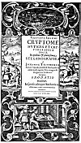
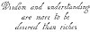
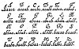
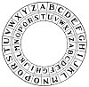
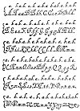
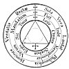
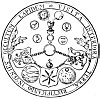
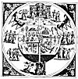
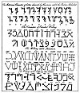

  
[Intangible Textual Heritage](../../index)  [Esoteric](../index) 
[Index](index)  [Previous](sta41)  [Next](sta43) 

------------------------------------------------------------------------

p. 169

# The Cryptogram as a factor in Symbolic Philosophy

NO treatise which deals with symbolism would be complete without a
section devoted to the consideration of cryptograms. The use of ciphers
has long been recognized as indispensable in military and diplomatic
circles, but the modern world has overlooked the important rôle played
by cryptography in literature and philosophy. If the art of deciphering
cryptograms could be made popular, it would result in the discovery of
much hitherto unsuspected wisdom possessed by both ancient and mediæval
philosophers. It would prove that many apparently verbose and rambling
authors were wordy for the sake of concealing words. Ciphers are hidden
in the most subtle manner: they may be concealed in the watermark of the
paper upon which a book is printed; they may be bound into the covers of
ancient books; they may be hidden under imperfect pagination; they may
be extracted from the first letters of words or the first words of
sentences; they may be artfully concealed in mathematical equations or
in apparently unintelligible characters; they may be extracted from the
jargon of clowns or revealed by heat as having been written in
sympathetic ink; they may be word ciphers, letter ciphers, or apparently
ambiguous statements whose meaning could be understood only by repeated
careful readings; they may he discovered in the elaborately illuminated
initial letters of early books or they may be revealed by a process of
counting words or letters. If those interested in Freemasonic research
would give serious consideration to this subject, they might find in
books and manuscripts of the sixteenth and seventeenth centuries the
information necessary to bridge the gap in Masonic history that now
exists between the Mysteries of the ancient world and the Craft Masonry
of the last three centuries.

The arcana of the ancient Mysteries were never revealed to the profane
except through the media of symbols. Symbolism fulfilled the dual office
of concealing the sacred truths from the uninitiated and revealing them
to those qualified to understand the symbols. Forms are the symbols of
formless divine principles; symbolism is the language of Nature. With
reverence the wise pierce the veil and with clearer vision contemplate
the reality; but the ignorant, unable to distinguish between the false
and the true, behold a universe of symbols. It may well be said of
Nature--the Great Mother--that she is ever tracing strange characters
upon the surface of things, but only to her eldest and wisest sons as a
reward for their faith and devotion does she reveal the cryptic alphabet
which is the key to the import of these tracings.

The temples of the ancient Mysteries evolved their own sacred languages,
known only to their initiates and never spoken save in the sanctuary.
The illumined priests considered it sacrilege to discuss the sacred
truths of the higher worlds or the divine verities of eternal Nature in
the same tongue as that used by the vulgar for wrangling and dissension.
A sacred science must needs be couched in a sacred language. Secret
alphabets also were invented, and whenever the secrets of the wise were
committed to writing, characters meaningless to the uninformed were
employed. Such forms of writing were called sacred or Hermetic
alphabets. Some--such as the famous *angelic writing*--are still
retained in the higher degrees of Masonry.

Secret alphabets were not entirely satisfactory, however, for although
they rendered unintelligible the true nature of the writings, their very
presence disclosed the fact of concealed information--which the priests
also sought to conceal. Through patience or persecution, the keys to
these alphabets were eventually acquired and the contents of the
documents revealed to the unworthy. This [necessitated](errata.htm#13)
employment of more subtle methods for concealing the divine truths. The
result was the appearance of cryptic systems of writing designed to
conceal the presence of both the message and the cryptogram. Having thus
devised a method of transmitting their secrets to posterity, the
illuminati encouraged the circulation of certain documents specially
prepared through incorporating into them ciphers containing the deepest
secrets of mysticism and philosophy. Thus mediæval philosophers
disseminated their theories throughout Europe without evoking suspicion,
since volumes containing these cryptograms could be subjected to the
closest scrutiny without revealing the presence of the hidden message.

During the Middle Ages scores of writers--members of secret political or
religious organizations--published books containing ciphers. Secret
writing became a fad; every European court had its own diplomatic
cipher, and the intelligentsia vied with one another in devising curious
and complicated cryptograms. The literature of the fifteenth, sixteenth,
and seventeenth centuries is permeated with ciphers, few of which have
ever been decoded. Many of the magnificent scientific and philosophic
intellects of this period dared not publish their findings, because of
the religious intolerance of their day. In order to preserve the
fruitage of their intellectual labors for mankind, these pioneers of
progress concealed their discoveries in ciphers, trusting that future
generations, more kindly than their own, would discover and appreciate
their learning.

Many churchmen, it is interesting to note, used cryptograms, fearing
excommunication or a worse fate should their scientific researches be
suspected. Only recently an intricate cipher of Roger Bacon's has been
unraveled, revealing the fact that this early scientist was well versed
in the cellular theory. Lecturing before the American Philosophical
Society, Dr. William Romaine Newbold,

[  
Click to enlarge](img/16900.jpg)  
A FAMOUS CRYPTIC TITLE PAGE.  

From Selenus' *Cryptomenytices et Cryptographiæ*.

One year after the publication of the first Great "Shakespearian" Folio,
a remarkable volume on cryptogram, and ciphers was published. The title
page of the work is reproduced above. The year of its publication (1624)
was during the Rosicrucian controversy. The translation of the title
page is as follows:

"The Cryptomenysis and Cryptography of Gustavus Selenus in nine books,
to which is added a clear explanation of the System of Steganography of
John Trithemius, Abbot of Spanheim and Herbipolis, a man of admirable
genius. Interspersed with worthy inventions of the Author and others,
1624." The author of this volume was believed to be Augustus, Duke of
Brunswick. The symbols and emblems ornamenting the title page, however,
are conclusive evidence that the fine hand of the Rosicrucians was
behind its publication. At the bottom of the picture is a nobleman
(Bacon?) placing his hat on another man's head. In the oval at the top
of the plate, it is possible that the lights are beacons, or a play upon
the name Bacon. In the two side panels are striking and subtle
"Shakespearian" allusions. On the left is a nobleman (possibly Bacon)
handing a paper to another man of mean appearance who carries in his
hand a spear. At the right, the man who previously carried the spear is
shown in the costume of an actor, wearing spurs and blowing a horn. The
allusion to the actor blowing his horn and the figure carrying the spear
suggest much, especially as spear is the last syllable of the name
"*Shakespeare*."

p. 170

who translated the cipher manuscript of the friar, declared: "There are
drawings which so accurately portray the actual appearance of certain
objects that it is difficult to resist the inference that Bacon had seen
them with the microscope. \* \* \* These are spermatozoa, the body cells
and the seminiferous tubes, the ova, with their nuclei distinctly
indicated. There are nine large drawings, of which one at least bears
considerable resemblance to a certain stage of development of a
fertilized cell." (See *Review of Reviews*, July, 1921.) Had Roger Bacon
failed to conceal this discovery under a complicated cipher, he would
have been persecuted as a heretic and would probably have met the fate
of other early liberal thinkers. In spite of the rapid progress made by
science in the last two hundred and fifty years, it still remains
ignorant concerning many of the original discoveries made by mediæval
investigators. The only record of these important findings is that
contained in the cryptograms of the volumes which they published. While
many authors have written on the subject of cryptography, the books most
valuable to students of philosophy and religion are: *Polygraphia* and
*Steganographia*, by Trithemius, Abbot of Spanheim; *Mercury, or The
Secret and Swift Messenger*, by John Wilkins, Bishop of Chester; *Œdipus
Ægyptiacus* and other works by Athanasius Kircher, Society of Jesus; and
*Cryptomenytices et Cryptographiæ*, by Gustavus Selenus.

To illustrate the basic differences in their construction and use, the
various forms of ciphers are here grouped under seven general headings:

1\. The *literal* cipher. The most famous of all literal cryptograms is
the famous biliteral cipher described by Sir Francis Bacon in his *De
Augmentis Scientiarum*. Lord Bacon originated the system while still a
young man residing in Paris. The biliteral cipher requires the use of
two styles of type, one an ordinary face and the other specially cut.
The differences between the two fonts are in many case so minute that it
requires a powerful magnifying glass to detect them. Originally, the
cipher messages were concealed only in the italicized words, sentences,
or paragraphs, because the italic letters, being more ornate than the
Roman letters, offered greater opportunity for concealing the slight but
necessary variations. Sometimes the letters vary a trifle in size; at
other times in thickness or in their ornamental flourishes. Later, Lord
Bacon is believed to have had two Roman alphabets specially prepared in
which the differences were so trivial that it is almost impossible for
experts to distinguish them.

A careful inspection of the first four "Shakespeare" folios discloses
the use throughout the volumes of several styles of type differing in
minute but distinguishable details. It is possible that all the
"Shakespeare" folios contain ciphers running through the text. These
ciphers may have been added to the original plays, which are much longer
in the folios than in the original quartos, full scenes having been
added in some instances.

The biliteral cipher was not confined to the writings of Bacon and
"Shakespeare," however, but appears in many books published during Lord
Bacon's lifetime and for nearly a century after his b death. In
referring to the biliteral cipher, Lord Bacon terms it *omnia per
omnia*. The cipher may run through an entire book and be placed therein
at the time of printing without the knowledge of the original author,
for it does not necessitate the changing of either words or punctuation.
It is possible that this cipher was inserted for political purposes into
many documents and volumes published during the seventeenth century. It
is well known that ciphers were used for the same reason as early as the
Council of Nicæa.

The Baconian biliteral cipher is difficult to use today, owing to the
present exact standardization of type and the fact that so few books are
now hand set. Accompanying this chapter are facsimiles of Lord Bacon's
biliteral alphabet as it appeared in the 1640 English translation of *De
Augmentis Scientiarum*. There are four alphabets, two for the capital
and two for the small letters. Consider carefully the differences
between these four and note that each alphabet has the power of either
the letter *a* or the letter *b*, and that when reading a word its
letters are divisible into one of two groups: those which correspond to
the letter *a* and those which correspond to the letter *b*. In order to
employ the biliteral cipher, a document must contain five times as many
letters as there are in the cipher message to be concealed, for it
requires five letters to conceal one. The biliteral cipher somewhat
resembles a telegraph code in which letters are changed into dots and
dashes; according to the biliteral system, however, the dots and dashes
are represented respectively by *a*'s and *b*'s. The word *biliteral* is
derived from the fact that all letters of the alphabet may be reduced to
either *a* or *b*. An example of biliteral writing is shown in one of
the accompanying diagrams. In order to demonstrate the working of this
cipher, the message concealed within the words "Wisdom and understanding
are more to be desired than riches" will now be deciphered.

The first step is to discover \[he letters of each alphabet and replace
them by their equivalent *a* or *b* in accordance with the key given by
Lord Bacon in his biliteral alphabet (q.v.). In the word *wisdom*, the
*W* is from the b alphabet; therefore it is replaced by a *b*. The *i*
is from the *a* alphabet; therefore an *a* is put in its place. The *s*
is also from the *a* alphabet, but the *d* belongs to the *b* alphabet.
The *o* and the *m* both belong to the *a* alphabet is replaced by *a*.
By this process the word WISDOM become *baabaa*. Treating the remaining
words of the sentence in a similar manner, AND becomes *aba*;
UNDERSTANDING, *aaabaaaaaabab*; ARE, *aba*; MORE, *abbb*; TO, *ab*; BE,
*ab*; DESIRED, *abaabaa*; THAN, *aaba*; RICHES, *aaaaaa*.

The next step is to run all the letters together; thus:
*baabaaabaaaabaaaaaabababaabbbabababaabaaaabaaaaaaa*. All the
combinations used in the Baconian biliteral cipher consist of groups
containing five letters each. Therefore the solid line of letters must
be broken into groups of five in the following manner: *baaba
aabaa aabaa aaaab ababa abbba babab aabaa aabaa aaaaa*. Each of these
groups of five letters now represents one letter of the cipher, and the
actual letter can now be determined by comparing the groups with the
alphabetical table, The Key to the Biliteral Cipher, from De Augmentis
Scientiarum (*q.v.*): *baaba* = T, *aabaa* = E, *aabaa* = E; *aaaab* =
B; *ababa* = L; *abbba* = P; *babab* = X; *aabaa* = E, *aabaa* = E;
*aaaaa* = A; but the last five letters of the word *riches* being set
off by a period from the initial *r*, the last five *a*'s do not count
in the cipher. The letters thus extracted are now brought together in
order, resulting in TEEBLPXEE.

At this point the inquirer might reasonably expect the letters to make
intelligible words; but he will very likely be disappointed, for, as in
the case above, the letters thus extracted are themselves a cryptogram,
doubly involved to discourage those who might have a casual acquaintance
with the biliteral system. The next step is to apply the nine letters to
what is commonly called a wheel (or disc) cipher (q.v.), which consists
of two alphabets, one revolving around the other in such a manner that
numerous transpositions of letters are possible. In the accompanying cut
the A of the inner alphabet

[  
Click to enlarge](img/17000.jpg)  
AN EXAMPLE OF BILITERAL WRITING.  

In the above sentence note carefully the formation of the letters.
Compare each letter with the two types of letters in the biliteral
alphabet table reproduced from Lord Bacon's De Augmentis Scientiarum. A
comparison of the "d" in "wisdom" with the "d" in "and" discloses a
large loop at the top of the first, while the second shows practically
no loop at all. Contrast the "i" in "wisdom" with the "i" in
"understanding." In the former, the lines are curved and in the latter
angular. A similar analysis of the two "r's" in "desired" reveals
obvious differences. The "o" in "more" differs only from the "o" in
"wisdom" in that it a tiny line continues from the top over towards the
"r." The "a" in "than" is thinner and more angular than the "a" in
"are," while the "r" in "riches" differs from that in "desired" in that
the final upright stroke terminates in a ball instead of a sharp point.
These minor differences disclose the presence of the two alphabets
employed in writing the sentence.

[  
Click to enlarge](img/17001.jpg)  
THE KEY TO THE BILITERAL CIPHER.  

From Bacon's *De Augmentis Scientiarum*.

After the document to be deciphered has been reduced to its "a" and "b"
equivalents, it is then broken up into five-letter groups and the
message read with the aid of the above table.

[  
Click to enlarge](img/17002.jpg)  
A MODERN WHEEL, OR DISC, CIPHER.  

The above diagram shows a wheel cipher. The smaller, or inner, alphabet
moves around so that any one of its letters may be brought opposite any
me of he letters on the larger, or outer, alphabet. In some, cases the
inner alphabet is written backwards, but in the present example, both
alphabets read the same way.

[  
Click to enlarge](img/17003.jpg)  
THE BILITERAL ALPHABET.  

From Bacon's *De Augmentis Scientiarum*.

This Plate is reproduced from Bacon's *De Augmentis Scientiarum*, and
shows the two alphabets as designed by him for the purpose of his
cipher. Each capital and small letter has two distinct forms which are
designated "a" and "b". The biliteral system did not in every instance
make use of two alphabets in which the differences were as perceptible
as in the example here given, but the two alphabets were always used;
sometimes variations are so minute that it requires a powerful
magnifying glass to distinguish the difference between the "a" and "b"
types of letters.

p. 171

is opposite the H of the outer alphabet, so that for cipher purposes
these letters are interchangeable. The F and M, the P, and Y, the W and
D, in fact all the letters, may be transposed as shown by the two
circles. The nine letters extracted by the biliteral cipher may thus be
exchanged for nine others by the wheel cipher. The nine letters are
considered as being on the inner circle of the wheel and are exchanged
for the nine letters on the outer circle which are opposite the inner
letters. By this process the T becomes A; the two E's become two L's;
the B becomes I, the L becomes S; the P becomes W; the X becomes E; and
the two E's become two L's. The result is ALLISWELL, which, broken up
into words, reads: "All is well."

Of course, by moving the inner disc of the wheel cipher, many different
combinations in addition to the one given above can be made of the
letters, but this is the only one which will produce sense, and the
cryptogrammatist must keep on experimenting until he discovers a logical
and intelligible message. He may then feel reasonably sure that he has
deciphered the system. Lord Bacon involved the biliteral cipher in many
different ways. There are probably a score of different systems used in
the "Shakespeare" folio alone, some so intricate that they may forever
baffle all attempts at their decipherment. In those susceptible of
solution, sometimes the *a*'s and *b*'s have to be exchanged; at other
times the concealed message is written backwards; again only every other
letter is counted; and so on.

There are several other forms of the literal cipher in which letters are
substituted for each other by a prearranged sequence. The simplest form
is that in which two alphabets are written thus:

|     |     |     |     |     |     |     |     |     |     |     |     |     |
|-----|-----|-----|-----|-----|-----|-----|-----|-----|-----|-----|-----|-----|
| A   | B   | C   | D   | E   | F   | G   | H   | I   | K   | L   | M   | N   |
| Z   | Y   | X   | W   | U   | T   | S   | R   | Q   | P   | O   | N   | M   |
|     |     |     |     |     |     |     |     |     |     |     |     |     |
| O   | P   | Q   | R   | S   | T   | U   | W   | X   | Y   | Z   |     |     |
| L   | K   | I   | H   | G   | F   | E   | D   | C   | B   | A   |     |     |

By substituting the letters of the lower alphabet for their equivalents
in the upper one, a meaningless conglomeration results, the hidden
message being decoded by reversing the process. There is also a form of
the literal cipher in which the actual cryptogram is written in the body
of the document, but unimportant words are inserted between important
ones according to a prearranged order. The literal cipher also includes
what are called acrostic signatures--that is, words written down the
column by the use of the first letter of each line and also more
complicated acrostics in which the important letters are scattered
through entire paragraphs or chapters. The two accompanying alchemical
cryptograms illustrate another form of the literal cipher involving the
first letter of each word. Every cryptogram based upon the arrangement
or combination of the letters of the alphabet is called a literal
cipher.

2\. The *pictorial* cipher. Any picture or drawing with other than its
obvious meaning may be considered a pictorial cryptogram. Instances of
pictorial cipher are frequently found in Egyptian symbolism and early
religious art. The diagrams of alchemists and Hermetic philosophers are
invariably pictorial ciphers. In addition to the simple pictorial
cipher, there is a more technical form in which words or letters are
concealed by the number of stones in a wall, by the spread of birds'
wings in flight, by ripples on the surface of water, or by the length
and order of lines used in shading. Such cryptograms are not obvious,
and must be decoded with the aid of an arbitrary measuring scale, the
length of the lines determining the letter or word concealed. The shape
and proportion of a building, the height of a tower, the number of bars
in a window, the folds of a man's garments--even the proportions or
attitude of the human body--were used to conceal definite figures or
characters which could be exchanged for letters or words by a person
acquainted with the code.

Initial letters of names were secreted in architectural arches and
spans. A notable example of this practice is found on the title page of
Montaigue's *Essays*, third edition, where an initial B is formed by two
arches and an F by a broken arch. Pictorial cryptograms are sometimes
accompanied by the key necessary for their decipherment. A figure may
point toward the starting point of the cipher or carry in its hand some
implement disclosing the system of measurement used. There are also
frequent instances in which the cryptographer purposely distorted or
improperly clothed some figure in his drawing by placing the hat on
backwards, the sword on the wrong side, or the shield on the wrong arm,
or by employing some similar artifice. The much-discussed fifth finger
on the Pope's hand in Raphael's *Sistine Madonna* and the sixth toe on
Joseph's foot in the same artist's *Marriage of the Virgin* are
cunningly concealed cryptograms.

3\. The *acroamatic* cipher. The religious and philosophical writings of
all nations abound with acroamatic cryptograms, that is, parables and
allegories. The acroamatic is unique in that the document containing it
may be translated or reprinted without affecting the cryptogram.
Parables and allegories have been used since remote antiquity to present
moral truths in an attractive and understandable manner. The acroamatic
cryptogram is a pictorial cipher drawn in words and its symbolism must
be so interpreted. The Old and New Testaments of the Jews, the writings
of Plato and Aristotle, Homer's *Odyssey* and *Iliad*, Virgil's *Æneid*,
*The Metamorphosis* of Apuleius, and Æsop's *Fables* are outstanding
examples of acroamatic cryptography in which are concealed the deepest
and most sublime truths of ancient mystical philosophy.

The acroamatic cipher is the most subtle of all, for the parable or
allegory is susceptible of several interpretations. Bible students for
centuries have been confronted by this difficultly. They are satisfied
with the moral interpretation of the parable and forget that each
parable and allegory is capable of seven interpretations, of which the
seventh--the highest--is complete and all-inclusive, whereas the other
six (and lesser) interpretations are fragmentary, revealing but part of
the mystery. The creation myths of the world are acroamatic cryptograms,
and the deities of the various pantheons are only cryptic characters
which, if properly understood, become the constituents of a divine
alphabet. The initiated few comprehend the true nature of this alphabet,
but the uninitiated many worship the letters of it as gods.

[  
Click to enlarge](img/17100.jpg)  
AN ALCHEMICAL CRYPTOGRAM.  

From Brown's H*istory of Chemistry*.

James Campbell Brown reprints a curious cipher from Kircher. The capital
letters of the seven words in the outer circle read clockwise, form the
word SVLPHVR. From the words in the second circle, when read in a
similar manner, is derived FIXVM. The capitals of the six words in the
inner circle, when properly arranged, also read ESTSOL. The following
cipher is thus extracted: "Sulphur Fixum Est Sol," which when translated
is: "Fixed sulphur is gold."

[  
Click to enlarge](img/17101.jpg)  
AN ALCHEMICAL CRYPTOGRAM.  

From *Geheime Figuren der Rosenkreuzer*.

Beginning with the word VISITA and reading clockwise, the seven initial
letters of the seven words inscribed in the outer circle read: VITRIOL.
This is a very simple alchemical enigma, but is a reminder that those
studying works on Hermeticism, Rosicrucianism, alchemy, and Freemasonry
should always be on the lookout for concealed meanings hidden either in
Parables and allegories or in cryptic arrangements of numbers, letters,
and words.

[  
Click to enlarge](img/17102.jpg)  
A CRYPTIC DEPICTION OF DIVINE AND NATURAL JUSTICE.  

From Selenus' *Cryptomenytices et Cryptographiæ*.

The first circle portrays the divine antecedents of justice, the second
the universal scope of justice, and the third the results of human
application of justice. Hence, the first circle deals with divine
principles, the second circle with mundane affairs, and the third circle
with man. On the at the top of the picture sits Themis, the presiding
spirit of law, and at her feet three other queens--Juno, Minerva, and
Venus--their robes ornamented with geometric figures. The axis of law
connects the throne, of divine justice above with the throne of human
judgment at the bottom of the picture. Upon the latter throne is seated
a queen with a scepter in her hand, before whom stands the winged
goddess Nemesis--the angel of judgment.

The second Circle is divided into three parts by two sets of two
horizontal lines. The upper and light section is called the Supreme
Region and is the abode of the gods, the good spirits, and the heroes.
The lower and dark section is the abode of lust, sin, and ignorance.
Between these two extremes is the larger section in which are blended
the powers and impulses of both the superior and the inferior regions.

In the third or inner circle is man, a tenfold creature, consisting of
nine parts--three of spirit, three of intellect, and three of
soul--enclosed within one constitution. According to Selenus, man's
three spiritual qualities are thought, speech, and action; his three
intellectual qualities are memory, intelligence, and will; and his three
qualities of soul are understanding, courage, and desire. The third
circle is further divided into three parts called ages: the Golden Age
of spiritual truth in the upper right section, the Iron Age of spiritual
darkness in the lower right section and the Bronze Age--a composite of
the two occupying the entire left half of the inner circle and itself
divided into three parts. The lowest division of the Bronze Age depicts
ignorant man controlled by force, the central the partly awakened man
controlled by jurisprudence, and the upper the spiritually illuminated
man controlled by love. Both the second and third circles revolve upon
the axis of law, but the divine source, of law--Heavenly Justice--is
concealed by clouds. All of the symbols and figures ornamenting the
plate are devoted to a detailed amplification of the principles here
outlined.

p. 172

4\. The *numerical* cipher. Many cryptograms have been produced in which
numbers in various sequences are substituted for letters, words, or even
complete thoughts. The reading of numerical ciphers usually depends upon
the possession of specially arranged tables of correspondences. The
numerical cryptograms of the Old Testament are so complicated that only
a few scholars versed in rabbinical lore have ever sought to unravel
their mysteries. In his *Œdipus Ægyptiacus*, Athanasius Kircher
describes several Arabian Qabbalistic theorems, and a great part of the
Pythagorean mystery was concealed in a secret method in vogue among
Greek mystics of substituting letters for numbers.

The most simple numerical cipher is that in which the letters of the
alphabet are exchanged for numbers in ordinary sequence. Thus *A*
becomes 1, *B* 2, *C* 3, and so on, counting both *I* and *J* as 9 and
both *U* and *V* as 20. The word yes by this system would be written
23-5-18. This cipher can be made more difficult by reversing the
alphabet so that *Z* becomes 1, *Y* 2, *X* 3, and so on. By inserting a
non-significant, or uncounted, number after each of the significant
numbers the cipher is still more effectively concealed, thus:
23-16-5-9-18. The word *yes* is found by eliminating the second and
fourth numbers. By adding 23, 5, and 18 together the sum 46 results.
Therefore 46 is the numerical equivalent of the word *yes*. According to
the simple numerical cipher, the sum 138 is equal to the words *Note
carefully*. Therefore in a book using this method, line 138, page 138,
or paragraph 138 may contain the concealed message. In addition to this
simple numerical cipher there are scores of others so complicated that
no one without the key can hope to solve them.

Authors sometimes based their cryptograms upon the numerical value of
their own names; for example, Sir Francis Bacon repeatedly used the
cryptic number 33--the numerical equivalent of his name. Numerical
ciphers often involve the pagination of a book. Imperfect pagination,
though generally attributed to carelessness, often conceals important
secrets. The mispaginations found in the 1623 folio of "Shakespeare" and
the consistent recurrence of similar errors in various volumes printed
about the same period have occasioned considerable thought among
scholars and cryptogrammatists. In Baconian cryptograms, all page
numbers ending in 89 seem to have a special significance. The 89th page
of the *Comedies* in the 1623 folio of "Shakespeare" shows an error of
type in the pagination, the "9" being from a considerably smaller font
than the "8." The 189th page is entirely missing, there being two pages
numbered 187; and page 188 shows the second " 8 " scarcely more than
half the size of the first one. Page 289 is correctly numbered and has
no unusual features, but page 89 of the *Histories* is missing. Several
volumes published by Bacon show similar errors, page 89 being often
involved.

There are also numerical ciphers from which the cryptic message may be
extracted by counting every tenth word, every twentieth word, or every
fiftieth word. In some cases the count is irregular. The first important
word may be found by counting 100, the second by counting 90, the third
by counting 80, and so on until the count of 10 is reached. The count
then returns to 100 and the process is repeated.

5\. The *musical* cipher. John Wilkins, afterwards Bishop of Chester, in
1641 circulated an anonymous essay entitled *Mercury, or the Secret and
Swift Messenger*. In this little volume, which was largely derived from
the more voluminous treatises of Trithemius and Selenus, the author sets
forth a method whereby musicians can converse with each other by
substituting musical notes for the letters of the alphabet. Two persons
understanding the code could converse with each other by merely playing
certain notes upon a piano or other instrument. Musical cryptograms can
be involved to an inconceivable point; by certain systems it is possible
to take an already existing musical theme and conceal in it a cryptogram
without actually changing the composition in any way. The pennants upon
the notes may conceal the cipher, or the actual sounds of the notes may
be exchanged for syllables of similar sound. This latter method is
effective but its scope is somewhat limited. Several musical
compositions by Sir Francis Bacon are still in existence. An examination
of them might reveal musical cryptograms, for it is quite certain that
Lord Bacon was well acquainted with the manner of their construction.

6\. The *arbitrary* cipher. The system of exchanging letters of the
alphabet for hieroglyphic figures is too easily decoded to be popular.
Albert: Pike describes an arbitrary cipher based upon the various parts
of the Knights Templars' cross, each angle representing a letter. The
many curious alphabets that have been devised are rendered worthless,
however, by the table of recurrence. According to Edgar Allan Poe, a
great cryptogrammatist, the most common letter of the English language
is E, the other letters in their order of frequency are as follows: *A,
O, I, D, H, N, R, S, T, V, Y, C, F, Q L, M, W, B, K, P, Q, X, Z*. Other
authorities declare the table of frequency to be: *E, T, A, O, N, I, R,
S, H, D, L, C, W, U, M, F, Y, G, P, B, V, K, X, Q, J, Z*. By merely
counting the number of times each character appears in the message, the
law of recurrence discloses the English letter for which the arbitrary
character stands. Further help is also rendered by the fact that if the
cryptogram be split up into words there are only three single letters
which may form words: *A, I, O*. Thus any single character set off from
the rest of the text must be one of these three letters. For details of
this System see *The Gold Bug*, by Edgar Allan Poe.

To render more difficult the decoding of arbitrary ciphers, however, the
characters are seldom broken up into words, and, further, the table of
recurrence is partly nullified by assigning two or more different
characters to each letter, thereby making it impossible to estimate
accurately the frequency of recurrence. Therefore, the greater the
number of arbitrary characters used to represent any single letter of
the alphabet, the more difficult it is to decipher an arbitrary
cryptogram. The secret alphabets of the ancients are comparatively easy
to decode, the only requisites being a table of frequency, a knowledge
of the language in which the cryptogram was originally written, a
moderate amount of patience, and a little ingenuity.

7\. The *code* cipher. The most modem form of cryptogram is the code
system. Its most familiar form is the Morse code for use in telegraphic
and wireless communication. This form of cipher may be complicated
somewhat by embodying dots and dashes into a document in which periods
and colons are dots, while commas and semicolons are dashes. There are
also codes used by the business world which can be solved only by the
use of a private code book. Because they furnish an economical and
efficient method of transmitting confidential information, the use of
such codes is far more prevalent than the average person has any
suspicion.

In addition to the foregoing classifications there are a number of
miscellaneous systems of secret writing, some employing mechanical
devices, others colors. A few make use of sundry miscellaneous objects
to represent words and even complete thoughts. But as these more
elaborate devices were seldom employed by the ancients or by the
mediæval philosophers and alchemists, they have no direct bearing upon
religion and philosophy. The mystics of the Middle Ages, borrowing the
terminology of the various arts and sciences, evolved a system of
cryptography which concealed the secrets of the human soul under terms
generally applied to chemistry, biology, astronomy, botany, and
physiology. Ciphers of this nature can only be decoded by individuals
versed in the deep philosophic principles upon which these mediæval
mystics based their theories of life. Much information relating to the
invisible nature of man is concealed under what seem to be chemical
experiments or scientific speculations. Every student of symbolism and
philosophy, therefore, should be reasonably well acquainted with the
underlying principles of cryptography; in addition to serving him well
in his researches, this art furnishes a fascinating method of developing
the acuteness of the mental faculties. Discrimination and observation
are indispensable to the seeker after knowledge, and no study is equal
to cryptography as a means of stimulating these powers.

[  
Click to enlarge](img/17200.jpg)  
QABBALISTIC AND MAGIC ALPHABETS.  

From Barrett's *Magus*.

Curious alphabets were invented by the early and mediæval philosophers
to conceal their doctrines and tenets from the profane. Some of these
alphabets are still used to a limited extent in the higher degrees of
Freemasonry. Probably the most famous is the angelic writing, termed in
the above plate "The Writing called Malachim." Its figures are
supposedly derived from the constellations. Advanced students of occult
philosophy will come upon many valuable documents in which these figures
are used. Under each letter of the first alphabet above is its
equivalent in English. Above each letter of the other three alphabets is
its Hebrew letter equivalent.

------------------------------------------------------------------------

[Next: Freemasonic Symbolism](sta43)
