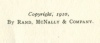

  
[Intangible Textual Heritage](../../index)  [Esoteric](../index.md) 
[Theosophy](../../the/index)  [Index](index)  [Next](theo01.md) 

------------------------------------------------------------------------

[Buy this Book at
Amazon.com](https://www.amazon.com/exec/obidos/ASIN/1564598063/internetsacredte.md)

------------------------------------------------------------------------

  
*Theosophy*, by Rudolf Steiner, \[1910\], at Intangible Textual Heritage

------------------------------------------------------------------------

# THEOSOPHY

##### AN INTRODUCTION TO THE SUPERSENSIBLE KNOWLEDGE OF THE WORLD AND THE DESTINATION OF MAN

###### BY

## RUDOLF STEINER

##### TRANSLATED WITH THE PERMISSION OF THE AUTHOR FROM THE THIRD GERMAN EDITION

###### BY

### E. D. S.

##### \[Elizabeth Douglas Shields\]

#### RAND McNALLY & COMPANY, PUBLISHERS

#### CHICAGO, NEW YORK

#### \[1910\]

Scanned, proofed and formatted at Intangible Textual Heritage by John
Bruno Hare, July 2008. This text is in the public domain in the US
because it was published prior to 1923.

  [  
Click to enlarge](img/cover.jpg.md)  
Front Cover and Spine  

  [  
Click to enlarge](img/title.jpg.md)  
Title Page  

 
[  
Click to enlarge](img/verso.jpg.md)  
Verso  

------------------------------------------------------------------------

[Next: Contents](theo01.md)
