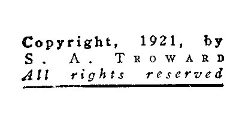

  
[Intangible Textual Heritage](../../index)  [Esoteric](../index.md)  [New
Thought](../../nth/index)  [Index](index)  [Next](thp01.md) 

------------------------------------------------------------------------

[Buy this Book at
Amazon.com](https://www.amazon.com/exec/obidos/ASIN/0766100413/internetsacredte.md)

------------------------------------------------------------------------

The Hidden Power, by Thomas Troward \[1921\], at Intangible Textual
Heritage

------------------------------------------------------------------------

# THE

# HIDDEN POWER

##### And Other Papers On Mental Science

## by Thomas Troward

*Fides et Amor Veritas et Robur*

#### New York, R. M. McBride & company

#### \[1921\]

NOTICE OF ATTRIBUTION  
Scanned at Intangible Textual Heritage, October 2005. Proofed and
formatted by John Bruno Hare. This text is in the public domain in the
United States because it was published prior to January 1st, 1923. These
files may be used for any non-commercial purpose provided this notice of
attribution is left intact in all copies

 

 

------------------------------------------------------------------------

[Next: Publisher's Note](thp01.md)
