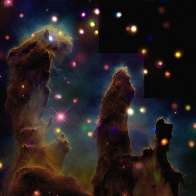

  
[Intangible Textual Heritage](../../index)  [Esoteric](../index) 

------------------------------------------------------------------------

[Buy this Book at
Amazon.com](https://www.amazon.com/exec/obidos/ASIN/B00272NIFS/internetsacredte)

------------------------------------------------------------------------

<table width="75%">
<colgroup>
<col style="width: 50%" />
<col style="width: 50%" />
</colgroup>
<tbody>
<tr class="odd">
<td width="50%" data-valign="TOP"></td>
<td width="50%" data-valign="CENTER"><h1 id="tertium-organum" data-align="CENTER">TERTIUM ORGANUM</h1>
<h4 id="the-third-canon-of-thought" data-align="CENTER">THE THIRD CANON OF THOUGHT</h4>
<h4 id="a-key-to-the-enigmas-of-the-world" data-align="CENTER">A KEY TO THE ENIGMAS OF THE WORLD</h4>
<h3 id="by-p.d.-ouspensky" data-align="CENTER">by P.D. Ouspensky</h3>
<h4 id="section" data-align="CENTER">[1922]</h4></td>
</tr>
</tbody>
</table>

------------------------------------------------------------------------

[Contents](#contents)    [Start Reading](to00)    [Page
Index](pageidx)    [Text \[Zipped\]](to.txt.gz)

------------------------------------------------------------------------

|                                                                                                                           |
|---------------------------------------------------------------------------------------------------------------------------|
|  |

This is P.D. Ouspensky's Tertium Organum, which he believed was the
third major philosophical synthesis, the previous being those of
Aristotle and Bacon. Originally issued in Russian in 1912, this is the
second, revised edition. It was translated into English and published in
1922. This is the only major work by Ouspensky which is in the public
domain in the US by current copyright laws.

Ouspensky (1878-1947) was a mystic who traveled widely in Europe and the
East looking for esoteric knowledge. He later studied with G.I.
Gurdjieff. In this book, he uses the concept of the fourth dimension as
an extended metaphor for the esoteric nature of reality. Einstein and
other physicists had at that time validated the study of higher
dimensions, and Ouspensky was fixated on this idea. One can only wonder
at what he would think of string theory, parallel universes, and the
holographic universe hypothesis (the latter of which he prefigures in
this book).

Also available by Ouspensky at this site is a shorter text, [The
Symbolism of the Tarot](../../tarot/sot/index).

------------------------------------------------------------------------

 [Title Page](to00)  
[Contents](to01)  
[Author's Preface to the Second Edition](to02)  
[Introduction to the English Translation](to03)  
[Chapter I](to04)  
[Chapter II](to05)  
[Chapter III](to06)  
[Chapter IV](to07)  
[Chapter V](to08)  
[Chapter VI](to09)  
[Chapter VII](to10)  
[Chapter VIII](to11)  
[Chapter IX](to12)  
[Chapter X](to13)  
[Chapter XI](to14)  
[Chapter XII](to15)  
[Chapter XIII](to16)  
[Chapter XIV](to17)  
[Chapter XV](to18)  
[Chapter XVI](to19)  
[Chapter XVII](to20)  
[Chapter XVIII](to21)  
[Chapter XIX](to22)  
[Chapter XX](to23)  
[Chapter XXI](to24)  
[Chapter XXII](to25)  
[Chapter XXIII](to26)  
[Conclusion](to27)  
[Table of the Four Forms of the Manifestation of Consciousness](to28)  
