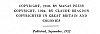

  
[Intangible Textual Heritage](../../index)  [Esoteric](../index) 
[Index](index)  [Next](to01) 

------------------------------------------------------------------------

[Buy this Book at
Amazon.com](https://www.amazon.com/exec/obidos/ASIN/B00272NIFS/internetsacredte)

------------------------------------------------------------------------

  
*Tertium Organum*, by P.D. Ouspensky, \[1922\], at Intangible Textual
Heritage

------------------------------------------------------------------------

# TERTIUM ORGANUM

## THE THIRD CANON OF THOUGHT

### A KEY TO THE ENIGMAS OF THE WORLD

## P. D. OUSPENSKY

#### TRANSLATED FROM THE RUSSIAN BY NICHOLAS BESSARABOFF AND CLAUDE BRAGDON—WITH AN INTRODUCTION BY CLAUDE BRAGDON

###### SECOND AMERICAN EDITION, AUTHORIZED AND REVISED

###### THE MYSTERY OF SPACE AND TIME. SHADOWS AND REALITY, OCCULTISM AND LOVE. ANIMATED NATURE. VOICES OF THE STONES. MATHEMATICS OF THE INFINITE. THE LOGIC OF ECSTASY. MYSTICAL THEOSOPHY. COSMIC CONSCIOUSNESS. THE NEW MORALITY. BIRTH OF THE SUPERMAN.

#### NEW YORK; ALFRED A KNOPF

#### \[1922\]

Scanned, proofed and formatted at Intangible Textual Heritage, May 2005
by John Bruno Hare. This text is in the public domain in the United
States because it was published prior to 1923

  [  
Click to enlarge](img/fcover.jpg)  
Front Cover  

  [  
Click to enlarge](img/title.jpg)  
Title Page  

 
[  
Click to enlarge](img/verso.jpg)  
Verso  

p. v

 

<table data-border="0" width="75%">
<colgroup>
<col style="width: 100%" />
</colgroup>
<tbody>
<tr class="odd">
<td data-valign="top" width="655">
"And swear . . . THAT THERE SHOULD BE TIME NO LONGER." 
                                                        REVELATIONS, X. 6

"That ye, being rooted and grounded in love may be able to COMPREHEND with all <em>saints</em> what is the BREADTH AND LENGTH AND DEPTH AND HEIGHT." 
                                                        Paul the Apostle 
                                 THE EPISTLE TO THE EPHESIANS, III. 18
</td>
</tr>
</tbody>
</table>

 

------------------------------------------------------------------------

[Next: Contents](to01)

