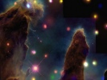

  
[Intangible Textual Heritage](../../index)  [Esoteric](../index.md) 
[Index](index)  [Previous](to23)  [Next](to25.md) 

------------------------------------------------------------------------

[Buy this Book at
Amazon.com](https://www.amazon.com/exec/obidos/ASIN/B00272NIFS/internetsacredte.md)

------------------------------------------------------------------------

  
*Tertium Organum*, by P.D. Ouspensky, \[1922\], at Intangible Textual
Heritage

------------------------------------------------------------------------

p. 254

# CHAPTER XXI

|                                                                                                                                                                                                                                                                                                                                                                                                                                                                                                                                                                                                                                                                                                                                   |
|-----------------------------------------------------------------------------------------------------------------------------------------------------------------------------------------------------------------------------------------------------------------------------------------------------------------------------------------------------------------------------------------------------------------------------------------------------------------------------------------------------------------------------------------------------------------------------------------------------------------------------------------------------------------------------------------------------------------------------------|
| Man's transition to a higher logic. The necessity for rejecting everything "real." "Poverty of the spirit." The recognition of the infinite alone as real. Laws of the infinite. Logic of the finite—the *Organon* of Aristotle and the *Novum Organum* of Bacon. Logic of the infinite—*Tertium Organum*. The higher logic as an instrument of thought, as a key to the mysteries of nature, to the hidden side of life, to the world of noumena. A definition of the world of noumena on the basis of all the foregoing. The impression of the noumenal world on an unprepared consciousness. "The thrice unknown darkness in the contemplation of which all knowledge is re-solved into ignorance." |

EVERYTHING that has been said about mathematical magnitudes is true also
with regard to logical concepts. *Finite* mathematical magnitudes and
*logical* concepts are subject to the same laws.

We have now established that the laws discovered by us in a space of
three dimensions, and operating in that space, are inapplicable,
incorrect and untrue in a space of a greater number of dimensions.

And as this is true of mathematics, so is it true of logic.

As soon as we begin to consider infinite and variable magnitudes instead
of those which are finite and constant, we perceive that the fundamental
axioms of our mathematics cannot be applied to the former class.

And as soon as we begin to think in other terms than those of concepts,
we must be prepared to encounter an enormous number of absurdities *from
the standpoint of existing logic*.

These absurdities seem to us such, because we approach the world of many
dimensions with the logic of the three-dimensional world.

It has been proven already that to an animal, i.e., to a two-dimensional
being, thinking not by concepts, but by perceptions, our logical ideas
must seem absurd.

p. 255

The *logical* relations in the world of many dimensions seem equally
absurd to us. We have no reason whatsoever to hope that the relations of
*the world of causes* can be logical from our point of view. On the
contrary, it may be said that EVERYTHING LOGICAL is phenomenal. Nothing
can be logical, from our standpoint, *there*. All that is *there* must
seem to us *a logical absurdity*, nonsense. We must remember that it is
impossible to penetrate there with *our logic*.

The relation of the general trend of the thought of humanity toward the
"other world" has always been highly incorrect.

In "positivism" men have denied that other world altogether. This was
because, not admitting the possibility of relations other than those
formulated by Aristotle and Bacon, men denied the *very existence* of
that which seemed absurd and impossible from the standpoint of those
formula. Also, in spiritism they attempted to construct the noumenal
world on the model of the phenomenal, that is, against reason, against
nature, they wanted at all costs to prove that the other world is
*logical from our standpoint*, that the same laws of causality operate
just as in our world, and that the other world is nothing more than the
extension of ours. The "other world" of spiritists or spiritualists in
all existing descriptions of it is a naive and barbaric concept of the
unknown.

Positive philosophy perceived the absurdity of all dualistic theses, but
having no power to expand the field of its activity, limited by logic
and "the infinite sphere," it could think of nothing better than to
DENY.

Mystical philosophy alone felt the possibility of relations other than
those of the phenomenal world. But it was arrested by hazy and unclear
sensations, finding it impossible to define and classify them.

Nevertheless, *science must come to mysticism*, because in mysticism
there is a new method—and then to the study of different forms of
consciousness, i.e., of forms of receptivity different from our own.
Science should throw off almost everything old and should start afresh
with a new theory of knowledge.

Science cannot deny the fact that mathematics grows, expands, and
escapes from the limits of the visible and measurable world. Entire
departments of mathematics take into consideration quantitative
relations which did not and do not exist in the real world of

p. 256

positivism, i.e., relations which have no correspondence to any
realities in the visible, three-dimensional world.

But there cannot be any mathematical relations to which the relation of
some realities would not correspond. Therefore mathematics transcends
the limits of our world, and penetrates into a world unknown. This is
the *telescope*, by the aid of which we begin to investigate the *space
of many dimensions* with its worlds. Mathematics goes ahead of our
thought, ahead of our power of imagination and perception. *Even now* it
is engaged in [calculating](errata.htm#41.md) relations which we cannot
imagine or comprehend.

It is impossible to deny all this, even from the strictly
"positivistic," i.e., *positive* standpoint. Thus science, having
admitted the possibility of the expansion of mathematics beyond the
limits of the sensuously perceived world—that is beyond the limits of a
world *accessible* (though theoretically) to the organs of sense and
their mechanical aids—must thereby recognize the expansion of the *real
world* far beyond the limits of any "infinite sphere" or of our logic,
i.e., must *recognize* the reality of "the world of many dimensions."

The recognition of the reality of the world of many dimensions is the
*already accomplished* transition to, and understanding of, the world of
the wondrous. And this transition to the wondrous is impossible without
the recognition of the *reality* of new logical relations which are
absurd and impossible from the standpoint of our logic.

What are the laws of our logic?

They are the laws of our receptivity of the three-dimensional *world*,
or *the laws of our three-dimensional receptivity of the world*.

If we desire to escape from the three-dimensional world and go farther,
we must first of all work out the fundamental logical principles which
would permit us to observe the relations of things in a world of many
dimensions—seeing in them a certain reasonableness, and not complete
absurdity. If we enter there armed only with the principles of the logic
of the three-dimensional world, these principles will drag us back, will
not give us a chance to rise from the earth.

First of all we must throw off the chains of our logic. This is the
first, the great, the chief liberation toward which humanity

p. 257

must strive. Man, throwing off the chains of "three-dimensional" logic,
has already penetrated, in thought, into another world. And not only is
this transition possible, but it is accomplished constantly. Although
unhappily we are not entirely conscious of our rights in "another
world," and often sacrifice these rights, regarding ourselves as limited
to this *earthly* world, paths nevertheless exist. Poetry, mysticism,
the idealistic philosophy of all ages and peoples, preserve the traces
of such transitions. Following these traces, we ourselves can find the
path. Ancient and modern thinkers have given us many keys with which we
may open mysterious doors; many magical formulæ, before which these
doors open of themselves. But we have not understood either the purpose
of these keys or the meaning of the formulæ. We have also lost the
understanding of magical ceremonies and rites of initiation into
mysteries which had a single purpose: to help this transformation in the
soul of man.

Therefore the doors remained closed, and we even denied that there was
anything whatever behind them; or, suspecting the existence of another
world, we regarded it as similar to ours, and separate from ours, and
tried to penetrate there unconscious of the fact that the chief obstacle
in our path was our own division of the world into *this* world and
*that*.

*The world is one*, only the ways of knowing it are different; and with
imperfect methods of knowledge it is impossible to penetrate into that
which is accessible to perfect methods only.

All attempts to penetrate mentally into that higher, noumenal world, or
world of causes, by means of the logic of the phenomenal world, if they
did not fail altogether, or did not lead to *castles in the air*, gave
only one result: in becoming conscious of a new order of things, a man
lost the sense of the reality of the old order. The visible world began
to seem to him fantastic and unreal, everything all about him was
disappearing, was vanishing like smoke, leaving a dreadful feeling of
*illusion*. In everything he felt the abyss of infinity, and everything
was plunging into the abyss.

This sense of the infinite is the first and most terrible trial before
initiation. Nothing exists! A little miserable soul feels itself
suspended in an infinite void. Then even this void disappears! Nothing
exists. There is only infinity, a constant and continuous division and
dissolution of everything. The mystical literature of

p. 258

all peoples abounds in references to this sensation of *darkness and
emptiness*.

Such was that mysterious deity of the ancient Egyptians, about which
there exists a story in the *Orpheus* myth, in which it is de-scribed as
a "*Thrice-unknown darkness in contemplation of which all knowledge is
resolved into ignorance*." [1](#fn_32.md)

This means that man must have felt horror transcending all limits as he
approached the world of causes with the knowledge of the world of
phenomena only, his instrument of logic having proved useless, because
all the new eluded him. In *the new* as yet he sensed chaos only, *the
old* had disappeared, gone away and become unreal. Horror and regret for
the loss of the old mingled with horror of the new—unknown and *terrible
by its infinitude*.

At this stage man experiences the same thing that an animal, becoming a
man, would feel. Having looked into *a new world* for an instant, it is
attracted by the life left behind. The world which it saw only for an
instant seems but a dream, a vision, the creation of imagination, but
the familiar old world, too, is never thereafter the same, it is too
narrow, in it there is not sufficient room. The awakening consciousness
can no longer live the free life of the beast. Already it knows
something different, it hears some voices, even though *the body* holds
it. And the animal does not know where or how it can escape from the
body or from itself.

A man on the threshold of a new world experiences literally the same
thing. He has heard celestial harmonies, and the wearisome songs of
earth touch him no longer, nor do they move him—or if they touch and
move him it is because they remind him of celestial harmonies, of the
inaccessible, of the unknown. He has experienced the sensation of an
unusual EXPANSION of consciousness, when everything was clear to him for
a moment, and he cannot reconcile himself to the sluggish *earthly* work
of the brain.

These moments of the "sensation of infinity" are accompanied by unusual
emotions.

In theosophical literature, and in books on occultism, it is often
asserted that on entering into the "astral" world, man begins to see new
colors, colors which are not in the solar spectrum. [2](#fn_33.md) In

p. 259

this symbolism of the new colors of the "astral sphere" is conveyed the
idea of those *new emotions* which man begins to feel along with the
sensation of the expansion of consciousness—"of the sea pouring into the
drop." This is the "strange bliss" of which mystics speak, the "heavenly
light" which saints "see," the "new" sensations experienced by poets.
Even conversational psychology [identifies](errata.htm#42.md) "ecstasy"
with entirely unusual sensations, inaccessible and unknown to man in the
life of every day.

This sensation of *light* and of unlimited joy is experienced at the
moment of the expansion of consciousness (the unfoldment of the
*mystical lotus* of the Hindu yogi), at the moment of the sensation of
infinity, and it yields also the sensation of darkness and of unlimited
horror.

What does this mean?

Now shall we reconcile the sensation of light with the sensation of
darkness, the sensation of joy with that of horror? Can these exist
simultaneously? Do they occur simultaneously?

They do so occur, and must be exactly thus. Mystical literature gives us
examples of it. The simultaneous sensations of light and darkness, joy
and horror, symbolize as it were the strange duality and contradiction
of human life. It may happen to a man of dual nature, who following one
side of his nature has been led far into "spirit," and on the other side
is deeply immersed in "matter," i.e., in illusion, in unreality—to one
who believes too much in the reality of the unreal.

Generally speaking the sensation of light, of life, of consciousness
penetrating all, of happiness, gives a *new* world. But the same world
to the unprepared mind will give the sensation of infinite darkness and
horror. In this case the sensation of horror will arise from the *loss
of everything real*, from the disappearance of *this* world.

In order not to experience the horror of the new world, it is necessary
to know it beforehand, either emotionally—by faith or love—or
intellectually, by *reason*.

And in order not to experience horror from the loss of the old world, it
is necessary to have renounced it *voluntarily* either through faith or
reason.

One must renounce all the beautiful, bright world in which we are
living; one must admit that it is ghostly, phantasmal, unreal,

p. 260

deceitful, illusory, *mayavic*. One must reconcile oneself to this
unreality, not be afraid of it, but rejoice at it. One must give up
everything. One must become POOR IN SPIRIT, i.e., make oneself *poor* by
the effort of one's spirit.

This most profound philosophical truth is expressed in the beautiful
evangelical symbol:

*Blessed are the poor in spirit: for theirs is the
kingdom of heaven*.

These words become clear in the sense of a renouncement of the material
world only. "Poor in spirit" does not mean poor materially, in the
worldly meaning of the word, and still less does it signify *poverty of
spirit*. Spiritual poverty is the renouncement of matter; such "poverty"
is his when a man has no earth under his feet, no sky above his head.

*Foxes have holes, and birds of the air have nests,
but the Son of man hath not where to lay his head*.

This is the poverty of the man who is *entirely alone*, because father,
mother, other men, even the nearest *here on earth* he begins to regard
differently, not as he regarded them before; and renounces them because
he discerns the *true substances* that he is striving toward; just as,
renouncing the phenomenal illusions of the world, he approaches the
truly real.

The moment of transition—that terrible moment of *the loss of the old*
and *the unfoldment of the new*—has been represented in innumerable
allegories in ancient literature. To make this transition easy was the
purpose of the *mysteries*. In India, in Egypt, in Greece, special
preparatory rituals existed, sometimes merely symbolical, sometimes
real, which actually brought a soul to the very portals of the new
world, and opened these portals at the moment of *initiation*. But no
outward rituals and ceremonies could take the place of self-initiation.
The great work must have been going on *inside* the soul and mind of
man.

\_\_\_\_\_\_

But how can *logic* help a man to pass to the consciousness of a new and
higher world?

p. 261

We have seen that MATHEMATICS has already found the path into that
higher order of things. Penetrating there, it first of all renounces its
*fundamental* axioms of identity and difference.

In the world of infinite and fluent magnitudes, a magnitude may be *not
equal to itself; a part may be equal to the whole; and of two equal
magnitudes one may be infinitely greater than the other*.

All this sounds like an absurdity from the standpoint of the mathematics
of finite and constant numbers. But the mathematics of finite and
constant numbers is itself the calculation of relations between
non-existent magnitudes, i.e., an absurdity. And therefore only that
which from the standpoint of this mathematics seems an absurdity, can be
the truth.

Logic now goes along the same path. It must renounce itself, come to
perceive the necessity for its own annihilation—then out of it a new and
higher logic can arise.

In his *Critique of Pare Reason* Kant proved the possibility of
*transcendental logic*.

Before Bacon and earlier than Aristotle, in the ancient Hindu
scriptures, the formulæ of this higher logic were given, opening the
doors of mystery. But the meaning of these formula was rapidly lost.
They were preserved in ancient books, but remained there as some strange
mummeries of extinguished thought, the words without real content.

New thinkers again discovered these principles, and expressed them in
new words, but again they remained incomprehensible, again they suffered
transformation into some unnecessary ornamental form of words. *But the
idea persisted*. A consciousness of the possibility of finding and
establishing the laws of the higher world was never lost. Mystical
philosophy never regarded the logic of Aristotle as all-embracing and
all-powerful. It built its system *outside of logic* or above logic,
unconsciously going along those paths of thought paved in remote
antiquity.

The higher logic existed before *deductive* and *inductive* logic was
formulated. This higher logic may be called *intuitive* logic—the logic
of infinity, the logic of ecstasy.

Not only is this logic possible, but it exists, and has existed from
time immemorial; it has been formulated many times; it has entered into
philosophical systems as their key—but for some strange reason *has not
been recognized as logic*.

p. 262

It is possible to deduce the system of this logic from many
*philosophical* systems. The most precise and complete formulation of
the law of higher logic I find in the writing of Plotinus, in his *On
Intelligible Beauty*. I shall quote this passage in the succeeding
chapter.

I have called this system of higher logic *Tertium Organum* because *for
us* it is *the third canon*—third instrument—*of thought* after those of
Aristotle and Bacon. The first was the *Organon*, the second, *Novum
Organum*. But *the third* existed earlier than the first.

Man, master of this instrument, of this key, may open the door of *the
world of causes* without fear.

The axioms which *Tertium Organum* embraces cannot be formulated in our
language. If we attempt to formulate them in spite of this, they will
produce the impression of absurdities. Taking the axioms of Aristotle as
a model, we may express the principal axiom of the new logic in our poor
earthly language in the following manner:

*A is both A and Not-A*.

or

*Everything is both A and Not-A*.

or,

*Everything is All*.

But these axioms are in effect absolutely impossible. They are not the
*axioms of higher logic*, they are merely *attempts* to express the
axioms of this logic in concepts. In reality the ideas of higher logic
are *inexpressible* in concepts. When we encounter such an
inexpressibility it means that we have touched the world of causes.

The logical formula: *A is both A and Not-A*, corresponds to the
mathematical formula: *A magnitude can be greater or less than itself*.

The [absurdity](errata.htm#43.md) of both these propositions shows that
they cannot refer to our world. Of course *absurdity*, as such, is
indeed not an index of the attributes of noumena, but the attributes of
noumena will certainly be expressed in what are absurdities to us. To
hope to find in the world of causes anything logical from our standpoint
is just as useless as to think that *the world of things* can exist in

p. 263

accordance with the laws of *a world of shadows* or stereometry
according to the laws of planimetry.

To master the fundamental principles of *higher logic* means to master
the fundamentals of the understanding of *a space of higher dimensions*,
or of the world of the wondrous.

In order to approach to a clear understanding of the relations of the
multi-dimensional world, we must free ourselves from all the "idols" of
*our world*, as Bacon calls them, i.e., from all obstacles to *correct*
receptivity and reasoning. Then we shall have taken the most important
step toward an inner affinity with the world of the wondrous.

A two-dimensional being, in order to approach to an understanding of the
three-dimensional world, already should have become *a three-dimensional
being* before it can rid itself of its "idols," i.e., of its
conventional—converted into axiomatic—ways of feeling and thinking,
which create for it the illusion of two-dimensionality.

What is it exactly from which the two-dimensional being must liberate
itself?

First of all—and most important—from the assurance *that that which it
sees and senses really exists*; from this will come the consciousness of
the [incorrectness](errata.htm#44.md) of its perception of the world, and
then the idea that the *real, new* world must exist in quite other
forms—new, incomparable, incommensurable with relation to the old ones.
Then the two-dimensional being must overcome its sureness of the
correctness of its *categories*. It must understand that things which
seem to it different and separate from one another may be parts of some
to it incomprehensible *whole*, or that they have much in common which
it does not perceive; and that things which seem to it one and
indivisible are in reality infinitely complex and multifarious.

The mental growth of the two-dimensional being must proceed along the
path of the recognition of those common properties of objects, *unknown
to it before*, which are the result of their similar origin or similar
functions, incomprehensible from the point of view of a plane.

When once the two-dimensional being has admitted the possibility of the
existence of hitherto unknown *common* properties of objects, which
before seemed different, then it has already approached to our own
understanding of the world. It has approached to our

p. 264

logic, has begun to understand *the collective name*, i.e., a word used
*not as a proper noun*, but as an appellate noun—a word expressing a
concept.

The "idols" of the two-dimensional being, hindering the development of
its consciousness, are those *proper nouns*, which it has itself given
to all the objects surrounding it. For such a being each object has its
own proper noun, corresponding to its perception of the object; common
names, corresponding to concepts, it knows not of. Only by getting rid
of these *idols*, by understanding that the names of things can be not
only proper, but common ones as well, will it be possible for it to
advance farther, to develop mentally, to approach the human
understanding of the world. Take the most simple sentence:

*John and Peter are both men*.

\[paragraph continues\] For the
two-dimensional being this will be an absurdity, and it will represent
the idea to itself after this fashion:

John and Peter are both Johns and Peters.

In other words, every one of our logical propositions will be an
absurdity to it. Why this is so is clear. Such a being has no concepts;
*the proper nouns* which constitute the speech of such a being have no
plurals. It is easy to understand that any plural of our speech will
seem to it an absurdity.

\_\_\_\_\_\_\_

Where are our "idols?" From what shall we liberate ourselves in order to
pass to an understanding of the multi-dimensional world?

First of all we must get rid of our assurance that we see and sense that
which exists in reality, and that the real world is like the world which
we see—i.e., we must rid ourselves of the illusion of the material
world. We must understand *mentally* all the illusoriness of the world
perceived by us in space and time, and know that the *real* world cannot
have anything in common with it; to understand that it is impossible to
imagine the real world in terms of form; and finally we must perceive
the conditionality of the axioms

p. 265

of our mathematics and logic, related as they are to the unreal
phenomenal world.

In mathematics *the idea of infinity* will help us to do this. The
unreality of finite magnitudes in comparison with infinite ones is
obvious. In logic let us dwell upon *the idea of monism*, i.e., the
fundamental unity of everything which exists, and consequently recognize
the impossibility of constructing any axioms, which involve the idea of
opposites—of theses and antitheses—upon which our logic is built.

The logic of Aristotle and of Bacon is at bottom *dualistic*. If we
really deeply assimilate the idea of monism, we shall dethrone the
"idol" of this logic.

The fundamental axioms of our logic reduce themselves to identity and
contradiction, just as do the axioms of mathematics. At the bottom of
them all lies the admission of our general axiom, namely, that every
given *something* has *something* opposite to it; therefore every
proposition has its anti-proposition, every *thesis* has its
*anti-thesis*. To the *existence* of any thing is opposed the
*non-existence* of that thing. To the existence of the world is opposed
the non-existence of the world. *Object* is opposed to *subject*; the
objective world to the subjective; the I is opposed to the Not-I; to
motion—immobility; to variability—constancy; to unity—heterogeneity; to
truth—falsehood; to good—evil. And in conclusion, to every A in general
is opposed *Not-A*.

The recognition of the reality of these divisions is necessary for the
acceptance of the fundamental axioms of the logic of Aristotle and
Bacon, i.e., the absolute and incontestable recognition of the *duality
of the world*—of dualism. The recognition of the unreality of these
divisions and that of the unity of all opposites is necessary for the
comprehension of *higher logic*.

\_\_\_\_\_\_

At the very beginning of this book the existence of THE WORLD and of THE
PSYCHE was admitted, i.e., the reality of the dual division of
everything existent, because all other opposites are derived from this
opposition.

*Duality* is the condition of *our* knowledge of the phenomenal
(three-dimensional) world; this is the *instrument* of our knowledge

p. 266

of phenomena. But when we come to the knowledge of the noumenal world
(or the world of many dimensions), this duality begins to hinder us,
appears as an obstacle to knowledge.

*Dualism* is the chief "idol"; let us free ourselves from it.

The two-dimensional being, in order to comprehend the relations of
things in three dimensions and our logic, must renounce its "idol"—the
absolute singularity of objects which permits it to call them solely by
their proper names.

We, in order to comprehend the world of many dimensions, must renounce
*the idol of duality*.

But the application of monism to practical thought meets the
in-surmountable obstacle of our language. Our language is incapable of
expressing *the unity of opposites*, just as it cannot express
*spatially* the relation of cause to effect. Therefore we must reconcile
ourselves to the fact that all attempts to express *super-logical*
relations in our language will seem absurdities, and really can only
*give hints* at that which we wish to express.

Thus the formula,

*A is both A and Not-A*,

or,

*Everything is both A and Not-A*,

representing the principal axioms of higher logic, expressed in our
language of concepts, sounds absurd from the standpoint of our usual
logic, *and is not essentially true*.

Let us therefore reconcile ourselves to the fact that it is *impossible*
to express super-logical relations in our language as it is at present
constituted.

The formula, "*A is both A and Not-A*" is untrue because in the world of
causes there exists no opposition between "*A*" and "*Not-A*." But we
cannot express their real relation. It would be more correct to say:

*A is all*.

But this also would be untrue, because "A" is not only *all*, but also
*an arbitrary part* of all, and at the same time a *given* part.

This is exactly the thing which our language cannot express. It

p. 267

is to this that we must accustom our thought, and train it along these
lines.

\_\_\_\_\_\_

We must train our thought to the idea that separateness and
inclusiveness are not opposed in the real world, but exist together and
simultaneously without contradicting one another. Let us understand that
in the real world one and the same thing can be both a part and the
whole, i.e., that the whole, without changing, can be its own part;
understand that there are no opposites in general, that *everything* is
a certain *image of all*.

And then, beginning to understand all this, we shall grasp the separate
ideas concerning the essentials of the "noumenal world," or *the world
of many dimensions* in which we really live.

In such case the *higher logic*, even with its imperfect formulæ, as
they appear in our rough language of concepts, represents in spite of
this a powerful instrument of knowledge of the world, our only means of
preservation from deceptions.

The application of this instrument of thought gives the key to the
mysteries of nature, to *the world as it is*.

\_\_\_\_\_\_

Let us endeavor to enumerate those properties of THE WORLD OF CAUSES
which result from all the foregoing.

It is first of all necessary to reiterate that it is impossible to
express in words the properties of the world of causes. Every thought
*expressed* about them in our ordinary language will be *false*. That
is, we may say in relation to the "real" world that "*every spoken
thought is a lie*." It is possible to speak about it only conditionally.
by hints, by symbols. And if one *interprets literally anything said
about it*, nothing but absurdity results. Generally speaking,
*everything said in words* regarding the world of causes is likely to
seem absurd, and *is in reality its mutilation*. The truth it is
impossible to express; it is possible only to give a hint at it, to give
an impulse to thought. But everyone must discover the truth for himself.
"Another's truth" is worse than a lie, because it is *two lies*. This
explains why truth very often can be expressed only by means of

p. 268

paradox, or even in the form of a lie. Because, in order to speak of
truth without a lie, we should know some other language—ours is
unsuitable.

What then are we able to say about the world of many dimensions, about
the world of noumena, or world of causes?

1\. In that world "TIME" must exist spatially, i.e. *temporal* events
must exist and not happen—exist before and after their manifestation,
and be located in one section, as it were. Effects must exist
simultaneously with causes. That which we name *the law of causality*
cannot exist there, because time is a necessary condition for it. There
cannot be anything which is measured by years, days, hours—there cannot
be before, now, after. *Moments* of different epochs, divided by great
intervals of time, exist simultaneously, and may touch one another.
Along with this, all the *possibilities* of a given moment, even those
opposite to one another, and all their results up to infinity, must be
*actualized* simultaneously with a given moment, but the length of a
moment can be different on different planes.

2\. There is nothing measurable by our measures, nothing *commensurable*
with our objects, nothing *greater or less* than our objects. There is
nothing situated on the right or left side, above or below one of our
objects. There can be nothing *similar* to our objects, lines or figures
and at the same time exist. Different *points* in our space, divided for
us by enormous distances, may meet there. "Distance" or "proximity" are
there defined by inner "affinity" or "remoteness," by sympathy or
antipathy, i.e., by properties which seem to us to be subjective.

3\. There is neither matter nor motion. There is nothing that could
possibly be weighed or photographed, or expressed in the formulæ of
physical energy. There is nothing which has *form*, *color* or
*odor*—nothing possessing the properties of physical bodies.
Nevertheless, the properties of the world of causes, granted an
understanding of certain laws, can be considered in enumerated
categories.

4\. There is nothing dead or unconscious. Everything lives, everything
breathes, thinks, feels; everything is conscious, and everything speaks.

5\. In that world the axioms of our mathematics cannot be applied,

p. 269

because there is nothing *finite*. Everything there is infinite and,
from our standpoint, *variable*.

6\. The laws of our logic cannot act there. From the standpoint of our
logic, that world is *illogical*. This is the realm the laws of which
are expressed in *Tertium Organum*.

7\. The *separateness* of our world does not exist there. *Everything is
the whole*. And each particle of dust, without mentioning of course
every life and every conscious being, lives a life which is *one with
the whole* and includes *the whole* within itself.

8\. In that world the *duality* of our world cannot exist. There *being*
is not opposed to *non-being*. *Life* is not opposed to *death*. On the
contrary, the one includes the other within itself. The unity and
multiplicity of the I; the I and the Not-I; motion and immobility; union
and separateness; good and evil; truth and falsehood—all these divisions
are impossible there. *Everything subjective is objective, and
everything objective is subjective*. That world is the world of the
*unity of opposites*.

9\. The sensation of the *reality* of that world must be accompanied by
the sensation of the *unreality* of this one. At the same time the
difference between real and unreal cannot exist there, just as the
difference between subjective and objective cannot exist.

10\. *That world* and *our world* are not two different worlds. The
world is one. That which we call our world is merely *our incorrect
perception of the world*: the world seen by us through a narrow slit.
*That world* begins to be sensed by us as *the wondrous*, i.e., as
something opposite to the reality of *this world*, and at the same time
this, our earthly world, begins to seem unreal. *The sense of the
wondrous* is the key to that world.

11\. But everything that can be said about it will not define our
relation to that world until we come to understand that even
comprehending it we will not be able to grasp it as a whole, i.e., in
all its variety of relations, but can think of it only in this or that
aspect.

12\. Everything that is said about the world of causes refers also to
*the All*. But between our world and *the All* there may be many
transitions.

------------------------------------------------------------------------

### Footnotes

[258:1](to24.htm#fr_32.md) "The Ancient Wisdom," by
Annie Besant, Introd. p. 23, Theosophical Publishing Society, London.

[258:2](to24.htm#fr_33.md) Although it should be
remembered that we see *only three* out of seven colors of the solar
spectrum.

------------------------------------------------------------------------

[Next: Chapter XXII](to25.md)

