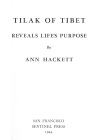
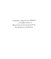

  
[Intangible Textual Heritage](../../index)  [Esoteric](../index) 
[Index](index)  [Next](tot01) 

------------------------------------------------------------------------

[Buy this Book at
Amazon.com](https://www.amazon.com/exec/obidos/ASIN/1417977574/internetsacredte)

------------------------------------------------------------------------

*Tilak of Tibet Reveals Life's Purpose*, by Ann Hackett \[1944\], at
Intangible Textual Heritage

------------------------------------------------------------------------

p. ii

# TILAK OF TIBET

## REVEALS LIFE'S PURPOSE

###### By

### ANN HACKETT

#### SAN FRANCISCO

#### SENTINEL PRESS

#### \[1944\]

Scanned at Intangible Textual Heritage, April 2007. Proofed and
formatted by John Bruno Hare. This text is in the public domain in the
United States because was not renewed at the US Copyright Office in a
timely fashion as required by law at the time. These files may be used
for any non-commercial purpose, provided this notice of attribution is
left intact in all copies.

[  
Click to enlarge](img/cover.jpg)  
Cover  

[  
Click to enlarge](img/title.jpg)  
Title Page  

[  
Click to enlarge](img/verso.jpg)  
Verso  

------------------------------------------------------------------------

[Next: Foreword](tot01)
