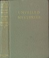
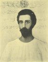
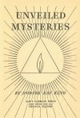
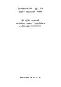

  
[Intangible Textual Heritage](../../index)  [Esoteric](../index.md) 
[Index](index)  [Next](um01.md) 

------------------------------------------------------------------------

[Buy this Book at
Amazon.com](https://www.amazon.com/exec/obidos/ASIN/1878891014/internetsacredte.md)

------------------------------------------------------------------------

*Unveiled Mysteries*, by Godfré Ray King, \[1934\], at Intangible
Textual Heritage

------------------------------------------------------------------------

# UNVEILED MYSTERIES

### BY GODFRÉ RAY KING

pseudonym of Guy Warren Ballard

#### SAINT GERMAIN PRESS

#### POST OFFICE BOX 1133

#### CHICAGO, ILLINOIS

#### \[1934\]

Scanned at Intangible Textual Heritage, October 2006. Proofed and
formatted by Jean Lelievre. This text is in the public domain in the
United States because it was not renewed at the US Copyright Office, as
required by law at the time. These files may be used for any
non-commercial purpose, provided this notice of attribution is left
intact in all copies.

[  
Click to enlarge](img/cover.jpg.md)  
Front Cover and Spine  

[  
Click to enlarge](img/front.jpg.md)  
Frontispiece: The Ascended Master Saint Germain  

[  
Click to enlarge](img/title.jpg.md)  
Title Page  

[  
Click to enlarge](img/verso.jpg.md)  
Verso  

[  
Click to enlarge](img/renew.jpg.md)  
Report from the legal firm of Thompson Compumark verifying the lack of
renewal of this book  

 

### DEDICATION

This series of books is dedicated in deepest, Eternal Love and Gratitude
to our Beloved Master, Saint Germain, the Great White Brotherhood, the
Brotherhood of the Royal Teton, the Brotherhood of Mount Shasta, and
those other Ascended Masters whose loving help has been direct and
without limit.

------------------------------------------------------------------------

[Next: Tribute](um01.md)
