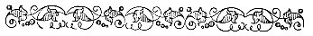

  
[Intangible Textual Heritage](../../index)  [Esoteric](../index.md) 
[Gnostic and Hermetic](../../gno/index)  [Index](index.md) 
[Previous](vow02)  [Next](vow04.md) 

------------------------------------------------------------------------

[Buy this Book at
Amazon.com](https://www.amazon.com/exec/obidos/ASIN/B002FGTM4C/internetsacredte.md)

------------------------------------------------------------------------

  
*The Virgin of the World*, by Anna Kingsford and Edward Maitland,
\[1884\], at Intangible Textual Heritage

------------------------------------------------------------------------

p. i

### *The Hermetic Books*.

 

THE Sacred Books of Hermes, says Mrs. Child in her admirable
compendium, [1](#fn_0.md) containing the laws,
science, and theology of Egypt, were declared by the priests to have
been composed during the reign of the Gods, preceding that of their
first king, Menes. Allusions on very ancient monuments prove their great
antiquity. There were four of them, and the sub-divisions of the whole
make forty-two volumes. These numbers correspond exactly to those of the
Vedas, which the Puranas say were carried into Egypt by the Yadavas at
the first emigration to that country from Hindostan. The subjects
treated of in them were likewise similar; but how far the Books of
Hermes were copied from the Vedas remains doubtful. They were deposited
in the inmost holy recesses of the temples, and none but the higher
order of priests were allowed to read them. They were carried reverently
in all great religious processions. The chief priests carried ten
volumes relating to the emanations of the Gods, the formation of the
world, the divine annunciation of laws and rules for the priesthood. The
prophets carried four, treating of astronomy and astrology. The leader
of the sacred musicians carried two, containing hymns to the Gods, and
maxims to guide the conduct of the king, which the chanter was required
to know by heart. Such were the reputed antiquity and sanctity of these
Egyptian hymns that Plato says they were ascribed to Isis, and believed
to be ten thousand years old. Servitors of the temple carried ten
volumes more, containing forms of prayer and rules for offerings,
festivals, and processions. The other volumes treated of philosophy and
the sciences, including anatomy and medicine.

\[These

p. ii

\[paragraph continues\] These books were
very famous, and later were much sought after for alchemical purposes,
especially for that of making gold. The Roman Emperor Severus collected
all writings on the Mysteries and buried them in the tomb of Alexander
the Great; and Diocletian destroyed all their books on alchemy lest
Egypt should become too rich to remain tributary to Rome. The
once-renowned Books of Hermes have been lost these fifteen hundred
years.

Thus much concerning the Hermetic Books generally.

The Fragments comprised in this reprint have been the subject of much
learned research. In the early centuries of Christianity--Dr. Louis
Menard tells us [1](#fn_1.md)--they enjoyed a high
repute as of undoubted genuineness, the Fathers invoking their testimony
on behalf of the Christian mysteries, while Lactantius--the "Christian
Cicero"--said of them, "Hermes, I know not how, has discovered well-nigh
the whole truth." He was regarded as an inspired revealer, and the
writings which bore his name passed for genuine monuments of that
ancient Egyptian theology in which Moses had been instructed. And this
opinion was accepted by Massilius Ficinus, Patricius, and other learned
men of the Renaissance, who regarded them as the source of the Orphic
initiations and of the philosophy of Pythagoras and Plato. Doubts,
however, arose. They were ascribed, variously, on the strength of
internal evidence, to a Jew, a Christian, and a Gnostic. And the
conclusion come to by recent critics and accepted by Dr. Menard, is that
their place is among the latest productions of Greek philosophy, but
that amid the Alexandrian ideas, on which they are based, there are some
traces of the religious doctrine of ancient Egypt. It was, he says, from
the conjunction of the religious doctrines of Egypt, with the
philosophic doctrines of Greece, that the Egyptian philosophy sprang
which has left no other memorial than the books of Hermes, in which are
to be recognised, under an abstract form, the ideas and tendencies which
had before been presented under a mythological form.

\[Another

p. iii

Another comparison is that which he institutes between some of the
Hermetic writings and the Jewish and Christian Scriptures, especially
the Book of Genesis and the fourth Gospel, and the works of Philo and
the Shepherd of Hernias. [1](#fn_2.md) "The advent
of Christianity presents at first sight the appearance of a radical
revolution in the manners and beliefs of the Western World. But history
knows nothing of sudden changes and unanticipated transformations. To
comprehend the passage from one religion to another, one should not
contrast their two extreme terms--the Homeric mythology and the Nicene
symbology. It is necessary to study their intermediate remains--the
multiple products of an epoch of transition, when the primitive
Hellenism, under philosophical discussion, changed more and more by
admixture with the religions of the East, which were then confused by
advancing upon Europe. Christianity represents the latest terms of this
incursion of Oriental conceptions into the West. It did not fall like a
thunderbolt into the midst of an old world surprised and aghast. It had
its period of incubation; and while it sought a definitive form for its
doctrines, the problems, the solution of which it sought, equally
preoccupied the minds of Greece, Asia, and Egypt. The ideas were already
in the air, which became combined in every kind of proportion.

"The multiplicity of the sects springing up in our days can give but a
slight notion of that astonishing intellectual chemistry which had
established its chief laboratory at Alexandria. Humanity had put up to
competition vast moral and philosophical issues--the origin of evil, the
destiny of souls, their fall and their redemption; the prize offered was
the dictatorship of consciences. The Christian solution prevailed."

Our critic proceeds to distinguish in the books of Hermes Trismegistus
between that which, in his view, belonged respectively to Egypt and to
Judea. "When we meet in these books," he remarks, "Platonist or
Pythagorean ideas, we must ask whether the author had recovered them
from the ancient sources whence Pythagoras or Plato had drawn them
before him; or whether they represent an element purely Greek. There is,
then, room to discuss the influence, real or supposed, of the East on
the Hellenic philosophy. One is generally too liable, on the

\[strength

p. iv

strength of the belief of the Greeks themselves, to exaggerate this
influence, and especially to set back the date of it. It is only after
the foundation of Alexandria that a permanent and consistent connection
was established between the thought of Greece and that of other peoples;
and in these exchanges Greece had much more to give than to receive. The
Orientals--at least, such of them as came into contact with the
Greeks--appeared never to have had a philosophy properly so called.
Psychic analysis, research for the foundations of knowledge and of moral
laws, and their application to social life, were things absolutely
unknown to the East before the invasion of Alexander. The expression
respecting his countrymen which Plato ascribes to the Egyptian priest,
'You Greeks are but children; and there are no old men among you,' might
be referred to the East and to Egypt itself. The scientific spirit is as
alien to those peoples as the political instinct. They can endure,
through long ages, but they can never reach their manhood. They are
elderly youths, always in leading strings, and as incapable of searching
for truth as of accomplishing justice.

"Initiated into philosophy by Greece, the East could but give in return
that which it had,--the exaltation of religious sentiment; Greece
accepted the exchange. Weary of the scepticism produced by the strife of
her schools, she cast herself, by a reaction, into mystic fervours,
precursors of a renewal of faith. The books of Hermes Trismegistus are a
bond of union between the dogmas of the past and those of a future, and
it is by this bond that they attach themselves to questions actual and
living. If they belong still to paganism, it is to paganism in its last
hours, always full of disdain for the new faith, and declining to
abdicate in her favour, because it guards the depository of the old
civilisation which will become extinct with it, already tired of a
hopeless struggle, resigned to its destiny, and returning to sleep for
evermore in its first cradle, the old Egypt, the land of the dead."

Dr. Menard thus concludes:--"The Hermetic books are the last monuments
of paganism. They belong at once to the Greek philosophy and the
Egyptian religion, and in their mystic exaltation they impinge already
upon the Middle Age. Between a world which is ending and a world which
is commencing, they resemble those animals who by their undecided nature
serve as a

\[link

p. v

link between different orders of organisations. These mixed creations
are always inferior to each of the groups which they connect together.
Not to be compared either with the religion of Homer or Christianity,
the Books of Hermes enable us to comprehend the method of the world's
passage from one to the other. In them the beliefs which were being
born, and, the beliefs which were dying, met and clasped hands."

In contrast to, and also, as we hold, in correction of, the view thus
expressed concerning the relative philosophies of Greece and the East,
we adduce the following passages from Mr. Plumptre's "History of
Pantheism":-- [1](#fn_3.md)

"From our earliest childhood we have generally been taught to regard the
Hebrews as those to whom we owe all our knowledge of theology and
religion; and in a great measure even our knowledge of God Himself. We
have been taught to regard the Greeks as those from whom we have gained
all our acquaintance with the arts and sciences, philosophy, and, to a
certain extent, all that is comprised within the word wisdom. And in
like manner it is upon the Romans we have been told to look as upon
those from whom we have gained all our notions of discipline and law. As
regards our relations to the Hebrews and Romans, the definition is
fairly accurate. Not so with the Greeks. There is, indeed, a certain
superficial accuracy about the statement. We do, of course, owe a good
deal of our knowledge and learning to the Greeks. But where the
definition is erroneous is in this: it leads us to imply from it that
the Greeks were the first people who cultivated the love of learning for
its own sake; that they gained their knowledge from no other nations,
but were the authors of it themselves. It might almost lead us to imply
that they were the first people who had ever attained any degree of
civilisation.

"The slightest acquaintance with Egyptian or Hindoo history is
sufficient to make us detect such an obvious fallacy, and lead us
readily to discredit the assertion. The civilisation of Egypt goes so
far back in the world's history that it is almost impossible to say when
it began. It is almost generally acknowledged now that Moses gained the
greater portion of his knowledge from his

\[connection

p. vi

connection with the Egyptians; and in that case even our first ideas of
religion may be traced to an Egyptian source."

Mr. Plumptre goes on to spew that while the Hindoos and Egyptians had
long been in possession of religio-philosophical systems of the highest
intellectual order, the Greeks were sunk in ignorance and superstition
of the most irrational kind, until the occurrence of an event which
revolutionised, or, rather, which gave the first impulse to Greek
thought, so that in a short time after it Greece sprang from a state of
childish ignorance into one in which she became, both commercially and
philosophically, the leading power of the world. This momentous event
was the opening of the Egyptian ports by Psammetichus, B.C. 670.
Previous to that time, the Egyptians had been shut out from all
intercourse with Europe and the Mediterranean by an exclusion more
rigorous than that which until lately was practised in China and Japan;
and Egypt was to the Greeks but a land of mystery and fable, as witness
the allusions to it in Homer and Hesiod. But with the system of
isolation overthrown which had prevailed for so many thousands of years,
the influence of the event upon the progress of Europe was such as to be
incapable of exaggeration. First Greece, then the rest of the world,
owed their civilisation to it. It destroyed the belief in the old
mythologies, and gave birth to Greek philosophy.

There is one respect in which this statement requires modification. The
Greek mythologies may indeed have been but irrational fables as
popularly received and without the key to their interpretation. But in
reality they were symbols denoting, while concealing, profound occult
truths. And while their presence in Greece at so early a period shews
that colleges of the Sacred Mysteries flourished there long before the
rise of Greek philosophy, the identity of the doctrines they symbolised
with those of Egypt and the East shews that there had been religious
intercourse between these countries long before there was any political,
commercial, or philosophical intercourse. Foreign missionary enterprise
by no means originated with Christianity. The Sacred Mysteries were
continually migrating and planting themselves in new ground in advance
of secular civilisation. The migration of Abraham and the flights of
Bacchus and of Moses were doubtless all of them events of this
character.

\[Mr.

p. vii

Mr. Plumtre's conclusion that whatever there was of coincidence between
Greek and Egyptian philosophic thought was due to the recognition and
adoption of the latter by the Greeks, is one which it seems to us
impossible to escape. And we regard M. Menard's inferences to the
contrary as due to his failure to combine with his classical knowledge a
knowledge of Hermetic and Kabbalistic methods and traditions. Comprising
as do these the world's spiritual history, it is impossible apart from
them to form any sound judgment on the matters in question. Those who,
enamoured of conventional methods, are unable to recognise any *organon*
of knowledge except the superficial faculties, or any plane of knowledge
transcending the range of those faculties, are necessarily intolerant of
the idea that there has been in the world from the earliest times a
system of esoteric and positive doctrine concerning the most hidden
mysteries of Existence, of such a character, and so obtained as to
fulfil all the conditions requisite to constitute a divine revelation.
Nevertheless, this is the conclusion to which we have found ourselves
compelled by sheer force of evidence, at once exoteric and esoteric. It
is in Hindostan and Egypt that we find its earliest traces; and if, as
assuredly is the case, there are coincidences between the ancient
doctrines of those lands, and those of Greece, Judæa, and Christendom,
it is because the same truth has passed from people to people,
everywhere finding recognition, and undergoing re-formulation according
to the genius of the time and place of its sojourn. And this, we may
add, is a process which must inevitably continue until man has become
either so far degenerate as to lose all care for and perception of
truth; or so far regenerate as to attain to the full perception of it,
and fix it for evermore as his most precious possession.

But be this as it may, we have seen that even the most destructive
criticism is forced to make these three important admissions

\(1\) That the doctrine contained in the Hermetic books is in part, at
least, a survival from the times of ancient Egypt, and therein really
Hermetic.

\(2\) That there is a coincidence between the doctrine which has thus
survived and that of Christianity. And,

\[ (3) That

p. viii

\(3\) That this coincidence has been recognised and welcomed by the
Church, to the admission that Christianity, so far from being something
wholly new and unprecedented at the time of its inception, represents a
development from, or re-formulation of; doctrine long pre-existent.

E. M.

 

 

------------------------------------------------------------------------

### Footnotes

[i:1](vow03.htm#fr_0.md) "The Progress of Religious
Ideas."

[ii:1](vow03.htm#fr_1.md) Hermès Trismegistus.
Traduction complète; précédée d’une étude sur l’origine des livres
Hermétiques. Par Dr. Louis Ménard, 2nd Ed., Paris, 1867.

This translation has been used, but not entirely followed, in the
present work, as also have some of the notes, those which are not
initialled being Dr. Menard's.

[iii:1](vow03.htm#fr_2.md) A title identical with
that of the Pymander, or Shepherd, of Hermes.

[v:1](vow03.htm#fr_3.md) Vol. I, B. II.

------------------------------------------------------------------------

[Next: The Hermetic System and the Significance of its Present
Revival](vow04.md)
