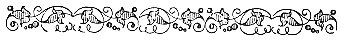

  
[Intangible Textual Heritage](../../index)  [Esoteric](../index.md) 
[Gnostic and Hermetic](../../gno/index)  [Index](index.md) 
[Previous](vow35)  [Next](vow37.md) 

------------------------------------------------------------------------

[Buy this Book at
Amazon.com](https://www.amazon.com/exec/obidos/ASIN/B002FGTM4C/internetsacredte.md)

------------------------------------------------------------------------

  
*The Virgin of the World*, by Anna Kingsford and Edward Maitland,
\[1884\], at Intangible Textual Heritage

------------------------------------------------------------------------

p. 141

 

# *FRAGMENTS of the WRITINGS*

# *of*

# *HERMES to AMMON*.

 

### PART I.

THAT which rules the universe is Providence; that which contains the
universe and limits it is Necessity; Destiny impels and enfolds all
things by the compulsory force which belongs thereto. It is Destiny
which is the cause of birth and of the dissolution of Life. The
universe, then, first receives Providence, the first ordained.
Providence extends to the skies, about which the Gods revolve, in
perpetual and untiring motion. There is Destiny because there is
Necessity. Providence foresees, Destiny determines, the position of the
stars. Such is the universal law.

\[All

------------------------------------------------------------------------

[Next: Part II](vow37.md)
