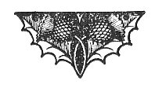

  
[Intangible Textual Heritage](../../index)  [Esoteric](../index) 
[Gnostic and Hermetic](../../gno/index)  [Index](index) 
[Previous](vow48) 

------------------------------------------------------------------------

[Buy this Book at
Amazon.com](https://www.amazon.com/exec/obidos/ASIN/B002FGTM4C/internetsacredte)

------------------------------------------------------------------------

  
*The Virgin of the World*, by Anna Kingsford and Edward Maitland,
\[1884\], at Intangible Textual Heritage

------------------------------------------------------------------------

### PART VIII.

HERMES affirms that those who know God, are preserved from assaults of
the evil one, and are not even subject to Destiny. The knowledge of God
is religion.

\[From Lactantius: "Divine Institutions."\]

 

 

\[Published under the auspices of the Hermetic
Society.\]

 
