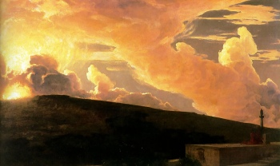

  
[Intangible Textual Heritage](../../index)  [Esoteric](../index.md) 

------------------------------------------------------------------------

[Buy this Book at
Amazon.com](https://www.amazon.com/exec/obidos/ASIN/B0008BCE64/internetsacredte.md)

------------------------------------------------------------------------

<table width="75%">
<colgroup>
<col style="width: 50%" />
<col style="width: 50%" />
</colgroup>
<tbody>
<tr class="odd">
<td width="50%" data-valign="TOP"> 
Clytie, by Lord Frederick Leighton [19th cent.] (Public Domain Image)</td>
<td width="50%" data-valign="CENTER"><h1 id="wisdom-of-the-ages" data-align="CENTER">Wisdom of the Ages</h1>
<h2 id="by-george-a.-fuller" data-align="CENTER">by George A. Fuller</h2>
<h4 id="section" data-align="CENTER">[1916]</h4></td>
</tr>
</tbody>
</table>

------------------------------------------------------------------------

[Contents](#contents)    [Start Reading](wota00.md)    [Page
Index](pageidx)    [Text \[Zipped\]](wotatxt.zip.md)

------------------------------------------------------------------------

|                                                                                                                           |
|---------------------------------------------------------------------------------------------------------------------------|
|  |

This book, a product of automatic writing, first came to my attention in
[a footnote](../../etc/vre/vre15.htm#fn_320.md) in William James'
[Varieties of Religious Experience](../../etc/vre/index.md). James compared
this text to [Oahspe](../../oah/index.md), as well as the case of Helene
Smith, described in [From India to the Planet
Mars](../../ufo/ipm/index.md). The book claims to be the revelation of one
Zertoulem, who lived long ago in a land called Tlaskanata. The preface
and glossary state that Tlaskanata was in Middle America, 'thousands of
years ago.'

The actual text is a lot more consistent than most automatic writing
I've seen. The style is similar to Lord Dunsany, Khalil Gibran, or
perhaps the orientalist translations of Edward Fitz-Gerald. Although the
setting is in a previously unknown lost civilization, the spiritual
concerns addressed here are very modern. As far as I can tell this book
has not been reprinted since 1916, and appears for the first time on the
Internet at this site.--*J.B. Hare, May 5, 2008*.

------------------------------------------------------------------------

 [Title Page](wota00.md)  
[Introduction](wota01.md)  
[I](wota02.md)  
[II](wota03.md)  
[III](wota04.md)  
[IV](wota05.md)  
[V](wota06.md)  
[VI](wota07.md)  
[VII](wota08.md)  
[VIII](wota09.md)  
[IX](wota10.md)  
[X](wota11.md)  
[XI](wota12.md)  
[XII](wota13.md)  
[XIII](wota14.md)  
[XIV](wota15.md)  
[XV](wota16.md)  
[XVI](wota17.md)  
[XVII](wota18.md)  
[XVIII](wota19.md)  
[XIX](wota20.md)  
[XX](wota21.md)  
[XXI](wota22.md)  
[XXII](wota23.md)  
[XXIII](wota24.md)  
[XXIV](wota25.md)  
[XXV](wota26.md)  
[XXVI](wota27.md)  
[XXVII](wota28.md)  
[XXVIII](wota29.md)  
[XXIX](wota30.md)  
[XXX](wota31.md)  
[XXXI](wota32.md)  
[XXXII](wota33.md)  
[XXXIII](wota34.md)  
[XXXIV](wota35.md)  
[XXXV](wota36.md)  
[XXXVI](wota37.md)  
[XXXVII](wota38.md)  
[XXXVIII](wota39.md)  
[XXXIX](wota40.md)  
[XL](wota41.md)  
[XLI](wota42.md)  
[XLII](wota43.md)  
[XLIII](wota44.md)  
[XLIV](wota45.md)  
[XLV](wota46.md)  
[XLVI](wota47.md)  
[XLVII](wota48.md)  
[XLVIII](wota49.md)  
[XLIX](wota50.md)  
[L](wota51.md)  
[Tlaskan Words](wota52.md)  
