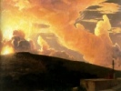

  
[Intangible Textual Heritage](../../index)  [Esoteric](../index.md) 
[Index](index)  [Previous](wota48)  [Next](wota50.md) 

------------------------------------------------------------------------

[Buy this Book at
Amazon.com](https://www.amazon.com/exec/obidos/ASIN/B0008BCE64/internetsacredte.md)

------------------------------------------------------------------------

  
*Wisdom of the Ages*, by George A. Fuller, \[1916\], at Intangible
Textual Heritage

------------------------------------------------------------------------

p. 197

### XLVIII.

The states after death are dependent upon
the states before death. I have sought, whenever the opportunity
offered, oh, Neontu, to impress upon thee the great law of consequences. In other words, that it is
impossible for man to escape the consequence of his every act.
Therefore, habits must necessarily cling to him after the body physical
has been thrown aside. No miracle occurs to transform him in a moment's
time from a demon to a saint. If his home has

been in the realm of the carnal appetites and passions, death will not
lift him out of that realm, for it can destroy only that through which
these appetites and passions were gratified. Such spirits attach
themselves as parasites to susceptible subjects, and through

p. 198

these usurped bodies seek to gratify their unhallowed desires. Inasmuch
as there are malignant spirits encased in physical bodies, there are
also malignant spirits denuded of physical habiliments, who disturb the
equilibrium of everyday life, break down health and harass these
physical bodies by sowing in them the seeds of disease. Much of the
insanity of the world has been caused by unhappy suggestions and
melancholy thoughts that emanate from these evil spirits that still hug
the lower strata of physical life. Many times the holy sanctuary of life
is not only invaded but also desecrated by these spirits. The rightful
owner of the house for the time being is deposed and sometimes fairly
driven away. The most powerful adversaries man is called upon to meet
are they of the invisible realms. Because of their invisibility they are
the more dangerous. Their attacks are all carefully

p. 199

arranged and planned without our knowledge. The powers and
principalities thou art called upon to wrestle with are not of this
world of physical sensations, but of the great realm of the unseen, out
of which everything that is proceeds.

Not only are men directly controlled and influenced by these spirits,
but the great social, political and religious worlds are invaded by
them. Thus, oft-times are they enabled to wield a powerful influence
over the affairs as well as the lives of men. Here may be found in part
the cause of the perversions in the great religions of the world. The
social and political conditions that obtain in the world are also in a
great measure influenced by these denizens of the lower spheres.

Oft-times they invade the aura surrounding the sensitive and live on his
very life. Through him they again live the old life,

p. 200

drink in once more its delights and revel in its associations.

This species of vampirism is far more prevalent in the world to-day than
many are willing to believe. The great body of men and women who are
prone to investigate along the line of psychical phenomena are ever
ready to hear of all that which is good and beautiful, while they turn
away in disgust from him who would show them the darker side of human
existence. Man cannot afford to wander longer in the realm of
half-truths. In order that he may be well armed and fully equipped for
the battles of life he must know the whole truth. Therefore he must be
led to realize the dangers that confront him. Knowledge is one of the
greatest sources of our strength and power. Ignorance makes slaves of
even the wisest of the earth. Ignorance draws dark curtains before the
eyes of man, while spirit

p. 201

vampires creep upon him unawares. Knowledge lifts all curtains, dispels
all fogs and clouds, revealing the enemy in his lair. When we know our
enemy and the source of his strength, the battle is more than half won.
Victory comes when we are led to realize our own strength and power.

------------------------------------------------------------------------

[Next: XLIX](wota50.md)
