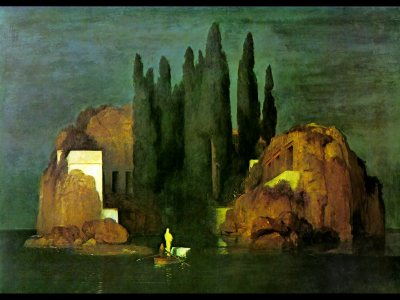

  
[Intangible Textual Heritage](../../index)  [Esoteric](../index) 

------------------------------------------------------------------------

[Buy this Book at
Amazon.com](https://www.amazon.com/exec/obidos/ASIN/B002F9NJRA/internetsacredte)

------------------------------------------------------------------------

<table width="75%">
<colgroup>
<col style="width: 50%" />
<col style="width: 50%" />
</colgroup>
<tbody>
<tr class="odd">
<td width="50%" data-valign="TOP"> 
The Island of the Dead, by Arnold Bocklin [1880] (Public Domain Image)</td>
<td width="50%" data-valign="CENTER"><h1 id="a-wanderer-in-the-spirit-lands" data-align="CENTER">A Wanderer in the Spirit Lands</h1>
<h2 id="by-franchezzo-a.-farnese" data-align="CENTER">by Franchezzo (A. Farnese)</h2>
<h4 id="section" data-align="CENTER">[1896]</h4></td>
</tr>
</tbody>
</table>

------------------------------------------------------------------------

[Contents](#contents)    [Start Reading](wsl00)    [Text
\[Zipped\]](wsl.txt.gz)

------------------------------------------------------------------------

|                                                                                                                           |
|---------------------------------------------------------------------------------------------------------------------------|
|  |

What lies beyond the land of the living? Franchezzo explores the path
into a literal land of the dead. Will we see long dead relatives? Can we
return? Questions to keep in mind as one reads...

------------------------------------------------------------------------

 [Title Page](wsl00)  
[Preface by Transcriber.](wsl01)  
[Dedication by Author.](wsl02)  

### Part I. Days of Darkness

[Chapter I.--My Death](wsl03)  
[Chapter II.--Despair](wsl04)  
[Chapter III.--Hope--Wanderings on the Earth Plane--A Door of Spiritual
Sight](wsl05)  
[Chapter IV.--The Brotherhood of Hope](wsl06)  
[Chapter V.--Spirits of the Earth Plane](wsl07)  
[Chapter VI.--Twilight Lands--Love's Gifts--The Valley of
Selfishness--The Country of Unrest--The Miser's Land--The Gambler's
Land](wsl08)  
[Chapter VII.--The Story of Raoul](wsl09)  
[Chapter VIII.--Temptation](wsl10)  
[Chapter IX.--The Frozen Land--The Caverns of Slumber](wsl11)  
[Chapter X.--My House in the Twilight Lands--Communion Between the
Living and the Dead](wsl12)  
[Chapter XI.--Ahrinziman](wsl13)  
[Chapter XII.--My Second Death](wsl14)  

### Part II. The Dawn of Light

[Chapter XIII.--Welcome in the Land of Dawn--My New Home
There.](wsl15)  
[Chapter XIV.--A Father's Love](wsl16)  
[Chapter XV.--A New Expedition Proposed](wsl17)  
[Chapter XVI.--Clairvoyance--The Journey Begun](wsl18)  
[Chapter XVII.--The Astral Plane and Its Inhabitants--Spooks, Elves,
Vampires, etc.](wsl19)  
[Chapter XVIII.--The Approach to Hell](wsl20)  

### Part III. The Kingdom of Hell

[Chapter XIX.--Through the Wall of Fire](wsl21)  
[Chapter XX.--The Imperial City](wsl22)  
[Chapter XXI.--The Fires of Hell--A Vengeful Spirit--Pirates--The Sea of
Foul Mud--The Mountains of Selfish Oppression--The Forest of
Desolation--Messages of Love](wsl23)  
[Chapter XXII.--Amusements in a Great City of Hell--Words of
Caution](wsl24)  
[Chapter XXIII.--The Palace of My Ancestors--False Brothers
Baffled](wsl25)  
[Chapter XXIV.--The Story of Benedetto--Plotters Again Baffled](wsl26)  
[Chapter XXV.--A Pitched Battle in Hell](wsl27)  
[Chapter XXVI.--Farewell to the Dark Land](wsl28)  

### Part IV. Through the Gates of Gold

[Chapter XXVII.--Welcome on Our Return--A Magic Mirror--Work in the
Cities of Earth--The Land of Remorse--The Valley of Phantom Mists--A
Home of Rest](wsl29)  
[Chapter XXVIII--My Home and Work in the Morning Land](wsl30)  
[Chapter XXIX.--The Formation of Planets](wsl31)  
[Chapter XXX.--Materialization of Spirits](wsl32)  
[Chapter XXXI.--Why the Spheres Are Invisible--Spirit
Photographs](wsl33)  
[Chapter XXXII.--Through the Gates of Gold--My Mother--My Home in the
Land of Bright Day--I Am Joined by Benedetto](wsl34)  
[Chapter XXXIII.--My Vision of the Spheres](wsl35)  
[Chapter XXXIV.--Conclusion](wsl36)  
