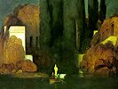

  
[Intangible Textual Heritage](../../index)  [Esoteric](../index.md) 
[Index](index)  [Previous](wsl01)  [Next](wsl03.md) 

------------------------------------------------------------------------

[Buy this Book at
Amazon.com](https://www.amazon.com/exec/obidos/ASIN/B002F9NJRA/internetsacredte.md)

------------------------------------------------------------------------

  
*A Wanderer in the Sprit Lands*, by Franchezzo (A. Farnese), \[1896\],
at Intangible Textual Heritage

------------------------------------------------------------------------

### Dedication by the Author.

To those who toil still in the mists and darkness of uncertainty which
veil the future of their earthly lives, I dedicate this record of the
Wanderings of one who has passed from earth life into the hidden
mysteries of the Life Beyond, in the hope that through my experiences
now given to the world, some may be induced to pause in their downward
career and think ere they pass from the mortal life, as I did, with all
their unrepented sins thick upon them.

It is to those of my brethren who are treading fast upon the downward
path, that I would fain hope to speak, with the power which Truth ever
has over those who do not blindly seek to shut it out; for if the after
consequences of a life spent in dissipation and selfishness are often
terrible even during the earth-life, they are doubly so in the Spirit
World, where all disguise is stripped from the soul, and it stands forth
in all the naked hideousness of its sins, with the scars of the
spiritual disease contracted in its earthly life stamped upon its spirit
form--never to be effaced but by the healing powers of sincere
repentance and the cleansing waters of its own sorrowful tears.

I now ask these dwellers upon earth to believe that if these weary
travelers of the other life can return to warn their brothers yet on
earth, they are eager to do so. I would have them to understand that
spirits who materialize have a higher mission to perform than even the
solacing of those who mourn in deep affliction for the beloved they have
lost. I would have them to look and see that now even at the eleventh
hour of man's pride and sin, these spirit wanderers *are* permitted by
the Great Supreme to go back and tell them the fate of all who outrage
the laws of God and man. I would have even the idle and frivolous to
pause and think whether Spiritualism be not something higher, holier,
nobler, than the passing of an idle hour in speculations as to whether
there are occult forces which can move a table or rap out the Alphabet,
and whether it is not possible that these feeble raps and apparently
unmeaning tips and tilts of a table are but the opening doors through
which a flood of light is being let in upon the dark places of earth and
of the Nether World--faint signs that those who have gone before do now
return to earth to warn their brethren.

As a warrior who has fought and conquered I look back upon the scenes of
those battles and the toils through which I have passed, and I feel that
all has been cheaply won--all has been gained for which I hoped and
strove, and I seek now but to point out the Better Way to others who are
yet in the storm and stress of battle, that they may use the invaluable
time given to them upon earth to enter upon and follow with unfaltering
step the Shining Path which shall lead them home to Rest and Peace at
last.

FRANCHEZZO.

------------------------------------------------------------------------

[Next: Chapter I.--My Death](wsl03.md)
