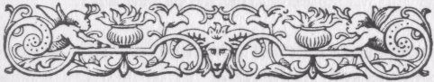

p.1

THE BOOK OF NOODLES.  
CHAPTER I.  
ANCIENT GRECIAN NOODLES.

"LD as
the days of Hierokles!" is the exclamation of the "classical" reader on
hearing a well-worn jest; while, on the like occasion, that of the
"genera " reader--a comprehensive term, which, doubtless, signifies one
who knows "small Latin and less Greek"--is, that it is "a Joe Miller;
"both implying that the critic is too deeply versed in *joke-ology* to
be imposed upon, to have an old jest palmed on him as new, or as one
made by a living wit. That the so-called jests of Hierokles are *old*
there can be no doubt whatever; that they were collected by the
Alexandrian sage of that name is more than doubtful; while it is certain
that several of them are much older than the time in which he
flourished, namely, the fifth century: it is very possible that some

p.2

may date even as far back as the days of the ancient Egyptians! It is
perhaps hardly necessary to say that honest Joseph Miller, the comedian,
was not the compiler of the celebrated jest-book with which his name is
associated; that it was, in fact, simply a bookseller's trick to entitle
a heterogeneous collection of jokes, "quips, and cranks, and
quiddities," *Joe Miller's Jests; or, The Wits Vade Mecum.* And when one
speaks of a jest as being "a Joe Miller," he should only mean that it is
"familiar as household words," not that it is of contemptible antiquity,
albeit many of the jokes in "Joe Miller " are, at least, "as old as
Hierokles," such, for instance, as that of the man who trained his horse
to live on a straw *per diem,* when it suddenly died, or that of him who
had a house to sell and carried about a brick as a specimen of it.

The collection of facetiæ ascribed to Hierokles, by whomsoever it was
made, is composed of very short anecdotes of the sayings and doings of
pedants, who are represented as noodles, or simpletons. In their
existing form they may not perhaps be of much earlier date than the
ninth century. They seem to have come into the popular facetiæ of Europe
through the churchmen of the Middle Ages, and, after having circulated

p.3

long orally, passed into literature, whence, like other kinds of tales,
they once more returned to the people. We find in them the indirect
originals of some of the bulls and blunders which have in modern times
been credited to Irishmen and Scotch Highlanders, and the germs also,
perhaps, of some stories of the Gothamite type: as brave men lived
before Agamemnon, so, too, the race of Gothamites can boast of a very
ancient pedigree! By far the greater number of them, however, seem now
pithless and pointless, whatever they may have been considered in
ancient days, when, perhaps, folk found food for mirth in things which
utterly fail to tickle our "sense of humour" in these double-distilled
days. Of the Ἀστεῖα, or facetiæ, of Hierokles, twenty-eight only are
appended to his Commentary on Pythagoras and the fragments of his other
works edited, with Latin translations, by Needham, and published at
Cambridge in 1709. A much larger collection, together with other Greek
jests--of the people of Abdera, Sidonia, Cumæ, etc.-- has been edited by
Eberhard, under the title of *Philogelos Hieraclis el Philagrii Facetiœ*
which was published at Berlin in 1869.

In attempting to classify the best of these relics of ancient wit--or
witlessness, rather--it is often difficult to decide whether

p.4

a particular jest is of the Hibernian bull, or blunder, genus or an
example of that droll stupidity which is the characteristic of noodles
or simpletons. In the latter class, however, one need not hesitate to
place the story of the men of Cumæ, who were expecting shortly to be
visited by a very eminent man, and having but one bath in the town, they
filled it afresh, and placed an open grating in the middle, in order
that half the water should be kept clean for his sole use.

But we at once recognise our conventional Irishman in the pedant who, on
going abroad, was asked by a friend to buy him two slave-boys of fifteen
years each, and replied, "If I cannot find such a pair, I will bring you
one of thirty years;" and in the fellow who was quarrelling with his
father, and said to him, "Don't you know how much injury you have done
me? Why, had you not been born, I should have inherited my grandfather's
estate;" also in the pedant who heard that a raven lived two hundred
years, and bought one that he should ascertain the fact for himself.

Among Grecian Gothamites, again, was the hunter who was constantly
disturbed by dreams of a boar pursuing him, and procured dogs to sleep
with him. Another, surely, was the man of Cumæ who wished to sell some
clothes he had stolen, and smeared them with

p.5

pitch, so that they should not be recognised by the owner. They were
Gothamites, too, those men of Abdera who punished a runaway ass for
having got into the gymnasium and upset the olive oil. Having brought
all the asses of the town together, as a caution, they flogged the
delinquent ass before his fellows.

Some of the jests of Hierokles may be considered either as witticisms or
witless sayings of noodles; for example, the story of the man who
recovered his health though the doctor had sworn he could not live, and
afterwards, being asked by his friends why he seemed to avoid the doctor
whenever they were both likely to meet, he replied, "He told me I should
not live, and now I am ashamed to be alive;" or that of the pedant who
said to the doctor, "Pardon me for not having been sick so long;" or
this, "I dreamt that I saw and spoke to you last night:" quoth the
other, "By the gods, I was so busy, I did not hear you."

But our friend the Gothamite reappears in the pedant who saw some
sparrows on a tree, and went quietly under it, stretched out his robe,
and shook the tree, expecting to catch the sparrows as they fell, like
ripe fruit again, in the pedant who lay down to sleep, and, finding he
had no pillow, bade his servant place a jar under his head, after
stuffing it

p.6

full of feathers to render it soft; again, in the cross-grained fellow
who had some honey for sale, and a man coming up to him and inquiring
the price, he upset the jar, and then replied, "You may shed my heart's
blood like that before I tell such as you;" and again, in the man of
Abdera who tried to hang himself, when the rope broke, and he hurt his
head; but after having the wound dressed by the doctor, he went and
accomplished his purpose. And we seem to have a trace of them in the
story of the pedant who dreamt that a nail had pierced his foot, and in
the morning he bound it up; when he told a friend of his mishap, he
said, "Why do you sleep barefooted?"

The following jest is spread--*mutatis mutandis*--over all Europe: A
pedant, a bald man, and a barber, making a journey in company, agreed to
watch in turn during the night. It was the barber's watch first. He
propped up the sleeping pedant, and shaved his head, and when his time
came, awoke him. When the pedant felt his head bare, "What a fool is
this barber," he cried, "for he has roused the bald man instead of me!"

A variant of this story is related of a raw Highlander, fresh from the
heather, who put up at an inn in Perth, and shared his bed with a negro.
Some coffee-room jokers hav-

p.7

ing blackened his face during the night, when he was called, as he had
desired, very early next morning, and got up, he saw the reflection of
his face in the mirror, and exclaimed in a rage, "Tuts, tuts! The silly
body has waukened the wrang man."

In connection with these two stories may be cited the following, from a
Persian jest-book: A poor wrestler, who had passed all his life in
forests, resolved to try his fortune in a great city, and as he drew
near it he observed with wonder the crowds on the road, and thought, "I
shall certainly not be able to know myself among so many people if I
have not something about me that the others have not." So he tied a
pumpkin to his right leg and, thus decorated, entered the town. A young
wag, perceiving the simpleton, made friends with him, and induced him to
spend the night at his house. While he was asleep, the joker removed the
pumpkin from his leg and tied it to his own, and then lay down again. In
the morning, when the poor fellow awoke and found the pumpkin on his
companion's leg, he called to him, "Hey! get up, for I am perplexed in
my mind. Who am I, and who are you? If I am myself, why is the pumpkin
on your leg? And if you are yourself, why is the pumpkin not on my leg?"
Modern counterparts of the following jest

p.8

are not far to seek: Quoth a man to a pedant, "The slave I bought of you
has died." Rejoined the other, "By the gods, I do assure you that he
never once played me such a trick while I had him." The old Greek pedant
is transformed into an Irishman, in our collections of facetiæ, who
applied to a farmer for work. "I'll have nothing to do with you," said
the farmer, "for the last five Irishmen I had all died on my hands."
Quoth Pat, "Sure, sir, I can bring you characters from half a dozen
gentlemen I've worked for that I never did such a thing." And the jest
is thus told in an old translation of *Les Contes Facetieux de Sieur
Gaulard:* "Speaking of one of his Horses which broake his Neck at the
descent of a Rock, he said, Truly it was one of the handsomest and best
Curtails in all the Country; he neuer shewed me such a trick before in
all his life."\[1\]

Equally familiar is the jest of the pedant who was looking out for a
place to prepare a tomb

\[1\] Etienne Tabourot, the author of this amusing little book, who was
born at Dijon in 1549 and died in 1590, is said to have written the
tales in ridicule of the inhabitants of Franche Comte, who were then the
subjects of Spain, and reputed to be stupid and illiterate. From a
manuscript translation, entitled *Bizarrures; or, The Pleasant and
Witlesse and Simple Speeches of the Lord Gaulard of Burgundy,*
purporting to be made by

p.9

for himself, and on a friend indicating what he thought to be a suitable
spot, "Very true," said the pedant, "but it is unhealthy." And we have
the prototype of a modern "Irish" story in the following: A pedant
sealed a jar of wine, and his slaves perforated it below and drew off
some of the liquor. He was astonished to find his wine disappear while
the seal remained intact. A friend, to whom he had communicated the
affair, advised him to look and ascertain if the liquor had not been
drawn off from below. "Why, you fool," said he, "it is not the lower,
but the upper, portion that is going off."

It was a Greek pedant who stood before a mirror and shut his eyes that
he might know how he looked when asleep--a jest which reappears in
Taylor's *Wit and Mirth* in this form: "A wealthy monsieur in France
(hauing profound reuenues and a shallow braine) was told by his man that
he did continually gape

"J.B., of Charterhouse," probably about the year 1660, in the possession
of Mr. Frederick William Cosens, London, fifty copies, edited, with a
preface, by "A.S." (Alexander Smith), were printed at Glasgow in 1884. I
am indebted to the courtesy of my friend Mr. F.T. Barrett, Librarian of
the Mitchell Library, Glasgow, for directing my attention to this
curious work, a copy of which is among the treasures of that already
important institution.

p.10

in his sleepe, at which he was angry with his man, saying he would not
belieue it. His man verified it to be true; his master said that he
would neuer belieue any that told him so, except (quoth hee) I chance to
see it with mine owne eyes; and therefore I will have a great Looking
glasse at my bed's feet for the purpose to try whether thou art a lying
knaue or not."\[1\]

Not unlike some of our "Joe Millers" is the following: A citizen of
Cumæ, on an ass, passed by an orchard, and seeing a branch of a fig-tree
loaded with delicious fruit, he laid hold of it, but the ass went on,
leaving him

\[1\] "*Wit and Mirth.* Chargeably collected out of Taverns, Ordinaries,
Innes, Bowling-greenes and Allyes, Alehouses, Tobacco-shops, Highwayes,
and Water-passages. Made up and fashioned into Clinches, Bulls, Quirkes,
Yerkes, Quips, and Jerkes. Apothegmatically bundled vp and garbled at
the request of John Garrett's Ghost." (1635)--such is the elaborate
title of the collection of jests made by John Taylor, the Water Poet,
which owes very little to preceding English jest-books. The above story
had, however, been told previously in the *Bizarrures* of the Sieur
Gaulard: "His cousine Dantressesa reproued him one day that she had
found him sleeping in an ill posture with his mouth open, to order which
for the tyme to come he commanded his seruant to hang a looking glasse
upon the curtaine at his Bed's feet, that he might henceforth see if he
had a good posture in his sleep."

p.11

suspended. Just then the gardener came up and asked him what he did
there. The man replied, "I fell off the ass."--An analogue to this
drollery is found in an Indian story-book, entitled *Kathá Manjarí:* One
day a thief climbed up a cocoa-nut tree in a garden to steal the fruit.
The gardener heard the noise, and while he was running from his house,
giving the alarm, the thief hastily descended from the tree. "Why were
you up that tree?" asked the gardener. The thief replied, "My brother, I
went up to gather grass for my calf." "Ha! ha! is there grass, then, on
a cocoa-nut tree?" said the gardener. "No," quoth the thief; "but I did
not know; therefore I came down again."--And we have a variant of this
in the Turkish jest of the fellow who went into a garden and pulled up
carrots, turnips, and other kinds of vegetables, some of which he put
into a sack, and some into his bosom. The gardener, coming suddenly on
the spot, laid hold of him, and said, "What are you seeking here?" The
simpleton replied, "For some days past a great wind has been blowing,
and that wind blew me hither." "But who pulled up these vegetables?" "As
the wind blew very violently, it cast me here and there; and whatever I
laid hold of in the hope of saving myself remained in my hands." "Ah,"
said the gardener,

p.12

"but who filled this sack with them?" "Well, that is the very question I
was about to ask myself when you came up."

The propensity with which Irishmen are credited of making ludicrous
bulls is said to have its origin, not from any lack of intelligence, but
rather in the fancy of that lively race, which often does not wait for
expression until the ideas have taken proper verbal form. Be this as it
may, a considerable portion of the bulls popularly ascribed to Irishmen
are certainly "old as the jests of Hierokles," and are, moreover,
current throughout Europe. Thus in Hierokles we read that one of
twin-brothers having recently died, a pedant, meeting the survivor,
asked him whether it was he or his brother who had deceased.--Taylor has
this in his *Wit and Mirth,* and he probably heard it from some one who
had read the facetious tales of the Sieur Gaulard: "A nobleman of France
(as he was riding) met with a yeoman of the Country, to whom he said, My
friend, I should know thee. I doe remember I haue often seene thee. My
good Lord, said the countriman, I am one of your Honers poore tenants,
and my name is T.J. I remember better now (said my Lord); there were two
brothers of you, but one is dead; I pray, which of you doth remaine
aliue?"--Mr. W. Carew Hazlitt, in the notes to his edition

p.13

of Taylor's collection (*Shakespeare Jest Books,* Third Series), cites a
Scotch parallel from *The Laird of Logan:* "As the Paisley steamer came
alongside the quay\[1\] at the city of the Seestus,\[2\] a denizen of
St. Mirren's hailed one of the passengers: 'Jock! Jock! distu hear, man?
Is that you or your brother?'" And to the same point is the old nursery
rhyme,--

> "Ho, Master Teague, what is your story?  
> I went to the wood, and killed a tory;\[3\]  
> I went to the wood, and killed another:  
> "Was it the same, or was it his brother?"\[4\]

We meet with a very old acquaintance in the pedant who lost a book and
sought for it many days in vain, till one day he chanced to be eating
lettuces, when, turning a corner, he saw it on the ground. Afterwards
meeting a friend who was lamenting the loss of his girdle, he said to
him, "Don't grieve; buy some lettuces; eat them at a corner; turn

\[1\] Only a Liliputian steamer could go up the "river" Cart!

\[2\] "Seestu" is a nickname for Paisley, the good folks of that busy
town being in the habit of frequently interjecting, "Seestu?"--*i.e.,*
"Seest thou? "--in their familiar colloquies.

\[3\] "Tory" is said to be the Erse term for a robber.

\[4\] Halliwell's *Nursery Rhymes of England,* vol. iv. of Percy
Society's publications.

p.14

round it, go a little way on, and you will find your girdle." But is
there anything like this in "Joe Miller"?--Two lazy fellows were
sleeping together, when a thief came, and drawing down the coverlet made
off with it. One of them was aware of the theft, and said to the other,
"Get up, and run after the man that has stolen our coverlet." "You
blockhead," replied his companion, "wait till he comes back to steal the
bolster, and we two will master him." And has "Joe" got this one?--A
pedant's little boy having died, many friends came to the funeral, on
seeing whom he said, "I am ashamed to bring out so small a boy to so
great a crowd."

An epigram in the *Anthologia* may find a place among noodle stories:

> "A blockhead, bit by fleas, put out the light,  
> And, chuckling, cried, 'Now you can't see to  
> bite!'"

This ancient jest has been somewhat improved in later times. Two
Irishmen in the East Indies, being sorely pestered with mosquitoes, kept
their light burning in hopes of scaring them off, but finding this did
not answer, one suggested they should extinguish the light and thus
puzzle their tormentors to find them, which was done. Presently the
other, observing the light of a firefly in the

p.15

room, called to his bedfellow, "Arrah, Mike, sure your plan's no good,
for, bedad, here's one of them looking for us wid a lantern!"

Our specimens may be now concluded with what is probably the best of the
old Greek jokes. The father of a man of Cumæ having died at Alexandria,
the son dutifully took the body to the embalmers. When he returned at
the appointed time to fetch it away, there happened to be a number of
bodies in the same place, so he was asked if his father had any
peculiarity by which his body might be recognised, and the wittol
replied, "He had a cough."

