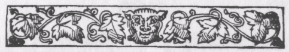
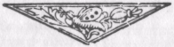

p.225

INDEX.

Abdera, Man of, [6](chap01.htm#p.6).  
Alewife and her Hens, [73](chap03.htm#p.73).  
Alfonsus, Peter, [45](chap02.htm#p.45).  
Arab and his Cow, [70](chap03.htm#p.70).  
Arab Schoolmaster, [83](chap04.htm#p.83).  
Arabian Idiot, [133](chap05.htm#p.131).*  
Arabian Nights,* [81](chap04.htm#p.81), [83](chap04.htm#p.83),
[133](chap05.htm#p.133), [146](chap05.htm#p.146).  
Arabian Noodles, [70](chap03.htm#p.70), [75](chap03.htm#p.75),
[107](chap04.htm#p.107), [147](chap05.htm#p.147).  
Armstrong's, Archie, *Banquet of Jests,* [74](chap03.htm#p.74).  
Ashton, John, [xiv](preface.htm#p.xiv).  
Ass and the Two Sharpers, [81](chap04.htm#p.81).  
Austwick, Carles of, [17](chap02.htm#p.17), [53](chap02.htm#p.53),
[54](chap02.htm#p.54).*  
Avadánas,* [53](chap02.htm#p.53).

Babrius, [53](chap02.htm#p.53).  
Bakki, Brothers of, [32](chap02.htm#p.32), [64](chap03.htm#p.64).  
Bang-eater and his Wife, [147](chap05.htm#p.147).  
Bang-eaters and the Dogs, [109](chap04.htm#p.109).  
Barrett, F.T., [9](chap01.htm#p.9).*  
Barrin' o' the Door,* [107](chap04.htm#p.107).  
Belmont, Fools of, [55](chap02.htm#p.55).*  
Beryn, Tale of,* [40](chap02.htm#p.40).  
Beschi, Father, [29](chap02.htm#p.29).*  
Bharataka Dwatrinsati,* [158](chap05.htm#p.158).*  
Bizarrures of the Sieur Gaulard,* [8](chap01.htm#p.8),
[12](chap01.htm#p.12), [20](chap02.htm#p.20), [76](chap03.htm#p.76).  
Bidpaï's Fables, [53](chap02.htm#p.53).  
Birth-Stories--*see* Játakas.  
Boccaccio's *Decameron,* [39](chap02.htm#p.39).  
"Boiling" River, [30](chap02.htm#p.30), [43](chap02.htm#p.43).  
Bond, The Lord's, [17](chap02.htm#p.17).  
Borde, Andrew, [23](chap02.htm#p.23).  
Bráhmans, Four Simple, [171](chap06.htm#p.171).  
Bromyard, John, [167](chap05.htm#p.167).  
Buddha's Five Precepts, [69](chap03.htm#p.69).  
Bull and the Gate, [54](chap02.htm#p.54).  
Bull of Siva, [48](chap02.htm#p.48).  
Burton's *Arabian Nights,* [83](chap04.htm#p.83).  
Busk's *Folk-Lore of Rome,* [204](chap07.htm#p.204).  
Butter eaten by a Dog, [18](chap02.htm#p.18).  
Buzzard, The Gothamite's, [38](chap02.htm#p.38).

Cabbage-Tree, [47](chap02.htm#p.47).  
Caftan on Tree, [90](chap04.htm#p.90).  
Calfs Head in a Pot, [89](chap04.htm#p.89).  
Campbell's *Popular Tales of the West Highlands,* [32](chap02.htm#p.32),
[33](chap02.htm#p.33), [34](chap02.htm#p.34), [35](chap02.htm#p.35),
[36](chap02.htm#p.36), [154](chap05.htm#p.154),
[193](chap07.htm#p.193).  
Cat and old Woman, [65](chap03.htm#p.65).  
Cat, Men of Schilda's, [61](chap03.htm#p.61).  
Cazette's *New Arabian Nights,* [133](chap05.htm#p.133).  
Ceylon -- *see* Sinhalese Noodles.  
Chamberlain, B.H., [130](chap05.htm#p.130).  
Cheese, The Gothamite's, [34](chap02.htm#p.34).  
Cheese on the Highway, [40](chap02.htm#p.40).  
Cheese, The Stolen, [91](chap04.htm#p.91).  
Chinese Noodles, [93](chap04.htm#p.93), [94](chap04.htm#p.94).  
Coelho's *Contes Portugueses,* [120](chap04.htm#p.120).

p.226

Colombo, Michele, [81](chap04.htm#p.81).  
Countryman and Dog, [79](chap03.htm#p.79).  
Cozens, F.W., [9](chap01.htm#p.9).  
Council-House, Dark, [57](chap03.htm#p.57).  
Crane's *Italian Popular Tales,* [117](chap04.htm#p.117),
[128](chap05.htm#p.128), [139](chap05.htm#p.139),
[202](chap07.htm#p.202), [204](chap07.htm#p.204).  
Cuckoo, Hedging in the, [26](chap02.htm#p.26).  
Cumeans and the bath, [4](chap01.htm#p.4); and the father's corpse,
[15](chap01.htm#p.15); and the fig-tree, [10](chap01.htm#p.10); and the
pot of honey, [19](chap02.htm#p.19); and the stolen clothes,
[4](chap01.htm#p.4).

Dark Council-House, [57](chap03.htm#p.57).  
Dasent's *Norse Tales,* [126](chap05.htm#p.126),
[212](chap07.htm#p.212).  
Dekker's *Gul's Horn Book,* [26](chap02.htm#p.26).  
Devil in the Meadow, [42](chap02.htm#p.42).*  
Disciplina Clericalis,* [45](chap02.htm#p.45).  
Doctor and Patients, [5](chap01.htm#p.5).  
Doctor's Apprentice, [168](chap05.htm#p.168).  
Dog that ate Honey, [18](chap02.htm#p.18).  
Door, Taking Care of the, [97](chap04.htm#p.97),
[98](chap04.htm#p.98).  
Dreams, The Good, [92](chap04.htm#p.92), [93](chap04.htm#p.93).  
Dubois, Abbé, [171](chap06.htm#p.171).

Ear, Biting one's own, [86](chap04.htm#p.86).  
Eberhard's *Hieraclis,* [3](chap01.htm#p.3).  
Eel, Drowning the, [33](chap02.htm#p.33).*  
El Conde Lucanor,* [162](chap05.htm#p.126).  
English typical booby, [139](chap05.htm#p.139).

*Fabliaux*, Le Grand's, [39](chap02.htm#p.39),
[163](chap05.htm#p.163).  
Family, Best of the, [165](chap05.htm#p.165).  
Farmer and his Pigs, [54](chap02.htm#p.54).  
Fisher, Indian Silly Son as, [163](chap05.htm#p.163).  
Fishers, Gothamite, [28](chap02.htm#p.28).  
Fleas, Bit by, [14](chap01.htm#p.14).*  
Folk-Lore in Southern India,* [212](chap07.htm#p.212). Fool and the
aloes-wood, [98](chap04.htm#p.98); and the birch-tree,
[151](chap05.htm#p.151); and the cotton, [99](chap04.htm#p.99); and the
cup lost in the sea, [99](chap04.htm#p.99); and the elephant-driver,
[51](chap02.htm#p.51); and his porridge, [119](chap04.htm#p.119); and
the *Ramáyana,* [70](chap03.htm#p.70); and the sack of meal,
[19](chap02.htm#p.19), [25](chap02.htm#p.25), [68](chap03.htm#p.68); and
the shopkeeper, [100](chap04.htm#p.100); at his fireside,
[119](chap04.htm#p.119); kicked by his mule, [119](chap04.htm#p.119); of
Hereford, [221](appendix.htm#p.221); of Huntingdon,
[222](appendix.htm#p.222).  
Fools and the buffalo, [101](chap04.htm#p.101); and the Bull of Siva,
[48](chap02.htm#p.48); and their inheritance, [118](chap04.htm#p.118);
and the mosquitoes, [95](chap04.htm#p.95); and the palm-trees,
[96](chap04.htm#p.96); and the trunks, [96](chap04.htm#p.96).  
Fortini's Italian Novels, [162](chap05.htm#p.162).  
Fuller, Thomas, on the Gothamites, [20](chap02.htm#p.20).  
Furnivall, F.J., [23](chap02.htm#p.23).

Gaulard, The Sieur, [8](chap01.htm#p.8), [12](chap01.htm#p.12),
[20](chap02.htm#p.20), [76](chap03.htm#p.76).  
Geese and Tortoise, [52](chap02.htm#p.52).*  
Gesta Romanorum,* [117](chap04.htm#p.117), [163](chap05.htm#p.163).  
Gibb's *Forty Vazírs,* [109](chap04.htm#p.109), [166](chap05.htm#p.166),
[167](chap05.htm#p.167).  
Giufà, the Sicilian Booby, [97](chap04.htm#p.97),
[139](chap05.htm#p.139), [165](chap05.htm#p.165).  
Goat and Old Woman, [66](chap03.htm#p.66).*  
Gooroo Paramartan,* [29](chap02.htm#p.29), [37](chap02.htm#p.37),
[157](chap05.htm#p.157).  
Gossips and their late Husbands, [74](chap03.htm#p.74).  
Gossips at the Alehouse, [43](chap02.htm#p.43).*  
Gotham, Tales of the Mad Men of,* [xiii](preface.htm#p.xiii).,
[20](chap02.htm#p.20), [24](chap02.htm#p.24)-[44](chap02.htm#p.44).  
Grazzini's Florentine Fool, [161](chap05.htm#p.161).  
Grecian Noodles, [1](chap01.htm#p.1)-[15](chap01.htm#p.15).

Halliwell-Phillipps, J.O., [xiii](preface.htm#p.xiii).,
[13](chap01.htm#p.13), [22](chap02.htm#p.22), [27](chap02.htm#p.27),
[53](chap02.htm#p.53).  
Hama and Hums, Men of, [75](chap03.htm#p.75).  
Hazlitt, W.C., xiii., [12](chap01.htm#p.12).  
Heaven, Sorry he has gone to, [74](chap03.htm#p.74).  
Herdsman, The Foolish, [106](chap04.htm#p.106).  
Herodotus, Stephens' *Apology* for, [119](chap04.htm#p.119).  
Hierokles, Jests of, [2](chap01.htm#p.2).*  
Hitopadesa,* [162](chap05.htm#p.162).  
Honey, Pot of, [6](chap01.htm#p.6), [18](chap02.htm#p.18).  
Hunter's Dream of a Boar, [4](chap01.htm#p.4).

p.227

Icelandic Noodles, [32](chap02.htm#p.32), [64](chap03.htm#p.64),
[163](chap05.htm#p.163).  
Indian Noodles, [29](chap02.htm#p.29), [37](chap02.htm#p.37),
[44](chap02.htm#p.44), [48](chap02.htm#p.48), [51](chap02.htm#p.51),
[70](chap03.htm#p.70), [96](chap04.htm#p.96),
[97](chap04.htm#p.97)-[106](chap04.htm#p.106), [111](chap04.htm#p.111),
[118](chap04.htm#p.118), [158](chap05.htm#p.158),
[161](chap05.htm#p.161), [163](chap05.htm#p.163),
[170](chap05.htm#p.170), [212](chap07.htm#p.212).  
Italian Noodles, [115](chap04.htm#p.115), [127](chap05.htm#p.127),
[143](chap05.htm#p.143), [160](chap05.htm#p.160),
[197](chap07.htm#p.192), [202](chap07.htm#p.202),
[204](chap07.htm#p.204).  
Irish Labourer and Farmer, [8](chap01.htm#p.8).  
Irishman and his ass, [119](chap04.htm#p.119).  
Irishman and his hens, [120](chap04.htm#p.120).  
Irishman and lost shovel, [99](chap04.htm#p.99).  
Irishmen and mosquitoes, [14](chap01.htm#p.14).  
Irishman's Dream, [92](chap04.htm#p.92).

Jack of Dover's Quest, [219](appendix.htm#p.219).  
Japanese Noodle, [130](chap05.htm#p.130).  
Játakas (Buddhist Birth-Stories), [52](chap02.htm#p.52),
[65](chap03.htm#p.65), [95](chap04.htm#p.95),
[164](chap05.htm#p.164).*  
Jests of Scogin,* [162](chap05.htm#p.162).  
Joe Miller's Jest-Book, [1](chap01.htm#p.1), [2](chap01.htm#p.2).  
Judge and Thieves, [87](chap04.htm#p.87).

Kabaïl Tales, [37](chap02.htm#p.37), [154](chap05.htm#p.154).  
Kashmírí Tales, [65](chap03.htm#p.65), [89](chap04.htm#p.89),
[111](chap04.htm#p.111).*  
Kathá Manjarí,* [11](chap01.htm#p.11), [70](chap03.htm#p.70),
[100](chap04.htm#p.100), [163](chap05.htm#p.163).*  
Katná Sarit Ságara,* [48](chap02.htm#p.48), [53](chap02.htm#p.53),
[120](chap04.htm#p.120), [164](chap05.htm#p.164).  
Kerchief, The, [90](chap04.htm#p.90).  
Khoja Nasr-ed-Dín, [89](chap04.htm#p.89).  
King's Stupid Son, The, [167](chap05.htm#p.167).  
Knife, The Gothamites', [53](chap02.htm#p.53).  
Knowles, J.H., [66](chap03.htm#p.66), [113](chap04.htm#p.113).

*Laird of Logan,* [13](chap01.htm#p.13).  
Leger's *Conies Populaires Slaves,* [128](chap05.htm#p.128),
[154](chap05.htm#p.154).

Marie de France, [46](chap02.htm#p.46).*  
Mery Tales and Quicke Ansiveres,* [161](chap05.htm#p.161).  
Miller's Jest-Book, [1](chap01.htm#p.1), [2](chap01.htm#p.2).  
Millstone of the Schildburgers, [59](chap03.htm#p.59).  
Minstrel and Pupil, [166](chap05.htm#p.166).  
Monk Transformed, [81](chap04.htm#p.81).  
Moon a green cheese, [44](chap02.htm#p.44).  
Moon in the well, [92](chap04.htm#p.92).  
Moon swallowed by an ass, [46](chap02.htm#p.46).  
"Mortuus Loquens," [160](chap05.htm#p.160).  
Mummy, The, [15](chap01.htm#p.15).

Nasr-ed-Dín Khoja, [89](chap04.htm#p.89).  
Natesa Sastri Pandit, [212](chap07.htm#p.212).  
Needham's *Hieroclis,* [3](chap01.htm#p.3).  
Noodles, The Three Great, [191](chap07.htm#p.191).  
Norfolk Noodles, [17](chap02.htm#p.17).  
Norse Noodles, [123](chap05.htm#p.123), [207](chap07.htm#p.207).  
Notts Bridge, [24](chap02.htm#p.24).

*Orientalist, The*, [69](chap03.htm#p.69), [87](chap04.htm#p.87),
[114](chap04.htm#p.114), [143](chap05.htm#p.143),
[160](chap05.htm#p.160).

*Pancha Tantra,* [67](chap03.htm#p.67), [171](chap06.htm#p.171).  
Paradise, Man who came from, [204](chap07.htm#p.204),
[210](chap07.htm#p.210), [212](chap07.htm#p.212),
[217](chap07.htm#p.217).  
Pedant, bald man, and barber, [6](chap01.htm#p.6); and the lost book,
[13](chap01.htm#p.13); and his dream, [5](chap01.htm#p.5),
[6](chap01.htm#p.6); and the jar of feathers, [5](chap01.htm#p.5): and
his jar of wine, [9](chap01.htm#p.9); and the mirror,
[9](chap01.htm#p.9); and the two slave-boys, [4](chap01.htm#p.4); and
his slave who died, [8](chap01.htm#p.8); and the sparrows,
[5](chap01.htm#p.5); and the twin-brothers, [12](chap01.htm#p.12); and
his tomb, [8](chap01.htm#p.8).  
Persian Noodle, [7](chap01.htm#p.7).  
Persian Tales, [7](chap01.htm#p.7), [66](chap03.htm#p.66),
[79](chap03.htm#p.79).*  
Philotimus,* [27](chap02.htm#p.27).  
Poet and the Dogs, [79](chap03.htm#p.79).  
Poggius' *Facetice,* [160](chap05.htm#p.160), [162](chap05.htm#p.162).  
Priest of Gotham, [42](chap02.htm#p.42).  
Princess caused to grow, [102](chap04.htm#p.102).  
Pupil, The Attentive, [165](chap05.htm#p.165).

Ralston's *Russian Folk-Tales,* [48](chap02.htm#p.48),
[153](chap05.htm#p.153).  
Relic-hunter, [95](chap04.htm#p.95).  
Rents of Gothamites, [27](chap02.htm#p.27).  
Right Hand or Left, [91](chap04.htm#p.91).  
River, "Boiling," [30](chap02.htm#p.30), [43](chap02.htm#p.43).  
Rivière's *Contes Populaíres de la Kabylie du Djurdjura,*
[37](chap02.htm#p.37), [154](chap05.htm#p.154).

p.228

Russian Noodles, [47](chap02.htm#p.47), [128](chap05.htm#p.128),
[151](chap05.htm#p.151), [154](chap05.htm#p.154).
[195](chap07.htm#p.195).  
Rustic and the Dog, [79](chap03.htm#p.79).

*Sacke Full of Newes,* [46](chap02.htm#p.46), [97](chap04.htm#p.97).  
Sa'dí's *Gulistán,* [xi](preface.htm#p.xi), [79](chap03.htm#p.79).  
Schilda, The Men of, [56](chap03.htm#p.56).  
Schoolmaster's Lady-love, [83](chap04.htm#p.83).  
Sesame, Roasted, [120](chap04.htm#p.120).  
Sheep's Eyes, Casting, [41](chap02.htm#p.41), [126](chap05.htm#p.126),
[127](chap05.htm#p.127).  
Sicilian Boobies, [97](chap04.htm#p.97), [116](chap04.htm#p.116),
[139](chap05.htm#p.139), [165](chap05.htm#p.165).  
Silent Noodles, [107](chap04.htm#p.107)-[117](chap04.htm#p.117).  
Silly Matt, [123](chap05.htm#p.123).  
Silly Son, The, [121](chap05.htm#p.121).  
Simple Simon, [121](chap05.htm#p.121), [122](chap05.htm#p.122).  
Simpleton and Sharpers, [81](chap04.htm#p.81).*  
Sindibád Náma,* [66](chap03.htm#p.66).  
Sinhalese Noodles, [67](chap03.htm#p.67)-[69](chap03.htm#p.69),
[87](chap04.htm#p.87), [89](chap04.htm#p.89), [113](chap04.htm#p.113),
[141](chap05.htm#p.141), [165](chap05.htm#p.165),
[179](chap06.htm#p.179), [217](chap07.htm#p.217).  
Smith, Alexander, [9](chap01.htm#p.9).  
Spade, The Stolen, [94](chap04.htm#p.94).  
Spinning-Wheel, The, [36](chap02.htm#p.36).  
Stephens, Henry, Tales by, [119](chap04.htm#p.119).  
Stokes' *Indian Fairy Tales,* [154](chap05.htm#p.154).*  
Sutnma Prœdicantium,* The, [167](chap05.htm#p.167).

Tabourot, Etienne, [8](chap01.htm#p.8).*  
Tales and Quicke Answeres,* [161](chap05.htm#p.161).  
Tawney, C.H., [48](chap02.htm#p.48).  
Taylor's *Wit and Mirth,* [9](chap01.htm#p.9), [10](chap01.htm#p.10),
[74](chap03.htm#p.74), [78](chap03.htm#p.78).  
Thief on a Tree, [11](chap01.htm#p.11).  
Thorns, W.J., xii., [56](chap03.htm#p.56).  
Thoroton's *History of Nottinghamshire,* [21](chap02.htm#p.21).  
Three Greatest Noodles. [191](chap07.htm#p.191).  
Treasure Trove, [144](chap05.htm#p.144), [151](chap05.htm#p.151),
[154](chap05.htm#p.154).  
Trivet, The Gothamite's, [36](chap02.htm#p.36).  
Turkish Noodles, [11](chap01.htm#p.11), [86](chap04.htm#p.86),
[90](chap04.htm#p.90), [93](chap04.htm#p.93), [109](chap04.htm#p.109),
[166](chap05.htm#p.166), [167](chap05.htm#p.167).  
Twelve Fishers, The, [28](chap02.htm#p.28).  
Twin Brothers, [12](chap01.htm#p.12).

Vives, Ludovicus, [46](chap02.htm#p.46).

*Warton's History of English Poetry,* [22](chap02.htm#p.22).  
Washerman and his young Ass, [103](chap04.htm#p.103).  
Wasp's Nest, [40](chap02.htm#p.40).  
"Whittle to the Tree," [53](chap02.htm#p.53).  
Widows, The Two, [74](chap03.htm#p.74).  
Wiltshire Noodles, [17](chap02.htm#p.17), [54](chap02.htm#p.54).  
Wither's *Abuses Whipt and Stript,* [26](chap02.htm#p.26).*  
*Wolf's Tail, The, [91](chap04.htm#p.91).  
Wood, Anthony, on the Gotham Tales. [23](chap02.htm#p.23).  
Worsted Balls, The, [35](chap02.htm#p.35).  
Wrestler and the Wag, [7](chap01.htm#p.7).  
Wrong Man wakened, [6](chap01.htm#p.6), [7](chap01.htm#p.7).

