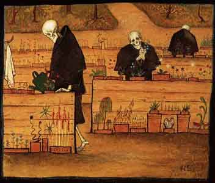

  
[Intangible Textual Heritage](../../index)  [Misc Texts](../index.md) 

------------------------------------------------------------------------

# Funeral Customs

## by Bertram S. Puckle

#### \[1926\]

------------------------------------------------------------------------

[Title Page](fcod00.md)  
[Forword](fcod01.md)  
[Acknowledgment](fcod02.md)  
[Contents](fcod03.md)  
[Chapter I: The Provisions of Nature](fcod04.md)  
[Chapter II: Death Warnings--When Does Death Take Place?](fcod05.md)  
[Chapter III: Preparation For Burial, Coffins, ''Grave-Goods,''
Suttee](fcod06.md)  
[Chapter IV: Wakes, Mutes, Wailers, Sin-Eating, Totemism,
Death-Taxes](fcod07.md)  
[Chapter V: Bells, Mourning](fcod08.md)  
[Chapter VI: Funeral Feasts and Processions](fcod09.md)  
[Chapter VII: Early Burial-Places](fcod10.md)  
[Chapter VIII: Churchyards, Cemeteries, Orientation and Other Burial
Customs](fcod11.md)  
[Chapter IX: Trees, Flowers, Body-Snatching](fcod12.md)  
[Chapter X: Plague](fcod13.md)  
[Chapter XI: State and Public Funerals](fcod14.md)  
[Chapter XII: Cremation, Embalming](fcod15.md)  
[Chapter XIII: In Memoriam](fcod16.md)  
[Chapter XIV: Memorials, Epitaphs, Rings and Mourning Cards](fcod17.md)  
