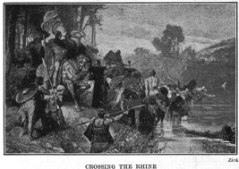
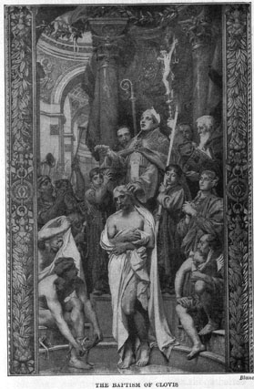

  
[Intangible Textual Heritage](../../index)  [Miscellaneous](../index) 
[Index](index)  [Previous](fmma08)  [Next](fmma10) 

------------------------------------------------------------------------

*Famous Men of the Middle Ages*, by John Henry Haaren, \[1904\], at
Intangible Textual Heritage

------------------------------------------------------------------------

CLOVIS

KING FROM 481-511 A.D.

 

I

 

WHILE the power of the Roman Empire was declining there dwelt on the
banks of the River Rhine a number of savage Teuton tribes called Franks.
The word Frank means free, and those tribes took pride in being known as
Franks or freemen.

 

The Franks occupied the east bank of the Rhine for about two hundred
years. Then many of the tribes crossed the river in search of new homes.
The region west of the river was at that time called Gaul. Here the
Franks established themselves and became a powerful people. From their
name the country was afterwards called France.

 

Each tribe of the Franks had its own king. The greatest of all these
kings was Chlodwig, or Clovis, as we call him, who became ruler of his
tribe in the year 481, just six years after Theodoric became king of the
Ostrogoths. Clovis was then only sixteen years of age. But though he was
so young he proved in a very short time that he could govern as well as
older men. He was intelligent and brave. No one ever knew him to be
afraid of anything even when he was but a child. His father, who was
named Childeric, often took him to wars which the Franks had with
neighboring tribes, and he was very proud of his son's bravery. The
young man was also a bold and skillful horseman. He could tame and ride
the most fiery horse.

 

When Clovis became king of the Franks a great part of Gaul still
belonged to Rome. This part was then governed by a Roman general, named
Syagrius. Clovis resolved to drive the Romans out of the country, and he
talked over the matter with the head men of his army.

 

"My desire," said he, "is that the Franks shall have possession of every
part of this fair land. I shall drive the Romans and their friends away
and make Gaul the empire of the Franks."

 

II

 

AT this time the Romans had a great army in Gaul.  It was encamped near
the city of Soissons and was commanded by Syagrius. Clovis resolved to
attack it and led his army at once to Soissons. When he came near the
city he summoned Syagrius to surrender. Syagrius refused and asked for
an interview with the commander of the Franks. Clovis consented to meet
him, and an arrangement was made that the meeting should take place in
the open space between the two armies. When Clovis stepped out in front
of his own army, accompanied by some of his savage warriors, Syagrius
also came forward. But the moment he saw the king of the Franks he
laughed loudly and exclaimed:

 

"A boy! A boy has come to fight me! The Franks with a boy to lead them
have come to fight the Romans."

 

Clovis was very angry at this insulting language and shouted back:

 

"Ay, but this boy will conquer you."

 

Then both sides prepared for battle. The Romans thought that they would
win the victory easily, but they were mistaken. Every time that they
made a charge upon the Franks they were beaten back by the warriors of
Clovis. The young king himself fought bravely at the head of his men and
with his own sword struck down a number of the Romans. He tried to find
Syagrius and fight with him; but the Roman commander was nowhere to be
found. Early in the battle he had fled from the field, leaving his men
to defend themselves as best they could.

 

The Franks gained a great victory. With their gallant boy king leading
them on they drove the Roman's before them, and when the battle was over
they took possession of the city of Soissons. Clovis afterwards
conquered all the other Frankish chiefs and made himself king of all the
Franks.

 

III

 

NOT very long after Clovis became king he heard of a beautiful young
girl, the niece of Gondebaud, king of Burgundy, and he thought he would
like to marry her. Her name was Clotilde, and she was an orphan, for her
wicked uncle Gondebaud had killed her father and mother. Clovis sent one
of his nobles to Gondebaud to ask her for his wife. At first Gondebaud
thought of refusing to let the girl go. He feared that she might have
him punished for the murder of her parents if she became the wife of so
powerful a man as Clovis. But he was also afraid that by refusing he
would provoke the anger of Clovis; so he permitted the girl to be taken
to the court of the king of the Franks. Clovis was delighted when he saw
her; and they were immediately married.

 

Clotilde was a devout Christian, and she wished very much to convert her
husband, who, like most of his people, was a worshiper of the heathen
gods. But Clovis was not willing to give up his own religion.
Nevertheless Clotilde continued to do every thing she could to persuade
him to become a Christian.

 

 

 

Soon after his marriage Clovis had a war with a tribe called the
Alemanni. This tribe had crossed the Rhine from Germany and taken
possession of some of the eastern provinces of Gaul. Clovis speedily got
his warriors together and marched against them. A battle was fought at a
place called Tolbiac, not far from the present city of Cologne. In this
battle the Franks were nearly beaten, for the Alemanni were fierce and
brave men and skillful fighters. When Clovis saw his soldiers driven
back several times he began to lose hope, but at that moment he thought
of his pious wife and of the powerful God of whom she had so often
spoken. Then he raised his hands to heaven and earnestly prayed to that
God.

 

"O God of Clotilde," he cried, "help me in this my hour of need. If thou
wilt give me victory now I will believe in thee."

 

Almost immediately the course of the battle began to change in favor of
the Franks. Clovis led his warriors forward once more, and this time the
Alemanni fled before them in terror. The Franks gained a great victory,
and they believed it was in answer to the prayer of their king.

 

When Clovis returned home he did not forget his promise. He told
Clotilde how he had prayed to her God for help and how his prayer had
been heard, and he said he was now ready to become a Christian. Clotilde
was very happy on hearing this, and she arranged that her husband should
be baptized in the church of Rheims on the following Christmas day.

 

Meanwhile Clovis issued a proclamation to his people declaring that he
was a believer in Christ, and giving orders that all the images and
temples of the heathen gods should be destroyed. This was immediately
done, and many of the people followed his example and became Christians.

 

 

 

Clovis was a very earnest and fervent convert. One day the bishop of
Rheims, while instructing him in the doctrines of Christianity,
described the death of Christ. As the bishop proceeded Clovis became
much excited, and at last jumped up from his seat and exclaimed:

 

"Had I been there with my brave Franks I would have avenged His wrongs."

 

On Christmas day a great multitude assembled in the church at Rheims to
witness the baptism of the king. A large number of his fierce warriors
were baptized at the same time. The service was performed with great
ceremony by the bishop of Rheims, and the title of "Most Christian King"
was conferred on Clovis by the Pope. This title was ever afterwards
borne by the kings of France.

 

Like most of the kings and chiefs of those rude and barbarous times,
Clovis often did cruel and wicked things. When Rheims was captured,
before he became a Christian, a golden vase was taken by some soldiers
from the church. The bishop asked Clovis to have it returned, and Clovis
bade him wait until the division of spoils. All the valuable things
taken by soldiers in war were divided among the whole army, each man
getting his share according to rank. Such things were called spoils.

 

 

 

When the next time came for dividing spoils Clovis asked that he might
have the vase over and above his regular share, his intention being to
return it to the bishop. But one of the soldiers objected, saying that
the king should have no more than his fair share, and at the same time
shattered the vase with his ax. Clovis was very angry, but at the time
said nothing. Soon afterwards, however, there was the usual examination
of the arms of the soldiers to see that they were in proper condition
for active service. Clovis himself took part in the examination, and
when he came to the soldier who had broken the vase he found fault with
the condition of his weapons and with one blow of his battle-ax struck
the man dead.

 

IV

 

THE next war that Clovis engaged in was with some tribes of the Goths
who occupied the country called Aquitaine lying south of the River
Loire. He defeated them and added Aquitaine to the kingdom of the
Franks.

 

Clovis afterwards made war upon other people of Gaul and defeated them.
At last all the provinces from the lower Rhine to the Pyrenees Mountains
were compelled to acknowledge him as king. He then went to reside at the
city of Paris, which he made the capital of his kingdom. He died there
A.D. 511.

 

The dynasty or family of kings to which he belonged is known in history
as the Merovingian dynasty. It was so called from Meroveus, the father
of Childeric and grandfather of Clovis.

 

 

------------------------------------------------------------------------

[Next: Justinian The Great. Emperor From 527-565 A.D.](fmma10)
