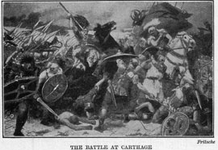
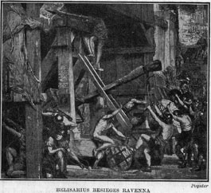

  
[Intangible Textual Heritage](../../index)  [Miscellaneous](../index) 
[Index](index)  [Previous](fmma09)  [Next](fmma11) 

------------------------------------------------------------------------

*Famous Men of the Middle Ages*, by John Henry Haaren, \[1904\], at
Intangible Textual Heritage

------------------------------------------------------------------------

JUSTINIAN THE GREAT

EMPEROR FROM 527-565 A.D.

 

I

IN the time of Clovis the country now called Bulgaria was inhabited by
Goths. One day a poor shepherd boy, about sixteen years of age, left his
mountain home in that country to go to the city of Constantinople, which
was many miles away. The boy had no money to pay the expenses of the
journey, but he was determined to go, even though he should have to walk
every step of the road and live on fruits that he could gather by the
way. He was a bright, clever boy who had spent his life hitherto in a
village, but was now eager to go out into the world to seek his fortune.

 

Some years before, this boy's uncle, who was named Justin, had gone to
Constantinople and joined the Roman army. He was so brave and so good a
soldier that he soon came to be commander of the imperial guard which
attended the emperor.

 

The poor shepherd boy had heard of the success of his uncle, and this
was the reason why he resolved to set off for the big city.  So he
started down the mountain and trudged along the valley in high hope,
feeling certain that he would reach the end of his journey in safety. It
was a difficult and dangerous journey, and it took him several weeks,
for he had to go through dark forests and to cross rivers and high
hills; but at last one afternoon in midsummer he walked through the main
gate of Constantinople, proud and happy that he had accomplished his
purpose.

 

He had no trouble in finding his Uncle Justin; for everybody in
Constantinople knew the commander of the emperor's guards. And when the
boy appeared at the great man's house and told who he was, his uncle
received him with much kindness. He took him into his own family, and
gave him the best education that could be had in the city.

 

As the boy was very talented and eager for knowledge he soon became an
excellent scholar. He grew up a tall, good-looking man, with black eyes
and curly hair, and he was always richly dressed. He was well liked at
the emperor's court, and was respected by everybody on account of his
learning.

 

II

 

ONE day a great change came for both uncle and nephew.  The emperor
died; and the people chose Justin to succeed him. He took the title of
Justinus I (Jus-ti-nus), and so the young scholar, who had once been a
poor shepherd boy, was now nephew of an emperor.

 

 

 

After some years Justinus was advised by his nobles to take the young
man, who had adopted the name of Justinian, to help him in ruling the
empire. Justinus agreed to this proposal, for he was now old and in
feeble health, and not able himself to attend to the important affairs
of government. He therefore called the great lords of his court together
and in their presence he placed a crown on the head of his nephew, who
thus became joint emperor with his uncle. The uncle died only a few
months after, and then Justinian was declared emperor. This was in the
year 527. Justinian reigned for nearly forty years and did so many
important things that he was afterwards called Justinian the Great.

 

He had many wars during his reign, but he himself did not take part in
them. He was not experienced as a soldier, for he had spent most of his
time in study. He was fortunate enough, however, to have two great
generals to lead his armies. One of them was named Belisarius and the
other Narses.

 

Belisarius was one of the greatest soldiers that ever lived. He gained
wonderful victories for Justinian, and conquered some of the old Roman
provinces that had been lost for many years.

 

The victories of these two generals largely helped to make the reign of
Justinian remarkable in history. Many years before he ascended the
throne the Vandals, as you have read, conquered the northern part of
Africa and established a kingdom there with Carthage as its capital. The
Vandal king in the time of Justinian was named Gelimer , and he lived in
Carthage.

 

Justinian resolved to make war on this king in order to recover Northern
Africa and make it again a part of the Empire. So Belisarius was sent to
Africa with an army of thirty-five thousand men and five thousand
horses, that were carried on a fleet of six hundred ships. It took this
fleet three months to make the voyage from Constantinople to Africa. The
same voyage may now be made in a very few days. But in the time of
Belisarius there were no steamships, and nothing was known of the power
of steam for moving machinery. The ships or galleys were sailing
vessels; and when there was no wind they could make no progress except
by rowing.

 

When Belisarius reached Africa he left five men as a guard in each
vessel, and with the body of his army he marched for some days along the
coast. The people received him in a friendly way, for they had grown
tired of the rule of the Vandals, and preferred to be under the
government of the Romans.

 

 

 

About ten miles from Carthage he met a large army led by the brother of
Gelimer. A battle immediately took place, and the Vandals were utterly
defeated. Gelimer's brother was killed, and the king himself, who had
followed with another army and joined the fight, was also defeated and
fled from the field.  Belisarius then proceeded to Carthage and took
possession of the city.

 

Soon afterwards Gelimer collected another army and fought the Romans in
another battle, twenty miles from Carthage; but Belisarius again
defeated him and the Vandal king again fled.  This was the end of the
Vandal king in Africa. In a short time Gelimer gave himself up to
Belisarius, who took him to Constantinople. Justinian set apart an
estate for him to live upon, and the conquered king passed the rest of
his life in peaceful retirement.

 

After conquering the Vandals Justinian resolved to conquer Italy, which
was then held by the Ostrogoths. A large army was got together and put
under the command of Belisarius and Narses, who immediately set out for
Italy. When they arrived there they marched straight to Rome, and after
some fighting took possession of the city. But in a few months, Vitiges,
king of the Goths, appeared with an army before the gates and challenged
Belisarius and Narses to come out and fight.

 

The Roman generals, however, were not then ready to fight, and so the
Ostrogoth king laid siege to the city, thinking that he would compel the
Romans to surrender.

 

But instead of having any thought of surrender, Belisarius was preparing
his men for fight, and when they were ready he attacked Vitiges and
defeated him. Vitiges retired to Ravenna, and Belisarius quickly
followed, and made such an assault on the city that it was compelled to
surrender. The Ostrogoth army was captured, and Vitiges was taken to
Constantinople a prisoner.

 

Belisarius and Narses then went to Northern Italy, and, after a long
war, conquered all the tribes there. Thus the power of Justinian was
established throughout the whole country, and the city of Rome was again
under the dominion of a Roman emperor.

 

 

 

While his brave generals were winning these victories for the Empire,
Justinian himself was busy in making improvements of various kinds at
the capital. He erected great public buildings, which were not only
useful but ornamental to the city.  The most remarkable of them was the
very magnificent cathedral of St. Sophia, for a long time the grandest
church structure in the world. The great temple still exists in all its
beauty and grandeur, but is now used as a Mohammedan mosque.

 

But the most important thing that Justinian did--the work for which he
is most celebrated--was the improving and collecting of the laws. He
made many excellent new laws and reformed many of the old laws, so that
he became famous as one of the greatest of the world's legislators. For
a long time the Roman laws had been difficult to understand. There was a
vast number of them, and different writers differed widely as to what
the laws really were and what they meant. Justinian employed a great
lawyer, named Tribonian, to collect and simplify the principal laws. The
collection which he made was called the Code of Justinian. It still
exists, and is the model according to which most of the countries of
Europe have made their laws.

 

Justinian also did a great deal of good by establishing a number of
manufactures in Constantinople. It was he who first brought silk-worms
into Europe.

 

To the last year of his life Justinian was strong and active and a hard
worker. He often worked or studied all day and all night without eating
or sleeping. He died in 565 at the age of eighty-three years.

 

------------------------------------------------------------------------

[Next: Mohammed. Lived from 570-632 A.D.](fmma11)
