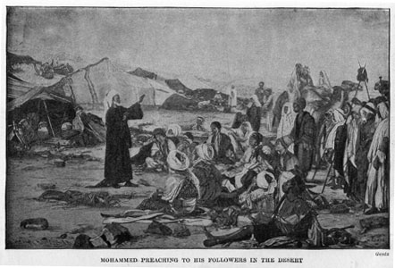
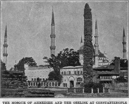
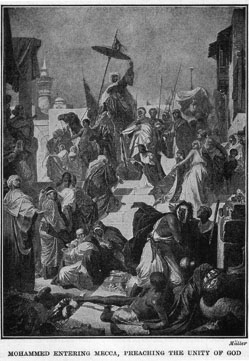
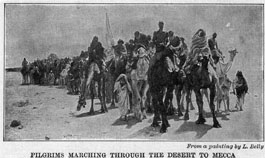
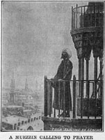

  
[Intangible Textual Heritage](../../index)  [Miscellaneous](../index.md) 
[Index](index)  [Previous](fmma10)  [Next](fmma12.md) 

------------------------------------------------------------------------

*Famous Men of the Middle Ages*, by John Henry Haaren, \[1904\], at
Intangible Textual Heritage

------------------------------------------------------------------------

MOHAMMED

LIVED FROM 570-632 A.D.

 

I

 

A GREAT number of people in Asia and Africa and much of those in Turkey
in Europe profess the Mohammedan religion. They are called Mohammedans,
Mussulmans or Moslems; and the proper name for their religion is
"Islam," which means obedience, or submission.

 

The founder of this religion was a man named Mohammed, or Mahomet. He
was born in the year 570, in Mecca, a city of Arabia. His parents were
poor people, though, it is said, they were descended from Arabian
princes. They died when Mohammed was a child, and his uncle, a
kind-hearted man named Abutalib, took him home and brought him up.

 

When the boy grew old enough he took care of his uncle's sheep and
camels. Sometimes he went on journeys with his uncle to different parts
of Arabia, to help him in his business as a trader. On these journeys
Mohammed used to ride on a camel, and he soon became a skillful
camel-driver.

 

Mohammed was very faithful and honest in all his work. He always spoke
the truth and never broke a promise. "I have given my promise," he would
say, "and I must keep it." He became so well known in Mecca for being
truthful and trustworthy that people gave him the name of El Amin, which
means "the truthful."

 

At this time he was only sixteen years of age; but the rich traders had
so much confidence in him that they gave him important business to
attend to, and trusted him with large sums of money. He often went with
caravans to a port on the shore of the Red Sea, sixty-five miles from
Mecca, and sold there the goods carried by the camels. Then he guided
the long line of camels back to Mecca, and faithfully paid over to the
owners of the goods the money he had received.

 

Mohammed had no school education. He could neither read nor write. But
he was not ignorant. He knew well how to do the work intrusted to him,
and was a first-rate man of business.

 

II

 

ONE day, when Mohammed was about twenty-five years old, he was walking
through the bazaar or market-place, of Mecca when he met the chief
camel-driver of a wealthy woman named Khadijah. This woman was a widow,
who was carrying on the business left her by her husband. As soon as the
camel-driver saw Mohammed he stopped him and said:

 

"My mistress wishes to see you before noon. I think she intends to
engage you to take charge of her caravans."

 

Mohammed waited to hear no more. As quickly as possible he went to the
house of Khadijah; for he was well pleased at the thought of being
employed in so important a service. The widow received him in a very
friendly way.  She said:

 

"I have heard much of you among the traders. They say that though you
are so young you are a good caravan manager and can be trusted. Are you
willing to take charge of my caravans and give your whole time and
service to me?"

 

Mohammed was delighted.

 

"I accept your offer," said he, "and I shall do all I can to serve and
please you."

 

Khadijah then engaged him as the manager of her business; and he served
her well and faithfully. She thought a great deal of him, and he was
much attracted to her, and soon they came to love one another and were
married.

 

As he was now the husband of a rich woman he did not need to work very
hard. He still continued to attend to his wife's business; but he did
not make so many journeys as before. He spent much of his time in
thinking about religion. He learned all that he could about Judaism and
Christianity; but he was not satisfied with either of them.

 

At that time most of the people of Arabia worshiped idols. Very few of
them were Christians.

 

Mohammed was very earnest and serious. In a cave on Mount Hira, near
Mecca, he spent several weeks every year in prayer and religious
meditation. He declared that, while praying in his cave, he often had
visions of God and heaven. He said that many times the angel Gabriel
appeared to him and revealed to him the religion which he afterwards
taught his followers. As he himself could not write, he committed to
memory all that the angel told him, and had it written in a book. This
book is called the "Koran," which means, like our own word Bible, the
"Book."  The Koran is the Bible of Mohammedans.

 

III

 

WHEN Mohammed returned home after the angel had first spoken to him, he
told his wife of what he had seen and heard. She at once believed and so
became a convert to the new religion. She fell upon her knees at the
feet of her husband and cried out:

 

"There is but one God.  Mohammed is God's prophet."

 

Mohammed then told the story to other members of his family. Some of
them believed and became his first followers. Soon afterwards he began
to preach to the people. He spoke in the market and other public places.
Most of those who heard him laughed at what he told them; but some poor
people and a few slaves believed him and adopted the new religion.
Others said he was a dreamer and a fool.

 

Mohammed, however, paid no heed to the insults he received. He went on
telling about the appearance of Gabriel and preaching the doctrines
which he said the angel had ordered him to teach the people.

 

Often while speaking in public Mohammed had what he called a "vision of
heavenly things."  At such times his face grew pale as death, his eyes
became red and staring, he spoke in a loud voice, and his body trembled
violently. Then he would tell what he had seen in his vision.

 

 

 

After a time the number of his followers began to increase. People came
from distant parts of Arabia and from neighboring countries to hear him.
One day six of the chief men of Medina, one of the largest cities of
Arabia, listened earnestly to his preaching and were converted. When
they returned home they talked of the new religion to their
fellow-citizens, and a great many of them became believers.

 

But the people of Mecca, Mohammed's own home, were nearly all opposed to
him. They would not believe what he preached, and they called him an
impostor. The people of the tribe to which he himself belonged were the
most bitter against him. They even threatened to put him to death as an
enemy of the gods.

 

About this time Mohammed's uncle and wife died, and he had then hardly
any friends in Mecca. He therefore resolved to leave that city and go to
Medina. Numbers of the people there believed his doctrines and wished
him to come and live among them. So he secretly left his native town and
fled from his enemies. With a few faithful companions he made his escape
to Medina.

 

It was in the year of our Lord 622 that Mohammed fled from Mecca. This
event is very important in Mohammedan history.  It is called "the flight
of the prophet," or "the Hejira," a word which means flight.  The Hejira
is the beginning of the Mohammedan era; and so in all countries where
the rulers and people are Mohammedans, the years are counted from the
Hejira instead of from the birth of Christ.

 

 

 

On his arrival in Medina the people received Mohammed with great
rejoicing. He lived there the remainder of his life. A splendid church
was built for him in Medina. It was called a mosque, and all Mohammedan
churches, or places of worship, are called by this name. It means a
place for prostration or prayer.

 

 

 

IV

 

MOHAMMED thought that it was right to spread his religion by force, and
to make war on "unbelievers", as he called all people who did not accept
his teaching. He therefore got together an army and fought battles and
unbelievers. He gained many victories.  He marched against Mecca with an
army of ten thousand men, and the city surrendered with little
resistance. The people then joined his religion and destroyed their
idols. Before very long all the inhabitants of Arabia and many of the
people of the neighboring countries became Mohammedans.

 

Mohammed died in Medina in the year of our Lord 632, or year 11 of the
Hejira. He was buried in the mosque in which he had held religious
services for so many years; and Medina has ever since been honored,
because it contains the tomb of the Prophet. It is believed by his
followers that the body still lies in the coffin in the same state as
when it was first buried. There is also a story that the coffin of
Mohammed rests somewhere between heaven and earth, suspended in the air.
But this fable was invented by enemies to bring ridicule on the prophet
and his religion.

 

The tomb of Mohammed is visited every year by people from all Mohammedan
countries. Mecca, the birthplace of the prophet, is also visited by vast
numbers of pilgrims. Every Mussulman is bound by his religion to make a
visit or pilgrimage to Mecca at least once in his life. Whenever a
Mussulman prays, no matter in what part of the world he may be, he turns
his face towards Mecca, as if he were always thinking of going there.

 

 

Good Mohammedans pray five times every day, and there is a church
officer called a muezzin, who gives them notice of the hour for prayer.
This he does by going on the platform, or balcony, of the minaret, or
tower, of the mosque and chanting in a loud voice such words as these:

 

"Come to prayer, come to prayer. There is no god but God. He giveth
life, and he dieth not. I praise his perfection. God is great."

 

In Mecca there is a mosque called the Great Mosque. It is a large
enclosure in the form of a quadrangle, or square, which can hold 35,000
persons. It is enclosed by arcades with pillars of marble and granite,
and has nineteen gates, each with a minaret or pointed tower above it.

 

 

 

Within this enclosure is a famous building called the "Kaaba," or cube. 
It is nearly a cube in shape.  It its wall, at one corner, is the
celebrated "Black Stone."  Moslems regard this stone with the greatest
reverence. They say that it came down from heaven. It is said to have
been once white, but has become dark from being wept upon and touched by
so many millions of pilgrims. It really is reddish-brown in color.

 

Before the time of Mohammed the Kaaba was a pagan temple; but when he
took possession of Mecca he made the old temple the centre of worship
for his own religion.

 

After Mohammed died a person was appointed to be his successor as head
of the Moslem church.  He was called the caliph, a word which means
successor; and this title has been borne ever since by the religious
chief of the Mohammedans.  In modern times the sultans or rulers of
Turkey have been commonly regarded as the caliphs. Arab scholars,
however, say that really the sherif, i.e., the governor of Mecca, is
entitled by the Koran to hold this position.

 

 

------------------------------------------------------------------------

[Next: Charles Martel, 714-741 A.D. And Pepin, 741-768 A.D.](fmma12.md)
