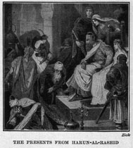
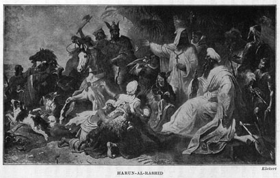

  
[Intangible Textual Heritage](../../index)  [Miscellaneous](../index) 
[Index](index)  [Previous](fmma13)  [Next](fmma15) 

------------------------------------------------------------------------

*Famous Men of the Middle Ages*, by John Henry Haaren, \[1904\], at
Intangible Textual Heritage

------------------------------------------------------------------------

HARUN-AL-RASHID

CALIPH FROM 786-809 A.D.

 

I

 

THE most celebrated of all Mohammedan caliphs was Harun-al-Rashid, which
means, in English, Aaron the Just. Harun is the hero of several of the
stories of the "Arabian Nights," a famous book, which perhaps you have
read. There are many curious and wonderful tales in it.

 

When Harun was only eighteen years old he showed such courage and skill
as a soldier that his father, who was then caliph, allowed him to lead
an army against the enemies of the Mohammedans; and he won many great
victories.

 

He afterwards commanded an army of ninety-five thousand Arabs and
Persians, sent by his father to invade the Eastern Roman Empire, which
was then ruled by the Empress Irene. After defeating Irene's famous
general, Nicetas, Harun marched his army to Chrysopolis, now Scutari, on
the Asiatic coast, opposite Constantinople. He encamped on the heights,
in full view of the Roman capital.

 

The Empress saw that the city would certainly by taken by the Moslems.
She therefore sent ambassadors to Harun to arrange terms; but he sternly
refused to agree to anything except immediate surrender.

 

Then one of the ambassadors said, "The Empress has heard much of your
ability as a general. Though you are her enemy, she admires you as a
soldier."

 

These flattering words were pleasing to Harun. He walked to and fro in
front of his tent and then spoke again to the ambassadors.

 

"Tell the Empress," he said, "that I will spare Constantinople if she
will pay me seventy thousand pieces of gold as a yearly tribute. If the
tribute is regularly paid Constantinople shall not be harmed by any
Moslem force."

 

The Empress had to agree to these terms. She paid the first year's
tribute; and soon the great Moslem army set out on its homeward march.

 

When Harun was not quite twenty-one years old he became caliph.

 

He began his reign by appointing very able ministers, who carried on the
work of the government so well that they greatly improved the condition
of the people.

 

Harun built a palace in Bagdad, far grander and more beautiful than that
of any caliph before him. Here he established his court and lived in
great splendor, attended by hundreds of courtiers and slaves.

 

He was very anxious that his people should be treated justly by the
officers of the government; and he was determined to find out whether
any had reason to complain. So he sometimes disguised himself at night
and went about through the streets and bazaars, listening to the talk of
those whom he met and asking them questions. In this way he learned
whether the people were contented and happy, or not.

 

In those times Bagdad in the east and the Mohammedan cities of Spain in
the west were famed for their schools and learned men. Arabian teachers
first introduced into Western Europe both algebra and the figures which
we use in arithmetic. It is for this reason that we call these figures
the "Arabic numerals."

 

Harun-al-Rashid gave great encouragement to learning. He was a scholar
and poet himself and whenever he heard of learned men in his own
kingdom, or in neighboring countries, he invited them to his court and
treated them with respect.

 

The name of Harun, therefore, became known throughout the world. It is
said that a correspondence took place between him and Charlemagne and
that, as you have learned, Harun sent the great emperor a present of a
clock and an elephant.

 

 

 

The tribute of gold that the Empress Irene agreed to pay Harun was sent
regularly for many years. It was always received at Bagdad with great
ceremony. The day on which it arrived was made a holiday. The Roman
soldiers who came with it entered the gates in procession. Moslem troops
also took part in the parade.

 

When the gold had been delivered at the palace, the Roman soldiers were
hospitably entertained, and were escorted to the main gate of the city
when they set out on their journey back to Constantinople.

 

II

 

IN 802 Nicephorus usurped the throne of the Eastern Empire.  He sent
ambassadors with a letter to Harun to tell him that the tribute would no
longer be paid.  The letter contained these words:

 

"The weak and faint-hearted Irene submitted to pay you tribute. She
ought to have made you pay tribute to her. Return to me all that she
paid you; else the matter must be settled by the sword."

 

As soon as Harun had read these words the ambassadors threw a bundle of
swords at his feet.  The caliph smiled, and drawing his own sword, or
cimeter, he cut the Roman swords in two with one stroke without injuring
the bald, or even turning the edge of his weapon.

 

Then he dictated a letter to Nicephorus, in which he said:

 

"Harun-al-Rashid, Commander of the Faithful to Nicephorus, the Roman
dog:  I have read thy letter. Thou shalt not hear, thou shalt see my
reply."

 

 

 

Harun was as good as his word. He started that day with a large army to
punish the emperor. As soon as he reached Roman territory he ravaged the
country and took possession of everything valuable that he found. He
laid siege to Heraclea, a city on the shores of the Black Sea, and in a
week forced it to surrender. Then he sacked the place.

 

Nicephorus was now forced to agree to pay the tribute. Scarcely,
however, had the caliph reached his palace in Bagdad when the emperor
again refused to pay.

 

Harun, consequently, advanced into the Roman province of Phrygia, in
Asia Minor, with an army of 15,000 men. Nicepherus marched against him
with 125,000 men. In the battle which followed the emperor was wounded,
and 40,000 of his men were killed.

 

After this defeat Nicephorus again promised payment of the tribute, but
again failed to keep his promise.

 

Harun now vowed that he would kill the emperor if he should ever lay
hands upon him. But as he was getting ready to march once more into the
Roman provinces a revolt broke out in one of the cities of his own
kingdom; and while on his way to suppress it the great caliph died of an
illness which had long given him trouble.

 

------------------------------------------------------------------------

[Next: Egbert. King From 802-837 A.D.](fmma15)
