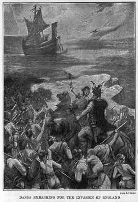
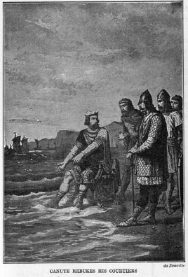

  
[Intangible Textual Heritage](../../index)  [Miscellaneous](../index) 
[Index](index)  [Previous](fmma18)  [Next](fmma20) 

------------------------------------------------------------------------

*Famous Men of the Middle Ages*, by John Henry Haaren, \[1904\], at
Intangible Textual Heritage

------------------------------------------------------------------------

CANUTE THE GREAT

KING FROM 1014-1035

 

I

 

THE Danes, you remember, had the eastern and northern parts of England
in the time of Alfred. Alfred's successors drove them farther and
farther north, and at length the Danish kingdom in England came to an
end for a time.

 

But the Danes in Denmark did not forget that there had been such a
kingdom and in the year 1013 Sweyn, King of Denmark, invaded England and
defeated the Anglo-Saxons. Ethelred, their king, fled to Normandy.

 

Sweyn now called himself the king of England; but in a short time he
died and his son Canute succeeded to his throne. Canute was nineteen
years old. He had been his father's companion during the war with the
Anglo-Saxons, and thus had had a good deal of experience as a soldier.

 

After the death of Sweyn some of the Anglo-Saxons recalled King Ethelred
and revolted against the Danes.

 

Canute, however, went to Denmark and there raised one of the largest
armies of Danes that had ever been assembled. With this powerful force
he sailed to England. When he landed Northumberland and Wessex
acknowledged him as king. Shortly after this Ethelred died.

 

Canute now thought he would find it easy to get possession of all
England. This was a mistake.

 

Ethelred left a son named Edmund Ironside who was a very brave soldier.
He became, by his father's death, the king of Saxon England and at once
raised an army to defend his kingdom. A battle was fought and Edmund was
victorious. This was the first of five battles that were fought in one
year. In none of them could the Danes do more than gain a slight
advantage now and then.

 

However, the Saxons were at last defeated in a sixth battle through the
act of a traitor. Edric, a Saxon noble, took his men out of the fight
and his treachery so weakened the Saxon army that Edmund Ironside had to
surrender to Canute.

 

 

 

But the young Dane had greatly admired Edmund for the way in which he
had fought against heavy odds, so he now treated him most generously.
Canute took certain portions of England and the remainder was given to
Edmund Ironside.

 

Thus for a short time the Anglo-Saxon people had at once a Danish and a
Saxon monarch.

 

II

 

EDMUND died in 1016 and after his death Canute became sole ruler.

 

He ruled wisely. He determined to make his Anglo-Saxon subjects forget
that he was a foreign conqueror. To show his confidence in them he sent
back to Denmark the army he had brought over the sea, keeping on a part
of his fleet and a small body of soldiers to act as guards at his
palace.

 

He now depended on the support of his Anglo-Saxon subjects and he won
their love.

 

Although a king--and it is generally believed that kings like
flattery--Canute is said to have rebuked his courtiers when they
flattered him. On one occasion, when they were talking about his
achievements, one of them said to him:

 

"Most noble king, I believe you can do anything."

 

Canute sternly rebuked the courtier for these words and then said:

 

"Come with me, gentlemen."

 

He led them from the palace grounds to the sea-shore where the tide was
rising, and had his chair placed at the edge of the water.

 

 

 

"You say I can do anything," he said to the courtiers.  "Very well, I
who am king and the lord of the ocean now command these rising waters to
go back and not dare wet my feet."

 

But the tide was disobedient and steadily rose and rose, until the feet
of the king were in the water. Turning to his courtiers, Canute said:

 

"Learn how feeble is the power of earthly kings. None is worthy the name
of king but He whom heaven and earth and sea obey."

 

During Canute's reign England had peace and prosperity and the English
people have ever held his memory dear.

 

 

------------------------------------------------------------------------

[Next: The Cid](fmma20)
