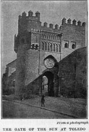
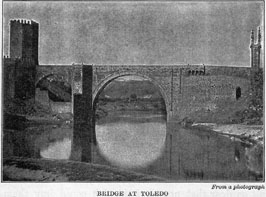

  
[Intangible Textual Heritage](../../index)  [Miscellaneous](../index.md) 
[Index](index)  [Previous](fmma19)  [Next](fmma21.md) 

------------------------------------------------------------------------

*Famous Men of the Middle Ages*, by John Henry Haaren, \[1904\], at
Intangible Textual Heritage

------------------------------------------------------------------------

THE CID

 

LATE one sunny afternoon one and twenty knights were riding along the
highway in the northern part of Spain. As they were passing a deep mire
they heard cries for help, and turning, saw a poor leper who was sinking
in the mud. One of the knights, a handsome young man, was touched by the
cries. He dismounted, rescued the poor fellow, took him upon his own
horse, and thus the two rode to the inn. The other knights wondered at
this.

 

When they reached the inn where they were to stop for the night, they
wondered still more, for their companion gave the leper a seat next to
himself at the table. After supper the knight shared his own bed with
the leper. If the knight had not done this, the leper would have been
driven out of the town, with nothing to eat and no place in which to
sleep. At midnight, while the young man was fast asleep, the leper
breathed upon his back. This awakened the knight, who turned quickly in
his bed and found that the leper was gone.

 

The knight called for a light and searched, but in vain. While he was
wondering about what had happened, a man in shining garments appeared
before him and said, "Rodrigo, art thou asleep or awake?" The knight
answered, "I am awake, but who art thou that bringest such brightness?" 
The vision replied, "I am St. Lazarus, the leper to whom thou wast so
kind. Because I have breathed upon thee thou shalt accomplish whatever
thou shalt undertake in peace or in battle. All shall honor thee.
Therefore, go on and evermore do good."

 

With that the vision vanished.

 

The promise of St. Lazarus was fulfilled. In time young Rodrigo became
the great hero of Spain.  The Spaniards called him Campeador, or
Champion. The Saracens called him "The Cid," or Lord. His real name was
Rodrigo Diaz de Bivar, but he is usually spoken of as "The Cid."

 

The Goths, after the death of Alaric, had taken Spain away from the
Romans. The Saracens, or, as they were usually called, the Moors, had
crossed the sea from Africa and in turn had taken Spain from the Goths.
In the time of Charles Martel the Goths had lost all Spain except the
small mountain district in the northern part. In the time of the Cid the
Goths, now called Spaniards, had driven the Moors down to about the
middle of Spain. War went on all the time between the two races, and
many men spent their lives in fighting. The Spanish part of the country
then comprised the kingdoms of Castile, Leon, Aragon and others.

 

 

 

The Cid was a subject of Fernando of Castile. Fernando had a dispute
with the king of Aragon about a city which each claimed. They agreed to
decide the matter by a combat. Each was to choose a champion. The
champions were to fight, and the king whose champion won was to have the
city. Fernando chose the Cid, and though the other champion was called
the bravest knight in Spain, the youthful warrior vanquished him.

 

When Alfonzo, a son of Fernando, succeeded to the throne, he became
angry with the Cid without just cause and banished him from Christian
Spain.

 

The Cid was in need of some money, so he filled two chests with sand and
sent word to two wealthy money lenders that he wished to borrow six
hundred Spanish marks, and would put into their hands his treasures of
silver and gold which were packed in two chests, but the money lenders
must solemnly swear not to open the chests until a full year had passed.
To this they gladly agreed. They took the chests and loaned him six
hundred marks.

 

The Cid was now ready for his journey. Three hundred of his knights went
into banishment with him. They crossed the mountains and entered the
land of the Moors. Soon they reached the town of Alcocer, and after a
siege captured it and lived in it.

 

Then the Moorish king of Valencia ordered two chiefs to take three
thousand horsemen, recapture the town and bring the Cid alive to him.

 

So the Cid and his men were shut up in Alcocer and besieged. Famine
threatened them and they determined to cut their way through the army of
the Moors. Suddenly and swiftly they poured from the gate of Alcocer,
and a terrible battle was fought. The two Moorish chiefs were taken
prisoners and thirteen hundred of their men were killed in the battle.
The Cid then became a vassal of the Moorish king of Saragossa.

 

After a while Alfonzo recalled the Cid from banishment and gave him
seven castles and the lands adjoining them. He needed the Cid's help in
the greatest of all his plans against the Moors. He was determined to
capture Toledo. He attacked it with a large army in which there were
soldiers from many foreign lands. The Cid is said to have been the
commander. After a long siege the city fell and the victorious army
marched across the great bridge built by the Moors, which you would
cross to-day if you went to Toledo.

 

Valencia was one of the largest and richest cities in Moorish Spain. It
was strongly fortified, but the Cid determined to attack it.

 

The plain about the city was irrigated by streams that came down from
the neighboring hills.  To prevent the Cid's army from coming near the
city the Saracens flooded the plain. But the Cid camped on high ground
above the plain and from that point besieged the city. Food became very
scarce in Valencia. Wheat, barley and cheese were all so dear that none
but the rich could buy them. People ate horses, dogs, cats and mice,
until in the whole city only three horses and a mule were left alive.

 

Then on the fifteenth of June, 1094, the governor went to the camp of
the Cid and delivered to him the keys of the city. The Cid placed his
men in all the forts and took the citadel as his own dwelling. His
banner floated from the towers. He called himself the Prince of
Valencia.

 

 

 

When the king of Morocco heard of this he raised an army of fifty
thousand men. They crossed from Africa to Spain and laid siege to
Valencia. But the Cid with his men made a sudden sally and routed them
and pursued them for miles. It is said that fifteen thousand soldiers
were drowned in the river Guadalquivir which they tried to cross.

 

The Cid was now at the height of his power and lived in great
magnificence. One of the first things he did was to repay the two
friends who had lent him the six hundred marks. He was kind and just to
the Saracens who had become his subjects. They were allowed to have
their mosques and to worship God as they thought right.

 

In time the Cid's health began to fail.  He could lead his men forth to
battle no more. He sent an army against the Moors, but it was so
completely routed that few of his men came back to tell the tale. It is
said by a Moorish writer that "when the runaways reached him the Cid
died of rage" (1099).

 

There is a legend that shortly before he died he saw a vision of St.
Peter, who told him that he should gain a victory over the Saracens
after his death.

 

So the Cid gave orders that his body should be embalmed. It was so well
preserved that it seemed alive. It was clothed in a coat of mail, and
the sword that had won so many battles was placed in the hand. Then it
was mounted upon the Cid's favorite horse and fastened into the saddle,
and at midnight was borne out of the gate of Valencia with a guard of a
thousand knights.

 

All silently they marched to a spot where the Moorish king, with
thirty-six chieftains, lay encamped, and at daylight the knights of the
Cid made a sudden attack. The king awoke. It seemed to him that there
were coming against him full seventy thousand knights, all dressed in
robes as white as snow, and before them rode a knight, taller than all
the rest, holding in his left hand a snow-white banner and in the other
a sword which seemed of fire. So afraid were the Moorish chief and his
men that they fled to the sea, and twenty thousand of them were drowned
as they tried to reach their ships.

 

There is a Latin inscription near the tomb of the Cid which may be
translated:

Brave and unconquered, famous in triumphs of war,  
Enclosed in this tomb lies Roderick the Great of Bivar.

 

 

 

------------------------------------------------------------------------

[Next: Edward The Confessor. King From 1042-1066](fmma21.md)
