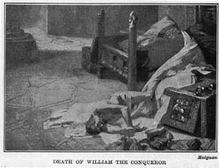

  
[Intangible Textual Heritage](../../index)  [Miscellaneous](../index) 
[Index](index)  [Previous](fmma21)  [Next](fmma23) 

------------------------------------------------------------------------

*Famous Men of the Middle Ages*, by John Henry Haaren, \[1904\], at
Intangible Textual Heritage

------------------------------------------------------------------------

WILLIAM THE CONQUEROR

KING FROM 1066-1087

 

I

 

ON the death of Edward the Confessor the throne of England was claimed
by William, Duke of Normandy.

 

When Edward took refuge in Normandy after the Danes conquered England,
he stayed at the palace of William. He was very kindly treated there,
and William said that Edward had promised in gratitude that William
should succeed him as king of England.

 

One day in the year 1066 when William was hunting with a party of his
courtiers in the woods near Rouen, a noble came riding rapidly toward
him shouting, "Your Highness, a messenger has just arrived from England,
bearing the news that King Edward is dead and that Harold, the son of
Earl Godwin, has been placed on the English throne."

 

William at once called his nobles together and said to them, "I must
have your consent that I enforce my claim to England's throne by arms."

 

 

 

The barons gave their consent. So an army of sixty thousand men was
collected and a large fleet of ships was built to carry this force
across the channel.

 

During the months of preparation William sent an embassy to the English
court to demand of Harold that he give up the throne. Harold refused.

 

Soon all England was startled by the news that William had landed on the
English coast at the port of Hastings with a large force.

 

Harold immediately marched as quickly as possible from the north to the
southern coast. In a week or so he arrived at a place called Senlac nine
miles from Hastings, in the neighborhood of which town the Norman army
was encamped. He took his position on a low range of hills and awaited
the attack of William. His men were tired with their march, but he
encouraged them and bade them prepare for battle.

 

On the morning of October 14, 1066, the two armies met. The Norman
foot-soldiers opened the battle by charging on the English stockades.
They ran over the plain to the low hills, singing a war-song at the top
of their voices; but they could not carry the stockades although they
tried again and again. They therefore attacked another part of the
English forces.

 

William, clad in complete armor, was in the very front of the fight,
urging on his troops. At one time a cry arose in his army that he was
slain and a panic began. William drew off his helmet and rode along the
lines, shouting, "I live!  I live!  Fight on! We shall conquer yet!"

 

The battle raged from morning till night. Harold himself fought on foot
at the head of his army and behaved most valiantly. His men, tired as
they were from their forced march, bravely struggled on hour after hour.

 

But at last William turned their lines and threw them into confusion. As
the sun went down Harold was killed and his men gave up the fight.

 

From Hastings William marched toward London. On the way he received the
surrender of some towns and burned others that would not surrender.
London submitted and some of the nobles and citizens came forth and
offered the English crown to the Norman duke. On the 25th of December,
1066, the "Conqueror," as he is always called, was crowned in
Westminster Abbey by Archbishop Ealdred. Both English and Norman people
were present. When the question was asked by the Archbishop, "Will you
have William, Duke of Normandy, for your king?" all present answered,
"We will."

 

II

 

AT first William ruled England with moderation. The laws and customs
were not changed, and in a few months after the battle of Hastings the
kingdom was so peaceful that William left it in charge of his brother
and went to Normandy for a visit.

 

While he was gone many of the English nobles rebelled against him, and
on his return he made very severe laws and did some very harsh things.
He laid waste an extensive territory, destroying all the houses upon it
and causing thousands of persons to die from lack of food and shelter,
because the people there had not sworn allegiance to him.

 

He made a law that all lights should be put out and fires covered with
ashes at eight o'clock every evening, so that the people would have to
go to bed then. A bell was rung in all cities and towns throughout
England to warn the people of the hour. The bell was called the
"curfew," from the French words "couvre feu," meaning "to cover fire."

 

To find out about the lands of England and their owners, so that
everybody might be made to pay taxes, he appointed officers in all the
towns to report what estates there were, who owned them, and what they
were worth. The reports were copied into two volumes, called the
"Domesday Book." This book showed that England at that time had a
population of a little more than a million.

 

 

 

William made war on Scotland, and conquered it. During a war with the
king of France the city of Mantes was burned by William's soldiers. As
William rode over the ruins his horse stumbled and the king was thrown
to the ground and injured. He was borne to Rouen, where he lay ill for
six weeks. His sons and even his attendants abandoned him in his last
hours. It is said that in his death struggle he fell from his bed to the
floor, where his body was found by his servants.

 

 

 

------------------------------------------------------------------------

[Next: Peter The Hermit. About 1050-1115](fmma23)
