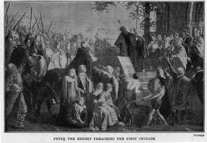
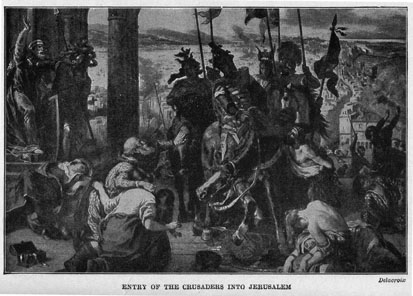

  
[Intangible Textual Heritage](../../index)  [Miscellaneous](../index) 
[Index](index)  [Previous](fmma22)  [Next](fmma24) 

------------------------------------------------------------------------

*Famous Men of the Middle Ages*, by John Henry Haaren, \[1904\], at
Intangible Textual Heritage

------------------------------------------------------------------------

PETER THE HERMIT

ABOUT 1050-1115

 

I

 

DURING the Middle Ages the Christians of Europe used to go to the Holy
Land for the purpose of visiting the tomb of Christ and other sacred
places. Those who made such a journey were called "pilgrims."

 

Every year thousands of pilgrims--kings, nobles and people of humbler
rank--went to the Holy Land.

 

While Jerusalem was in the hands of the Arabian caliphs who reigned at
Bagdad, the Christian pilgrims were generally well treated. After about
1070, when the Turks took possession of the city, outrages became so
frequent that it seemed as if it would not be safe for Christians to
visit the Savior's tomb at all.

 

About the year 1095 there lived at Amiens France, a monk named Peter the
Hermit.

 

Peter was present at a council of clergy and people held at Clermont in
France when his Holiness, Pope Urban II, made a stirring speech. He
begged the people to rescue the Holy Sepulchre and other sacred sites
from the Mohammedans.

 

The council was so roused by his words that they broke forth into loud
cries, "God wills it! God wills it!"

 

"It is, indeed, His will," said the Pope, "and let these words be your
war-cry when you meet the enemy."

 

Peter listened with deep attention. Immediately after the council he
began to preach in favor of a war against the Turks. With head and feet
bare, and clothed in a long, coarse robe tied at the waist with a rope,
he went through Italy from city to city, riding on a donkey. He preached
in churches, on the streets--wherever he could secure an audience.

 

When Peter had gone over Italy he crossed the Alps and preached to the
people of France, Germany, and neighboring countries. Everywhere he
kindled the zeal of the people, and multitudes enlisted as champions of
the cross.

 

Thus began the first of seven wars known as the "Crusades" or "Wars of
the Cross," waged to rescue the Holy Land from the Mohammedans.

 

 

 

It is said that more than 100,000 men, women and children went on the
first Crusade. Each wore on the right shoulder the emblem of the cross.

 

Peter was in command of one portion of this great multitude. His
followers began their journey with shouts of joy and praise.

 

But they had no proper supply of provisions. So when passing through
Hungary they plundered the towns and compelled the inhabitants to
support them. This roused the anger of the Hungarians. They attacked the
Crusaders and killed a great many of them.

 

After long delays about seven thousand of those who had started on the
Crusade reached Constantinople. They were still enthusiastic and sounded
their war-cry, "God wills it!" with as much fervor as when they first
joined Peter's standard.

 

Leaving Constantinople, they went eastward into the land of the Turks. A
powerful army led by the sultan met them. The Crusaders fought
heroically all day long but at length were badly beaten. Only a few
escaped and found their way back to Constantinople.

 

Peter the Hermit had left the Crusaders before the battle and returned
to Constantinople. He afterwards joined the army of Godfrey of Bouillon.

 

Godfrey's army was composed of six divisions, each commanded by a
soldier of high rank and distinction. It was a well organized and
disciplined force and numbered about half a million men.

 

It started only a few weeks after the irregular multitude which followed
Peter the Hermit, and was really the first Crusading army, for Peter's
undisciplined throng could hardly be called an army.

 

After a long march Godfrey reached Antioch and laid siege to it.

 

It was believed that this Moslem stronghold could be taken in a short
time; but the city resisted the attacks of the Christians for seven
months. Then it surrendered.

 

And now something happened that none of the Crusaders had dreamed of. An
army of two hundred thousand Persians arrived to help the Moslems. They
laid siege to Antioch and shut up the Crusaders within its walls for
weeks. However, after a number of engagements in which there was great
loss of life, the Turks and Persians were at last driven away.

 

The way was now opened to Jerusalem. But out of the half million
Crusaders who had marched from Europe less than fifty thousand were
left. They had won their way at a fearful cost.

 

Still onward they pushed with brave hearts, until on a bright summer
morning they caught the first glimpse of the Holy City in the distance.
For two whole years they had toiled and suffered in the hope of reaching
Jerusalem.  Now it lay before them.

 

 

 

But it had yet to be taken. For more than five weeks the Crusaders
carried on the siege. Finally, on the 15th of July, 1099, the Turks
surrendered. The Moslem flag was hauled down and the banner of the cross
floated over the Holy City.

 

A few days after the Christians had occupied Jerusalem Godfrey of
Bouillon was chosen king of the Holy Land.

 

"I will accept the office," he said, "but no crown must be put on my
head and I must never be called king. I cannot wear a crown of gold
where Christ wore one of thorns nor will I be called king in the land
where once lived the King of Kings."

 

Peter the Hermit is said to have preached an eloquent sermon on the
Mount of Olives. He did not, however, remain long in Jerusalem, but
after the capture of the city returned to Europe. He founded a monastery
in France and within its walls passed the rest of his life.

 

 

 

------------------------------------------------------------------------

[Next: Frederick Barbarossa. Emperor From 1152-1190](fmma24)
